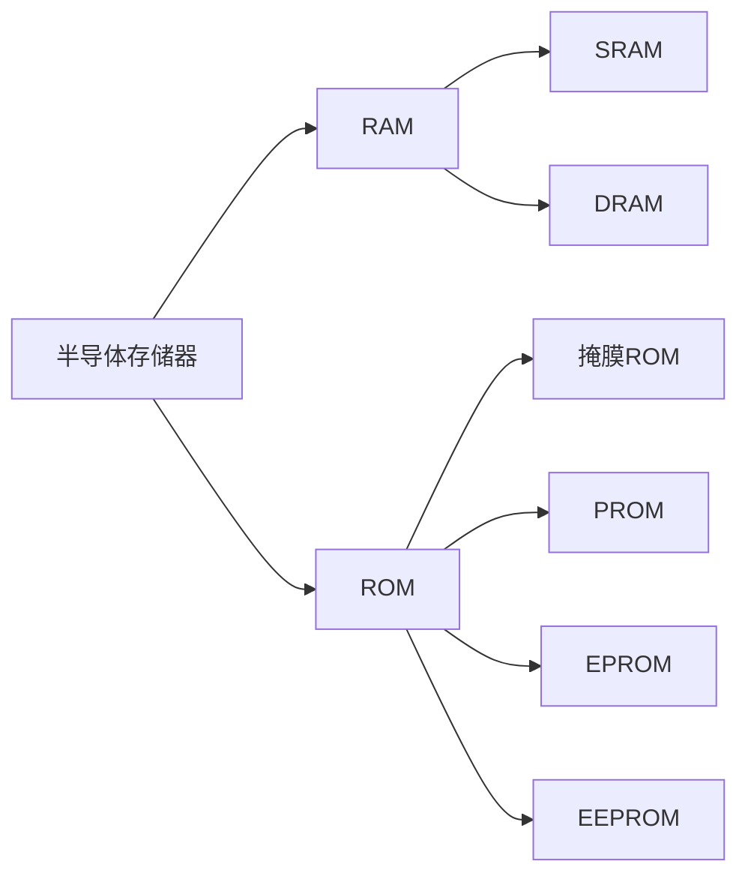

<!--more-->

## 一、SR锁存器

### (一) 电路结构

 

### (二) 工作原理

两个或非门接成反馈，引出输入端用来置0、1

**定义：**  

$Q=1$，$Q'=0$为“1”状态

$Q=0$，$Q'=1$为“0”状态

$R_D$为置0输入端，$S_D$为置1输入端

**真值表：**

 

### (三) 动作特点

在任何时刻，输入都能直接改变输出的状态。（不可靠）  

 

## 二、触发器

### (一) 电平触发的触发器

#### 1、电路结构与工作原理

 

**真值表：**

 

**带异步置位和异步置零的电平触发SR触发器：**

 

触发器在时钟信号控制下正常工作时应使$S'_D$和$R'_D$处于高电平

#### 2、动作特点

在$CLK=1$的全部时间里，S和R的变化都将引起输出状态的变化。  (不可靠)

 

**D触发器：** 

### (二) 脉冲触发的触发器

#### 1、电路结构和工作原理

##### (1) 主从$SR$触发器

 

 

* $CLK=1$时，“主”按$S$，$R$翻转，“从”保持
* $CLK$下降沿到达时，“主”保持，“从”根据“主”的状态翻转所以每个周期，输出状态只可能改变一次  

**存在的问题：**

* 输入信号仍需要遵守$SR＝0$的约束条件
* 虽然克服了CLK＝1期间输出状态可能发生多次翻转的问题，但由于主触发器本身是电平触发SR触发器，所以在$CLK＝1$期间$Q_m$的状态仍会随着$S$、$R$发生多次翻转，仅仅用$CLK$由高电平返回低电平时的$SR$判断次态是不够的  

##### (2) 主从$JK$触发器

**目的**：解除SR=0的约束，即S=R=1下，Q*也是确定的  

**解决途径**：增加两条反馈线  

 

 

 

#### 2、动作特点

##### (1) 分两步动作：

第一步$CLK=1$时，“主”接收信号，“从”保持

第二步$CLK↓$到达后，“从”按“主”状态翻转

故输出状态只能改变一次  

##### (2)对不同结构

* 主从$SR$，“主”为同步$SR$,$SLK=1$的全部时间里输入信号对"主"都起控制作用
* 主从$JK$在$CLK=1$期间，“主“只可能翻转一次，故$CLK↓$前$Q'$最后的状态，决定$Q^*$

 

### (三) 边沿触发的触发器

仅取决于CLK的下降沿（或上升沿）到来时的输入信号状态，与在此前、后输入的状态没有关系。  

#### 1、用两个电平触发D触发器组成的边沿触发器

##### (1) 电路结构及工作原理

 

**利用CMOS传输门的边沿触发器**  

 

##### (2) 动作特点

* $Q^*$变化发生在CLK的上升沿或下降沿
* $Q^*$仅取决于上升沿到达时的输入和状态，与之前和之后输入和状态无关  

#### 2、 维持阻塞触发器

**维持阻塞结构边沿触发SR触发器**  

 

### (四) 触发器按逻辑功能的分类  

#### 1、$SR$触发器

##### (1) 定义

凡在时钟信号作用下，具有如下功能的触发器称为SR触发器，与触发方式无关

 

##### (2) 特征方程

$$
\begin{cases}Q^*=S'R'Q+SR'Q'+SR'Q=S+R'Q\\约束条件：SR=0\end{cases}
$$

##### (3) 状态转换图

 

##### (4) 符号

 

#### 2、$JK$触发器

##### (1) 定义

 

##### (2) 特征方程

$$
Q^*=JQ'+K'Q
$$

##### (3) 状态转换图

 

##### (4) 符号

 

#### 3、$T$触发器

##### (1) 定义

 

##### (2) 特征方程

$$
Q^*=TQ'+T'Q
$$

##### (3)状态转换图

 

##### (4) 符号

 

#### 4、$D$触发器

##### (1) 定义

 

##### (2) 特征方程

$$
Q^*=D
$$

##### (3)状态转换图

 

##### (4) 符号

 

### (五) 触发器的动态特性

#### 1、SR锁存器的动态特性

 

* 输入信号宽度： $t_W\geq 2t_{pd}$
* 传输延迟时间：$t_{PLH}=t_{pd},\ t_{PHL}=2t_{pd}$

（设门传输延迟为$t_{pd}^*$）

#### 2、电平触发SR触发器动态特性  

 

* 输入信号宽度： $t_W\geq 2t_{pd}$
* 传输延迟时间：$t_{PLH}=2t_{pd},\ t_{PHL}=3t_{pd}$

#### 3、主从触发器的动态特性

 

* 建立时间：$t_{setup}\geq2t_{pd}$
* 保持时间：$t_{hold}\geq t_f$（防止在门$G7$、$G8$产生竞争现象）
* 传输延迟时间：$t_{PLH}=3t_{pd},\ t_{PHL}=4t_{pd}$
* $f_{c(max)}\leq1/(6t_{pd})$

## 三、寄存器

1、用于寄存一组二值代码，N位寄存器由N个触发器组成，可存放一组N位二值代码  

2、只要求其中每个触发器可置1，置0。  

**例：**

 

 

## 四、存储器

### (一) 简介

#### 1、分类

##### (1) 存/取功能

* 只读存储器
* 随机读/写

##### (2) 工艺

* 双极型
* MOS型

#### 2、指标

##### (1) 存储速度

* ns级

###### (2) 存储容量

* $m\times n$

#### 3、一般结构形式

**解决问题：**有限的引脚输入输出庞大的数据

 