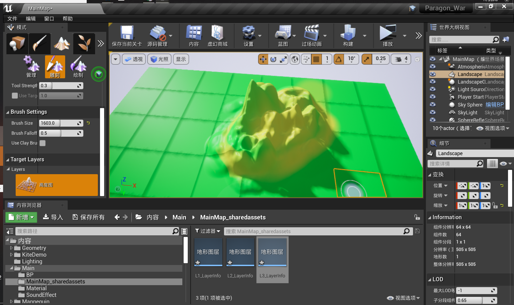
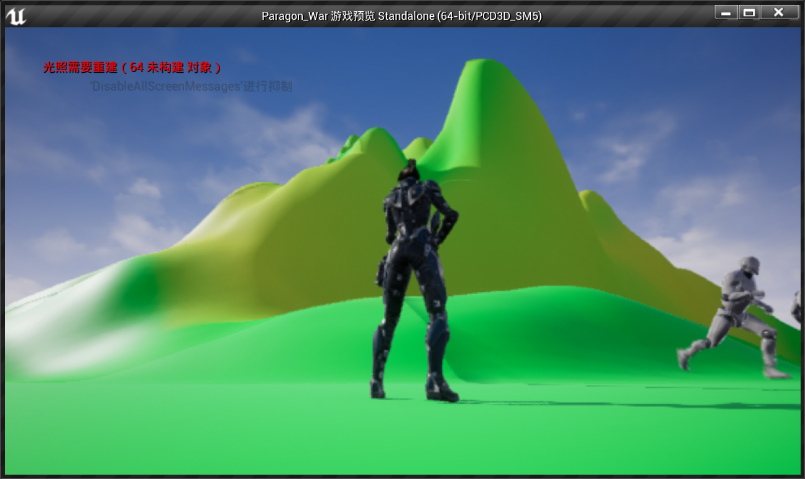
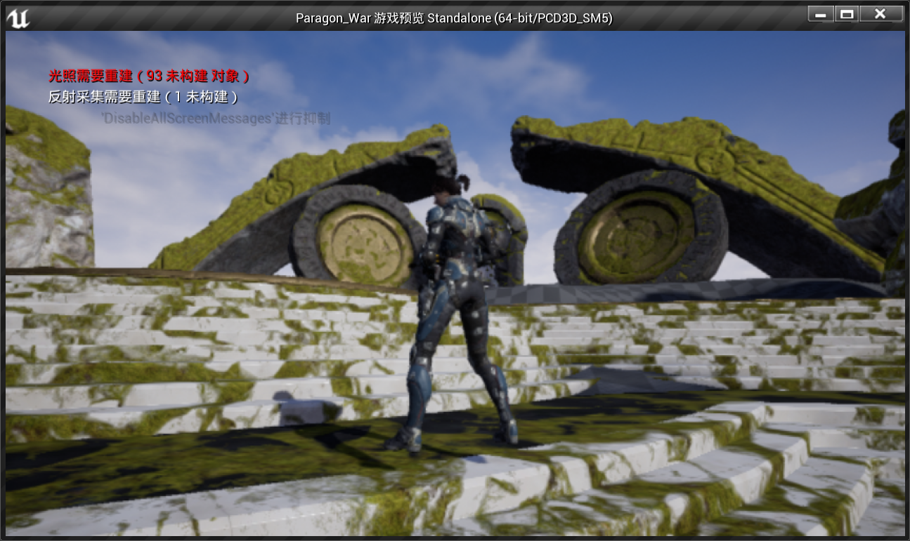
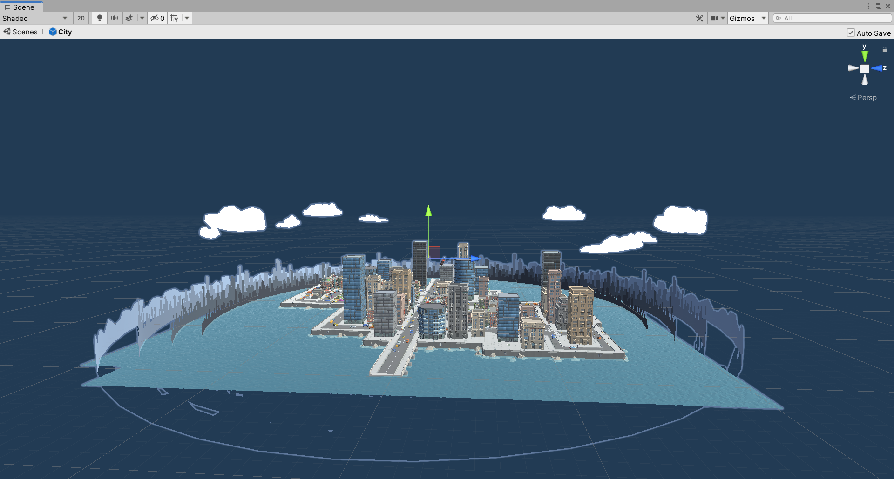
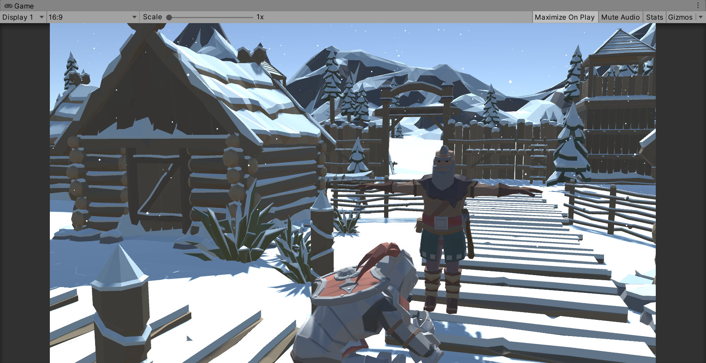
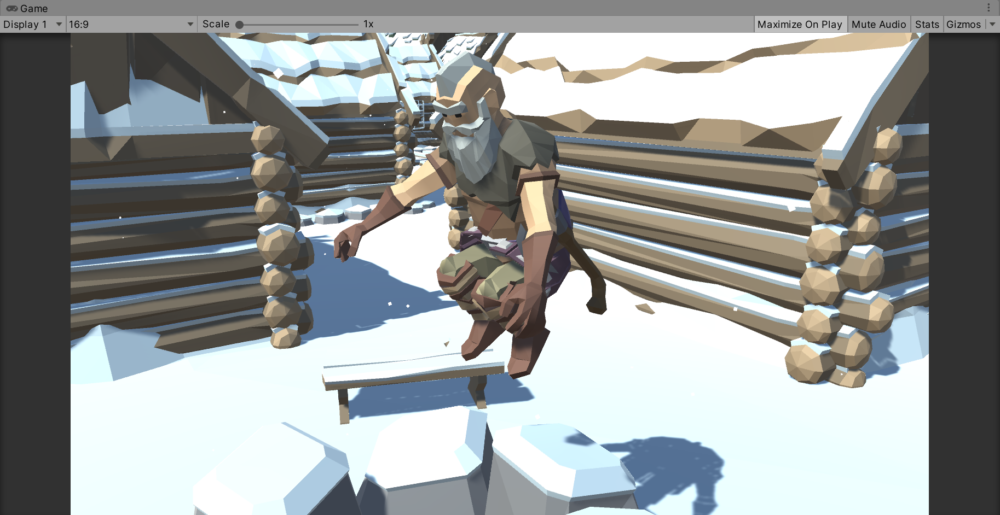

Cyberpunk Polygon

## Inspiration

### 2020 New Game: Cyberpunk 2077

<video width="100%" height="100%" id="video" controls="" preload="none" poster="">
      <source id="mp4" src="https://steamcdn-a.akamaihd.net/steam/apps/256775079/movie480.webm?t=1581607833" type="video/mp4">
      </video>

### Unity3D Assets Store: Polygon Sci-Fi City Pack

## Other Try

### Unreal Engine: Paragon War

### Ploygon GTA

### Ploygon Valhalla

## TODO

- [x] Character
- [x] Scene Material

- [ ]  Third Person Controller
	- [ ] Movement
		- [ ] Free
		- [ ] Hold Melee Weapon
		- [ ] Hold Gun
	- [ ] Attack
		- [ ] Melee Combat System
		- [ ] Shooter Combat System
	- [ ] NPC AI System
		- [ ] Companion AI
		- [ ] Enemy AI
	- [ ] Weapon System
		- [ ] Melee Weapon
		- [ ] Shooter Weapon
	- [ ] Vehicle System
		- [ ] Switch
		- [ ] Vehicle Controller
- [ ] Scene
	- [ ] Object Collision
	- [ ] Light Effect
	- [ ] Vehicle AI

