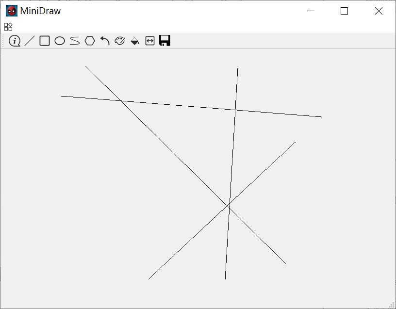
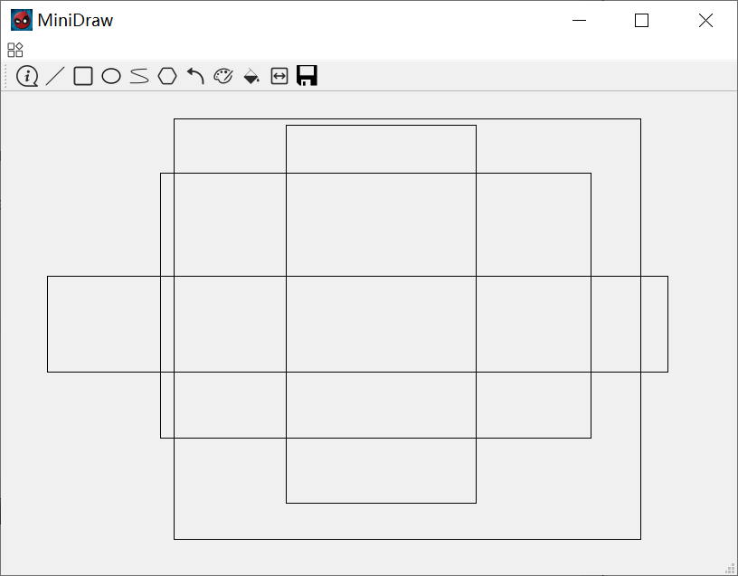
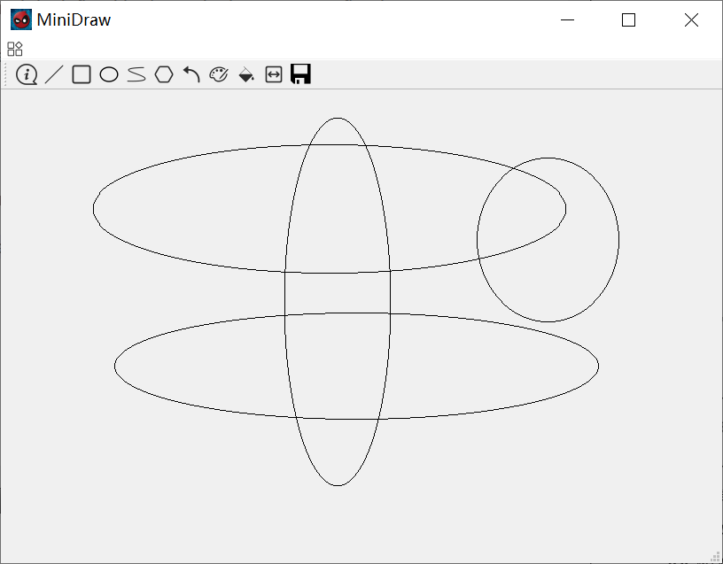
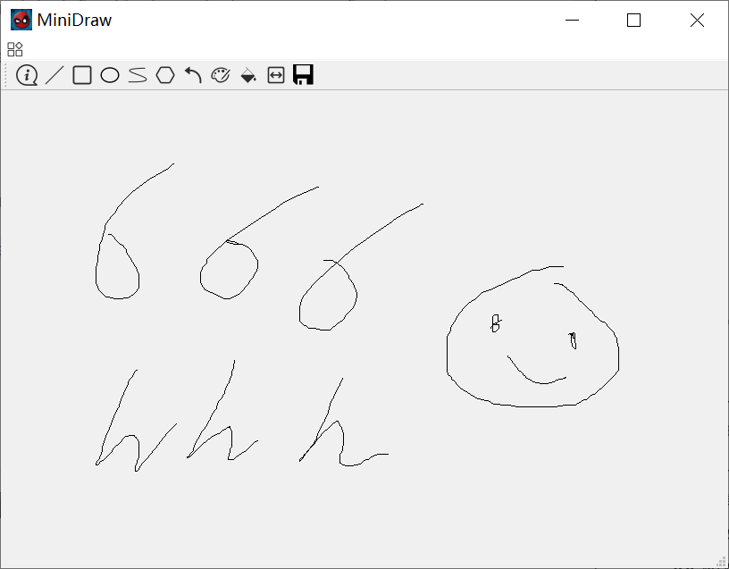
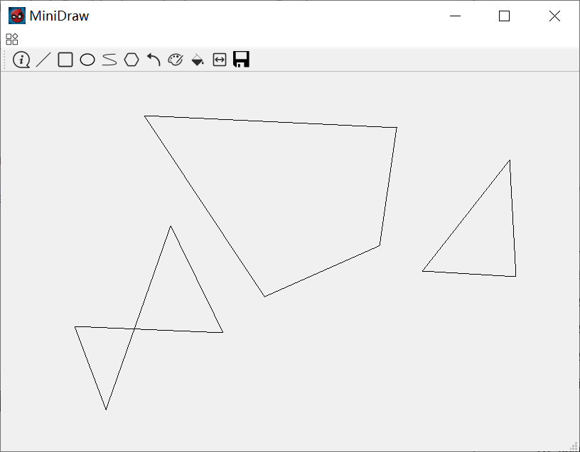
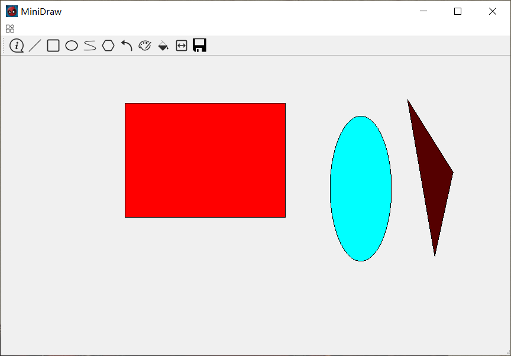
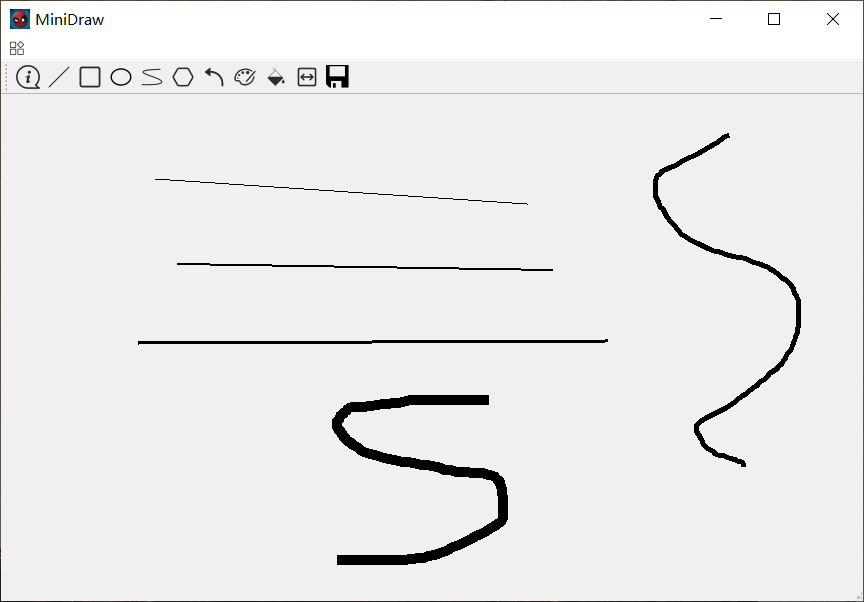
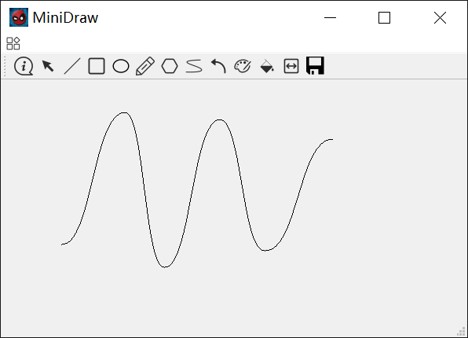

MiniDraw Demo

## Draw Line

## Draw Rectangle

## Draw Ellipse

## Free Draw

## Draw Polygon

## Fill Color

## Line Width

## Curve

## Demo Video

<video width="100%" height="100%" id="video" controls="" preload="none" poster="">
      <source id="mp4" src="./MiniDraw/video/demo.mp4" type="video/mp4">
      </video>

## Download

[MiniDraw_Demo.zip](./MiniDraw/MiniDraw_Demo.zip)

[report](./MiniDraw/MiniDraw.pdf)