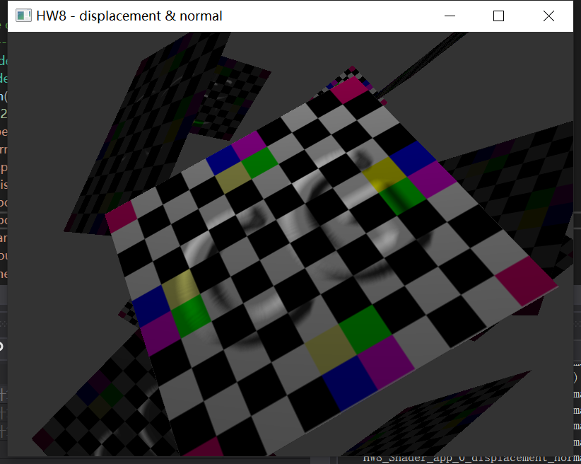
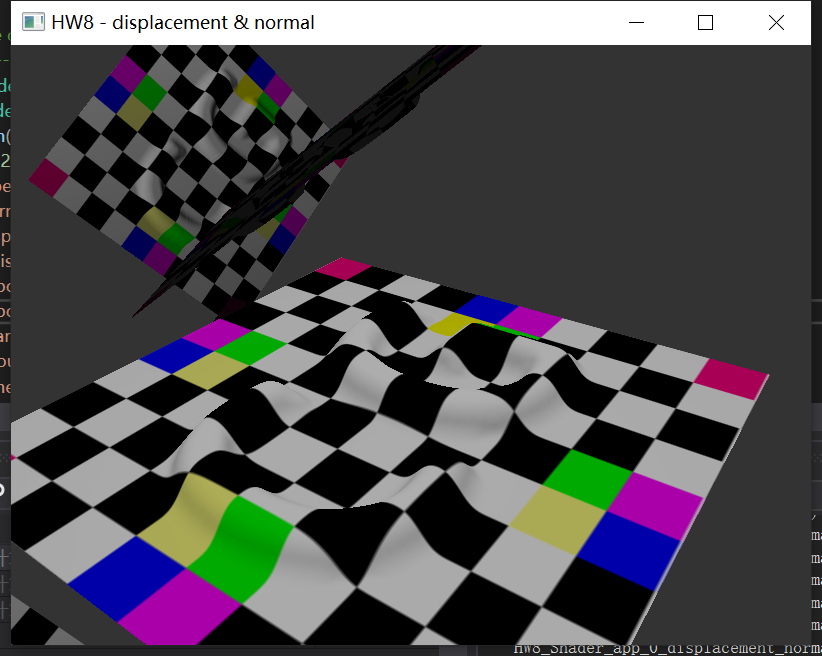
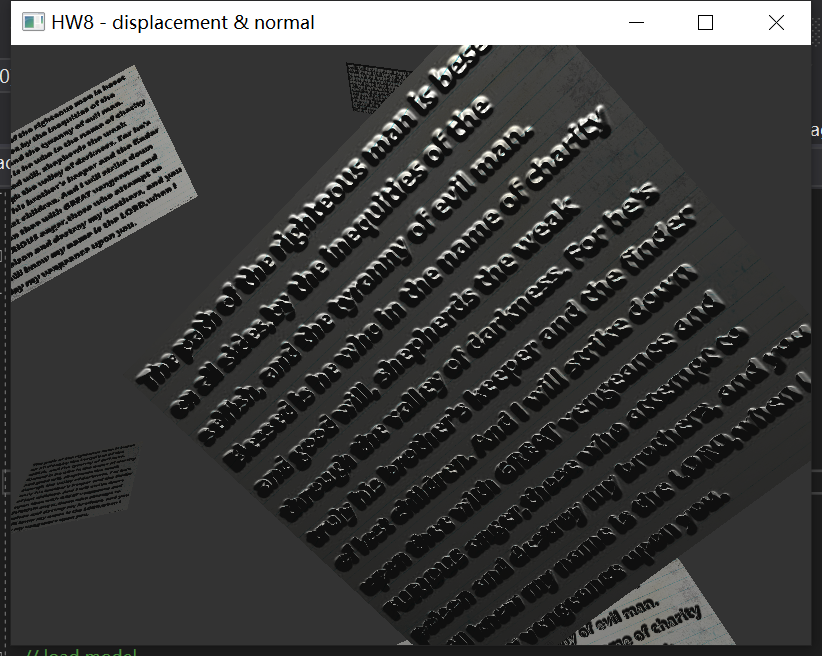
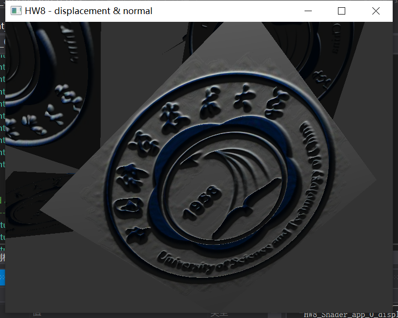
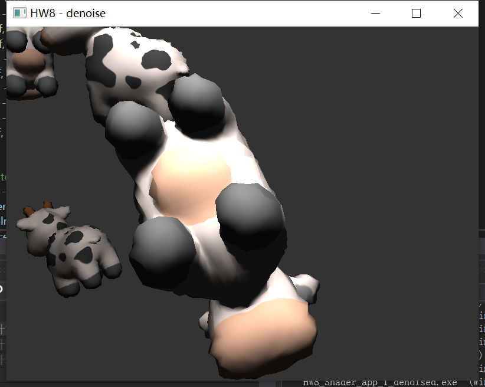
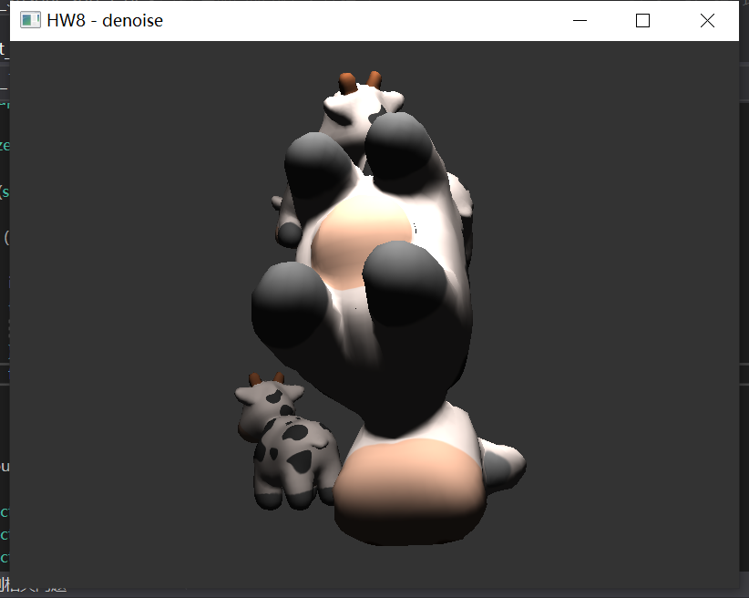

Shader Demo

## Normal Map

## Displacement Map

## Denoise

**Before**

## Demo Video

<video width="100%" height="100%" id="video" controls="" preload="none" poster="">
      <source id="mp4" src="./Shader/video/map.mp4" type="video/mp4">
      </video>

<video width="100%" height="100%" id="video" controls="" preload="none" poster="">
      <source id="mp4" src="./Shader/video/denoise.mp4" type="video/mp4">
      </video>
## Download

[report](./Shader/Shader.pdf)