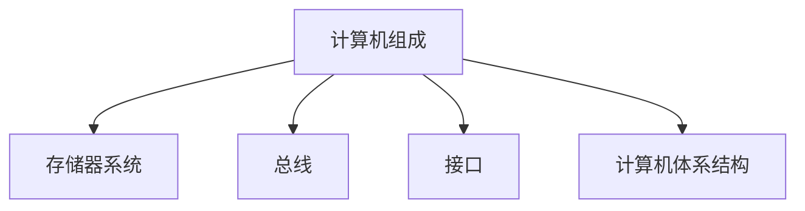
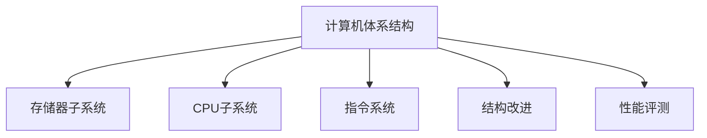
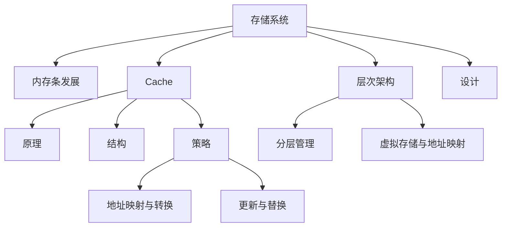
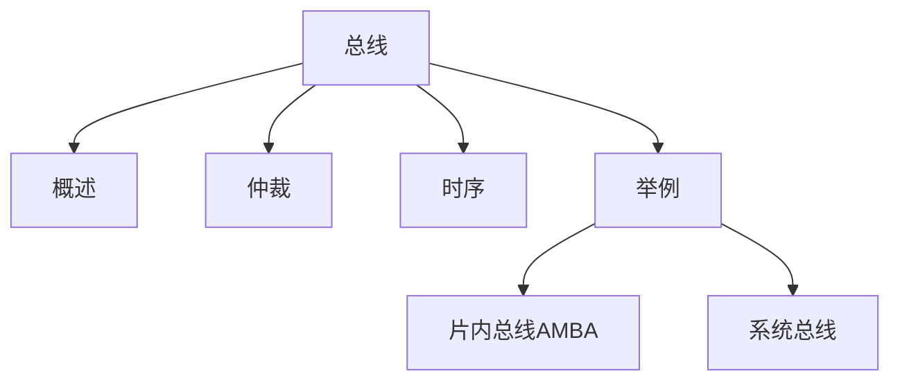
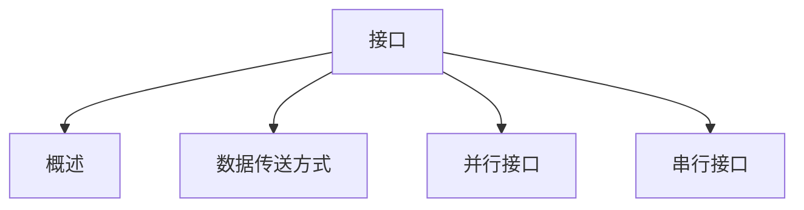
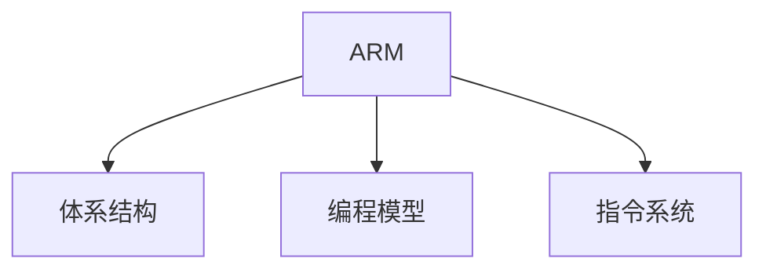
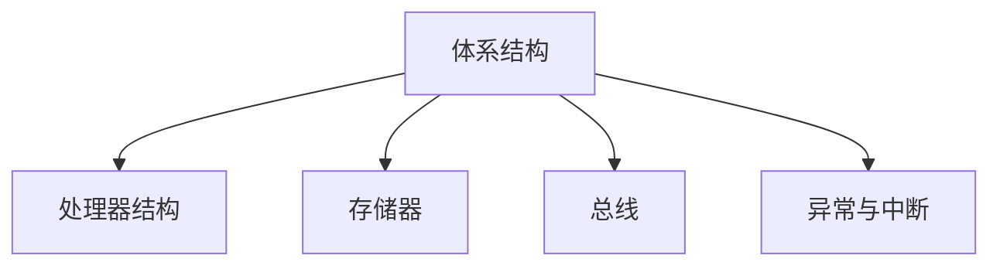
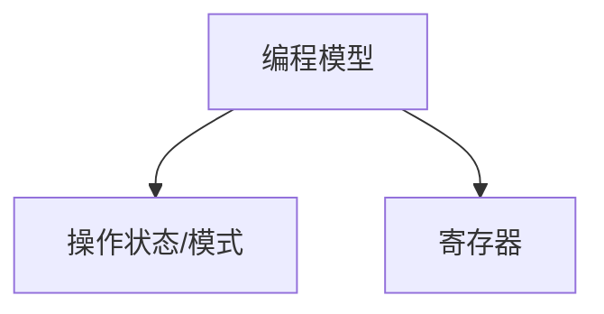
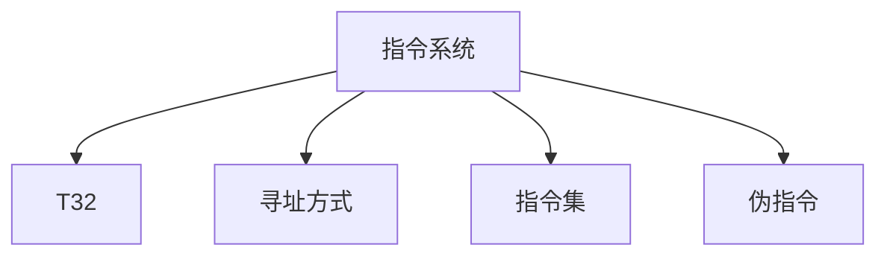
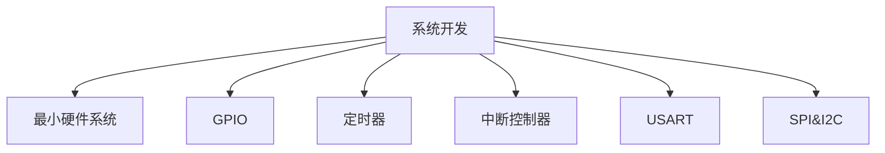

## 计算机组成模块

```mermaid
graph TB

计算机组成 --> 存储器系统
计算机组成 --> 总线
计算机组成 --> 接口
计算机组成 --> 计算机体系结构
```

---

```mermaid
graph TB
计算机体系结构 -->存储器子系统
计算机体系结构 --> CPU子系统
计算机体系结构 --> 指令系统
计算机体系结构 --> 结构改进
计算机体系结构 --> 性能评测
```

---

```mermaid
graph TB
存储系统 --> 内存条发展
存储系统 --> 层次架构
存储系统 --> Cache
Cache --> 原理
Cache --> 结构
Cache --> 策略
层次架构 --> 分层管理
层次架构 --> 虚拟存储与地址映射
策略 --> 地址映射与转换
策略 --> 更新与替换
存储系统 --> 设计
```

---

```mermaid
graph TB
总线 --> 概述
总线 --> 仲裁
总线 --> 时序
总线 --> 举例
举例 --> 片内总线AMBA
举例 --> 系统总线
```

---

```mermaid
graph TB
接口 --> 概述
接口 --> 数据传送方式
接口 --> 并行接口
接口 --> 串行接口
```

---

## ARM Cortex-M3/M4模块

```mermaid
graph TB
ARM --> 体系结构
ARM --> 编程模型
ARM --> 指令系统
```

---

```mermaid
graph TB
体系结构 --> 处理器结构
体系结构 --> 存储器
体系结构 --> 总线
体系结构 --> 异常与中断
```

---

```mermaid
graph TB
编程模型 --> 操作状态/模式
编程模型 --> 寄存器
```

---

```mermaid
graph TB
指令系统 --> T32
指令系统 --> 寻址方式
指令系统 --> 指令集
指令系统 --> 伪指令

```

---

```mermaid
graph TB
系统开发 --> 最小硬件系统
系统开发 --> GPIO
系统开发 --> 定时器
系统开发 --> 中断控制器
系统开发 --> USART
系统开发 --> SPI&I2C
```

