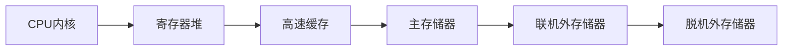
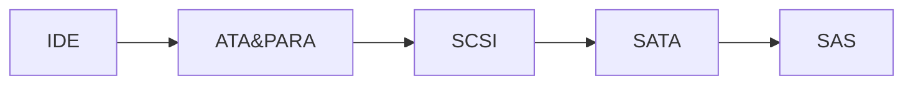

# 嵌入式与微机原理总复习

[TOC]

## 复习大纲

- [x] 概述
- [x] 计算机系统的基本结构与工作原理
- [ ] 存储器系统
- [ ] 总线和接口
- [ ] ARM处理器体系结构
- [ ] ARM处理器指令系统
- [ ] ARM程序设计
- [ ] 基于ARM微处理器硬件与软件系统设计开发
- [ ] 附录
	- [ ] 中英文术语对照表

## 1. 概述

### 1.1. 计算机的发展简史

#### 1.1.1. 计算机的诞生

1. 布莱兹·帕斯卡(Blaise Pasca)：基于齿轮结构的机械加减法器
2. 莱布尼茨(Gottfried Wilhelm Leibniz)：可进行乘法、除法和自乘运算的机械计算器
3. 查尔斯·巴贝奇(Charles Babbage)：基于齿轮结构的差分机和分析机
4. 阿兰·图灵(Alan Turing)：图灵机
5. 莫克利(John Mauchly)、艾克特(Eckert)团队：ENIAC(电子数字积分器和计算器)
	* 世界上第一台数字式电子计算机
6. 冯诺依曼(Von Neumanm)：EDVAC(离散变量自动电子计算机)
	* 确定计算机五个构成部分：运算器，控制器，存储器，输入设备，输出设备
	* 三方面重大改进
		* 二进制
		* 存储程序
		* 程序执行顺序可通过“条件转移”指令自动完成
7. 莫里斯·威尔克斯(Maurice Wilkes)：EDSAC
	* 第一台存储程序式电子计算机

#### 1.1.2. 现代计算机发展历程

* **第一阶段**： 电子管阶段 (1946至20世纪50年代中期)
	* 计算机体积庞大，功耗大，可靠性低，售价昂贵
	* 主要用在重要场合的科学计算和数据处理
* **第二阶段**： 晶体管时代 (1955至20世纪六十年代中期)
	* 内存采用磁芯，外存采用磁带或磁鼓，减小体积，降低功耗，提高可靠性，降低成本
	* 运算速度提高，出现了高级程序设计语言(FORTRAN, Algol)，计算机开始进入工业过程控制领域
* **第三阶段**： 集成电路时代 (1965至20世纪七十年代初期)
	* 计算机体积进一步减小，可靠性进一步提高，成本进一步降低，速度大大提高(IBM 360系列计算机)
	* 操作系统逐渐成熟，应用扩大
* **第四阶段**： LSI & VLSI时 (1972~1990)
	* LSI和VLSI得到广泛使用，内存普遍采用半导体存储器，外存采用磁盘、磁带和光盘
	* 体积进一步缩小，性能和可靠性进一步提高，成本进一步降低
	* 应用日益广泛，PC机成为办公和娱乐设备
* **第五阶段**： ULSI & GSI时代 (1991年至今)
	* 流水线、超标量、多线程、多内核、多CPU和新型高速总线技术使得普通PC机的速度可达每秒数十亿次
	* 更加注重多媒体信息和并行数据处理能力
	* 单片机和嵌入式系统性能不断提高，应用领域不断扩大
	* 现代计算机是云计算、大数据、物联网、移动互联网和人工智能等技术发展的最重要基础

#### 1.1.3. 计算机的类型

* **微型计算机**

	* 台式计算机
	* 个人工作站
	* 笔记本电脑
	* 平板电脑

* **服务器**

	具有较强大计算能力，可通过网络为大量用户提供计算、信息处理和数据存储服务，用于大型企事业单位和政府机构的信息处理服务。可分为：

	* 采用Unix操作系统的小型机（服务器）
		* 具有高可靠性和高可用性，数据处理能力较强
		* 多为基于RISC架构的国外品牌
	* 采用Intel架构的x86服务器
		* 支持Linux或者微软视窗操作系统
		* 出色的性价比，国产化程度高

* **嵌入式计算机**

	* 集成到应用对象中的专用计算机，以自动监测与控制应用对象的物理过程
	* 服务与特定目的，不属于通用计算机
	* 典型应用：工业自动化、智能家居、通信设备、数码产品、交通工具、安防、军工等

* **超级计算机**

	* 提供最高的计算性能，最昂贵、物理上最大型的计算机
	* 广泛用于复杂过程仿真等科学计算领域

### 1.2. 计算机系统的组成

**计算机硬件**： 构成计算机的物理部件

**计算机软件**： 按特定顺序组织的指令和数据集合


#### 1.2.1. 计算机硬件


##### 1.2.1.1. 存储器

**主存储器**

* 简称**主存**或**内存**，由半导体材料构成，每个单元存储1位二进制信息，单位为1个**比特**(bit)
* **8bit**组成1个**字节**(Byte)
* 字节是存储器存储和读取数据的基本单位，每个字节都有唯一的物理地址(PA)
* 若干字节构成一个字，每个字所包含的位数称为计算机的**字长**
* 典型的字长有16位、32位和64位

**辅助存储器**

* **主存特点**：读写速度相对较快，价格高、容量受限、掉电后RAM存储的信息消失
* **辅存特点**：读写速度慢，价格低，容量大、具有非易失性，又称为**外存**
* 常见外存包括：
	* 基于磁介质极化的磁盘和磁带
	* 基于表面几何微观形状的光盘 (CD, DVD, BD)
	* 基于半导体的闪存

---

##### 1.2.1.2. 运算器

* **主要功能**： 完成各种数据运算和处理
* **核心构成**： 算术逻辑单元ALU和寄存器阵列
* **ALU**：在控制信号的作用下完成任意的算术或逻辑运算 (加、减、乘、除、移位或比较大小等)
* **寄存器**： 运算器内部的高速存储单元，访问速度最快
	* 受芯片面积限制，寄存器的数量不会很多
	* 运算器工作时，需要处理的数据（操作数）先被送到某个寄存器中暂存
	* 运算过程中的临时数据或者处理后的结果也暂存在特定的寄存器中

---

##### 1.2.1.3. 控制器

* 计算机的指挥控制中心
* **主要功能**： 根据指令对计算机各部件进行操控，协调各部件有序工作
* **主要构成**： 
	* 指令寄存器IR
	* 指令译码器ID
	* 操作控制器OC
* VLSI出现后，运算器和控制器被集成到CPU中
* CPU与主存是计算机的**核心部分**

---

##### 1.2.1.4. 输入设备

* **主要功能**：将信息进行编码后输入计算机
* **最常见输入设备**： 键盘和鼠标
* 用于人机交互的输入设备：
	* 触摸屏、操纵杆、轨迹球、麦克风、游戏机手柄……
* 其他输入设备
	* 扫描仪、证件读卡器、摄像头等

---

##### 1.2.1.5. 输入设备

* **主要功能**： 向外界输出计算机处理后的结果
* 有些兼具输入和输出功能，如触摸屏和计算机通信设备，简称I/O设备，外存也可以看作是一种I/O设备
* **特点**： 种类繁多、信息格式各异、速度快慢不一
* **慢速设备**：打印机、绘图机、扬声器、……
* **高速设备**：外存、数据通信设备、超高清显示器、数字波形合成器、……

---

##### 1.2.1.6. 适配器

* **主要功能**： 在计算机与和外设之间进行桥接和匹配，解决种类繁多、速度快慢不一、信息编码格式各异的输入输出设备的互连问题
	* **数据缓冲**，解决速度不匹配问题
	* **信息转换**，解决编码格式不同的问题
	* **电平转换**，解决电平不一致问题
	* **状态监测**，收发双方的相互沟通
	* **时序控制**，协调外设和主机并行工作
* 适配器又称I/O接口
* 多个不同种类的外设，需要多个接口
* 常见的外设接口：并行接口、I^2^C接口、串行接口和USB接口

---

##### 1.2.1.7. 总线

* **主要功能**： 实现各部件之间的信息传输和交换
* 按用途分三类：
	* **数据总线**DB：双向
	* **地址总线**AB：单向
	* **控制总线**CB：有些单向有些双向


#### 1.2.2. 计算机软件

##### 1.2.2.1. 计算机软件分类

按特定顺序组织的计算机数据和指令的集合，可分为：

**系统软件**

* 控制和管理计算机工作并且无需用户干预的各种程序集合。主要功能是调度、监控和维护计算机运行，管理各种部件，协调各种资源
* 系统软件的核心是**操作系统**，负责管理硬件与软件资源、控制I/O设备和网络、维护文件系统、提供用户接口UI

**应用软件**

* 利用计算机解决特定问题而编程开发的各种程序

**中间件软件**

* 处于计算机系统软件与用户应用软件之间，是分布式应用系统的基础软件
* 为上层应用软件提供开发、集成和运行环境，并实现应用软件之间的互操作
* 通过网络通信功能解决分布式环境下数据传输、数据访问、应用调度、系统构建、系统集成和流程管理等问题，是分布式环境下支撑应用开发、运行和集成的平台
* **核心思想**：抽取分布式系统对于数据传输、信息系统构建与集成等问题的共性要求，封装共性问题的解决方法，对外提供简单统一的接口，从而减少系统开发难度，优化系统结构和提高系统的开发效率

##### 1.2.2.2. 计算机软件的发展

* **第一代** 1846~1953
	* 机器语言
	* 汇编语言
* **第二代** 1954~1964
	* 算法语言
	* Fortran
	* LISP
	* ALGOL
	* BASIC
* **第三代** 1965~1970
	* 多用户多任务操作系统
	* 数据库技术
	* 软件工程
* **第四代** 1971~1989
	* 结构化程序设计思想
	* PASCAL
	* C语言
	* 多媒体技术
* **第五代** 1990~至今
	* GUI和OA软件
	* 面向对象技术
	* 万维网
	* 分布式架构
	* API
	* 软件定义一切

### 1.3. 计算机中数的表示方法

#### 1.3.1. 进位计数制

**10进制**

* 后缀为D
* 基数为10

$$
456D=456=4\times 10^2+5\times10^1+6\times 10^0
$$

**二进制**

* 后缀为B
* 基数为2

$$
10110B=1\times2^4+0\times2^3+1\times2^2+1\times2^1+0\times2^0 
$$

**16进制** (两位16进制表示1字节)

* 后缀为H或h
* 基数为16
* $0\sim 15,\ 0123456789ABCDEF$ 

$$
32AEh=3\times16^3+2\times16^2+10\times16^1+14\times16^0
$$

**位、字节、字和字长**

* 位=**比特**，计算机存储数据的**最小单位**
* 字节**Byte**，用B表示，一个字节=8个二进制位 (1 Byte=8 bit)，字节是计算机存储和读取数据的基本单位
* 字：计算机进行数据处理时一次存取、加工和传送的数据长度，一个字=多个字节
* n 位计算机的字长为n bit (位)

#### 1.3.2. 有符号数的原码、反码和补码表示

**原码**

* **约定**： 数值$x$的原码记为$[x]_原$，若机器（处理器）字长为$n$位，那么数值$x$的原码定义为：
	$$
	[x]_原=
	\begin{align}
	\begin{cases}
	x&0\leq x\leq 2^{n-1}-1\\\\
	2^{n-1}+|x|&-(2^{n-1}-1)\leq x\leq 0
	\end{cases}
	\end{align}
	$$

* 最高位为符号位：0为正数，1为负数，其余为绝对值

* n bit原码可表示的数值范围是：$-(2^{n-1}-1)\sim 2^{n-1}-1$

* 例：8位有符号二进制数：
	$$
	\begin{align}
	0000\ 0001\to +1\ \ & \ \ 0111\ 1111\to +127\\
	1000\ 0001\to -1\ \ & \ \ 1111\ 1111\to -127\\
	0000\ 0000\to +0\ \ & \ \ 1000\ 0000\to -0
	\end{align}
	$$

* 原码表示的0有正负之分，习惯上将0用+0表示

* 原码存在的问题：原码表示的有符号数在运算时会出现错误 (原因：在运算过程中，符号位也参与了运算)

**反码**

* **约定**：数值$x$的反码记为$[x]_反$，若机器（处理器）字长为$n$位，那么数值$x$的反码定义为：
	$$
	[x]_反=
	\begin{cases}
	x&0\leq x\leq 2^{n-1}-1\\
	(2^n-1)-|x|&-(2^{n-1}-1)\leq x\leq 0
	\end{cases}
	$$

* n bit反码可表示的数值范围为：$-(2^{n-1}-1)\sim 2^{n-1}-1$

* 整数的反码与原码相同；负数的反码符号位为1，其余各位与原码相反

* 反码表示的0有正负之分，习惯上将0用+0表示

* 使用反码表示数据，在运算时符号位也参与运算，故计算机未采用反码

**补码**

* **约定**：数值$x$的补码记为$[x]_补$，若机器（处理器）字长为$n$位，那么数值$x$的补码定义如下：
	$$
	[x]_补=\begin{cases}x&0\leq 2^{n-1}-1\\2^n-|x|&-2^{n-1}\leq x\leq 0 \end{cases}
	$$

* 正数的补码与原码完全相同

* 负数的补码用模$2^n$的补数$2^n-|x|$的二进制编码表示

	* 求一个负数的补码时，可先求出该负数的反码，然后加1即可
	* 另一种方法，求负数绝对值的原码，然后从低位向高位扫描，将遇到的首个1以及之前的0保持不变，对之后的各位按位取反

* 补码运算

	* 对于有符号数$p$和$q$有：
		$$
		\begin{align}
		[p+q]_补&=[p]_补+[q]_补\\ 
		[p-q]_补&=[p]_补-[q]_补=[p]_补+[-q]_补
		\end{align}
		$$

	* 采用补码运算的前提：结果不能发生溢出（结果超出了补码所能表示的范围）

	* **结论**：若记符号位向前进位为CP，次高位向前进位为CF，当且仅当$CP\bigoplus CF=1$时，结果发生溢出

	* **推论**：

		* 若参加运算的二进制数被看成无符号数，没有符号位，加减运算结果可能会有进位或借位，没有溢出问题
		* 若参加运算的二进制数被看成有符号数，运算结果受到最大表示范围的限制，超出则出现溢出，结果错误
		* 有符号数运算必须判断是否出现溢出，如果出现溢出只能重新设计算法

#### 1.3.3. 定点数和浮点数

* **定点数**：采用定点格式表示的数据，能够表示的数值范围较小，所需的硬件电路较简单

	* 定点格式：小数点位置固定不变，无需再用符号表示
	* 现代计算机中多采用定点纯整数，定点数称为整数

* **浮点数**：采用浮点格式表示的数据，可以表示的数值范围很大，所需的硬件电路较复杂

	* 浮点格式：有效数字和数值范围（比例因子）分别表示，小数点位置将随比例因子不同在一定范围内浮动

	* 任意一个二进制数$N$也可以表示为：$N=M\times 2^e$

		* $M$—浮点数尾数，$e$—浮点数阶码

	* IEEE-754规定的浮点数格式

		

#### 1.3.4. 其他信息编码

**BCD编码**

* **4位二进制表示1位十进制数**，最常用的是8421 BCD码，简称BCD码

* 例如：10进制数135，其BCD码位0001 0011 0101

* 计算机以字节为基本存储单位，有两种BCD码表示方法

	* **压缩BCD码**：一个字节表示2位十进制数
		* 例如：十进制数89D的压缩BCD码为：1000 1001B
	* **非压缩BCD码**：一个字节仅用来表示一位BCD码，其中低4位表示0~9，高4位为0
		* 例如：十进制数89D的非压缩BCD码需要使用两个字节：0000 1000B和0000 1001B

* 存在的问题

	* 每4位二进制数可以表示成16种状态，但是BCD码只使用其中的10个，二进制数状态空间利用率低

	* 计算机对数据运算均按照二进制运算规则将带来问题

		* 例如：7+5用非压缩BCD码计算

			$0000\ 0111b+0000\ 0101b=0000\ 1100b(\neq 12D=0001\ 0010b)$

		* 错误原因：使用二进制运算法则计算BCD码

		* 解决方法：BCD码运算后必须对结果进行调整

**ASCII码——美国信息交换标准代码**

* ASCII等同于国际标准的7单位制IRA码
	* 用于给西文字符编码，由7位二进制数组合而成，可以表示128种字符
	* 在ASCII码中，按其作用可分为
		* 34个控制字符
		* 10个阿拉伯数字
		* 52个英文大小写字母
		* 32个专用符号

**字符串表示方法**

* 字符串：一串连续字符，在内存中占用连续多个字节，每个字节存放一个字符
* 字长为多字节的计算机，一个字可存放多个字符

* 不同类型的计算机，一个字有两种字符存放顺序

	* 第一种：从**高位字节向低位字节**顺序存放
	* 第二种：从**低位字节向高位字节**顺序存放


### 1.4. 嵌入式系统简介

#### 1.4.1. 嵌入式系统的基本概念

* Embedded System：嵌入式计算机系统的简称
* **IEEE定义**：嵌入式系统是用于控制、监视或者辅助设备、机器和车间运行的装置
* **中国大陆定义**：以应用为中心、以计算机技术为基础，软件硬件可裁剪，适应应用系统对功能、可靠性、成本、体积、功耗严格要求的专用计算机系统
* 三个**特点**：**嵌入性**、**专用性**和**计算机系统**
* 嵌入性的两层含义：
	* 本系统是嵌入另一个目标大系统中，成为目标系统的一个组成部分，并为实现目标系统的功能提供特定服务
	* 提供特定服务的软件代码也嵌入目标系统中

#### 1.4.2. 嵌入式系统的硬件

* 主要包括：
	* 嵌入式微处理器（核心）
		* 有MPU，MCU，DSP和SOC之分
	* 存储器（外存多采用半导体非易失存储器，如flash）
	* 嵌入式外围设备
	* I/O接口

**嵌入式微处理器 (EMPU)**

* 原理和功能和通用微处理器相同
* MPU没有存储器和外设接口 (MPU的特征)
	* 使用MPU构建嵌入式系统需要外接存储器和I/O接口芯片
	* 如果所有器件安装在一块主板上—单板机
	* 单板机特点：
		* 与传统工控机相比，集成度高、成本低、功耗小和可靠性高
		* 板上芯片、总线、结构呈裸露状态，技术保密性差

**嵌入式微控制器 (EMCU)**

* 将计算机的主要部件，如ROM、RAM、总线控制逻辑和中断控制器，以及可能需要的定时/计数器，并/串接口、看门狗、ADC和DAC等集成在一块芯片上，构成一个功能相对完整的计算机系统，又称为单片机
* **特点**：集成度高，产品开发周期短，成本低廉，功能丰富，功耗小和可靠性高

**数字信号处理器 (DSP)**

* 通过内部硬件电路和专门的DSP指令，快速实现各种高强度数字信号处理，广泛用于数字滤波、信号特征分析、电子对抗、音视频编/解码等领域
* 有非嵌入式和嵌入式、定点和浮点之分
	* **非嵌入式**：独立的芯片，需要与其他处理器通过总线互连，具有较高的处理能力
	* **嵌入式**：作为一个功能部件，被集成到MCP中
	* 定点DSP的运算精度稍差，但是功耗小，成本低
	* 浮点DSP的运算精度高，但是功耗大，成本高

**片上系统 (SOC)**

* 将一个复杂系统集成在一块硅片上
* 如果将设计后的系统下载到FPGA上，就形成了SOC的另一种形式SOPC
* 特点：应用系统集成度高，技术保密性强，功耗低，工作可靠

#### 1.4.3. 嵌入式系统软件

分为嵌入式操作系统和嵌入式应用软件

* **嵌入式操作系统**
	* **实时性**：在规定的时间内准确地完成应该执行地操作
	* **可靠性**：也称为可依赖性或者可信任性
	* **可裁剪**：可根据需求进行功能模块配置
* 应用软件
	* 围绕特定应用需求开发，许多简单应用无需操作系统
	* 复杂应用软件需要嵌入式操作系统支持
	* 逻辑准确、时间确定、运行可靠、减少硬件资源开销

#### 1.4.4. 嵌入式系统的发展概况

* 第一个嵌入式处理器：Intel 4004
* 嵌入式系统发展的四个阶段：
	* 以**MPU**为核心的可编程控制器，无操作系统
	* 以**MCU**为核心的嵌入式系统，出现了简单的操作系统
	* 32位高性能MCU大量涌现，嵌入式操作系统开始成熟，内核精致，效率高，兼容性较好，可提供文件管理、多任务支持和网络接口等功能
	* 与Internet深度融合，嵌入式系统是物联网的主要基础

#### 1.4.5. 典型嵌入式处理器简介

**ARM**

* Advanced RISC Machines：全球最大的IP供应商
* 体系架构版本先后有ARMv1~v8，从v4开始成熟，从v8开始升级到64位，版本号与产品名称之间的关系较为复杂
* 早期产品：ARM7、ARM9和ARM11等系列
* v7版本以后产品名称改用Cortex，有CortexA、M和R三大系列，分别适用不同的应用需求
	* A系列：Application，高性能处理器
	* M系列：MCU，针对价格和功耗敏感应用
	* R系列：RealTime，针对有实时性要求的应用

**MIPS**

* Microprocessor without Interlocked piped stages：第二大IP供应商
* 设计理念：强调软硬件协同提高性能，简化硬件设计
* 嵌入式处理器非常小巧

## 2. 计算机系统的基本结构与工作原理

### 2.1. 计算机系统的基本结构与组成

#### 2.1.1. 计算机的层次模型

**分层目的**：分析计算机各个部件之间的逻辑关系

**层次模型发展历程**：

1. **最初阶段**：只有两层

	* **硬件层**：逻辑电路
	* **软件层**：指令系统

	

2. **第二阶段**：微程序 vs RISC

	* 微程序设计思想 → 三层模型
		* 一条**指令**可以分解为多个**微操作**
		* **微操作**可以用**微指令**实现
		* 多条**微指令**组成**微程序**实现指令功能
		* **微程序**存储在**控制ROM**中，执行时逐条读出完成**微操作**

	

	* **微程序**
		* 微程序简化了控制器硬件，并可实现复杂指令
		* 增加新指令，引入新的寻址方式，导致
			* 芯片中的器件数量增加
			* 芯片功耗不断增大
			* 而计算机性能与电路规模不成比例
	* **RISC**
		* **二八定律**
			* 80%的时间运行的是占总量不到20%的简单指令
			* 80%的任务是由占总量不到20%的电路完成的
		* 为提高性能，应该：
			* 减少指令数量，一条复杂指令用多条简单指令替代
			* 取消微程序，指令功能由硬件电路（硬核）实现

3. **第三阶段**：操作系统

	* 早期计算机没有操作系统，必须“手工”对计算机进行管理，如任务调度、内存管理、I/O控制等
	* 第一个真正的操作系统：1964年可运行在不同规格的IBM System/360系列大型机的OS/360
	* 操作系统负责管理计算机硬件资源和用户作业，提供了人机交互界面、多条用户命令和多种子程序调用接口，极大简化了计算机操作、管理的复杂性

	

4. **第四阶段**：编程语言

	* 使用各种语言编写的程序，必须经过相应的编译（或解释）程序进行处理后，计算机才能识别和执行

	

#### 2.1.2. 基于冯诺依曼架构的模型机系统结构


**结构特点**：

1. **以CPU为核心**（现代计算机逐步转化为以存储器为核心）
2. **单总线系统**（类似于快慢车道不分的混合式交通）
3. **指令和数据使用同一条总线**（冯诺依曼架构的主要缺陷）

### 2.2. 模型机存储器子系统

#### 2.2.1. 存储器的组织和地址

* 每个**字节**拥有一个独一无二的物理地址（PA），字节是计算机可访问的最小存储单元
* **字节寻址存储器**：按照字节组织存储器，连续地址对应于连续的字节单元（存储器按照字节组织）
	* 如果计算机的字长是8位，总线宽度也为8位，CPU访问存储器时，总线一次可以传送一个字节数据
	* 字节单元地址有n, n+1, n+2, ...
	* 若模型机字长为32位，一个字有4个字节，连续的字被分配到n, n+4, n+8, ...中

**计算机的分体结构**：

问题描述：若总线宽度为16位、32位或64位，CPU访问存储器时，为一次能够传输一个完整的字（2/4/8字节），或根据需要一次传送这个字中的一部分字节，应如何组织存储器和连接存储器与总线？

以32位模型机为例，总容量为2^32^的存储器分成4个存储体，每个存储体为2^30^，分别与32位数据总线按下图连接，每个存储体只需30条地址线，用字节选择信号进行选择


**Intel 8086系统存储器的分体结构**

Intel 8086数据总线位宽为16位，地址总线位宽为20位

* 总容量为1MB的存储系统分成2个512KB的存储体
* 高位和低位字节存储体分别连接DB的高8位和低8位
* $\overline{BHE}$和$A_0$为存储体选择信号
* $\overline{BHE}$有效（低电平）选中高字节存储体；$A_0=0$选择低字节存储体；都有效同时选中两个存储体


#### 2.2.2. 字的对齐——对准存放

* 8位计算机没有对准存放问题
* **对准存放**：
	* 16位机的字起始地址应该是2的倍数，如0、2、4……
	* 32位机的字起始地址应该是4的倍数，如0、4、8……
	* 64位机的字起始地址应该是8的倍数，如0、8、16……
* 对准存放不是必须的，但如果采用对准存放，存取一个字只需要一次总线操作即可完成

#### 2.2.3. 小端格式和大端格式

* 假设$W$由$B_3$，$B_2$，$B_1$和$B_0$组成，$B_3$是最高字节，$B_0$是最低字节，存储$W$需使用4个地址连续的内存单元

* 对于地址依次为$m$、$m+1$、$m+2$和$m+3$的连续4个存储单元，$m$单元地址最小，称为尾部；$m+3$单元地址最大，称为头部

	

* $W$有两种存放格式：

	* Intel x86采用小尾或小端格式
	* Motorola采用大尾或大端格式

	

* 如果采用对准存放，$m$是整个字的地址
* 现代许多CPU兼容大端格式和小端格式，如：ARM处理器默认小端格式，但可通过硬件引脚或者指令选择大端格式

#### 2.2.4. 存储器操作

计算机运行时所需的**指令**和**数据**都存放在存储器中。一条指令在**执行之前**必须将这条指令完整地从存储器取出并传送到CPU中；**指令执行时**所需的操作数和操作结果有时也需要在CPU和存储器之间进行传送

两个最基本操作：读出和写入

**读操作**

* **作用**：将一个指定内存单元的内容读出并传送到CPU中
* **特点**：读操作之后存储单元的内容保持不变
* **过程**：
	* 读操作开始时，CPU通过**地址总线AB**向存储器发送指定存储单元的**地址**，并通过**控制总线CB**向存储器发出**读命令**
	* 被选中的存储单元的内容则被**读出**并送上**数据总线DB**
	* CPU在时序信号的控制下，**采样**DB上的数据并存入内部，完成一次读操作

**写操作**

* **作用**：从CPU中向一个指定存储单元传送一条数据
* **特点**：传送的数据将覆盖目的单元中原有的内容
* **过程**：
	* 写操作开始时，CPU通过**地址总线**向存储器发送目的存储单元的**地址**，通过**数据总线**传送所需写入的**内容**
	* 通过**控制总线**向存储器发送写命令
	* 数据总线上的数据被写入存储器指定单元，完成一次写操作

**连续数据读写**

* 只需在第一次读写时发送地址
* 对于地址连续的数据块，只需告知存储器本次传送是数据块传送、一次读写的字节数和地址修改的方向，存储器即可推断出下一次读写操作的地址，无需CPU再次重复发送

#### 2.2.5. 存储器的分级

**对存储器的要求**：速度快、容量大、成本低

**分级存储体系结构**

* 使用外存满足大容量、低成本和非易失的要求
* 使用DRAM型内存，兼顾容量、速度和成本
* 使用高速缓存，减少CPU访问内存的开销
	* 高速缓存(Cache)：位于CPU与内存之间，SRAM型小容量快速存储器，用于存放CPU最近使用过或者可能要使用的指令和数据


### 2.3. 模型机CPU子系统

**模型机CPU内部结构：**


#### 2.3.1. 运算器

**基本组成**

* 算术逻辑单元 (ALU)
* 累加器 (ACC)
* 标志寄存器 (FR)
* 暂存寄存器

**算术逻辑单元ALU**：运算器的核心

* 作用：负责运算，也是数据传送的一条重要途径
* 组成：带有先行进位功能的**全加器**（简称加法器）、**移位寄存器**以及相应的**控制逻辑**
* 加法器是ALU最主要的部件，所有二进制算术运算都可通过加法和移位来实现

**累加器ACC**：特殊寄存器

* 提供需要送入ALU的操作数，存储ALU的计算结果
* 早期的CPU只有一个ACC，因ACC与ALU之间密不可分，常被划分到运算器中，不属于通用寄存器组
* 现代CPU中有很多通用寄存器都可以当作累加器来使用
* ACC下方的**累加锁存器**：其作用是防止ALU的输出经ACC再反馈到ALU的输入端

**暂存器**

* 暂时存放需要送入ALU的操作数，但不存放计算结果
* 暂存器是透明的，程序员不可见

**标志寄存器**：也称为程序状态寄存器

* 标志寄存器的内容称为程序状态字PSW，PSW分为状态标志位（条件码标志位）和控制标志位

* **状态标志位**：记录ALU运算后的状态或者特征

	* 如：结果是否为零？是否为负数？是否有溢出？是否有进位？

	* 后续指令可根据状态标志决定程序执行顺序

	* 例如：

		* ARM处理器的程序状态寄存器（PSR）中有4个状态（条件码）

			

		* Intel 8086中还有辅助进位位A和奇偶校验位P（P现已不用）

	* 后续指令可根据这些状态标志决定程序是顺序执行还是跳转执行

* **控制标志位**：是对CPU的某些行为进行控制和管理

	* Intel 8086的标志寄存器中有3个控制标志位
		* D(Direction)：串操作的地址改变方向 （D=1 → 地址减量）
		* I(Interrupt)：是否允许外部中断（I=1 → 允许中断）
		* T(Trap)：单步中断（T=1 → 单步中断）
	* Intel 8086提供了对D和I进行单独操作的指令，如
		* STI：将I置位为1，允许外部可屏蔽中断，亦称开中断
		* CLI：将I复位为0，禁止外部可屏蔽中断，亦称关中断
	* Intel 8086还提供了对状态标志位C的3条操作指令，操作内容分别是置位、复位和取反

#### 2.4.2. 控制器

整个CPU的指挥控制中心

**功能和作用**：

根据指令中的操作码和时序信号，产生各种控制信号，对系统各个部件的工作过程进行控制，指挥和协调整个计算机有序地工作

**控制器主要构成**：

* 指令寄存器IR (Instruction Register)

* 指令译码器ID (Instruction Decoder)

* 操作控制器OC (Operation Controller)

* 有观点认为包括程序计数器PC (Program Counter)

	（也有观点认为PC属于数据通道）

**指令寄存器IR**

* 临时存放从内存或者缓冲区中取出地下一条待执行指令，其输出作为**指令译码器**的输入

**指令译码器ID**

* 计算机能且只能执行“指令”
* 指令由操作码和地址码两部分构成
	* 操作码表示要执行什么操作
	* 地址码表明指令执行时操作对象（操作数）的存放地址
* 指令译码器只对**操作码**进行译码，分析和识别指令应该执行什么样的操作

**操作控制器OC**

* 根据指令译码器的译码结果，产生所需的各种控制信号并发送到相关部件，控制这些部件完成规定的操作
* 操作控制器内部包括时序脉冲发生器、控制信号发生器、启停电路和复位逻辑等

**程序计数器PC**

* 存放下一条待执行指令在内存中的地址
* 计算机开机时，指向引导程序的第一条指令
* 顺序执行时，每条指令执行后自动修改，PC=PC+n，n与指令字长以及PC的单位有关
* 遇到转移指令，转移目标地址→PC

**控制器的工作过程：**

1. 根据**程序计数器**的内容获取下一条指令的存放地址
2. 通过总线从存储器中取出这条指令并存放到**指令寄存器**中（取指）
3. **指令寄存器**的输出直接接到**指令译码器**的输入
4. 指令操作码送入到**指令译码器**，由指令译码器对操作码进行分析和译码，识别出应执行什么样的操作
5. 由**操作控制器**确定操作时序，产生所需的各种控制信号并发送到相关部件，控制这些部件完成指令规定的操作
6. **地址生成部件**根据指令特征将地址码转换成有效地址，送往地址缓冲器
7. 对于转移指令，所生产的转移地址被转入**程序计数器**，实现程序的转移

**微操作**

* 每条指令的执行过程都可以分解为一系列的微操作
* **特点**：可由简单电路实现；可被多个指令复用
* 举例：
	* 假设指令“ADD R1，R2，R3”的功能为R2+R3→R1
	* 这条指令的执行过程可以分解为以下几个微操作：
		1. 根据程序计数器的内容，从内存中读取一条指令到指令寄存器
		2. 指令译码器对指令进行译码
		3. 读取R2寄存器的数值，并发送到ALU中作为加法器的输入
		4. 读取R3寄存器的数值，也送到ALU作为加法器另外一个输入
		5. 加法器进行加法运算
		6. 将加法器运算结果写入R1
		7. 根据运算结果更新状态寄存器中的状态标志位
		8. 修改程序寄存器的内容，使其指向下一条指令

**控制器的实现方式**

1. **微程序控制器**

	* 简介
		* 指令执行过程看作多个**微操作**序贯执行完成的
		* 对每个微操作进行编码，形成**微操作码**，微操作码可由简单电路产生微操作控制信号
		* 执行**顺序控制位**：指示后续微操作的执行顺序
		* 微操作码+执行顺序控制位=**微指令**
		* 指令→一段由若干微指令编排而成**微程序**
		* 所有指令对应的微程序都存放在**控制存储器**CM中逐条读出，其中微操作码经过译码产生**微操作控制信号**
	* 结构
		* **微地址**：微指令在控制存储器CM中的存放地址
		* **CLK**：作用等于读信号

	

	* 工作原理和过程
		* 计算机指令分为**操作码**和**操作数地址**两部分
		* 操作码由**指令译码器**译码，译码结果是该指令对应的微程序在CM中的首地址
		* 该地址经**微地址译码器**译码后，从CM中读出第一条微指令，其中微操作码部分送往微操作码译码器进行译码，生成相应的控制信号以实现规定的**微操作**
		* 执行顺序控制位送往微地址形成电路，生成下一条微指令的**微地址**
		* 不断重复上述过程，直到这段微程序全部执行完毕

2. **硬连线控制器**

	* 简介
		* 也称为组合逻辑控制器，最早采用的控制器设计方法
		* 把控制器看作专门产生固定时序的控制信号的逻辑电路，以使用元件少和速度快作为设计目标
		* 因指令功能的多样性和差异性，导致所实现的控制器逻辑电路复杂、规模庞大，并且一旦形成就无法变更，除非重新设计和布线
		
	* 设计步骤
	
		* **输出**：需要产生的微操作控制信号
		* **输入**：微操作信号类型、执行条件和时序
		* 列出逻辑表达式，经过化简，设计相应的逻辑电路
	
	* **一般结构**
	
		
	
	* **特点**：速度快，电路复杂，不支持复杂指令，调试和改动困难，一度被微程序取代。近年因RISC的兴起和VLSI的进步，再度兴起

#### 2.4.3. 寄存器阵列

* 也称为寄存器组、寄存器堆和寄存器文件
* CPU内部若干高速存储单元，每个都有编号或名称，根据指令中的编号或者名称对其直接访问
* CPU与寄存器之间的数据交换是通过**内部总线**直接进行的，所以CPU与寄存器之间的数据传送速度**最快**
* 受指令长度限制，寄存器数量有限，只能暂时存放CPU工作时所需的少量数据和地址
* 分为专用寄存器和通用寄存器两大类
	* 专用寄存器作用固定，如PSR(FR)、IR和PC等
	* 通用寄存器：为ALU运算提供一个存储区，早期数量较少且通用性差，现在数量增加，通用性增强

#### 2.4.4. 地址与数据缓冲器

CPU内部总线与系统总线之间的接口，提供地址和数据传送缓冲，同时增加CPU的系统总线驱动能力

#### 2.4.5. 数据通道

计算机各部件按功能划分为两大阵营：**控制单元CU**和**执行单元EU**

CU就是控制器，也是计算机中指令流的终点。控制器的组成包括指令寄存器、指令译码器和操作控制器。负责指令译码，生成相应的控制信号，控制执行单元完成指令规定的各种操作

EU负责指令执行，如生成地址、读取和传送数据、计算和处理数据、存储结果、更新PSR和PC。执行单元包括运算器、寄存器组、内部总线以及系统总线接口

在指令执行过程中，数据是在运算器、寄存器阵列和系统总线接口之间通过内部总线进行传送，所以这几个部件也被称为数据通道

### 2.4. 模型机指令集和指令执行过程

#### 2.4.1. 模型机指令集

**指令**

根据计算机组成的层次结构，可以分为：**微指令**，**机器指令**和**宏指令**

* 微指令：微程序级的指令，属于硬件层面
* 宏指令：由若干条机器指令组成的软件指令，属于软件层面
* 机器指令：简称指令，介于位指令与宏指令之间，是CPU能识别和直接执行的一条二进制编码序列，包括操作码和操作数两部分

**指令系统**

一台计算机中所有指令的集合称为这台计算机的指令系统

* 指令集架构ISA：狭义上的计算机体系结构

**汇编指令**

* 使用助记符（容易理解和记忆的字母）表示指令的操作码

* 使用标号和符号地址代替指令和操作数的地址

* 模型机部分常用汇编指令：

	

	

* RISC指令风格：定长指令，Load/Store体系，三操作数
* Rs-源操作数，Rd-目的操作数，Imm-立即数
* Label-标号（用符号表示的指令地址）

**定长指令**

* 每条指令长度固定
* 特点（假设32位机，32位指令长度）
	* 一次取指操作读取一个完整的指令
	* 受指令位数限制，对立即数的大小或者类型有要求
	* 同样原因，对内存寻址时，无法在指令中直接给出内存的单位地址
	* 内存单元地址可用如下方法表示：
		* 某个32位寄存器中的数值—寄存器间接寻址
		* 某个32位寄存器内容+偏移量—基址加偏移量寻址
		* 某两个寄存器之和—基址加索引寻址

#### 2.4.2. 指令周期

**计算机运行流程**

开始 → 取指 → 执行 → 取指 → 执行 → ……

**指令周期**

开始取指到完成指令操作的时间

* 因功能和操作内容不同，许多处理器指令周期也不同
* 有些采用流水线技术的RISC处理器，所有指令执行时间相同，被称为单周期处理器

**CPU时间**

* 又称总线周期、机器周期
* 一个CPU周期等于一次取指时间
* 一个指令周期分为若干个CPU周期

**T周期**

* 又称时钟周期
* 一个总线周期包括若干个T周期
* T周期是处理器**最基本**的时间单位


#### 2.4.3. 模型机指令执行流程

**示例**：利用模型机汇编指令编程实现如下操作：

将数据000FF000h(0x000FF000)与内存中某个字数据相加，字数据的地址位于R3寄存器中，如果相加结果没有溢出，则将0x000FF000存入由R3+80h指定的内存单元，然后停机；如果溢出，直接停机

模型机汇编语言源程序片段：


模型机系统结构：


用汇编语言编写的程序称为**汇编语言源程序**，简称**汇编程序**。将其转换成机器语言的过程称为**汇编**，能够实现汇编功能的软件称为**汇编器**或者**汇编软件**

汇编后的机器指令顺序存放，若指令长度为4字节，后一条指令地址等于前一条地址加4（PC的单位为字节）

模型机结构假设：

1. 模型机是32位，数据总线32位，地址总线32位
2. RISC结构，定长指令设计，每条指令长度也是32位
3. 待运行程序的首地址为0x2000 0000
4. 第一条指令的机器码为“E3 A0 06 FF”

**执行过程：**

1. 第一条：源操作数是立即数（取指时能从指令编码中立即得到的数），被装入R0寄存器后指令执行完毕
	* 根据程序的名字，把0x20000000装入**程序计数器PC** 
	* **程序计数器PC**内容0x20000000送至**地址缓冲器/驱动器**，**地址总线**的输出经**地址译码器**译码，寻址内存单元
	* **操作控制器OC**发读信号，将“E3 A0 06 FF”读出到**数据总线**
	* 由于是取指操作，**数据总线**上的数据被装入**指令寄存器IR**
	* **程序计数器PC**值自动加4（假设PC内容的单元是字节），指向下一条指令的存放地址
		* 流水线处理器取指后立刻更新，以便能够立即取下一条指令
		* 另一种策略是临近指令执行结束时再更新，可根据执行结果确定该如何更新
	* **指令译码器ID**对操作码译码，**操作控制器OC**产生相应的控制信号
	* 指令的**地址码**部分对应着汇编指令的**操作数**部分。本条指令中，源操作数为立即数\#0x000FF000，目的操作数是R0寄存器
	* 在**操作控制器OC**输出的控制信号作用下，立即数\#0x000FF000经地址形成部件和地址驱动器送到地址总线，再经地址译码后寻址到源操作数存放的内存单元
	* **操作控制器OC**发出读信号，将源操作数读出到**数据总线**，然后加载到R0寄存器
2. 第二条：Load操作，从内存取操作数到R1，操作数地址由R3提供
	* 把第二条指令的地址0x20000004 装入程序计数器PC, 程序计数器的内容0x20000004 送到地址形成部件，地址形成部件产生的地址信号经地址缓冲器/驱动器和地址总线，被送到地址译码器进行译码，寻址指令存放的内存单元
	* 操作控制器发读信号，将0x20000004 单元的内容“LDR R1, [R3]”读出，由于是取指操作，“LDR R1, [R3]”经过数据总线被存入到指令寄存器IR
	* 如果程序计数器的单位是字节，则PC 自动加4，指向下一条指令的存放地址
	* 指令译码器ID 对指令操作码进行译码，操作控制器OC 按照操作时序发出相应的控制信号
	* 指令的地址码部分对应着汇编指令的操作数部分。本条指令中，存放源操作数的内存地址位于R3 寄存器中，目的操作数是R1 寄存器
	* 在操作控制器输出的控制信号作用下，R3 寄存器的内容经地址形成部件和地址驱动器送到地址总线，再经地址译码后寻址到源操作数存放的内存单元
	* 操作控制器发出读信号，将源操作数读出到数据总线，然后加载到R1寄存器。
3. 第三条：ADD运算，R0与R1相加，结果存入R1寄存器，完成运算后更新到FR中相关状态位
4. 第四条：条件转移，溢出则跳转执行标号为L2的指令，PC=PC+m（m是转移目的指令与转移指令之间的相对距离）；否则继续执行下一条指令
5. 第五条：Store操作，源操作数是R0寄存器的内容，目的操作数的地址是R3寄存器的内容再加上偏移量80h
6. 第六条：HTL停机，持续执行空操作

**总结与讨论**

* 指令执行时，指令操作码送到IR，经IR译码后OC产生操作控制信号，指令的地址码送到地址形成部件，生成地址信号
	* 指令存储器 → 数据总线 → 指令寄存器 → 指令译码器/地址形成部件
	* 指令译码器是指令操作码的终点
	* 地址形成部件是指令地址码的终点
* CPU中的所有数据都在**数据通道**中传送
* 指令执行过程属于**多级串行作业**，始终有一部分部件处于空闲状态，部件的利用率不高
	* 取指 → 指令译码 → 取操作数 → 执行 → 存操作数
* 模型机属于冯诺依曼架构，**串行**工作方式的取指和存取操作数在时间上相互错开，不会出现冲突
* 如果改用流水线方式，前后指令的取指和存取操作数可能同时发生。冯诺依曼体系结构将造成总线竞争，故不太适合流水线模式

### 2.5. 计算机体系结构的改进

#### 2.5.1. CISC和RISC

**CISC**：指令数量多、功能丰富、可实现复杂操作

* **简介**

	* 采用微程序控制器，为了减少硬件实现难度，减少硬件规模
	* 控制器结构简单、规整。增加新指令或者为已有指令添加新的功能较为容易 → 指令系统规模日渐庞大

	

* **CISC处理器指令的特点**

	* **指令长度不一**

		* 较长指令取指需要使用多个总线周期和多次总线操作
		* 长短不一的指令给指令译码器设计带来挑战，增加了控制器的复杂性和电路规模，也不利于采用流水线和超标量等新技术
		* 举例：
			* Intel 8086处理器的最短指令只有一个字节（如CLC），最长指令6字节。指令长度的变化范围为1~6字节
			* Motorola 68020处理器（32位）的指令长度从半个字到8个字，变化范围为2~32字节

	* **非Load/Store体系**

		算术和逻辑运算指令的操作数可以是存储数

		* 例如：存储器数 + 寄存器数 → 存储器
		* CISC仅需要一条指令：`ADD[addr], Ri`
		* RISC需要三条指令：`LDR`、`ADD`和`STR`，比CISC至少多出2次取值和译码操作

		

	* **MOVE操作**

		* 格式为：`Move destination，source`的传送指令，可实现**寄存器**与**存储器**之间的数据传送
		* 大多数CISC处理器规定，MOVE指令的源操作数和目的操作数最多只能有一个是存储单元
		* 同一条总线上的两个存储单元，如果彼此之间需要传送数据，无论是RISC和CISC处理器，无论采用多条简单指令还是一条复杂指令，数据传送过程都分为两步
			* 第一步，将源操作数从内存单元中读出到某个通用寄存器暂存
			* 第二步，将暂存的内容写入目的存储单元

	* **两操作数**

		* 在现代CISC处理器中，大多数算术和逻辑运算指令只有两个操作数，其格式一般为：

			```
			OPR(操作码)	DST(目的操作数),	SRC(源操作数)
			```

		* 例如，加法指令：

			```
			Add B, A
			```

			对应的操作是(B)+(A)→B。指令执行后，结果送到B原来的存储位置，替换原先的内容。意味着DST既是目的操作数，也是参与运算的两个源操作数中之一

	* **指令功能强大，寻址方式多样，程序简洁**

		* CISC处理器的指令功能强大，可以实现复杂的操作，灵活多样的寻址方式有利于软件编程
		* 与RISC处理器相比，完成同样任务CISC处理器所需的指令数量较少，软件显得较为简洁
		* 指令数量少意味着所需的取指和译码操作次数也比较少，在不考虑其他技术因素（如流水线）的情况下，CISC处理器执行效率要高于RISC处理器

* **CISC处理器的性能问题**

	* 主要影响因素：微程序控制器的工作流程
		* 完成一条指令需要从控制ROM中顺序读出多条微指令，需要多个在时间上序贯执行的微操作，这种在时间上串行作业模式将影响指令的执行速度
	* 两种解决思路：
		* 提高处理器的工作时钟频率，加快微操作的节奏，但是增加时钟频率受到半导体材料物理特性的限制，并且难以消除由此产生的功耗和发热问题
		* 使用流水线和超标量等技术，让多条指令在时间上并行执行。但是由于CISC体系结构的特点，流水线和超标量的设计和实现遭遇很多困难

**RISC**

* **特点**
	* 摒弃微程序设计思想，采用硬连线方式实现控制器
	* 为了减少硬件实现难度，采用精简指令集
	* 减少处理器电路数，多余的芯片面积用于增加Cache容量以及寄存器数量，利用层次化的存储结构优化数据传送
	* 指令简单、长度一致、执行时间相同等特点使其更加易于引入流水线技术和超标量等可大幅度提高处理器性能的并行处理技术
	* CISC处理器一条复杂指令就能实现的操作，RISC处理器需要使用多条简单指令才能完成
	* 需要优秀的程序编译器，优化由数量较多的简单指令构成的程序代码
* **RISC指令特点**
	* 寻址方式简单，种类较少
	* 指令集中的指令数量较少
	* Load/Store体系结构
	* 每条指令长度一致，执行时间相同
	* 面向寄存器的编程思想
	* 算术和逻辑运算指令普遍支持三操作数
	* 只能对寄存器操作数进行算术和逻辑运算
	* 程序代码量较大，因为执行复杂操作需要使用较多的简单指令

**CISC & RISC借鉴与融合**

* 为了减少执行一项操作所需的指令数量，RISC处理器也增加了一些能够快速执行的非RISC指令
* 为降低硬连线控制器的设计难度，有些RISC处理器还是部分采用了微程序和微指令设计
* Intel通过与RISC阵营的合作引入RISC技术，从P6开始，处理器中有一部分采用了RISC设计
* Intel 64位IA-64架构处理器是在HP的帮助下完成的；Intel所提出的EPIC体系大部分是Alpha的遗产

#### 2.5.1. 流水线技术

**流水线原理**

* 指令执行过程可分解为多个步骤，假设分解为：
	* etch(取指) → Decode(译码) → Read(去操作数) → Execute(执行) → Writeback(回写)

* 每个步骤都有专用部件完成操作，各部件分工明确，各司其职，每个步骤按照顺序执行
* 模型机任何时候只能执行一条指令，前后指令呈多级串联作业模式，将会造成部件的“**窝工**”
	* 取指时，译码、取操作数、执行和回写处于等待状态
	* 执行时，取指、译码、执行和回写又处于等待状态
* 将功能部件按指令操作步骤顺序进行排列部署，前后部件之间增加缓冲寄存器，构成指令处理流水线
* 前后两个部件经过缓冲寄存器隔离后，可以相对独立地并行工作


* 部件之间地工作交接（数据传递）将通过缓存寄存器进行
* 这种缓存寄存器被称为流水线寄存器
* 多条指令可以在流水线上以时间重叠的方式序贯执行


* 从流水线时空图可看出，在10个流水线周期内
	* 串行作业模式只能完成2条指令的执行
	* 流水线方式至少可以完成5条指令的执行。多条指令以时间方式重叠方式执行使得IPC大大提高
	* 由于增加了流水线寄存器，增加了流水线寄存器写入时间和额外的门电路时延。因此，单条指令在流水线上执行所花费的时间要比非流水线方式更长
	* 流水线周期将受制于最慢的部件，将导致流水线的性能下降

**流水线中技术存在的主要问题**

流水线高效运行的前提：保持畅通，不发生断流

指令执行过程中可能发生的三种相关冲突：

* **资源相关**，又称结构相关

	* 多条指令在同一周期内争用同一个公用部件
	* 例如：冯诺依曼结构计算机的Fetch、Load和Store操作都使用公用总线接口访问同一个存储器，前一条指令的数据存取操作可能会影响后续指令的取指操作
	* 解决方法
		* 后面一条指令等待一个节拍再启动。称为向流水线插入气泡或者插入阻塞，这将造成流水线性能下降
		* 采用哈佛结构（程序指令和数据分开的结构）。解除存取操作数与取指之间的资源相关

* **数据相关**

	* 后一条指令执行需要使用前一条指令的结果。例如流水线上前后执行的两条运算逻辑令

		

	* SUB指令在第5个周期才将结果写回R1，但是AND指令在第4个周期就要读R1进行运算，而程序的本意是“写后读”（RAW）

	* RAW是一种最为常见的数据相关

	* 流水线可能还存在“写后写”（WAW）和“读后写”（WAR）两类数据相关

		* WAW：$I_{j+1}$试图在指令$I_j$写数据之前写数据，这样最终结果将由$I_j$决定，而程序本意是保留$I_{j+1}$的结果
		* WAR：$I_{j+1}$试图在指令$I_j$读数据之前写数据，此时指令$I_j$读到的是被$I_{j+1}$篡改后的结果
		* 插入气泡可消除数据相关，但将造成流水线性能下降

	* 解决方法

		* 定向推送，前一条指令执行结果通过专用通道直接推送给下一条，减少一个流水线周期，可减少数据相关
		* 优化编译器，对前后指令进行检查，调整执行顺序

* **控制相关**

	* 遇到转移指令时，后续已进入流水线的指令都应清空

	* 以无条件转移（包括子程序调用）指令为例：

		* 假设指令$I_j$是无条件转移指令，其执行步骤为：取指、译码、计算转移地址并更新程序计数器PC。在第4个周期读取**转移目标指令**$I_k$（转移目标指令：转移指令的目标指令，即下一条紧接着执行的命令）。在此之前流水线上的指令$I_{j+1}$和$I_{j+2}$应清除，造成流水线断流。产生两个流水线周期延迟被称为**转移代价**

		

		* 减少转移代价的方法

			* 对于无条件转移指令，增加电路，在译码阶段提前计算转移目标地址，在第3个周期读取转移目标指令$I_k$，将转移代价减少到一个流水线周期

			

			* 依旧存在的问题：大多数条件转移指令是否转移取决于状态标志位，而标志位在ALU运算后才更新，转移代价较大。流水线级数却多，代价越大
				* 转移预测技术

	* **转移预测技术**

		* **转移延迟槽**：转移指令$I_j$后面的一个时间片。无论是否转移，位于转移延迟槽的指令总是会被执行
		* **动态转移预测**：根据转移指令过去的行为进行预测
			* 评估：用2bit（权值）对转移指令过去行为进行量化，‘11’总是转移，‘00’总是不转移
			* 动态打分：每发生一次转移，权值+1，加到11b为止；每发生一次不转移，-1，减到00b为止
			* 使用**BTB**（**转移目标缓冲器**），收集和存储了近期所有转移指令的有关信息，并按照查找表的形式进行组织，为动态转移预测提供信息
			* BTB不能太大，一般为1024个表项，其内容包括：
				* 转移指令$I_j$的地址（查找表索引）
				* $I_j$转移可能性的量化结果（2bit权值）
				* 转移目标指令$I_k$的地址
			* 每条指令在取指时，处理器根据其地址在BTB中进行快速搜索，若有记录则表明这是一条转移指令，并根据其“档案”进行相应处理，最后根据这条指令的实际行为修正BTB的记录内容

#### 2.5.3. 超标量处理器和多发射技术

* **标量处理器**：只能处理标量数据，一条指令一次只能处理一个数据，属于SSID
* **向量处理器**（阵列处理器），一条指令完成一个向量计算，属于SIMD，用于科学计算和信号处理等领域
* **超标量处理器**：拥有多条流水线，通过空间并行方式提高处理能力
	* 将多条指令分发到多条流水线上，同时执行
	* 分发前需配对检查，**不同流水线上的指令不相干**
		* 若流水线2的指令要用到流水线1的结果，那便会产生窝工
	* 可以使用不同类型的流水线，如整数和浮点数
* **多发射技术**：多个指令分发单元
	* 指令分发单元需要在一个流水线周期之内向多条流水线发射多条指令

#### 2.5.4. 超线程处理器

* **进程**：程序的动态执行过程
	* 多任务系统中，CPU的运行时间被划分成多个时间片，CPU在不同的时间片轮流为每个任务进行服务
	* 早期，进程被作为作业调度和资源管理的基本单位
	* 进程运行时拥有所需的全部资源；任务切换时，操作系统回收资源并重新分配，无效开销太大
* **线程**：能独立执行的代码最基本单元
	* 每个进程拥有若干个线程
	* 线程是作业调度和执行的基本单元，拥有少量的必备资源，与进程中的其他线程共享全部资源
	* 线程调度时资源不可回收，无效开销小
* 单处理器同时只能执行一个线程，多线程只是利于操作系统的任务调度，减少无效开销，性能提高有限
* **超线程技术**：为进一步减少处理器内部的硬件资源闲置，对流水线进行改造并添加少量部件，使处理器在同一时间可以执行两个线程
	* 超线程只是有了两个逻辑上的线程处理单元，每个线程并不是独自拥有所需的全部资源
	* ALU、FPU、Cache和总线接口等仍是两个线程共享
	* 超线程需要操作系统、应用软件以及主板BIOS的支持
	* 性能提升：多任务时可提升30%，单任务时处理器性能不升反降

#### 2.5.5. 多处理器计算机和多计算机系统

**多处理器计算机**

* 一个计算机有分布在不同的芯片上的多个处理器
* 多个处理器芯片通过共享内存或者共享总线进行数据交换，并行工作，属于一种**紧耦合**多处理器系统
* 多处理器计算机分为：
	* **非对称多处理器计算机AMP**
		* 处理器有主从之分，不同的处理器承担不同的任务
	* **全对称多处理器计算机SMP**
		* 现代服务器的主流架构。各处理器地位相同，对称工作；所有共享系统内存、I/O通道和外部设备


**多计算机系统**

* 台计算机通过局域网以及私有网络彼此互连
* 每台计算机受各自独立的操作系统控制，有属于自己的存储系统和I/O设备，属于一种**松耦合**系统
* 可通过LAN或者SAN（存储域网）共享外部存储器，组成计算机集群
* 除提高了计算能力以外，也减少单点故障，具备高可用性，普遍应用于执行关键任务的信息系统中


**分布式计算机系统**

* 若干独立计算机或者集群通过网络互连而成
* 有一个全网统一的分布式操作系统，能够对用户所需的各种资源进行统一调度和管理，并且保证系统的一致性与透明性（不可见）
* 用户无需关心系统中的资源分布情况以及计算机差异
* 计算机之间没有主从之分，彼此既合作又自治，协同工作
* 分布式计算机系统是计算机应用领域发展的一个重要方向，也是云计算的主要基础


#### 2.5.6. 多核处理器

* 可集成的电路数越来越多，可以把多个功能完整的CPU集成在一个芯片上——单芯片多内核处理器

* 每个计算内核普遍采用超标量和超级流水线技术，拥有所需的全部计算资源，可彼此独立地执行任务

* 多个内核通过片内总线或交叉开关矩阵互连，可看作一个片上多处理器机CMP系统，对外呈现为一个统一的处理器

* 分为**同构**多核和**异构**多核两种类型

	* **同构**
		* 同构多核处理器的内核普遍采用通用处理器，每个处理器的结构相同，地位相同
		* 同构多核的结构相对简单，硬件实现复杂度低
	* **异构**
		* 通过配置具有不同功能和性能的内核以匹配实际应用需求
		* 在提升芯片整体性能的同时，优化处理器结构，降低系统功耗
		* “让专业的人做专业的事”，避免“大马拉小车”和“小马拉大车”
		* 范例：华为海思麒麟处理器

* 多核处理器性能与任务的并行性有关

* **安达尔定律**：性能加速比
	$$
	S=\frac{1}{1-a+\frac{a}{n}}
	$$
	其中，$n$为节点数，$a$为可并行代码比例

	* * 若$a=0$，全是串行，$S=1$
		* 若$a=1$，全是并行，$S=n$
		* 若$20%$代码为串行，$a=0.8$，即使$n\rightarrow \inf,S\rightarrow 5$

* 应在**核数**、**功耗**、**代价**和**实际效果**间寻求平衡

### 2.6. Intel x86典型微处理器简介

#### 2.6.1. Intel 8086处理器


* 全球第一款16位通用微处理器芯片
* 内部寄存器为16位，其中有4个可以分拆成8位使用
* 16位数据总线，20位地址总线
* 内存分段管理，段寄存器左移4位+偏移量=20位地址
* I/O端口独立编址，端口总数为64K个
* 时钟频率仅有5MHz，最高不超过10MHz
* 分成指令执行单元EU和总线接口单元BIU两部分

#### 2.6.2. Intel Pentium处理器


* 与以往的80x86系列微处理器兼容
* 32位地址总线，64位数据总线
* 采用CISC结果实现超标量结构，两条并行的5级整数指令流水线（U和V），一条8级浮点运算流水线
* 独立的指令Cache和数据Cache，数据和代码分离
* 汲取RISC的优点，简单指令改用硬连线控制器实现
* 基于BTB(转移目标地址缓冲器)的预测转移技术
* 191条指令，支持9种寻址方式
* 支持64位外部数据总线突发传输方式
* 支持SMM模式，增强的错误检测和报告功能

### 2.7. ARM嵌入式处理器简介

#### 2.7.1. ARM体系结构、ARM处理器和ARM内核

**ARM体系结构**

* ARMv1~ARMv7属于32位架构，ARMv8属于64位架构
* ARMv7子版本
	* ARMv7-A，对应的产品系列是ARM Cortex-A
	* ARMv7-R，对应的产品系列是ARM Cortex-R
	* ARMv7-M，对应的产品系列是ARM Cortex-M

**ARM处理器和ARM内核**

* 严格地说，ARM处理器是ARM公司设计的处理器
	* 内部仅有的最基本的数据处理核心，习惯上称之为**内核**
	* 基于同一体系结构版本，应用软件层面可相互兼容
* 芯片制造商获得授权后，根据实际需求和产品定位，在某款ARM设计的处理器基础上，再增加诸如实时时钟、ADC、DAC、存储器、协处理器、DSP，以及各种接口单元部件，形成多种各具特色的嵌入式处理器芯片，实际上应该属于SOC，但是往往也被称为ARM处理器（芯片）

#### 2.7.2. ARM处理器的特点

* ARM处理器成功三要素
	* **代码密度高**（代码占用内存少）
	* **功耗低**
	* **性价比高**
* 不同版本的ARM内核都具有如下RISC架构的共同特征：
	* 每条指令长度固定
	* 指令集中的指令数量较少
	* Load/Store体系结构
	* 只能对寄存器操作数进行算术和逻辑运算
	* 采用硬件布线逻辑，大部分指令在一个周期内完成执行
* ARM内核吸取的CISC架构特点：
	* 保留少数功能强大的复杂指令，如多寄存器传送指令
	* 提供自增、自减指令和基于PC的相对寻址方式
	* 用于转移指令和条件执行的条件码（N-负，Z-零，C-进位，V-溢出）
	* 少数指令可以在多个周期内完成
* 其他特点
	* 支持不同的指令集
	* 指令的条件执行
	* 移位操作的实现方式

#### 2.7.3. 典型ARM内核的基本结构

**ARM7TDMI——ARM7系列基本型产品**

* 属于ARMv4T版本，产品后缀含义：

	* T表示支持16位的Thumb指令（ARM指令集的子集）
	* D表示支持片上Debug
	* M表示内嵌硬件乘法器
	* I表示内嵌ICE逻辑

* 内部结构：

	

* 简介

	* ARM7家族其他产品的基础，内核中的内核
	* 包括一个32位ALU，一个32位桶形移位寄存器和一个32位x8位乘法器
	* 共有37个程序可访问的32位物理寄存器，包括31个通用寄存器和6个状态寄存器
		* 这些资源不是同时可见，在不同工作状态以及不同工作模式下只能看到其中一部分
		* 在任何状态和模式下，最多只能看到其中的18个
	* “写”和“读”数据总线分开，片外只需配置单向总线驱动器，没有双向驱动器的方向转换时延

* 特点

	* 有ARM和Thumb两种状态，可软件切换，分别支持全功能的32位ARM指令集和简洁的16位Thumb指令集
	* 一条3级（取指、译码和执行）流水线，性能可达0.9MIPS/MHz；支持8bit、16bit和32bit数据操作
	* 快速中断响应能力
	* 写数据和读数据总线分开，片外无需双向驱动器
	* 冯诺依曼结构，系统简洁，门电路数量较少
	* 高性能、低成本，超低功耗，尤其适合对功耗有苛刻要求的场合，如依赖电池供电的各种手持式电子设备

**ARM920T基本结构和特点**

* ARM9系列简介
	* ARM9产品家族可分为ARM9和ARM9E两个系列
		* ARM9系列是基于ARMv4T版本的普通型产品，包括ARM9TDMI、ARM920T、ARM922T和ARM940T
		* ARM9E系列则是基于ARMv5TE版本的增强型产品，具有DSP和Java扩展功能，包括ARM926EJ和ARM946E
	* ARM9系列与ARM7相比在体系结构上的改进
		* 指令流水线升级为5级（取指、译码、执行、存储器访问和回写），每级电路更简单，执行速度更快
		* 采用**哈佛结构**，减少发生资源冲突的概率
		* Thumb指令采用硬件译码，速度高于软件译码的ARM7

* ARM9TDMI处理器简介

	* ARM9TDMI是ARM9产品家族中的基本型产品
	* 同系列的其他处理器都是以ARM9TDMI为核心，扩展和集成其他功能部件所构成：
		* 指令Cache和数据Cache、AMBA总线接口、嵌入式跟踪宏单元ETM、MMU或者MPU等

* ARM920T处理器简介

	* 属于ARM9系列，以ARM9TDMI为核心，另外配置了
		* 各16B的数据和指令cache
		* 数据和指令MMU
		* 写缓存（16字的数据，4个地址）
		* CP15
		* 外部协处理器接口
		* 嵌入式跟踪宏单元ETM
	* 支持VxWorks，WindowsCE和Linux等嵌入式OS
	* 高性价比和低功耗，典型的目标SOC芯片
	* 提供**1.1MIPS/MHz**的哈佛结构

* ARM920T处理器结构

	

	* 两类地址信号：物理地址PA和虚拟地址VA
		* Physical Address：每个存储单元所拥有的真实地址
		* Virtual Address：编程时所使用的地址，也称为逻辑地址
		* 由MMU负责PA和VA的映射和转换
	* CP15：系统控制协处理器，用于管理和控制Cache、MMU、时钟类型和大小端设定等系统级操作
	* 回写物理地址TAG：地址标记寄存器，存放Cache中需要回写（更新）数据字段在主存中的地址信息
	* 数据总线上的写缓存：提高数据回写操作的速度
	* JTAG：符合JTAG规范的测试接口

### 2.8. 计算机性能评测

#### 2.8.1. 定性描述指标

**机器字长**

计算机中的字长不仅影响计算精度，也影响运算速度。64位计算机的性能显然高于32位

**存储容量**

在计算机存储系统中，高速缓存和内存（主存）容量和类型是评价计算机系统性能的两项重要指标

一般来说，高速缓存和内存容量越大、存取速度越快，计算机的处理能力就越强

**总线带宽和数据吞吐速率**

一般来说，总线带宽取决于总线结构、位宽、主频等。数据吞吐速率还与存储器的存取速度、传送方式、数据的组织形式以及外设接口速度等因素有关

**能耗与环保**

关于CPU效能的指标主要有EPI，EPI指标越低，表明CPU的能源效率越高

计算机的环保指标：耗电量、辐射、噪声、各种器件中有害物质的含量、各种废弃物的可处理性等

**RASIS特性**

* Reliability，可靠性，MTTF与MBTF
* Availability，可用性，系统正常运行时间的百分比
* Serviceability，可维护性
* Integrity，集成性，all in one
* Security，安全性

#### 2.8.2. 定量指标描述

**定量描述指标：速度**

一般来说，一台计算机的主频高、CPU数量或者内核数量多、高速缓存和主存容量大、总线传输速率高，表明计算机运算速度也快

**早期指标：MIPS**

对于执行相同的任务，RISC计算机相比CISC计算机要花费更多的指令，MIPS对CISC和RISC不能客观评价

**现在指标：基准测试**

* Whetstone和Dhrystone
	
	* 前者包括浮点数，后者只有整数，使用FORTRAN编写，代码量太小，与编译器有关
* CoreMark
	
	* 2009年由EEMBC提出，用C语言编写，包含嵌入式系统常见的4种计算（矩阵、查找和排序、状态机和CRC），已成为嵌入式内核标准评测的事实标准
* SPEC测试，通用计算机使用最多的基准测试
	* SPECjbb，用于评测JAVA应用服务器的性能
	* SPECint，用于评测整数计算及编译器优化能力
	* SPECfp，用于评测浮点数计算及编译器优化能力
	* SPEC CPU，用于评测单核或多核处理器在进行整数及浮点数计算时的性能，包括多个种类和多个测试项目

* 其他基准测试

	* TPC

		* 大型信息系统核心主机选型的重要依据
		* 主要针对计算机在数据库应用及事务处理方面的性能，常见的有
			* TPC-C，反映OLTP（联机事务处理）性能
			* TPC-H，反映OLAP（联机事务分析）性能

	* Linpack（线性系统软件包）

		一种高性能计算机系统浮点性能测试基准。通过在计算机（集群）系统中运行Linpack测试程序，可以得到能够反映高性能计算机浮点性能的测试结果Flops。在高性能计算领域，Linpack指标收到普遍重视

	* SAP基准测试

		* SAP研发ERP在大型企业中得到广泛的应用，其测试结果对于ERP系统的硬件选型和配置具有一定指导意义

## 3. 存储器系统

### 3.1. 概述

#### 3.1.1. 存储器的类型及特点

##### 3.1.1.1. 半导体存储器

**原理**

半导体存储器是一种以半导体电路作为存储媒体的存储器，内存储器就是由成为存储器芯片的半导体集成电路组成

**分类**

1. 按其功能分

	* 随机存取存储器RAM
	* 只读存储器ROM

2. 按地位和作用分

	

3. 按结构和工艺分

	* TTL（Transistor-Transistor Logic）
	* COMS（Complementary metal-oxide-semiconductor）

4. 按存储信息的可保存性分

	* 易失性存储器
	* 非易失性存储器

5. 按存储器在计算机中的功能分

	* 高速缓冲存储器（Cache）
	* 主存储器
	* 辅助存储器（外存储器）

**优点**

* 体积小
* 存储速度快
* 存储密度高
* 与逻辑电路接口容易

**缺点**

* 和磁芯存储器不同，半导体存储器如RAM，属于易失性存储器，在电源中断时数据消失
* 可擦除、可编程ROM，编程次数有限

---

##### 3.1.1.2. 磁介质存储器

**原理**

利用磁性介质的磁极化来存储信息

**分类**

* 早期主要用磁泡、磁鼓和磁芯作为存储器
* 现在主要采用磁表面存储器；磁盘（硬盘、软盘）和磁带

**特点**

* 早期为主存。现在为外设，需接口电路支持
* **非易失**性存储器，容量大，存取速度越来越快，体积不断减小。主要的外设，应用广泛

**磁芯存储器结构和工作方式**

磁芯在导线上流过一定电流情形下会被磁化或者改变磁化方向，实现通过实验和材料的工艺控制得到这个能够让磁芯磁化的电流最小阈值。根据磁化时电流的方向磁芯可产生两个相反方向的磁化，这就可作为0和1的状态来记录数据。每个磁芯都有XY互相垂直的两个方向的导线穿过，另外还有一条斜穿的读出线，这些线组成阵列，XY分别做两个不同方向的寻址

**磁盘结构和工作方式**

* 磁盘，是在一片或多片金属、薄膜或玻璃上覆盖磁性材料，由磁头随机存取表面被磁化的不同信息
* 以硬磁盘为代表的存储器，由硬磁盘、磁头、磁盘旋转运动机构，以及控制器组成，驱动盘片高速运动，由磁头沿径向运动进行存取信息的读写
* 作为计算机的海量外存，主要存储文件、图像和视频等
* 硬磁盘存储器已经是微型计算机系统最主要的标准外设之一，经过不断地技术进步，其容量越来越大，存取速度越来越高，而体积却不断减小

**磁带结构和工作方式**

* 磁带是一种柔软地带状磁性记录介质，由带基和磁表面层两部分组成，带基多为薄膜聚酯材料，磁表面层所用材料多为$\gamma-\mathrm{Fe_2O_3}$和$\mathrm{CrO_2}$等
* 由磁带传送机构、赐福控制电路、读写磁头、读写电路和有关逻辑控制电路等组成。驱动磁带相对磁头运动，用磁头进行电磁转换，在磁带上顺序地记录或读出数据
* 磁带控制器是中央处理器在磁带机上读写数据用的控制电路装置。存储数据地磁带可脱机保存和互换读出

---

##### 3.1.1.3. 光存储器

**原理** 

光盘上刻有凹点和空白，光照射后辐射强度不同，接收电路再转化为0、1地数字信号

**分类**

* 只读型光盘
* 可记录型光盘

**光驱结构和工作方式**

* 光驱组成：激光头组件（激光发射器、半分光棱镜、物镜、透镜以及光电二极管）、驱动机械部分、电路及电路板（电源电路、前置信号处理电路、聚焦/循迹/径向/主轴伺服电路、光电转换及控制电路、DSP数字信号处理电路等）、IDE解码器及输出接口、控制面板及外壳等
* 工作方式：驱动光盘高速旋转，激光二极管产生对应波长地激光光束，照射光盘表面，经由激光头组件中地光电二极管捕捉反射回来地信号从而识别实际地数据

**特点**

* 作为计算机外设：内置、外置。不同类型地光盘需要不用类型设备地支持
* 非易失性存储器，容量大，成本低，应用广泛

---

#### 3.1.2. 微机系统的存储体系架构

微型计算机系统的存储体系架构是分层次的，离CPU越近的存储器，速度越快，每字节的成本越高，同时容量越小。按照与CPU由近到远的距离，有


按照访问速度快慢和容量，有



简单的二级结构：内存+外存

完整的四级结构：寄存器+Cache+主存+辅存（联机、脱机外存）


---

1. **寄存器**

	* 组成
		* 采用触发器，构成中央处理器CPU中地一部分
	* 功能
		* 暂存指令、数据和地址
	* 特点
		* CPU处理的数据先提取到寄存器。有限存储容量，高速

2. **高速缓冲存储器Cache**

	* 组成

		存在于CPU与内存之间，由静态存储芯片SRAM组成

	* 功能

		CPU向内存读取数据时，首先查询Cache存储体缓存区是否有对应数据，如果有则直接读取，没有再从内存中读取

	* 特点

		* 成本高，容量比较小。但速度比内存高得多，近于CPU的速度
		* 系统动态管理缓存中的数据，如果有数据访问频率降低到一定值，就从Cache存储体中移除，而将内存中访问更加频繁的数据替换进去

3. **主存储器**

	* 组成

		* 主存储器，简称内存，是计算机运行过程中的存储主力，主要由DRAM和ROM组成
		* 在一些特殊类型或者小容量应用场合，如，在嵌入式系统中，也采用SRAM作为主存

	* 功能

		程序的运行都是在内存中进行。存储指令（编译好的代码段），运行中的各个静态，动态，临时变量，外部文件的指针等等

	* 特点

		成本较高，容量比较大，速度高，但比Cache低得多

4. **辅存**

	* **联机外存储器**
		* 组成：主要为磁介质的机械硬盘、固态硬盘SSD
		* 功能：存储需要永久存储的文件
		* 特点：
			* 磁介质机械硬盘空间大，价格便宜
			* 固态硬盘在接口的规范和定义、功能及使用方法上与普通机械硬盘完全相同，在产品外形和尺寸上也完全一致
	* **脱机外存储器**
		* 移动硬盘、光盘、U盘、Flash等便携式存储器，便于携带

#### 3.1.3. 辅助存储器主要接口标准

 常将联机、脱机存储器称为**辅助存储器**。辅助存储器接口，主要包括硬盘接口标准、Flash存储卡的接口标准等。通用的接口标准为不同类型辅助存储器产品提供接入的互换性，便于产品升级和维护

微机常用存储接口：



嵌入式设备常用存储接口：


---

1. **IDE接口**
	* IDE又称为ATA，用40/80针排线连接PC机和硬盘，16位双向总线并行传送，盘体与控制器集成一起以减少接口电缆长度，提高传输可靠性
	* 后发展为Ultra DMA，最快的Ultra DMA133接口的时钟达到133MHz
	* 由于采用并行接口传输数据，也称为PATA硬盘

---

2. **SCSI接口**
	* **并行**接口，用于计算机及其周边设备之间（硬盘、软驱、光驱、打印机、扫描仪等）系统级接口的独立处理器标准
	* 配专门SCSI控制卡，最多连15个硬盘，也可驱动其他SCSI接口外设
	* 优点：CPU占用率低，多任务并发操作效率高，转速高，传输速度快，更稳定，支持热插拔，连接设备多，连接距离长等
	* 成本高，多用于中高端的服务器和工作站。主流的Ultra 320SCSI的速度为320MB/s

---

3. **SATA接口**
	* SATA使用了**差动信号系统**，能有效滤除噪声
	* 4针**串行**点对点传输数据，一次传一位，但总线8位，每时钟周期能传送1字节，并用数据包传送，速率达150MB/s
	* 接口结构简单，能减小功耗，支持热插拔，还能对传输指令进行检查，并自动纠错，传输可靠性高
	* SATA2和SATA3是最新硬盘接口，传输速度分别达到300MB/s和600MB/s
4. **SAS接口**
	* 串行连接SCSI接口
	* 新一代SCSI技术，它和SATA接口那样采用串行技术来获得更高的传输速度，并通过缩短连线来改善内部空间等
	* SAS的接口技术可以向下兼容SATA，而SATA系统不兼容SAS

---

5. **SD接口**
	* SD卡的数据传送和物理规范由MMC（Multi Media Card）发展而来，大小和MMC卡相似，长宽和MMC卡一样，比MMC卡厚0.7mm
	* SD卡集成了闪存记忆卡控制器、MLC（Multilevel Cell）和NAND闪存，通过9针的接口界面与专门的驱动器相连接
	* SD卡系统是一个新的大容量存储系统，提供了一个便宜的、结实的卡片式的存储媒介
	* SD卡的低耗电和广供电电压，可以满足移动电话、电池应用。使用非常有效的数据压缩比如MPEG，SD卡可以提供足够的容量来存储多媒体数据
	* SD卡衍生类型Micro SD（T-Flash，简称TF）卡，具有更小的尺寸，在大部分场合替代了常规的SD卡，成为脱机外存储器的主流


---

6. **eMMC接口**
	* 嵌入式存储器接口
		* 嵌入式MMC，基于MMC协议的内嵌式存储器标准规格。主要针对使用成本较低的数据存储和传播媒体产品，手机或平板电脑等产品
		* eMMC=控制器+NAND Flash+MMC标准封装接口
		* eMMC封装为MCP芯片。为BGA封装
		* eMMC支持MMC、SPI模式
	* 特点
		* 接口速度高达每秒400MBytes
		* 不需处理其它复杂的NAND Flash兼容性和管理问题，简化了存储器的设计
		* eMMC加快了新产品更新速度，减少研发成本，缩短新产品研发周期
		* eMMC为**半双工**方式。将有被全双工的UFS取代的趋势

---

7. **UFS**
	* UFS，即“通用闪存存储”，同样是一种内嵌式存储器的标准规格，由JEDEC（Joint Electron Device Engineering Council）发布。同样是整合有主控芯片的闪存，不过其使用的是PC平台上常见的SCSI结构模型并支持对应的SCSI指令集
	* UFS是UFSHCI标准JESD223的扩展
	* UFSHCI标准定义了UFS驱动程序和UFS主机控制器之间的接口。除寄存器接口外，它还定义了系统内存中的数据结构，用于交换数据，控制和状态信息
	* 技术特点
		* **串行**传输，**全双工**，同一通道允许读写传输，读写能够同时进行，单通道带宽达1.5GB/s以上，传输效率有效提高
		* 抗EMI和串扰
		* 差分信号可以使用较低的电压，并且由于提高了抗噪声性能，获得更好的信噪比（SNR）
		* 差分信号集成到UFS卡，降低接收器电路复杂性
		* CLK线上的电阻，通过阻尼减少信号失真和EMI
		* 电源电容，去耦以及储能

### 3.2. 半导体存储芯片的基本结构和性能指标

电子计算机主板上主要采用半导体存储器，称为内存

内存用来存放当前执行的**数据**和**程序**，有易失性和非易失性两种

RAM：易失性存储器，仅用于暂时存放程序和数据，关闭电源或断电数据会丢失

ROM：非易失性存储器，用于存放程序或静态数据，即使断电，数据也不会丢失

#### 3.2.1. 随机存取存储器RAM

**简介**

* 特点：
	* 在使用过程中即可利用程序随时写入信息，又可随时读出信息，分为双极型和MOS型两种。前者读写速度高，但功耗大，集成度低，故在微型机主存中几乎使用后者
* 分类：
	* 静态RAM（SRAM）：其存储电路以双稳态触发器为基础，状态稳定，只要不掉电，信息不会丢失。
		* 优点是不需刷新
		* 缺点是集成度低。适用于不需要大存储容量的微型计算机（例如，单板机和单片机）中
	* 动态RAM（DRAM）：其存储单元以电容为基础，电路简单，集成度高。但也存在问题，即电容中电荷由于漏电会逐渐丢失，因此DRAM需定时刷新电路。它适用于大存储容量的计算机

---

**静态RAM（SRAM）**

1. 特点

	* 用**双稳态触发器（SR锁存器）**存储信息
	* **速度快**（双极型<5ns，MOS型几十～几百ns ），不需刷新，外围电路比较简单，但**集成度低**（存储容量小，约1Mbit/片），**功耗大**
	* SRAM被广泛地用作高速缓冲存储器Cache
	* 对容量为$M\times N$的SRAM芯片，其地址线数=$\lg2M$；数据线数=$N$。反之，若SRAM芯片的地址线数为$K$，则可以推断其单元数为$2^K$个。如，地址线分别为13、10根，则单元数为$2^{13}×8,2^{10}×4$ 

2. 基本存储电路

	

	* $V_1～V_4$管组成双稳态锁存器，用于记忆1位二值代码
	* $V_1$截止 → A为高电平 → $V_2$导通 → B为低电平 → $V_1$截止 → 状态“1”
	* $V_1$导通 → A为低电平 → $V_2$截止通 → B为高电平 → $V_1$导通 → 状态“0”
	* 控制管$V_5$、$V_6$ 实现状态控制

3. 工作原理

	* 保持状态

		

	* 读出状态

		选择线通过译码控制为高电平

		

	* 写入状态

		选择线通过译码控制为高电平

		

4. 静态RAM芯片结构

	静态RAM芯片内部由多个基本存储电路单元组成，**容量为单元数与数据线位数之乘积**

	为了选中某一个单元，往往利用矩阵式排列的地址译码电路：**行选择信号 + 列选择信号**

	* 例如，1K单元的内存需10根地址线，其中5根用于行译码，另5根用于列译码
	* 译码后在芯片内部排列成32条行选择线和32条列选择线，这样可选中1024个单元中的任何一个，而每一个单元的基本存储电路的个数与数据线位数相同

	常用的典型SRAM芯片有6116、6264、62256、628128等

	以6116芯片为例：

	

	* 6116芯片的容量为$\pmb {2K×8}$位
	* **2048**个存储单元需**11**根地址线
		* **7**根用于行地址译码输入，**4**根用于列译码地址输入
		* 每条列线控制**8**位，形成了**128×128**个存储阵列，即16384个存储位
	* 6116控制线有三条：片选CS#、输出允许OE#和写入允许(读写控制)WE#
	* 工作过程：
		* 读出
			* 地址输入线$A_{10}～A_0$送来的地址信号经地址译码器送到行、列地址译码器
			* 译码后选中一个存储单元（8个存储位）
			* 由CS#、OE#、WE#构成读出逻辑(CS#=0，OE#=0，WE#=1）
			* 打开右面的8个三态门，被选中单元的8位数据经I/O电路和三态门送到D~7~～D~0~输出
		* 写入
			* 地址输入线$A_{10}～A_0$送来的地址信号经地址译码器送到行、列地址译码器
			* 译码后选中一个存储单元（8个存储位）
			* 由CS#、OE#、WE#构成写入逻辑(CS#=0，OE#=1，WE#=0）
			* 打开左边的三态门，从D~7~～D~0~端输入的数据经三态门和输入数据控制电路送到I/O电路，从而写到存储单元的8个存储位中
		* 无读写操作
			* CS#=1，即片选处于无效状态，输入输出的三态门均为高阻状态，存储器芯片与系统总线断开

---

**动态RAM（DRAM）**

1. 特点

	* DRAM是靠**MOS电路中栅极电容**存储信息，电容上的电荷会逐渐**泄漏**
	* 需要**定时充电**以维持存储内容不丢失（称为动态刷新），动态RAM需要设置刷新电路，相应外围电路就较为复杂。刷新定时间隔一般为几微秒～几毫秒
	* **集成度高**（存储容量大，可达1Gbit/片以上），**功耗低**，但**速度慢**，约为SRAM的一半，**需要刷新**
	* DRAM在微机中应用广泛，如微机中的内存条（主存）、显卡上的显示存储器几乎都是用DRAM制造的

2. 存储原理

	

	* 存储单元由**1个MOS管**和**1个小电容**构成
		* 电容C充满电荷便保存了逻辑"1"
		* 电容C无电荷为逻辑“0”
	* 数据输入输出端连数据总线的某一位D~i~（位线）
	* 低位地址（如A~0~~ A~7~）译码产生**行选信号X**，高位地址（如A~15~~A~8~）译码产生**列选信号Y**。X、Y都为**高电平**时该单元被选中
	* 刷新操作：
		* 电容C上保存的电荷会逐渐泄漏。故DRAM使用过程中需要及时向保存“1”的那些存储单元补充电荷，也就是对电容C进行预充电，这一过程称为DRAM的刷新
		* 刷新逐行进行，当某一行选择信号X为“1”时，选中了该行，电容上信息送到刷新放大器上，刷新放大器又对这些电容立即进行重写。刷新时，列选择信号Y为“0”，因此电容上信息不会被送到数据总线上
		* 温度升高会加快电容放电，因此两次刷新的间隔不能太短，规定为1~100ms。在70°C时的典型刷新间隔为2ms，绝大多数刷新电路按此标准设计
	* **写操作**时，**X=1**，**Y=1**，**Q和T管均导通**，要写入的值（0或1）从**D~i~**加到**C**上
	* **读操作**时，**Q和T同样导通**，存储在**C**上电荷通过**Q**、**刷新放大器和T**输出到**D~i~**

3. DRAM芯片举例

	* 常见小容量DRAM芯片有：
		* 64K×1位－4164/2164
		* 256K×1位－41256
		* 1M×l位－21010
		* 256K×4位－21014
		* 4M×1位－21040... ...等
	* 大容量DRAM芯片有：
		* 16M×16位
		* 64M×4位
		* 32M×8位
		* 256M×4位
		* 512M×4位（DDR结构）...等
	* DRAM芯片举例：Intel 2164A  
		* 单管存储电路设计，容量：64K×1位
		* 数据线有二根：数据输入$\mathrm{D_{IN}}$和输出$\mathrm{D_{OUT}}$；
		* 8根地址输入脚A7~A0，分时接收8位行、列地址；
		* 行和列地址选通信号RAS#和CAS#输入端；
		* 读写命令WE# , 0-写，1-读

	以Intel 264A为例

	

	* Intel 264A的地址线与寻址
		* 容量为**64K×1**位，即片内有65536个存储单元，**每个单元只有1位数据**，用**8片2164A**才能构成64K字节的存储器。若想在2164A芯片内寻址64K个单元，则需要用**16条地址线**。但为减少地址线引脚数目，地址线又分为行地址线和列地址线，进行**分时工作**，这样DRAM对外部只需引出8条地址线
		* 芯片内部有地址锁存器，利用多路开关，由行地址选通信号RAS，把先送来的8位地址送至行地址锁存器加以锁存。由随后出现的列地址选通信号CAS把后送来的8位地址送至列地址锁存器加以锁存
	* 64K×1存储主体，设计成**4个128×128矩阵**
	* 4个128路**刷新放大器**，接收由**行地址选通的4×128个存储单元信息**，经放大后再写回原存储单元进行刷新
	* 16位地址分为行地址A~7~~ A~0~和列地址A~15~~A~8~，以**分时复用**方式，分两次送入芯片。**行地址在先，列地址随后**，各由一个8位地址锁存器保存
	* 两次送来的8位地址信息的最高位（A~7~和A~15~），形成RA7和CA7去控制4选1的I/O门电路，从4个矩阵中选择1个进行读/写
	* 行/列地址译码器对行/列地址的低7位进行译码，从某个128×128个单元中选择1个进行读/写
	* 行地址到达，选通信号RAS#变低；列地址到达，选通信号CAS#变低。经行/列时钟缓冲器协调后，有序控制行/列地址的选通以及数据读/写或刷新
	* 要写入的1位数据从$\mathrm{D_{IN}}$脚输入，由数据输入缓冲器暂存；准备从$\mathrm{D_{OUT}}$脚读出的1位数据，也先由输出缓冲器暂存
	* 写允许WE#以及RAS#、CAS#信号, 通过写允许时钟缓冲器控制后, 决定打开哪个数据缓冲器

4. DRAM存储条

	* 内存条

		* PC配置的内存已高达16GB、32GB，服务器更高达256GB，要求更高的DRAM集成度
		* 容量为1G位以及更高集成度的存储器芯片已大量使用。通常，把这些芯片放在内存条上形成更大存储容量，用户只需把内存条插到系统板上提供的存储条插座上即可使用。
		* 内存条标准化，实现通用和互换，便于维护和升级

	* 内存条的主要技术指标

		* 容量：用户最关心的指标，每种内存条都有多种容量规格
		* 时钟频率：内存芯片的基本工作频率，即表5.2中列出的时钟频率
		* 数据速率：芯片上每根引脚可传输数据的速率
		* 数据宽度：可同时传输数据的位数，现大多为64位
		* 奇偶校验：在每1字节外增加了1位，用作出错检测
		* ECC功能：出错检查和修正功能
		* ......

	* 存储条示例

		

		* 图中是采用HYM59256A存储芯片，构成256K×9位存储容量的存储条
		* 其中，**2片256K×4位**的存储芯片通过**位扩展**形成256K字节的存储单元，1片256K×1位的存储芯片作为**奇偶校验**
		* 引脚
			* A8～A0为地址输入线。
			* DQ7～DQ0为双向数据线，PD为奇偶校验数据输入，PCAS#为奇偶校验的地址选通信号，PQ为奇偶校验数据输出。
			* WE#为读写控制信号，RAS#、CAS#为行、列地址选通信号。
			* V~DD~为电源（+5V），V~SS~为地线。
			* **30个引脚定义**是存储条的通用标准之一

#### 3.2.2. 只读存储器ROM

只读存储器（ROM）掉电后信息不会丢失（**非易失性**或不会挥发性），弥补了RAM的不足，因此成为计算机中的一个重要部件

ROM包括掩模ROM、PROM、EPROM、EEPROM等多种类型

掩模ROM和PROM已淘汰，广泛使用的是EEPROM 和Flash

注意：

* ROM早已不是“只读”，仍称为ROM只是一种习惯
* 只读，是相对于CPU的读写控制电平及其控制逻辑而言
* EEPROM、Flash都是可在线编程读写的，只不过需要专门的写、擦除电平和时序

---

**掩膜ROM**


* Mask ROM（掩膜ROM）的存储数据由专门设计的掩模板决定，为固化数据，用户不能修改

* ROM电路结构包括**存储矩阵**、**地址译码器**和**输出缓冲器**三个组成部分

	* 存储矩阵由许多存储单元排列而成。存储单元可以用二极管构成，也可以用双极型三极管或MOS管构成。每个单元能存放一位二值代码（0或1）。每一个或一组存储单元有一个对应的地址代码
	* 地址译码器的作用是将输入的地址代码译成相应的控制信号，利用这个控制信号从存储矩阵中将指定的单元选出，并把其中的数据送到输出缓冲器
	* 输出缓冲器的作用有两个，一是能**提高存储器的带负载能力**，二是**实现对输出状态的三态控制**，以**使与系统的总线连接与隔离** 

* 掩膜ROM芯片示例：

	

	* 4位数据输出，4×4位的MOS管，单译码结构

	* 地址线A~1~、A~0~，译码后可译出4种状态W~3~~ W~0~。输出4条选择线，分别选中4个单元，每个单元4位输出

	* 存储矩阵由MOS门组成，当W~3~~ W~0~每根线上给出高电平信号时，都会在4根线d~3~~ d~0~上输出一个4位二值代码

	* 将每个输出代码称为一个“字”，并将W3~ W0称为**字线**，将d3~d0称为**位线**(或数据线），而A1、A0称为**地址线** 

	* 输出端的缓冲器用来提高带负载能力，并将输出的高、低电平变换为标准的逻辑电平

	* 通过给定EN#信号实现对输出的三态控制，将数据反相输出

	* 若地址线A~1~A~0~=00，则选中0号单元，即字线0为高电平，若有MOS管与其相连(如位线d2和d0），其相应的MOS管导通，位线输出为0，而位线1和3没有MOS管与字线相连，则输出为1

		* 行列交叉处有无MOS管分别表示了“0”和“1”

	* 掩膜ROM存储矩阵的内容：

		| 单元/位 | d~3~ | d~2~ | d~1~ | d~0~ |
		| ------- | ---- | ---- | ---- | ---- |
		| 0       | 1    | 0    | 1    | 0    |
		| 1       | 0    | 1    | 0    | 0    |
		| 2       | 1    | 0    | 1    | 1    |
		| 3       | 0    | 0    | 0    | 1    |

---

**可编程ROM（PROM）**


* 简介
	* 可编程ROM，即PROM是一种简单的可编程逻辑器件PLD
	* PROM的总体结构与掩模ROM一样，同样由**存储矩阵**、**地址译码器**和**输出电路**组成
	* 在出厂时已经在存储矩阵的所有交叉点上全部制作了存储元件，即相当于在所有存储单元中都存入了“1”
	* 用户可以根据需要将其中的某些单元写入数据“0”（部分的PROM在出厂时数据全为“0”，则用户可以将其中的部分单元写入“1”），以实现对其“编程”的目的

* PROM采用经典的“双极性熔丝结构”

	

	* 由一只三极管和串在发射极的快速熔断丝组成
	* 三极管be结相当于接在字线与位线之间的二极管，熔丝用很细的低熔点合金丝或多晶硅导线制成
	* 如果改写某些单元，则可以给这些单元通以足够大电流，维持一定时间后，需存入0的那些存储单元上的熔丝烧断

* 编程过程

	* 地址译码器选择要编程的地址，找出要写“0” 的单元地址
	* 将V~CC~和选中的字线提高到编程所要求的高电平
	* 在编程单元的位线上加入**编程脉冲**（幅度约20V，持续时间约十几微秒）
	* 写入放大器A~W~的**输出为低电平、低内阻状态**，有较大的脉冲电流流过熔丝，将其熔断
	* 正常工作时读出放大器AR输出的高电平不足以使D~Z~导通，A~W~不工作

---

**EPROM**

* 简介

	* 可擦除可编程ROM
		* 采用叠栅注入MOS管SIMOS (Stacked-gate Injection MOS)做存储单元
	* 是一个N沟道增强型的MOS管，有两个重叠的栅极—控制栅G~c~和浮置栅G~f~
		* 控制栅G~c~用于控制读出和写入
		* 浮置栅G~f~用于长期保存注入电荷
	* 初始状态
		* 浮栅上未注入电荷以前，在控制栅上加入正常的髙电平能够使漏-源之间产生导电沟道，MOS管导通，存储信息“0”
	* 重复擦写编程的EPROM
		* 利用编程器写入后，信息可长久保持，因此可作为**只读存储器**
		* 需要变更时，可利用**擦除器**将其擦除，各单元内容读出值为FFH
		* 再根据需要利用EPROM编程器编程，因此这种芯片可反复使用

* 编程原理

	* 漏-源间加较高电压（约+20~+25V），发生雪崩击穿
	* 同时在控制栅上加以高压脉冲（幅度约+25V，宽度约50ms）
	* 在栅极电场作用下，一些高能量电子穿越SiO~2~层到达浮置栅，被浮置栅俘获而形成注入电荷
	* 浮置栅上注入了电荷的SIMOS管相当于写入了“1”，未注入电荷的相当于存入了“0”

* 擦除原理

	* 存储器芯片开有玻璃窗口
	* 用特定波长紫外线照射该窗口数分钟，所有存储单元浮栅上的电荷会形成光电流泄放掉，使浮栅恢复初态
	* 擦净的芯片可重新编程
	* 编程过程总是从头到尾，对1块芯片的全部单元进行重写，因此不能修改芯片中的部分内容（哪怕1个字节）
	* 通过编程器写入新的数据后，需要将窗口用不透光胶带遮蔽，避免紫外线照射而使电荷泄放，以防数据丢失

* EPROM芯片示例

	

	* EPROM芯片有多种型号，如2716(2K×8 位）、2732(4K×8 位）、2764(8K×8 位）、27128(16K×8 位）、27256(32K×8 位）等

	* 典型EPROM芯片2764A

		* 28脚DIP封装
		* 13条地址线A~12~~A~0~
		* 8条数据线D~7~~D~0~
		* 2个电压输入端V~CC~和V~PP~
		* 片选端CE#(功能同CS#）
		* 输出允许OE#
		* 编程控制端PGM#

	* 读方式（数据）

		* **V~CC~和V~PP~都接至+5 V**，**PGM#接至高电平**
		* 当从2764A的某个单元读数据时，先通过地址引脚接收来自CPU的地址信号，然后**使控制信号和CE#、OE#都有效**
		* 经过一个时间间隔，指定单元的内容即可读到数据总线上

	* 读方式（读Intel标识符）

		* **A~9~引脚接至11.5～12.5 V**
		* 分两次顺序读出两个字节，先让A~1~～A~8~全为低电平，而使A~0~从低变高
		* **A~0~=0**，读出制造商编码(陶瓷封装为89H，塑封为88H）
		* **A~0~=1**，读出器件编码(2764A为08H，27C64为07H）

	* 备用方式

		* **CE#为高电平**，2764A就工作在备用方式，**输出端为高阻状态**
		* 芯片**功耗将下降**，从电源所取电流由100 mA下降到40 mA

	* 编程方式

		* **V~PP~接+12.5V，V~CC~接+5V**
		* 从数据线输入数据
		* **CE#端保持低电平，OE#为高电平**
		* 每写一个地址单元，都必须在**PGM#**引脚端给一个**低电平有效**，**宽度为45 ms的脉冲**

	* 编程禁止

		* 在编程过程中，只要使该片**CE#为高电平**，编程立即禁止

	* 编程校验方式

		* 完成一个字节编程后，电源接法不变
		* **PGM#为高电平**，**CE#、OE#均为低电平**
		* 则同一单元数据在数据线上输出，这样就可与输入数据相比较，校验编程结果是否正确

	* 快速编程方式

		* 传统编程按字节方式，宽度为45 ms的**编程脉冲**，速度慢。且容量越大，速度越慢
		* 新的编程方法提高速度达6倍以上
		* 思路：V~pp~上加编程电压，用1ms编程脉冲依次写完所有数据，再从头开始校验；若有错误，重写此单元

	* 小结

		2764A的工作方式选择表

		| 方式/引脚 | CE#  | OE#  | PGM# | A~9~ | A~0~ | V~CC~ | V~pp~ |   数据端功能   |
		| :-------: | :--: | :--: | :--: | :--: | :--: | :---: | :---: | :------------: |
		|    读     |  低  |  低  |  高  |  ×   |  ×   |  5V   | V~CC~ |    数据输出    |
		| 输出禁止  |  低  |  高  |  高  |  ×   |  ×   |  5V   | V~CC~ |      高阻      |
		|   备用    |  高  |  ×   |  ×   |  ×   |  ×   |  5V   | V~CC~ |      高阻      |
		|   编程    |  低  |  高  |  低  |  ×   |  ×   | V~CC~ | 12.5V |    数据输入    |
		|   校验    |  低  |  低  |  高  |  ×   |  ×   | V~CC~ | 12.5V |    数据输出    |
		| 编程禁止  |  高  |  ×   |  ×   |  ×   |  ×   | V~CC~ | 12.5V |      高阻      |
		|  标识符   |  低  |  低  |  高  |  高  |  低  |  5V   | V~CC~ | 制造商器件编码 |

		

* EPROM存在的问题

	* 

### 3.3. 内存条性能的改进

### 3.4. 存储系统的层次架构

### 3.5. 高速缓冲存储器Cache

### 3.6. 存储器系统设计

## 附录

### 中英文术语对照表

| 英文简称 |                      英文全称                       |            中文译名            |
| :------: | :-------------------------------------------------: | :----------------------------: |
|  ENIAC   |   Electronic Numerical Integrator And Calculator    |     电子数字积分器和计算器     |
|  EDVAC   | The Electronic Discrete Variable Automatic Computer |     离散变量自动电子计算机     |
|  EDSAC   |    Electronic Delay Storage Automatic Calculator    |      存储程序式电子计算机      |
|    PA    |                   Physic Address                    |            物理地址            |
|   ALU    |              Arithmetic and Logic Unit              |          算术逻辑单元          |
|    IR    |                Instruction Register                 |           指令寄存器           |
|    ID    |                 Instruction Decoder                 |           指令译码器           |
|    OC    |               Instruction Controller                |           指令控制器           |
|   LSI    |               Large Scale Integrated                |         大规模集成电路         |
|   VLSI   |            Very Large Scale Integration             |        甚大规模集成电路        |
|   ULSI   |            Ultra Large Scale Integration            |        超大规模集成电路        |
|   EMPU   |             Embedded Microprocessor Uni             |         嵌入式微处理器         |
|   EMCU   |            Embedded Microcontroller Unit            |         嵌入式微控制器         |
|   DSP    |              Digital Signal Processor               |         数字信号处理器         |
|   SOC    |                   System On Chip                    |            片上系统            |
|   SOPC   |            System on a Programmable Chip            |         可编程片上系统         |
|   CISC   |          Complex Instruction Set Computer           |        复杂指令集计算机        |
|   RISC   |          Reduced Instruction Set Computer           |        简化指令集计算机        |
|   RAM    |                Random Access Memory                 |         随机存取存储器         |
|   DRAM   |            Dynamic Random Access Memory             |       动态随机存取存储器       |
|   ACC    |                    *Acc*umulator                    |             累加器             |
|    FR    |                    Flag Register                    |           标志寄存器           |
|   PSR    |               Program State Register                |         程序状态寄存器         |
|   PSW    |                 Program State Word                  |           程序状态字           |
|    CU    |                    Control Unit                     |            控制单元            |
|    EU    |                   Execution Unit                    |            执行单元            |
|   ISA    |            Instruction Set Architecture             |           指令集架构           |
|    PC    |                   Program Counter                   |           程序计数器           |
|   EPIC   |      Explicitly Parallel Instruction Computers      |       精确并行指令计算机       |
|   IPC    |                Instruction Per Clock                | 每一时钟周期内所执行的指令多少 |
|   BTB    |                Branch Target Buffer                 |      转移/分支目标缓冲器       |
|   SISD   |           Single Instruction Single Data            |        单指令流单数据流        |
|   SIMD   |          Single Instruction Multiple Data           |        单指令流多数据流        |
|   CMP    |                 Chip Multiprocessor                 |          片上多处理器          |
|    VA    |                   Virtual Address                   |            虚拟地址            |
|   JTAG   |               Joint Test Action Group               |           联合测试组           |
|   EPI    |               Energy Per Instruction                |         每条指令的耗能         |
|   MIPS   |           Million Instructions Per Second           |   单字长定点指令平均执行速度   |
|   ROM    |                  Read Only Memory                   |           只读存储器           |
|   DRAM   |            Dynamic Random Access Memory             |       动态随机存取存储器       |
|   SRAM   |             Static Random Access Memory             |       静态随机存取存储器       |
|  EEPROM  | Electrically Erasable Programmable Read Only Memory |    电可擦除可编程只读存储器    |
|   IDE    |            Integrated Device Electronics            |         电子集成驱动器         |
|   ATA    |           Advanced Technology Attachment            |          高级技术连接          |
|   SCSI   |           Small Computer System Interface           |       小型计算机系统接口       |
|   SATA   |                     Serial ATA                      |            串行ATA             |
|   SAS    |                Serial Attached SCSI                 |        串行连接SCSI接口        |
|   eMMC   |              embedded Multi Media Card              |         嵌入式多媒体卡         |
|   UFS    |               Universal Flash Storage               |          通用闪存存储          |
|   RAS    |                 Row Address Strobe                  |         行地址选通信号         |
|   CAS    |                Column Address Strobe                |         列地址选通信号         |
|   PLD    |             Programmable Logical Device             |         可编程逻辑器件         |
|          |                                                     |                                |
|          |                                                     |                                |
|          |                                                     |                                |
|          |                                                     |                                |
|          |                                                     |                                |
|          |                                                     |                                |
|          |                                                     |                                |
|          |                                                     |                                |
|          |                                                     |                                |
|          |                                                     |                                |
|          |                                                     |                                |
|          |                                                     |                                |
|          |                                                     |                                |
|          |                                                     |                                |
|          |                                                     |                                |
|          |                                                     |                                |
|          |                                                     |                                |
|          |                                                     |                                |
|          |                                                     |                                |
|          |                                                     |                                |
|          |                                                     |                                |
|          |                                                     |                                |
|          |                                                     |                                |
|          |                                                     |                                |
|          |                                                     |                                |
|          |                                                     |                                |
|          |                                                     |                                |
|          |                                                     |                                |
|          |                                                     |                                |
|          |                                                     |                                |
|          |                                                     |                                |
|          |                                                     |                                |
|          |                                                     |                                |
|          |                                                     |                                |
|          |                                                     |                                |
|          |                                                     |                                |
|          |                                                     |                                |
|          |                                                     |                                |
|          |                                                     |                                |
|          |                                                     |                                |
|          |                                                     |                                |
|          |                                                     |                                |
|          |                                                     |                                |
|          |                                                     |                                |
|          |                                                     |                                |
|          |                                                     |                                |

