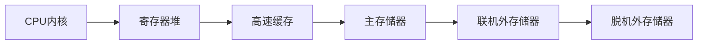
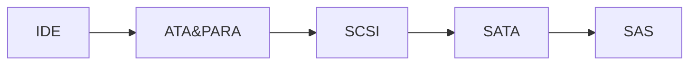
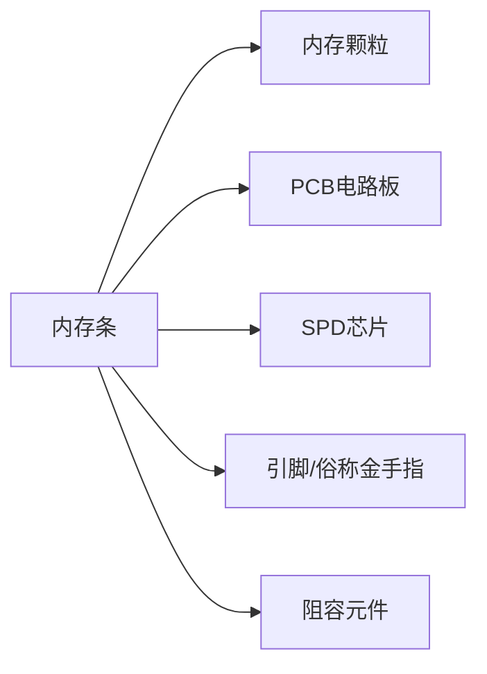

# 嵌入式与微机原理总复习

[TOC]

## 复习大纲

- [x] 概述
- [x] 计算机系统的基本结构与工作原理
- [x] 存储器系统
- [x] 总线和接口
- [ ] ARM处理器体系结构
- [ ] ARM处理器指令系统
- [ ] ARM程序设计
- [ ] 基于ARM微处理器硬件与软件系统设计开发
- [ ] 附录
	- [ ] 中英文术语对照表

## 1. 概述

### 1.1. 计算机的发展简史

#### 1.1.1. 计算机的诞生

1. 布莱兹·帕斯卡(Blaise Pasca)：基于齿轮结构的机械加减法器
2. 莱布尼茨(Gottfried Wilhelm Leibniz)：可进行乘法、除法和自乘运算的机械计算器
3. 查尔斯·巴贝奇(Charles Babbage)：基于齿轮结构的差分机和分析机
4. 阿兰·图灵(Alan Turing)：图灵机
5. 莫克利(John Mauchly)、艾克特(Eckert)团队：ENIAC(电子数字积分器和计算器)
	* 世界上第一台数字式电子计算机
6. 冯诺依曼(Von Neumanm)：EDVAC(离散变量自动电子计算机)
	* 确定计算机五个构成部分：运算器，控制器，存储器，输入设备，输出设备
	* 三方面重大改进
		* 二进制
		* 存储程序
		* 程序执行顺序可通过“条件转移”指令自动完成
7. 莫里斯·威尔克斯(Maurice Wilkes)：EDSAC
	* 第一台存储程序式电子计算机

#### 1.1.2. 现代计算机发展历程

* **第一阶段**： 电子管阶段 (1946至20世纪50年代中期)
	* 计算机体积庞大，功耗大，可靠性低，售价昂贵
	* 主要用在重要场合的科学计算和数据处理
* **第二阶段**： 晶体管时代 (1955至20世纪六十年代中期)
	* 内存采用磁芯，外存采用磁带或磁鼓，减小体积，降低功耗，提高可靠性，降低成本
	* 运算速度提高，出现了高级程序设计语言(FORTRAN, Algol)，计算机开始进入工业过程控制领域
* **第三阶段**： 集成电路时代 (1965至20世纪七十年代初期)
	* 计算机体积进一步减小，可靠性进一步提高，成本进一步降低，速度大大提高(IBM 360系列计算机)
	* 操作系统逐渐成熟，应用扩大
* **第四阶段**： LSI & VLSI时 (1972~1990)
	* LSI和VLSI得到广泛使用，内存普遍采用半导体存储器，外存采用磁盘、磁带和光盘
	* 体积进一步缩小，性能和可靠性进一步提高，成本进一步降低
	* 应用日益广泛，PC机成为办公和娱乐设备
* **第五阶段**： ULSI & GSI时代 (1991年至今)
	* 流水线、超标量、多线程、多内核、多CPU和新型高速总线技术使得普通PC机的速度可达每秒数十亿次
	* 更加注重多媒体信息和并行数据处理能力
	* 单片机和嵌入式系统性能不断提高，应用领域不断扩大
	* 现代计算机是云计算、大数据、物联网、移动互联网和人工智能等技术发展的最重要基础

#### 1.1.3. 计算机的类型

* **微型计算机**

	* 台式计算机
	* 个人工作站
	* 笔记本电脑
	* 平板电脑

* **服务器**

	具有较强大计算能力，可通过网络为大量用户提供计算、信息处理和数据存储服务，用于大型企事业单位和政府机构的信息处理服务。可分为：

	* 采用Unix操作系统的小型机（服务器）
		* 具有高可靠性和高可用性，数据处理能力较强
		* 多为基于RISC架构的国外品牌
	* 采用Intel架构的x86服务器
		* 支持Linux或者微软视窗操作系统
		* 出色的性价比，国产化程度高

* **嵌入式计算机**

	* 集成到应用对象中的专用计算机，以自动监测与控制应用对象的物理过程
	* 服务与特定目的，不属于通用计算机
	* 典型应用：工业自动化、智能家居、通信设备、数码产品、交通工具、安防、军工等

* **超级计算机**

	* 提供最高的计算性能，最昂贵、物理上最大型的计算机
	* 广泛用于复杂过程仿真等科学计算领域

### 1.2. 计算机系统的组成

**计算机硬件**： 构成计算机的物理部件

**计算机软件**： 按特定顺序组织的指令和数据集合


#### 1.2.1. 计算机硬件


##### 1.2.1.1. 存储器

**主存储器**

* 简称**主存**或**内存**，由半导体材料构成，每个单元存储1位二进制信息，单位为1个**比特**(bit)
* **8bit**组成1个**字节**(Byte)
* 字节是存储器存储和读取数据的基本单位，每个字节都有唯一的物理地址(PA)
* 若干字节构成一个字，每个字所包含的位数称为计算机的**字长**
* 典型的字长有16位、32位和64位

**辅助存储器**

* **主存特点**：读写速度相对较快，价格高、容量受限、掉电后RAM存储的信息消失
* **辅存特点**：读写速度慢，价格低，容量大、具有非易失性，又称为**外存**
* 常见外存包括：
	* 基于磁介质极化的磁盘和磁带
	* 基于表面几何微观形状的光盘 (CD, DVD, BD)
	* 基于半导体的闪存

---

##### 1.2.1.2. 运算器

* **主要功能**： 完成各种数据运算和处理
* **核心构成**： 算术逻辑单元ALU和寄存器阵列
* **ALU**：在控制信号的作用下完成任意的算术或逻辑运算 (加、减、乘、除、移位或比较大小等)
* **寄存器**： 运算器内部的高速存储单元，访问速度最快
	* 受芯片面积限制，寄存器的数量不会很多
	* 运算器工作时，需要处理的数据（操作数）先被送到某个寄存器中暂存
	* 运算过程中的临时数据或者处理后的结果也暂存在特定的寄存器中

---

##### 1.2.1.3. 控制器

* 计算机的指挥控制中心
* **主要功能**： 根据指令对计算机各部件进行操控，协调各部件有序工作
* **主要构成**： 
	* 指令寄存器IR
	* 指令译码器ID
	* 操作控制器OC
* VLSI出现后，运算器和控制器被集成到CPU中
* CPU与主存是计算机的**核心部分**

---

##### 1.2.1.4. 输入设备

* **主要功能**：将信息进行编码后输入计算机
* **最常见输入设备**： 键盘和鼠标
* 用于人机交互的输入设备：
	* 触摸屏、操纵杆、轨迹球、麦克风、游戏机手柄……
* 其他输入设备
	* 扫描仪、证件读卡器、摄像头等

---

##### 1.2.1.5. 输入设备

* **主要功能**： 向外界输出计算机处理后的结果
* 有些兼具输入和输出功能，如触摸屏和计算机通信设备，简称I/O设备，外存也可以看作是一种I/O设备
* **特点**： 种类繁多、信息格式各异、速度快慢不一
* **慢速设备**：打印机、绘图机、扬声器、……
* **高速设备**：外存、数据通信设备、超高清显示器、数字波形合成器、……

---

##### 1.2.1.6. 适配器

* **主要功能**： 在计算机与和外设之间进行桥接和匹配，解决种类繁多、速度快慢不一、信息编码格式各异的输入输出设备的互连问题
	* **数据缓冲**，解决速度不匹配问题
	* **信息转换**，解决编码格式不同的问题
	* **电平转换**，解决电平不一致问题
	* **状态监测**，收发双方的相互沟通
	* **时序控制**，协调外设和主机并行工作
* 适配器又称I/O接口
* 多个不同种类的外设，需要多个接口
* 常见的外设接口：并行接口、I^2^C接口、串行接口和USB接口

---

##### 1.2.1.7. 总线

* **主要功能**： 实现各部件之间的信息传输和交换
* 按用途分三类：
	* **数据总线**DB：双向
	* **地址总线**AB：单向
	* **控制总线**CB：有些单向有些双向


#### 1.2.2. 计算机软件

##### 1.2.2.1. 计算机软件分类

按特定顺序组织的计算机数据和指令的集合，可分为：

**系统软件**

* 控制和管理计算机工作并且无需用户干预的各种程序集合。主要功能是调度、监控和维护计算机运行，管理各种部件，协调各种资源
* 系统软件的核心是**操作系统**，负责管理硬件与软件资源、控制I/O设备和网络、维护文件系统、提供用户接口UI

**应用软件**

* 利用计算机解决特定问题而编程开发的各种程序

**中间件软件**

* 处于计算机系统软件与用户应用软件之间，是分布式应用系统的基础软件
* 为上层应用软件提供开发、集成和运行环境，并实现应用软件之间的互操作
* 通过网络通信功能解决分布式环境下数据传输、数据访问、应用调度、系统构建、系统集成和流程管理等问题，是分布式环境下支撑应用开发、运行和集成的平台
* **核心思想**：抽取分布式系统对于数据传输、信息系统构建与集成等问题的共性要求，封装共性问题的解决方法，对外提供简单统一的接口，从而减少系统开发难度，优化系统结构和提高系统的开发效率

##### 1.2.2.2. 计算机软件的发展

* **第一代** 1846~1953
	* 机器语言
	* 汇编语言
* **第二代** 1954~1964
	* 算法语言
	* Fortran
	* LISP
	* ALGOL
	* BASIC
* **第三代** 1965~1970
	* 多用户多任务操作系统
	* 数据库技术
	* 软件工程
* **第四代** 1971~1989
	* 结构化程序设计思想
	* PASCAL
	* C语言
	* 多媒体技术
* **第五代** 1990~至今
	* GUI和OA软件
	* 面向对象技术
	* 万维网
	* 分布式架构
	* API
	* 软件定义一切

### 1.3. 计算机中数的表示方法

#### 1.3.1. 进位计数制

**10进制**

* 后缀为D
* 基数为10

$$
456D=456=4\times 10^2+5\times10^1+6\times 10^0
$$

**二进制**

* 后缀为B
* 基数为2

$$
10110B=1\times2^4+0\times2^3+1\times2^2+1\times2^1+0\times2^0 
$$

**16进制** (两位16进制表示1字节)

* 后缀为H或h
* 基数为16
* $0\sim 15,\ 0123456789ABCDEF$ 

$$
32AEh=3\times16^3+2\times16^2+10\times16^1+14\times16^0
$$

**位、字节、字和字长**

* 位=**比特**，计算机存储数据的**最小单位**
* 字节**Byte**，用B表示，一个字节=8个二进制位 (1 Byte=8 bit)，字节是计算机存储和读取数据的基本单位
* 字：计算机进行数据处理时一次存取、加工和传送的数据长度，一个字=多个字节
* n 位计算机的字长为n bit (位)

#### 1.3.2. 有符号数的原码、反码和补码表示

**原码**

* **约定**： 数值$x$的原码记为$[x]_原$，若机器（处理器）字长为$n$位，那么数值$x$的原码定义为：
	$$
	[x]_原=
	\begin{align}
	\begin{cases}
	x&0\leq x\leq 2^{n-1}-1\\\\
	2^{n-1}+|x|&-(2^{n-1}-1)\leq x\leq 0
	\end{cases}
	\end{align}
	$$

* 最高位为符号位：0为正数，1为负数，其余为绝对值

* n bit原码可表示的数值范围是：$-(2^{n-1}-1)\sim 2^{n-1}-1$

* 例：8位有符号二进制数：
	$$
	\begin{align}
	0000\ 0001\to +1\ \ & \ \ 0111\ 1111\to +127\\
	1000\ 0001\to -1\ \ & \ \ 1111\ 1111\to -127\\
	0000\ 0000\to +0\ \ & \ \ 1000\ 0000\to -0
	\end{align}
	$$

* 原码表示的0有正负之分，习惯上将0用+0表示

* 原码存在的问题：原码表示的有符号数在运算时会出现错误 (原因：在运算过程中，符号位也参与了运算)

**反码**

* **约定**：数值$x$的反码记为$[x]_反$，若机器（处理器）字长为$n$位，那么数值$x$的反码定义为：
	$$
	[x]_反=
	\begin{cases}
	x&0\leq x\leq 2^{n-1}-1\\
	(2^n-1)-|x|&-(2^{n-1}-1)\leq x\leq 0
	\end{cases}
	$$

* n bit反码可表示的数值范围为：$-(2^{n-1}-1)\sim 2^{n-1}-1$

* 整数的反码与原码相同；负数的反码符号位为1，其余各位与原码相反

* 反码表示的0有正负之分，习惯上将0用+0表示

* 使用反码表示数据，在运算时符号位也参与运算，故计算机未采用反码

**补码**

* **约定**：数值$x$的补码记为$[x]_补$，若机器（处理器）字长为$n$位，那么数值$x$的补码定义如下：
	$$
	[x]_补=\begin{cases}x&0\leq 2^{n-1}-1\\2^n-|x|&-2^{n-1}\leq x\leq 0 \end{cases}
	$$

* 正数的补码与原码完全相同

* 负数的补码用模$2^n$的补数$2^n-|x|$的二进制编码表示

	* 求一个负数的补码时，可先求出该负数的反码，然后加1即可
	* 另一种方法，求负数绝对值的原码，然后从低位向高位扫描，将遇到的首个1以及之前的0保持不变，对之后的各位按位取反

* 补码运算

	* 对于有符号数$p$和$q$有：
		$$
		\begin{align}
		[p+q]_补&=[p]_补+[q]_补\\ 
		[p-q]_补&=[p]_补-[q]_补=[p]_补+[-q]_补
		\end{align}
		$$

	* 采用补码运算的前提：结果不能发生溢出（结果超出了补码所能表示的范围）

	* **结论**：若记符号位向前进位为CP，次高位向前进位为CF，当且仅当$CP\bigoplus CF=1$时，结果发生溢出

	* **推论**：

		* 若参加运算的二进制数被看成无符号数，没有符号位，加减运算结果可能会有进位或借位，没有溢出问题
		* 若参加运算的二进制数被看成有符号数，运算结果受到最大表示范围的限制，超出则出现溢出，结果错误
		* 有符号数运算必须判断是否出现溢出，如果出现溢出只能重新设计算法

#### 1.3.3. 定点数和浮点数

* **定点数**：采用定点格式表示的数据，能够表示的数值范围较小，所需的硬件电路较简单

	* 定点格式：小数点位置固定不变，无需再用符号表示
	* 现代计算机中多采用定点纯整数，定点数称为整数

* **浮点数**：采用浮点格式表示的数据，可以表示的数值范围很大，所需的硬件电路较复杂

	* 浮点格式：有效数字和数值范围（比例因子）分别表示，小数点位置将随比例因子不同在一定范围内浮动

	* 任意一个二进制数$N$也可以表示为：$N=M\times 2^e$

		* $M$—浮点数尾数，$e$—浮点数阶码

	* IEEE-754规定的浮点数格式

		

#### 1.3.4. 其他信息编码

**BCD编码**

* **4位二进制表示1位十进制数**，最常用的是8421 BCD码，简称BCD码

* 例如：10进制数135，其BCD码位0001 0011 0101

* 计算机以字节为基本存储单位，有两种BCD码表示方法

	* **压缩BCD码**：一个字节表示2位十进制数
		* 例如：十进制数89D的压缩BCD码为：1000 1001B
	* **非压缩BCD码**：一个字节仅用来表示一位BCD码，其中低4位表示0~9，高4位为0
		* 例如：十进制数89D的非压缩BCD码需要使用两个字节：0000 1000B和0000 1001B

* 存在的问题

	* 每4位二进制数可以表示成16种状态，但是BCD码只使用其中的10个，二进制数状态空间利用率低

	* 计算机对数据运算均按照二进制运算规则将带来问题

		* 例如：7+5用非压缩BCD码计算

			$0000\ 0111b+0000\ 0101b=0000\ 1100b(\neq 12D=0001\ 0010b)$

		* 错误原因：使用二进制运算法则计算BCD码

		* 解决方法：BCD码运算后必须对结果进行调整

**ASCII码——美国信息交换标准代码**

* ASCII等同于国际标准的7单位制IRA码
	* 用于给西文字符编码，由7位二进制数组合而成，可以表示128种字符
	* 在ASCII码中，按其作用可分为
		* 34个控制字符
		* 10个阿拉伯数字
		* 52个英文大小写字母
		* 32个专用符号

**字符串表示方法**

* 字符串：一串连续字符，在内存中占用连续多个字节，每个字节存放一个字符
* 字长为多字节的计算机，一个字可存放多个字符

* 不同类型的计算机，一个字有两种字符存放顺序

	* 第一种：从**高位字节向低位字节**顺序存放
	* 第二种：从**低位字节向高位字节**顺序存放


### 1.4. 嵌入式系统简介

#### 1.4.1. 嵌入式系统的基本概念

* Embedded System：嵌入式计算机系统的简称
* **IEEE定义**：嵌入式系统是用于控制、监视或者辅助设备、机器和车间运行的装置
* **中国大陆定义**：以应用为中心、以计算机技术为基础，软件硬件可裁剪，适应应用系统对功能、可靠性、成本、体积、功耗严格要求的专用计算机系统
* 三个**特点**：**嵌入性**、**专用性**和**计算机系统**
* 嵌入性的两层含义：
	* 本系统是嵌入另一个目标大系统中，成为目标系统的一个组成部分，并为实现目标系统的功能提供特定服务
	* 提供特定服务的软件代码也嵌入目标系统中

#### 1.4.2. 嵌入式系统的硬件

* 主要包括：
	* 嵌入式微处理器（核心）
		* 有MPU，MCU，DSP和SOC之分
	* 存储器（外存多采用半导体非易失存储器，如flash）
	* 嵌入式外围设备
	* I/O接口

**嵌入式微处理器 (EMPU)**

* 原理和功能和通用微处理器相同
* MPU没有存储器和外设接口 (MPU的特征)
	* 使用MPU构建嵌入式系统需要外接存储器和I/O接口芯片
	* 如果所有器件安装在一块主板上—单板机
	* 单板机特点：
		* 与传统工控机相比，集成度高、成本低、功耗小和可靠性高
		* 板上芯片、总线、结构呈裸露状态，技术保密性差

**嵌入式微控制器 (EMCU)**

* 将计算机的主要部件，如ROM、RAM、总线控制逻辑和中断控制器，以及可能需要的定时/计数器，并/串接口、看门狗、ADC和DAC等集成在一块芯片上，构成一个功能相对完整的计算机系统，又称为单片机
* **特点**：集成度高，产品开发周期短，成本低廉，功能丰富，功耗小和可靠性高

**数字信号处理器 (DSP)**

* 通过内部硬件电路和专门的DSP指令，快速实现各种高强度数字信号处理，广泛用于数字滤波、信号特征分析、电子对抗、音视频编/解码等领域
* 有非嵌入式和嵌入式、定点和浮点之分
	* **非嵌入式**：独立的芯片，需要与其他处理器通过总线互连，具有较高的处理能力
	* **嵌入式**：作为一个功能部件，被集成到MCP中
	* 定点DSP的运算精度稍差，但是功耗小，成本低
	* 浮点DSP的运算精度高，但是功耗大，成本高

**片上系统 (SOC)**

* 将一个复杂系统集成在一块硅片上
* 如果将设计后的系统下载到FPGA上，就形成了SOC的另一种形式SOPC
* 特点：应用系统集成度高，技术保密性强，功耗低，工作可靠

#### 1.4.3. 嵌入式系统软件

分为嵌入式操作系统和嵌入式应用软件

* **嵌入式操作系统**
	* **实时性**：在规定的时间内准确地完成应该执行地操作
	* **可靠性**：也称为可依赖性或者可信任性
	* **可裁剪**：可根据需求进行功能模块配置
* 应用软件
	* 围绕特定应用需求开发，许多简单应用无需操作系统
	* 复杂应用软件需要嵌入式操作系统支持
	* 逻辑准确、时间确定、运行可靠、减少硬件资源开销

#### 1.4.4. 嵌入式系统的发展概况

* 第一个嵌入式处理器：Intel 4004
* 嵌入式系统发展的四个阶段：
	* 以**MPU**为核心的可编程控制器，无操作系统
	* 以**MCU**为核心的嵌入式系统，出现了简单的操作系统
	* 32位高性能MCU大量涌现，嵌入式操作系统开始成熟，内核精致，效率高，兼容性较好，可提供文件管理、多任务支持和网络接口等功能
	* 与Internet深度融合，嵌入式系统是物联网的主要基础

#### 1.4.5. 典型嵌入式处理器简介

**ARM**

* Advanced RISC Machines：全球最大的IP供应商
* 体系架构版本先后有ARMv1~v8，从v4开始成熟，从v8开始升级到64位，版本号与产品名称之间的关系较为复杂
* 早期产品：ARM7、ARM9和ARM11等系列
* v7版本以后产品名称改用Cortex，有CortexA、M和R三大系列，分别适用不同的应用需求
	* A系列：Application，高性能处理器
	* M系列：MCU，针对价格和功耗敏感应用
	* R系列：RealTime，针对有实时性要求的应用

**MIPS**

* Microprocessor without Interlocked piped stages：第二大IP供应商
* 设计理念：强调软硬件协同提高性能，简化硬件设计
* 嵌入式处理器非常小巧

## 2. 计算机系统的基本结构与工作原理

### 2.1. 计算机系统的基本结构与组成

#### 2.1.1. 计算机的层次模型

**分层目的**：分析计算机各个部件之间的逻辑关系

**层次模型发展历程**：

1. **最初阶段**：只有两层

	* **硬件层**：逻辑电路
	* **软件层**：指令系统

	

2. **第二阶段**：微程序 vs RISC

	* 微程序设计思想 → 三层模型
		* 一条**指令**可以分解为多个**微操作**
		* **微操作**可以用**微指令**实现
		* 多条**微指令**组成**微程序**实现指令功能
		* **微程序**存储在**控制ROM**中，执行时逐条读出完成**微操作**

	

	* **微程序**
		* 微程序简化了控制器硬件，并可实现复杂指令
		* 增加新指令，引入新的寻址方式，导致
			* 芯片中的器件数量增加
			* 芯片功耗不断增大
			* 而计算机性能与电路规模不成比例
	* **RISC**
		* **二八定律**
			* 80%的时间运行的是占总量不到20%的简单指令
			* 80%的任务是由占总量不到20%的电路完成的
		* 为提高性能，应该：
			* 减少指令数量，一条复杂指令用多条简单指令替代
			* 取消微程序，指令功能由硬件电路（硬核）实现

3. **第三阶段**：操作系统

	* 早期计算机没有操作系统，必须“手工”对计算机进行管理，如任务调度、内存管理、I/O控制等
	* 第一个真正的操作系统：1964年可运行在不同规格的IBM System/360系列大型机的OS/360
	* 操作系统负责管理计算机硬件资源和用户作业，提供了人机交互界面、多条用户命令和多种子程序调用接口，极大简化了计算机操作、管理的复杂性

	

4. **第四阶段**：编程语言

	* 使用各种语言编写的程序，必须经过相应的编译（或解释）程序进行处理后，计算机才能识别和执行

	

#### 2.1.2. 基于冯诺依曼架构的模型机系统结构


**结构特点**：

1. **以CPU为核心**（现代计算机逐步转化为以存储器为核心）
2. **单总线系统**（类似于快慢车道不分的混合式交通）
3. **指令和数据使用同一条总线**（冯诺依曼架构的主要缺陷）

### 2.2. 模型机存储器子系统

#### 2.2.1. 存储器的组织和地址

* 每个**字节**拥有一个独一无二的物理地址（PA），字节是计算机可访问的最小存储单元
* **字节寻址存储器**：按照字节组织存储器，连续地址对应于连续的字节单元（存储器按照字节组织）
	* 如果计算机的字长是8位，总线宽度也为8位，CPU访问存储器时，总线一次可以传送一个字节数据
	* 字节单元地址有n, n+1, n+2, ...
	* 若模型机字长为32位，一个字有4个字节，连续的字被分配到n, n+4, n+8, ...中

**计算机的分体结构**：

问题描述：若总线宽度为16位、32位或64位，CPU访问存储器时，为一次能够传输一个完整的字（2/4/8字节），或根据需要一次传送这个字中的一部分字节，应如何组织存储器和连接存储器与总线？

以32位模型机为例，总容量为2^32^的存储器分成4个存储体，每个存储体为2^30^，分别与32位数据总线按下图连接，每个存储体只需30条地址线，用字节选择信号进行选择


**Intel 8086系统存储器的分体结构**

Intel 8086数据总线位宽为16位，地址总线位宽为20位

* 总容量为1MB的存储系统分成2个512KB的存储体
* 高位和低位字节存储体分别连接DB的高8位和低8位
* $\overline{BHE}$和$A_0$为存储体选择信号
* $\overline{BHE}$有效（低电平）选中高字节存储体；$A_0=0$选择低字节存储体；都有效同时选中两个存储体


#### 2.2.2. 字的对齐——对准存放

* 8位计算机没有对准存放问题
* **对准存放**：
	* 16位机的字起始地址应该是2的倍数，如0、2、4……
	* 32位机的字起始地址应该是4的倍数，如0、4、8……
	* 64位机的字起始地址应该是8的倍数，如0、8、16……
* 对准存放不是必须的，但如果采用对准存放，存取一个字只需要一次总线操作即可完成

#### 2.2.3. 小端格式和大端格式

* 假设$W$由$B_3$，$B_2$，$B_1$和$B_0$组成，$B_3$是最高字节，$B_0$是最低字节，存储$W$需使用4个地址连续的内存单元

* 对于地址依次为$m$、$m+1$、$m+2$和$m+3$的连续4个存储单元，$m$单元地址最小，称为尾部；$m+3$单元地址最大，称为头部

	

* $W$有两种存放格式：

	* Intel x86采用小尾或小端格式
	* Motorola采用大尾或大端格式

	

* 如果采用对准存放，$m$是整个字的地址
* 现代许多CPU兼容大端格式和小端格式，如：ARM处理器默认小端格式，但可通过硬件引脚或者指令选择大端格式

#### 2.2.4. 存储器操作

计算机运行时所需的**指令**和**数据**都存放在存储器中。一条指令在**执行之前**必须将这条指令完整地从存储器取出并传送到CPU中；**指令执行时**所需的操作数和操作结果有时也需要在CPU和存储器之间进行传送

两个最基本操作：读出和写入

**读操作**

* **作用**：将一个指定内存单元的内容读出并传送到CPU中
* **特点**：读操作之后存储单元的内容保持不变
* **过程**：
	* 读操作开始时，CPU通过**地址总线AB**向存储器发送指定存储单元的**地址**，并通过**控制总线CB**向存储器发出**读命令**
	* 被选中的存储单元的内容则被**读出**并送上**数据总线DB**
	* CPU在时序信号的控制下，**采样**DB上的数据并存入内部，完成一次读操作

**写操作**

* **作用**：从CPU中向一个指定存储单元传送一条数据
* **特点**：传送的数据将覆盖目的单元中原有的内容
* **过程**：
	* 写操作开始时，CPU通过**地址总线**向存储器发送目的存储单元的**地址**，通过**数据总线**传送所需写入的**内容**
	* 通过**控制总线**向存储器发送写命令
	* 数据总线上的数据被写入存储器指定单元，完成一次写操作

**连续数据读写**

* 只需在第一次读写时发送地址
* 对于地址连续的数据块，只需告知存储器本次传送是数据块传送、一次读写的字节数和地址修改的方向，存储器即可推断出下一次读写操作的地址，无需CPU再次重复发送

#### 2.2.5. 存储器的分级

**对存储器的要求**：速度快、容量大、成本低

**分级存储体系结构**

* 使用外存满足大容量、低成本和非易失的要求
* 使用DRAM型内存，兼顾容量、速度和成本
* 使用高速缓存，减少CPU访问内存的开销
	* 高速缓存(Cache)：位于CPU与内存之间，SRAM型小容量快速存储器，用于存放CPU最近使用过或者可能要使用的指令和数据


### 2.3. 模型机CPU子系统

**模型机CPU内部结构：**


#### 2.3.1. 运算器

**基本组成**

* 算术逻辑单元 (ALU)
* 累加器 (ACC)
* 标志寄存器 (FR)
* 暂存寄存器

**算术逻辑单元ALU**：运算器的核心

* 作用：负责运算，也是数据传送的一条重要途径
* 组成：带有先行进位功能的**全加器**（简称加法器）、**移位寄存器**以及相应的**控制逻辑**
* 加法器是ALU最主要的部件，所有二进制算术运算都可通过加法和移位来实现

**累加器ACC**：特殊寄存器

* 提供需要送入ALU的操作数，存储ALU的计算结果
* 早期的CPU只有一个ACC，因ACC与ALU之间密不可分，常被划分到运算器中，不属于通用寄存器组
* 现代CPU中有很多通用寄存器都可以当作累加器来使用
* ACC下方的**累加锁存器**：其作用是防止ALU的输出经ACC再反馈到ALU的输入端

**暂存器**

* 暂时存放需要送入ALU的操作数，但不存放计算结果
* 暂存器是透明的，程序员不可见

**标志寄存器**：也称为程序状态寄存器

* 标志寄存器的内容称为程序状态字PSW，PSW分为状态标志位（条件码标志位）和控制标志位

* **状态标志位**：记录ALU运算后的状态或者特征

	* 如：结果是否为零？是否为负数？是否有溢出？是否有进位？

	* 后续指令可根据状态标志决定程序执行顺序

	* 例如：

		* ARM处理器的程序状态寄存器（PSR）中有4个状态（条件码）

			

		* Intel 8086中还有辅助进位位A和奇偶校验位P（P现已不用）

	* 后续指令可根据这些状态标志决定程序是顺序执行还是跳转执行

* **控制标志位**：是对CPU的某些行为进行控制和管理

	* Intel 8086的标志寄存器中有3个控制标志位
		* D(Direction)：串操作的地址改变方向 （D=1 → 地址减量）
		* I(Interrupt)：是否允许外部中断（I=1 → 允许中断）
		* T(Trap)：单步中断（T=1 → 单步中断）
	* Intel 8086提供了对D和I进行单独操作的指令，如
		* STI：将I置位为1，允许外部可屏蔽中断，亦称开中断
		* CLI：将I复位为0，禁止外部可屏蔽中断，亦称关中断
	* Intel 8086还提供了对状态标志位C的3条操作指令，操作内容分别是置位、复位和取反

#### 2.4.2. 控制器

整个CPU的指挥控制中心

**功能和作用**：

根据指令中的操作码和时序信号，产生各种控制信号，对系统各个部件的工作过程进行控制，指挥和协调整个计算机有序地工作

**控制器主要构成**：

* 指令寄存器IR (Instruction Register)

* 指令译码器ID (Instruction Decoder)

* 操作控制器OC (Operation Controller)

* 有观点认为包括程序计数器PC (Program Counter)

	（也有观点认为PC属于数据通道）

**指令寄存器IR**

* 临时存放从内存或者缓冲区中取出地下一条待执行指令，其输出作为**指令译码器**的输入

**指令译码器ID**

* 计算机能且只能执行“指令”
* 指令由操作码和地址码两部分构成
	* 操作码表示要执行什么操作
	* 地址码表明指令执行时操作对象（操作数）的存放地址
* 指令译码器只对**操作码**进行译码，分析和识别指令应该执行什么样的操作

**操作控制器OC**

* 根据指令译码器的译码结果，产生所需的各种控制信号并发送到相关部件，控制这些部件完成规定的操作
* 操作控制器内部包括时序脉冲发生器、控制信号发生器、启停电路和复位逻辑等

**程序计数器PC**

* 存放下一条待执行指令在内存中的地址
* 计算机开机时，指向引导程序的第一条指令
* 顺序执行时，每条指令执行后自动修改，PC=PC+n，n与指令字长以及PC的单位有关
* 遇到转移指令，转移目标地址→PC

**控制器的工作过程：**

1. 根据**程序计数器**的内容获取下一条指令的存放地址
2. 通过总线从存储器中取出这条指令并存放到**指令寄存器**中（取指）
3. **指令寄存器**的输出直接接到**指令译码器**的输入
4. 指令操作码送入到**指令译码器**，由指令译码器对操作码进行分析和译码，识别出应执行什么样的操作
5. 由**操作控制器**确定操作时序，产生所需的各种控制信号并发送到相关部件，控制这些部件完成指令规定的操作
6. **地址生成部件**根据指令特征将地址码转换成有效地址，送往地址缓冲器
7. 对于转移指令，所生产的转移地址被转入**程序计数器**，实现程序的转移

**微操作**

* 每条指令的执行过程都可以分解为一系列的微操作
* **特点**：可由简单电路实现；可被多个指令复用
* 举例：
	* 假设指令“ADD R1，R2，R3”的功能为R2+R3→R1
	* 这条指令的执行过程可以分解为以下几个微操作：
		1. 根据程序计数器的内容，从内存中读取一条指令到指令寄存器
		2. 指令译码器对指令进行译码
		3. 读取R2寄存器的数值，并发送到ALU中作为加法器的输入
		4. 读取R3寄存器的数值，也送到ALU作为加法器另外一个输入
		5. 加法器进行加法运算
		6. 将加法器运算结果写入R1
		7. 根据运算结果更新状态寄存器中的状态标志位
		8. 修改程序寄存器的内容，使其指向下一条指令

**控制器的实现方式**

1. **微程序控制器**

	* 简介
		* 指令执行过程看作多个**微操作**序贯执行完成的
		* 对每个微操作进行编码，形成**微操作码**，微操作码可由简单电路产生微操作控制信号
		* 执行**顺序控制位**：指示后续微操作的执行顺序
		* 微操作码+执行顺序控制位=**微指令**
		* 指令→一段由若干微指令编排而成**微程序**
		* 所有指令对应的微程序都存放在**控制存储器**CM中逐条读出，其中微操作码经过译码产生**微操作控制信号**
	* 结构
		* **微地址**：微指令在控制存储器CM中的存放地址
		* **CLK**：作用等于读信号

	

	* 工作原理和过程
		* 计算机指令分为**操作码**和**操作数地址**两部分
		* 操作码由**指令译码器**译码，译码结果是该指令对应的微程序在CM中的首地址
		* 该地址经**微地址译码器**译码后，从CM中读出第一条微指令，其中微操作码部分送往微操作码译码器进行译码，生成相应的控制信号以实现规定的**微操作**
		* 执行顺序控制位送往微地址形成电路，生成下一条微指令的**微地址**
		* 不断重复上述过程，直到这段微程序全部执行完毕

2. **硬连线控制器**

	* 简介
		* 也称为组合逻辑控制器，最早采用的控制器设计方法
		* 把控制器看作专门产生固定时序的控制信号的逻辑电路，以使用元件少和速度快作为设计目标
		* 因指令功能的多样性和差异性，导致所实现的控制器逻辑电路复杂、规模庞大，并且一旦形成就无法变更，除非重新设计和布线
		
	* 设计步骤
	
		* **输出**：需要产生的微操作控制信号
		* **输入**：微操作信号类型、执行条件和时序
		* 列出逻辑表达式，经过化简，设计相应的逻辑电路
	
	* **一般结构**
	
		
	
	* **特点**：速度快，电路复杂，不支持复杂指令，调试和改动困难，一度被微程序取代。近年因RISC的兴起和VLSI的进步，再度兴起

#### 2.4.3. 寄存器阵列

* 也称为寄存器组、寄存器堆和寄存器文件
* CPU内部若干高速存储单元，每个都有编号或名称，根据指令中的编号或者名称对其直接访问
* CPU与寄存器之间的数据交换是通过**内部总线**直接进行的，所以CPU与寄存器之间的数据传送速度**最快**
* 受指令长度限制，寄存器数量有限，只能暂时存放CPU工作时所需的少量数据和地址
* 分为专用寄存器和通用寄存器两大类
	* 专用寄存器作用固定，如PSR(FR)、IR和PC等
	* 通用寄存器：为ALU运算提供一个存储区，早期数量较少且通用性差，现在数量增加，通用性增强

#### 2.4.4. 地址与数据缓冲器

CPU内部总线与系统总线之间的接口，提供地址和数据传送缓冲，同时增加CPU的系统总线驱动能力

#### 2.4.5. 数据通道

计算机各部件按功能划分为两大阵营：**控制单元CU**和**执行单元EU**

CU就是控制器，也是计算机中指令流的终点。控制器的组成包括指令寄存器、指令译码器和操作控制器。负责指令译码，生成相应的控制信号，控制执行单元完成指令规定的各种操作

EU负责指令执行，如生成地址、读取和传送数据、计算和处理数据、存储结果、更新PSR和PC。执行单元包括运算器、寄存器组、内部总线以及系统总线接口

在指令执行过程中，数据是在运算器、寄存器阵列和系统总线接口之间通过内部总线进行传送，所以这几个部件也被称为数据通道

### 2.4. 模型机指令集和指令执行过程

#### 2.4.1. 模型机指令集

**指令**

根据计算机组成的层次结构，可以分为：**微指令**，**机器指令**和**宏指令**

* 微指令：微程序级的指令，属于硬件层面
* 宏指令：由若干条机器指令组成的软件指令，属于软件层面
* 机器指令：简称指令，介于位指令与宏指令之间，是CPU能识别和直接执行的一条二进制编码序列，包括操作码和操作数两部分

**指令系统**

一台计算机中所有指令的集合称为这台计算机的指令系统

* 指令集架构ISA：狭义上的计算机体系结构

**汇编指令**

* 使用助记符（容易理解和记忆的字母）表示指令的操作码

* 使用标号和符号地址代替指令和操作数的地址

* 模型机部分常用汇编指令：

	

	

* RISC指令风格：定长指令，Load/Store体系，三操作数
* Rs-源操作数，Rd-目的操作数，Imm-立即数
* Label-标号（用符号表示的指令地址）

**定长指令**

* 每条指令长度固定
* 特点（假设32位机，32位指令长度）
	* 一次取指操作读取一个完整的指令
	* 受指令位数限制，对立即数的大小或者类型有要求
	* 同样原因，对内存寻址时，无法在指令中直接给出内存的单位地址
	* 内存单元地址可用如下方法表示：
		* 某个32位寄存器中的数值—寄存器间接寻址
		* 某个32位寄存器内容+偏移量—基址加偏移量寻址
		* 某两个寄存器之和—基址加索引寻址

#### 2.4.2. 指令周期

**计算机运行流程**

开始 → 取指 → 执行 → 取指 → 执行 → ……

**指令周期**

开始取指到完成指令操作的时间

* 因功能和操作内容不同，许多处理器指令周期也不同
* 有些采用流水线技术的RISC处理器，所有指令执行时间相同，被称为单周期处理器

**CPU时间**

* 又称总线周期、机器周期
* 一个CPU周期等于一次取指时间
* 一个指令周期分为若干个CPU周期

**T周期**

* 又称时钟周期
* 一个总线周期包括若干个T周期
* T周期是处理器**最基本**的时间单位


#### 2.4.3. 模型机指令执行流程

**示例**：利用模型机汇编指令编程实现如下操作：

将数据000FF000h(0x000FF000)与内存中某个字数据相加，字数据的地址位于R3寄存器中，如果相加结果没有溢出，则将0x000FF000存入由R3+80h指定的内存单元，然后停机；如果溢出，直接停机

模型机汇编语言源程序片段：


模型机系统结构：


用汇编语言编写的程序称为**汇编语言源程序**，简称**汇编程序**。将其转换成机器语言的过程称为**汇编**，能够实现汇编功能的软件称为**汇编器**或者**汇编软件**

汇编后的机器指令顺序存放，若指令长度为4字节，后一条指令地址等于前一条地址加4（PC的单位为字节）

模型机结构假设：

1. 模型机是32位，数据总线32位，地址总线32位
2. RISC结构，定长指令设计，每条指令长度也是32位
3. 待运行程序的首地址为0x2000 0000
4. 第一条指令的机器码为“E3 A0 06 FF”

**执行过程：**

1. 第一条：源操作数是立即数（取指时能从指令编码中立即得到的数），被装入R0寄存器后指令执行完毕
	* 根据程序的名字，把0x20000000装入**程序计数器PC** 
	* **程序计数器PC**内容0x20000000送至**地址缓冲器/驱动器**，**地址总线**的输出经**地址译码器**译码，寻址内存单元
	* **操作控制器OC**发读信号，将“E3 A0 06 FF”读出到**数据总线**
	* 由于是取指操作，**数据总线**上的数据被装入**指令寄存器IR**
	* **程序计数器PC**值自动加4（假设PC内容的单元是字节），指向下一条指令的存放地址
		* 流水线处理器取指后立刻更新，以便能够立即取下一条指令
		* 另一种策略是临近指令执行结束时再更新，可根据执行结果确定该如何更新
	* **指令译码器ID**对操作码译码，**操作控制器OC**产生相应的控制信号
	* 指令的**地址码**部分对应着汇编指令的**操作数**部分。本条指令中，源操作数为立即数\#0x000FF000，目的操作数是R0寄存器
	* 在**操作控制器OC**输出的控制信号作用下，立即数\#0x000FF000经地址形成部件和地址驱动器送到地址总线，再经地址译码后寻址到源操作数存放的内存单元
	* **操作控制器OC**发出读信号，将源操作数读出到**数据总线**，然后加载到R0寄存器
2. 第二条：Load操作，从内存取操作数到R1，操作数地址由R3提供
	* 把第二条指令的地址0x20000004 装入程序计数器PC, 程序计数器的内容0x20000004 送到地址形成部件，地址形成部件产生的地址信号经地址缓冲器/驱动器和地址总线，被送到地址译码器进行译码，寻址指令存放的内存单元
	* 操作控制器发读信号，将0x20000004 单元的内容“LDR R1, [R3]”读出，由于是取指操作，“LDR R1, [R3]”经过数据总线被存入到指令寄存器IR
	* 如果程序计数器的单位是字节，则PC 自动加4，指向下一条指令的存放地址
	* 指令译码器ID 对指令操作码进行译码，操作控制器OC 按照操作时序发出相应的控制信号
	* 指令的地址码部分对应着汇编指令的操作数部分。本条指令中，存放源操作数的内存地址位于R3 寄存器中，目的操作数是R1 寄存器
	* 在操作控制器输出的控制信号作用下，R3 寄存器的内容经地址形成部件和地址驱动器送到地址总线，再经地址译码后寻址到源操作数存放的内存单元
	* 操作控制器发出读信号，将源操作数读出到数据总线，然后加载到R1寄存器。
3. 第三条：ADD运算，R0与R1相加，结果存入R1寄存器，完成运算后更新到FR中相关状态位
4. 第四条：条件转移，溢出则跳转执行标号为L2的指令，PC=PC+m（m是转移目的指令与转移指令之间的相对距离）；否则继续执行下一条指令
5. 第五条：Store操作，源操作数是R0寄存器的内容，目的操作数的地址是R3寄存器的内容再加上偏移量80h
6. 第六条：HTL停机，持续执行空操作

**总结与讨论**

* 指令执行时，指令操作码送到IR，经IR译码后OC产生操作控制信号，指令的地址码送到地址形成部件，生成地址信号
	* 指令存储器 → 数据总线 → 指令寄存器 → 指令译码器/地址形成部件
	* 指令译码器是指令操作码的终点
	* 地址形成部件是指令地址码的终点
* CPU中的所有数据都在**数据通道**中传送
* 指令执行过程属于**多级串行作业**，始终有一部分部件处于空闲状态，部件的利用率不高
	* 取指 → 指令译码 → 取操作数 → 执行 → 存操作数
* 模型机属于冯诺依曼架构，**串行**工作方式的取指和存取操作数在时间上相互错开，不会出现冲突
* 如果改用流水线方式，前后指令的取指和存取操作数可能同时发生。冯诺依曼体系结构将造成总线竞争，故不太适合流水线模式

### 2.5. 计算机体系结构的改进

#### 2.5.1. CISC和RISC

**CISC**：指令数量多、功能丰富、可实现复杂操作

* **简介**

	* 采用微程序控制器，为了减少硬件实现难度，减少硬件规模
	* 控制器结构简单、规整。增加新指令或者为已有指令添加新的功能较为容易 → 指令系统规模日渐庞大

	

* **CISC处理器指令的特点**

	* **指令长度不一**

		* 较长指令取指需要使用多个总线周期和多次总线操作
		* 长短不一的指令给指令译码器设计带来挑战，增加了控制器的复杂性和电路规模，也不利于采用流水线和超标量等新技术
		* 举例：
			* Intel 8086处理器的最短指令只有一个字节（如CLC），最长指令6字节。指令长度的变化范围为1~6字节
			* Motorola 68020处理器（32位）的指令长度从半个字到8个字，变化范围为2~32字节

	* **非Load/Store体系**

		算术和逻辑运算指令的操作数可以是存储数

		* 例如：存储器数 + 寄存器数 → 存储器
		* CISC仅需要一条指令：`ADD[addr], Ri`
		* RISC需要三条指令：`LDR`、`ADD`和`STR`，比CISC至少多出2次取值和译码操作

		

	* **MOVE操作**

		* 格式为：`Move destination，source`的传送指令，可实现**寄存器**与**存储器**之间的数据传送
		* 大多数CISC处理器规定，MOVE指令的源操作数和目的操作数最多只能有一个是存储单元
		* 同一条总线上的两个存储单元，如果彼此之间需要传送数据，无论是RISC和CISC处理器，无论采用多条简单指令还是一条复杂指令，数据传送过程都分为两步
			* 第一步，将源操作数从内存单元中读出到某个通用寄存器暂存
			* 第二步，将暂存的内容写入目的存储单元

	* **两操作数**

		* 在现代CISC处理器中，大多数算术和逻辑运算指令只有两个操作数，其格式一般为：

			```
			OPR(操作码)	DST(目的操作数),	SRC(源操作数)
			```

		* 例如，加法指令：

			```
			Add B, A
			```

			对应的操作是(B)+(A)→B。指令执行后，结果送到B原来的存储位置，替换原先的内容。意味着DST既是目的操作数，也是参与运算的两个源操作数中之一

	* **指令功能强大，寻址方式多样，程序简洁**

		* CISC处理器的指令功能强大，可以实现复杂的操作，灵活多样的寻址方式有利于软件编程
		* 与RISC处理器相比，完成同样任务CISC处理器所需的指令数量较少，软件显得较为简洁
		* 指令数量少意味着所需的取指和译码操作次数也比较少，在不考虑其他技术因素（如流水线）的情况下，CISC处理器执行效率要高于RISC处理器

* **CISC处理器的性能问题**

	* 主要影响因素：微程序控制器的工作流程
		* 完成一条指令需要从控制ROM中顺序读出多条微指令，需要多个在时间上序贯执行的微操作，这种在时间上串行作业模式将影响指令的执行速度
	* 两种解决思路：
		* 提高处理器的工作时钟频率，加快微操作的节奏，但是增加时钟频率受到半导体材料物理特性的限制，并且难以消除由此产生的功耗和发热问题
		* 使用流水线和超标量等技术，让多条指令在时间上并行执行。但是由于CISC体系结构的特点，流水线和超标量的设计和实现遭遇很多困难

**RISC**

* **特点**
	* 摒弃微程序设计思想，采用硬连线方式实现控制器
	* 为了减少硬件实现难度，采用精简指令集
	* 减少处理器电路数，多余的芯片面积用于增加Cache容量以及寄存器数量，利用层次化的存储结构优化数据传送
	* 指令简单、长度一致、执行时间相同等特点使其更加易于引入流水线技术和超标量等可大幅度提高处理器性能的并行处理技术
	* CISC处理器一条复杂指令就能实现的操作，RISC处理器需要使用多条简单指令才能完成
	* 需要优秀的程序编译器，优化由数量较多的简单指令构成的程序代码
* **RISC指令特点**
	* 寻址方式简单，种类较少
	* 指令集中的指令数量较少
	* Load/Store体系结构
	* 每条指令长度一致，执行时间相同
	* 面向寄存器的编程思想
	* 算术和逻辑运算指令普遍支持三操作数
	* 只能对寄存器操作数进行算术和逻辑运算
	* 程序代码量较大，因为执行复杂操作需要使用较多的简单指令

**CISC & RISC借鉴与融合**

* 为了减少执行一项操作所需的指令数量，RISC处理器也增加了一些能够快速执行的非RISC指令
* 为降低硬连线控制器的设计难度，有些RISC处理器还是部分采用了微程序和微指令设计
* Intel通过与RISC阵营的合作引入RISC技术，从P6开始，处理器中有一部分采用了RISC设计
* Intel 64位IA-64架构处理器是在HP的帮助下完成的；Intel所提出的EPIC体系大部分是Alpha的遗产

#### 2.5.1. 流水线技术

**流水线原理**

* 指令执行过程可分解为多个步骤，假设分解为：
	* etch(取指) → Decode(译码) → Read(去操作数) → Execute(执行) → Writeback(回写)

* 每个步骤都有专用部件完成操作，各部件分工明确，各司其职，每个步骤按照顺序执行
* 模型机任何时候只能执行一条指令，前后指令呈多级串联作业模式，将会造成部件的“**窝工**”
	* 取指时，译码、取操作数、执行和回写处于等待状态
	* 执行时，取指、译码、执行和回写又处于等待状态
* 将功能部件按指令操作步骤顺序进行排列部署，前后部件之间增加缓冲寄存器，构成指令处理流水线
* 前后两个部件经过缓冲寄存器隔离后，可以相对独立地并行工作


* 部件之间地工作交接（数据传递）将通过缓存寄存器进行
* 这种缓存寄存器被称为流水线寄存器
* 多条指令可以在流水线上以时间重叠的方式序贯执行


* 从流水线时空图可看出，在10个流水线周期内
	* 串行作业模式只能完成2条指令的执行
	* 流水线方式至少可以完成5条指令的执行。多条指令以时间方式重叠方式执行使得IPC大大提高
	* 由于增加了流水线寄存器，增加了流水线寄存器写入时间和额外的门电路时延。因此，单条指令在流水线上执行所花费的时间要比非流水线方式更长
	* 流水线周期将受制于最慢的部件，将导致流水线的性能下降

**流水线中技术存在的主要问题**

流水线高效运行的前提：保持畅通，不发生断流

指令执行过程中可能发生的三种相关冲突：

* **资源相关**，又称结构相关

	* 多条指令在同一周期内争用同一个公用部件
	* 例如：冯诺依曼结构计算机的Fetch、Load和Store操作都使用公用总线接口访问同一个存储器，前一条指令的数据存取操作可能会影响后续指令的取指操作
	* 解决方法
		* 后面一条指令等待一个节拍再启动。称为向流水线插入气泡或者插入阻塞，这将造成流水线性能下降
		* 采用哈佛结构（程序指令和数据分开的结构）。解除存取操作数与取指之间的资源相关

* **数据相关**

	* 后一条指令执行需要使用前一条指令的结果。例如流水线上前后执行的两条运算逻辑令

		

	* SUB指令在第5个周期才将结果写回R1，但是AND指令在第4个周期就要读R1进行运算，而程序的本意是“写后读”（RAW）

	* RAW是一种最为常见的数据相关

	* 流水线可能还存在“写后写”（WAW）和“读后写”（WAR）两类数据相关

		* WAW：$I_{j+1}$试图在指令$I_j$写数据之前写数据，这样最终结果将由$I_j$决定，而程序本意是保留$I_{j+1}$的结果
		* WAR：$I_{j+1}$试图在指令$I_j$读数据之前写数据，此时指令$I_j$读到的是被$I_{j+1}$篡改后的结果
		* 插入气泡可消除数据相关，但将造成流水线性能下降

	* 解决方法

		* 定向推送，前一条指令执行结果通过专用通道直接推送给下一条，减少一个流水线周期，可减少数据相关
		* 优化编译器，对前后指令进行检查，调整执行顺序

* **控制相关**

	* 遇到转移指令时，后续已进入流水线的指令都应清空

	* 以无条件转移（包括子程序调用）指令为例：

		* 假设指令$I_j$是无条件转移指令，其执行步骤为：取指、译码、计算转移地址并更新程序计数器PC。在第4个周期读取**转移目标指令**$I_k$（转移目标指令：转移指令的目标指令，即下一条紧接着执行的命令）。在此之前流水线上的指令$I_{j+1}$和$I_{j+2}$应清除，造成流水线断流。产生两个流水线周期延迟被称为**转移代价**

		

		* 减少转移代价的方法

			* 对于无条件转移指令，增加电路，在译码阶段提前计算转移目标地址，在第3个周期读取转移目标指令$I_k$，将转移代价减少到一个流水线周期

			

			* 依旧存在的问题：大多数条件转移指令是否转移取决于状态标志位，而标志位在ALU运算后才更新，转移代价较大。流水线级数却多，代价越大
				* 转移预测技术

	* **转移预测技术**

		* **转移延迟槽**：转移指令$I_j$后面的一个时间片。无论是否转移，位于转移延迟槽的指令总是会被执行
		* **动态转移预测**：根据转移指令过去的行为进行预测
			* 评估：用2bit（权值）对转移指令过去行为进行量化，‘11’总是转移，‘00’总是不转移
			* 动态打分：每发生一次转移，权值+1，加到11b为止；每发生一次不转移，-1，减到00b为止
			* 使用**BTB**（**转移目标缓冲器**），收集和存储了近期所有转移指令的有关信息，并按照查找表的形式进行组织，为动态转移预测提供信息
			* BTB不能太大，一般为1024个表项，其内容包括：
				* 转移指令$I_j$的地址（查找表索引）
				* $I_j$转移可能性的量化结果（2bit权值）
				* 转移目标指令$I_k$的地址
			* 每条指令在取指时，处理器根据其地址在BTB中进行快速搜索，若有记录则表明这是一条转移指令，并根据其“档案”进行相应处理，最后根据这条指令的实际行为修正BTB的记录内容

#### 2.5.3. 超标量处理器和多发射技术

* **标量处理器**：只能处理标量数据，一条指令一次只能处理一个数据，属于SSID
* **向量处理器**（阵列处理器），一条指令完成一个向量计算，属于SIMD，用于科学计算和信号处理等领域
* **超标量处理器**：拥有多条流水线，通过空间并行方式提高处理能力
	* 将多条指令分发到多条流水线上，同时执行
	* 分发前需配对检查，**不同流水线上的指令不相干**
		* 若流水线2的指令要用到流水线1的结果，那便会产生窝工
	* 可以使用不同类型的流水线，如整数和浮点数
* **多发射技术**：多个指令分发单元
	* 指令分发单元需要在一个流水线周期之内向多条流水线发射多条指令

#### 2.5.4. 超线程处理器

* **进程**：程序的动态执行过程
	* 多任务系统中，CPU的运行时间被划分成多个时间片，CPU在不同的时间片轮流为每个任务进行服务
	* 早期，进程被作为作业调度和资源管理的基本单位
	* 进程运行时拥有所需的全部资源；任务切换时，操作系统回收资源并重新分配，无效开销太大
* **线程**：能独立执行的代码最基本单元
	* 每个进程拥有若干个线程
	* 线程是作业调度和执行的基本单元，拥有少量的必备资源，与进程中的其他线程共享全部资源
	* 线程调度时资源不可回收，无效开销小
* 单处理器同时只能执行一个线程，多线程只是利于操作系统的任务调度，减少无效开销，性能提高有限
* **超线程技术**：为进一步减少处理器内部的硬件资源闲置，对流水线进行改造并添加少量部件，使处理器在同一时间可以执行两个线程
	* 超线程只是有了两个逻辑上的线程处理单元，每个线程并不是独自拥有所需的全部资源
	* ALU、FPU、Cache和总线接口等仍是两个线程共享
	* 超线程需要操作系统、应用软件以及主板BIOS的支持
	* 性能提升：多任务时可提升30%，单任务时处理器性能不升反降

#### 2.5.5. 多处理器计算机和多计算机系统

**多处理器计算机**

* 一个计算机有分布在不同的芯片上的多个处理器
* 多个处理器芯片通过共享内存或者共享总线进行数据交换，并行工作，属于一种**紧耦合**多处理器系统
* 多处理器计算机分为：
	* **非对称多处理器计算机AMP**
		* 处理器有主从之分，不同的处理器承担不同的任务
	* **全对称多处理器计算机SMP**
		* 现代服务器的主流架构。各处理器地位相同，对称工作；所有共享系统内存、I/O通道和外部设备


**多计算机系统**

* 台计算机通过局域网以及私有网络彼此互连
* 每台计算机受各自独立的操作系统控制，有属于自己的存储系统和I/O设备，属于一种**松耦合**系统
* 可通过LAN或者SAN（存储域网）共享外部存储器，组成计算机集群
* 除提高了计算能力以外，也减少单点故障，具备高可用性，普遍应用于执行关键任务的信息系统中


**分布式计算机系统**

* 若干独立计算机或者集群通过网络互连而成
* 有一个全网统一的分布式操作系统，能够对用户所需的各种资源进行统一调度和管理，并且保证系统的一致性与透明性（不可见）
* 用户无需关心系统中的资源分布情况以及计算机差异
* 计算机之间没有主从之分，彼此既合作又自治，协同工作
* 分布式计算机系统是计算机应用领域发展的一个重要方向，也是云计算的主要基础


#### 2.5.6. 多核处理器

* 可集成的电路数越来越多，可以把多个功能完整的CPU集成在一个芯片上——单芯片多内核处理器

* 每个计算内核普遍采用超标量和超级流水线技术，拥有所需的全部计算资源，可彼此独立地执行任务

* 多个内核通过片内总线或交叉开关矩阵互连，可看作一个片上多处理器机CMP系统，对外呈现为一个统一的处理器

* 分为**同构**多核和**异构**多核两种类型

	* **同构**
		* 同构多核处理器的内核普遍采用通用处理器，每个处理器的结构相同，地位相同
		* 同构多核的结构相对简单，硬件实现复杂度低
	* **异构**
		* 通过配置具有不同功能和性能的内核以匹配实际应用需求
		* 在提升芯片整体性能的同时，优化处理器结构，降低系统功耗
		* “让专业的人做专业的事”，避免“大马拉小车”和“小马拉大车”
		* 范例：华为海思麒麟处理器

* 多核处理器性能与任务的并行性有关

* **安达尔定律**：性能加速比
	$$
	S=\frac{1}{1-a+\frac{a}{n}}
	$$
	其中，$n$为节点数，$a$为可并行代码比例

	* * 若$a=0$，全是串行，$S=1$
		* 若$a=1$，全是并行，$S=n$
		* 若$20%$代码为串行，$a=0.8$，即使$n\rightarrow \inf,S\rightarrow 5$

* 应在**核数**、**功耗**、**代价**和**实际效果**间寻求平衡

### 2.6. Intel x86典型微处理器简介

#### 2.6.1. Intel 8086处理器


* 全球第一款16位通用微处理器芯片
* 内部寄存器为16位，其中有4个可以分拆成8位使用
* 16位数据总线，20位地址总线
* 内存分段管理，段寄存器左移4位+偏移量=20位地址
* I/O端口独立编址，端口总数为64K个
* 时钟频率仅有5MHz，最高不超过10MHz
* 分成指令执行单元EU和总线接口单元BIU两部分

#### 2.6.2. Intel Pentium处理器


* 与以往的80x86系列微处理器兼容
* 32位地址总线，64位数据总线
* 采用CISC结果实现超标量结构，两条并行的5级整数指令流水线（U和V），一条8级浮点运算流水线
* 独立的指令Cache和数据Cache，数据和代码分离
* 汲取RISC的优点，简单指令改用硬连线控制器实现
* 基于BTB(转移目标地址缓冲器)的预测转移技术
* 191条指令，支持9种寻址方式
* 支持64位外部数据总线突发传输方式
* 支持SMM模式，增强的错误检测和报告功能

### 2.7. ARM嵌入式处理器简介

#### 2.7.1. ARM体系结构、ARM处理器和ARM内核

**ARM体系结构**

* ARMv1~ARMv7属于32位架构，ARMv8属于64位架构
* ARMv7子版本
	* ARMv7-A，对应的产品系列是ARM Cortex-A
	* ARMv7-R，对应的产品系列是ARM Cortex-R
	* ARMv7-M，对应的产品系列是ARM Cortex-M

**ARM处理器和ARM内核**

* 严格地说，ARM处理器是ARM公司设计的处理器
	* 内部仅有的最基本的数据处理核心，习惯上称之为**内核**
	* 基于同一体系结构版本，应用软件层面可相互兼容
* 芯片制造商获得授权后，根据实际需求和产品定位，在某款ARM设计的处理器基础上，再增加诸如实时时钟、ADC、DAC、存储器、协处理器、DSP，以及各种接口单元部件，形成多种各具特色的嵌入式处理器芯片，实际上应该属于SOC，但是往往也被称为ARM处理器（芯片）

#### 2.7.2. ARM处理器的特点

* ARM处理器成功三要素
	* **代码密度高**（代码占用内存少）
	* **功耗低**
	* **性价比高**
* 不同版本的ARM内核都具有如下RISC架构的共同特征：
	* 每条指令长度固定
	* 指令集中的指令数量较少
	* Load/Store体系结构
	* 只能对寄存器操作数进行算术和逻辑运算
	* 采用硬件布线逻辑，大部分指令在一个周期内完成执行
* ARM内核吸取的CISC架构特点：
	* 保留少数功能强大的复杂指令，如多寄存器传送指令
	* 提供自增、自减指令和基于PC的相对寻址方式
	* 用于转移指令和条件执行的条件码（N-负，Z-零，C-进位，V-溢出）
	* 少数指令可以在多个周期内完成
* 其他特点
	* 支持不同的指令集
	* 指令的条件执行
	* 移位操作的实现方式

#### 2.7.3. 典型ARM内核的基本结构

**ARM7TDMI——ARM7系列基本型产品**

* 属于ARMv4T版本，产品后缀含义：

	* T表示支持16位的Thumb指令（ARM指令集的子集）
	* D表示支持片上Debug
	* M表示内嵌硬件乘法器
	* I表示内嵌ICE逻辑

* 内部结构：

	

* 简介

	* ARM7家族其他产品的基础，内核中的内核
	* 包括一个32位ALU，一个32位桶形移位寄存器和一个32位x8位乘法器
	* 共有37个程序可访问的32位物理寄存器，包括31个通用寄存器和6个状态寄存器
		* 这些资源不是同时可见，在不同工作状态以及不同工作模式下只能看到其中一部分
		* 在任何状态和模式下，最多只能看到其中的18个
	* “写”和“读”数据总线分开，片外只需配置单向总线驱动器，没有双向驱动器的方向转换时延

* 特点

	* 有ARM和Thumb两种状态，可软件切换，分别支持全功能的32位ARM指令集和简洁的16位Thumb指令集
	* 一条3级（取指、译码和执行）流水线，性能可达0.9MIPS/MHz；支持8bit、16bit和32bit数据操作
	* 快速中断响应能力
	* 写数据和读数据总线分开，片外无需双向驱动器
	* 冯诺依曼结构，系统简洁，门电路数量较少
	* 高性能、低成本，超低功耗，尤其适合对功耗有苛刻要求的场合，如依赖电池供电的各种手持式电子设备

**ARM920T基本结构和特点**

* ARM9系列简介
	* ARM9产品家族可分为ARM9和ARM9E两个系列
		* ARM9系列是基于ARMv4T版本的普通型产品，包括ARM9TDMI、ARM920T、ARM922T和ARM940T
		* ARM9E系列则是基于ARMv5TE版本的增强型产品，具有DSP和Java扩展功能，包括ARM926EJ和ARM946E
	* ARM9系列与ARM7相比在体系结构上的改进
		* 指令流水线升级为5级（取指、译码、执行、存储器访问和回写），每级电路更简单，执行速度更快
		* 采用**哈佛结构**，减少发生资源冲突的概率
		* Thumb指令采用硬件译码，速度高于软件译码的ARM7

* ARM9TDMI处理器简介

	* ARM9TDMI是ARM9产品家族中的基本型产品
	* 同系列的其他处理器都是以ARM9TDMI为核心，扩展和集成其他功能部件所构成：
		* 指令Cache和数据Cache、AMBA总线接口、嵌入式跟踪宏单元ETM、MMU或者MPU等

* ARM920T处理器简介

	* 属于ARM9系列，以ARM9TDMI为核心，另外配置了
		* 各16B的数据和指令cache
		* 数据和指令MMU
		* 写缓存（16字的数据，4个地址）
		* CP15
		* 外部协处理器接口
		* 嵌入式跟踪宏单元ETM
	* 支持VxWorks，WindowsCE和Linux等嵌入式OS
	* 高性价比和低功耗，典型的目标SOC芯片
	* 提供**1.1MIPS/MHz**的哈佛结构

* ARM920T处理器结构

	

	* 两类地址信号：物理地址PA和虚拟地址VA
		* Physical Address：每个存储单元所拥有的真实地址
		* Virtual Address：编程时所使用的地址，也称为逻辑地址
		* 由MMU负责PA和VA的映射和转换
	* CP15：系统控制协处理器，用于管理和控制Cache、MMU、时钟类型和大小端设定等系统级操作
	* 回写物理地址TAG：地址标记寄存器，存放Cache中需要回写（更新）数据字段在主存中的地址信息
	* 数据总线上的写缓存：提高数据回写操作的速度
	* JTAG：符合JTAG规范的测试接口

### 2.8. 计算机性能评测

#### 2.8.1. 定性描述指标

**机器字长**

计算机中的字长不仅影响计算精度，也影响运算速度。64位计算机的性能显然高于32位

**存储容量**

在计算机存储系统中，高速缓存和内存（主存）容量和类型是评价计算机系统性能的两项重要指标

一般来说，高速缓存和内存容量越大、存取速度越快，计算机的处理能力就越强

**总线带宽和数据吞吐速率**

一般来说，总线带宽取决于总线结构、位宽、主频等。数据吞吐速率还与存储器的存取速度、传送方式、数据的组织形式以及外设接口速度等因素有关

**能耗与环保**

关于CPU效能的指标主要有EPI，EPI指标越低，表明CPU的能源效率越高

计算机的环保指标：耗电量、辐射、噪声、各种器件中有害物质的含量、各种废弃物的可处理性等

**RASIS特性**

* Reliability，可靠性，MTTF与MBTF
* Availability，可用性，系统正常运行时间的百分比
* Serviceability，可维护性
* Integrity，集成性，all in one
* Security，安全性

#### 2.8.2. 定量指标描述

**定量描述指标：速度**

一般来说，一台计算机的主频高、CPU数量或者内核数量多、高速缓存和主存容量大、总线传输速率高，表明计算机运算速度也快

**早期指标：MIPS**

对于执行相同的任务，RISC计算机相比CISC计算机要花费更多的指令，MIPS对CISC和RISC不能客观评价

**现在指标：基准测试**

* Whetstone和Dhrystone
	
	* 前者包括浮点数，后者只有整数，使用FORTRAN编写，代码量太小，与编译器有关
* CoreMark
	
	* 2009年由EEMBC提出，用C语言编写，包含嵌入式系统常见的4种计算（矩阵、查找和排序、状态机和CRC），已成为嵌入式内核标准评测的事实标准
* SPEC测试，通用计算机使用最多的基准测试
	* SPECjbb，用于评测JAVA应用服务器的性能
	* SPECint，用于评测整数计算及编译器优化能力
	* SPECfp，用于评测浮点数计算及编译器优化能力
	* SPEC CPU，用于评测单核或多核处理器在进行整数及浮点数计算时的性能，包括多个种类和多个测试项目

* 其他基准测试

	* TPC

		* 大型信息系统核心主机选型的重要依据
		* 主要针对计算机在数据库应用及事务处理方面的性能，常见的有
			* TPC-C，反映OLTP（联机事务处理）性能
			* TPC-H，反映OLAP（联机事务分析）性能

	* Linpack（线性系统软件包）

		一种高性能计算机系统浮点性能测试基准。通过在计算机（集群）系统中运行Linpack测试程序，可以得到能够反映高性能计算机浮点性能的测试结果Flops。在高性能计算领域，Linpack指标收到普遍重视

	* SAP基准测试

		* SAP研发ERP在大型企业中得到广泛的应用，其测试结果对于ERP系统的硬件选型和配置具有一定指导意义

## 3. 存储器系统

### 3.1. 概述

#### 3.1.1. 存储器的类型及特点

##### 3.1.1.1. 半导体存储器

**原理**

半导体存储器是一种以半导体电路作为存储媒体的存储器，内存储器就是由成为存储器芯片的半导体集成电路组成

**分类**

1. 按其功能分

	* 随机存取存储器RAM
	* 只读存储器ROM

2. 按地位和作用分

	

3. 按结构和工艺分

	* TTL（Transistor-Transistor Logic）
	* COMS（Complementary metal-oxide-semiconductor）

4. 按存储信息的可保存性分

	* 易失性存储器
	* 非易失性存储器

5. 按存储器在计算机中的功能分

	* 高速缓冲存储器（Cache）
	* 主存储器
	* 辅助存储器（外存储器）

**优点**

* 体积小
* 存储速度快
* 存储密度高
* 与逻辑电路接口容易

**缺点**

* 和磁芯存储器不同，半导体存储器如RAM，属于易失性存储器，在电源中断时数据消失
* 可擦除、可编程ROM，编程次数有限

---

##### 3.1.1.2. 磁介质存储器

**原理**

利用磁性介质的磁极化来存储信息

**分类**

* 早期主要用磁泡、磁鼓和磁芯作为存储器
* 现在主要采用磁表面存储器；磁盘（硬盘、软盘）和磁带

**特点**

* 早期为主存。现在为外设，需接口电路支持
* **非易失**性存储器，容量大，存取速度越来越快，体积不断减小。主要的外设，应用广泛

**磁芯存储器结构和工作方式**

磁芯在导线上流过一定电流情形下会被磁化或者改变磁化方向，实现通过实验和材料的工艺控制得到这个能够让磁芯磁化的电流最小阈值。根据磁化时电流的方向磁芯可产生两个相反方向的磁化，这就可作为0和1的状态来记录数据。每个磁芯都有XY互相垂直的两个方向的导线穿过，另外还有一条斜穿的读出线，这些线组成阵列，XY分别做两个不同方向的寻址

**磁盘结构和工作方式**

* 磁盘，是在一片或多片金属、薄膜或玻璃上覆盖磁性材料，由磁头随机存取表面被磁化的不同信息
* 以硬磁盘为代表的存储器，由硬磁盘、磁头、磁盘旋转运动机构，以及控制器组成，驱动盘片高速运动，由磁头沿径向运动进行存取信息的读写
* 作为计算机的海量外存，主要存储文件、图像和视频等
* 硬磁盘存储器已经是微型计算机系统最主要的标准外设之一，经过不断地技术进步，其容量越来越大，存取速度越来越高，而体积却不断减小

**磁带结构和工作方式**

* 磁带是一种柔软地带状磁性记录介质，由带基和磁表面层两部分组成，带基多为薄膜聚酯材料，磁表面层所用材料多为$\gamma-\mathrm{Fe_2O_3}$和$\mathrm{CrO_2}$等
* 由磁带传送机构、赐福控制电路、读写磁头、读写电路和有关逻辑控制电路等组成。驱动磁带相对磁头运动，用磁头进行电磁转换，在磁带上顺序地记录或读出数据
* 磁带控制器是中央处理器在磁带机上读写数据用的控制电路装置。存储数据地磁带可脱机保存和互换读出

---

##### 3.1.1.3. 光存储器

**原理** 

光盘上刻有凹点和空白，光照射后辐射强度不同，接收电路再转化为0、1地数字信号

**分类**

* 只读型光盘
* 可记录型光盘

**光驱结构和工作方式**

* 光驱组成：激光头组件（激光发射器、半分光棱镜、物镜、透镜以及光电二极管）、驱动机械部分、电路及电路板（电源电路、前置信号处理电路、聚焦/循迹/径向/主轴伺服电路、光电转换及控制电路、DSP数字信号处理电路等）、IDE解码器及输出接口、控制面板及外壳等
* 工作方式：驱动光盘高速旋转，激光二极管产生对应波长地激光光束，照射光盘表面，经由激光头组件中地光电二极管捕捉反射回来地信号从而识别实际地数据

**特点**

* 作为计算机外设：内置、外置。不同类型地光盘需要不用类型设备地支持
* 非易失性存储器，容量大，成本低，应用广泛

---

#### 3.1.2. 微机系统的存储体系架构

微型计算机系统的存储体系架构是分层次的，离CPU越近的存储器，速度越快，每字节的成本越高，同时容量越小。按照与CPU由近到远的距离，有


按照访问速度快慢和容量，有



简单的二级结构：内存+外存

完整的四级结构：寄存器+Cache+主存+辅存（联机、脱机外存）


---

1. **寄存器**

	* 组成
		* 采用触发器，构成中央处理器CPU中地一部分
	* 功能
		* 暂存指令、数据和地址
	* 特点
		* CPU处理的数据先提取到寄存器。有限存储容量，高速

2. **高速缓冲存储器Cache**

	* 组成

		存在于CPU与内存之间，由静态存储芯片SRAM组成

	* 功能

		CPU向内存读取数据时，首先查询Cache存储体缓存区是否有对应数据，如果有则直接读取，没有再从内存中读取

	* 特点

		* 成本高，容量比较小。但速度比内存高得多，近于CPU的速度
		* 系统动态管理缓存中的数据，如果有数据访问频率降低到一定值，就从Cache存储体中移除，而将内存中访问更加频繁的数据替换进去

3. **主存储器**

	* 组成

		* 主存储器，简称内存，是计算机运行过程中的存储主力，主要由DRAM和ROM组成
		* 在一些特殊类型或者小容量应用场合，如，在嵌入式系统中，也采用SRAM作为主存

	* 功能

		程序的运行都是在内存中进行。存储指令（编译好的代码段），运行中的各个静态，动态，临时变量，外部文件的指针等等

	* 特点

		成本较高，容量比较大，速度高，但比Cache低得多

4. **辅存**

	* **联机外存储器**
		* 组成：主要为磁介质的机械硬盘、固态硬盘SSD
		* 功能：存储需要永久存储的文件
		* 特点：
			* 磁介质机械硬盘空间大，价格便宜
			* 固态硬盘在接口的规范和定义、功能及使用方法上与普通机械硬盘完全相同，在产品外形和尺寸上也完全一致
	* **脱机外存储器**
		* 移动硬盘、光盘、U盘、Flash等便携式存储器，便于携带

#### 3.1.3. 辅助存储器主要接口标准

 常将联机、脱机存储器称为**辅助存储器**。辅助存储器接口，主要包括硬盘接口标准、Flash存储卡的接口标准等。通用的接口标准为不同类型辅助存储器产品提供接入的互换性，便于产品升级和维护

微机常用存储接口：



嵌入式设备常用存储接口：


---

1. **IDE接口**
	* IDE又称为ATA，用40/80针排线连接PC机和硬盘，16位双向总线并行传送，盘体与控制器集成一起以减少接口电缆长度，提高传输可靠性
	* 后发展为Ultra DMA，最快的Ultra DMA133接口的时钟达到133MHz
	* 由于采用并行接口传输数据，也称为PATA硬盘

---

2. **SCSI接口**
	* **并行**接口，用于计算机及其周边设备之间（硬盘、软驱、光驱、打印机、扫描仪等）系统级接口的独立处理器标准
	* 配专门SCSI控制卡，最多连15个硬盘，也可驱动其他SCSI接口外设
	* 优点：CPU占用率低，多任务并发操作效率高，转速高，传输速度快，更稳定，支持热插拔，连接设备多，连接距离长等
	* 成本高，多用于中高端的服务器和工作站。主流的Ultra 320SCSI的速度为320MB/s

---

3. **SATA接口**
	* SATA使用了**差动信号系统**，能有效滤除噪声
	* 4针**串行**点对点传输数据，一次传一位，但总线8位，每时钟周期能传送1字节，并用数据包传送，速率达150MB/s
	* 接口结构简单，能减小功耗，支持热插拔，还能对传输指令进行检查，并自动纠错，传输可靠性高
	* SATA2和SATA3是最新硬盘接口，传输速度分别达到300MB/s和600MB/s
4. **SAS接口**
	* 串行连接SCSI接口
	* 新一代SCSI技术，它和SATA接口那样采用串行技术来获得更高的传输速度，并通过缩短连线来改善内部空间等
	* SAS的接口技术可以向下兼容SATA，而SATA系统不兼容SAS

---

5. **SD接口**
	* SD卡的数据传送和物理规范由MMC（Multi Media Card）发展而来，大小和MMC卡相似，长宽和MMC卡一样，比MMC卡厚0.7mm
	* SD卡集成了闪存记忆卡控制器、MLC（Multilevel Cell）和NAND闪存，通过9针的接口界面与专门的驱动器相连接
	* SD卡系统是一个新的大容量存储系统，提供了一个便宜的、结实的卡片式的存储媒介
	* SD卡的低耗电和广供电电压，可以满足移动电话、电池应用。使用非常有效的数据压缩比如MPEG，SD卡可以提供足够的容量来存储多媒体数据
	* SD卡衍生类型Micro SD（T-Flash，简称TF）卡，具有更小的尺寸，在大部分场合替代了常规的SD卡，成为脱机外存储器的主流


---

6. **eMMC接口**
	* 嵌入式存储器接口
		* 嵌入式MMC，基于MMC协议的内嵌式存储器标准规格。主要针对使用成本较低的数据存储和传播媒体产品，手机或平板电脑等产品
		* eMMC=控制器+NAND Flash+MMC标准封装接口
		* eMMC封装为MCP芯片。为BGA封装
		* eMMC支持MMC、SPI模式
	* 特点
		* 接口速度高达每秒400MBytes
		* 不需处理其它复杂的NAND Flash兼容性和管理问题，简化了存储器的设计
		* eMMC加快了新产品更新速度，减少研发成本，缩短新产品研发周期
		* eMMC为**半双工**方式。将有被全双工的UFS取代的趋势

---

7. **UFS**
	* UFS，即“通用闪存存储”，同样是一种内嵌式存储器的标准规格，由JEDEC（Joint Electron Device Engineering Council）发布。同样是整合有主控芯片的闪存，不过其使用的是PC平台上常见的SCSI结构模型并支持对应的SCSI指令集
	* UFS是UFSHCI标准JESD223的扩展
	* UFSHCI标准定义了UFS驱动程序和UFS主机控制器之间的接口。除寄存器接口外，它还定义了系统内存中的数据结构，用于交换数据，控制和状态信息
	* 技术特点
		* **串行**传输，**全双工**，同一通道允许读写传输，读写能够同时进行，单通道带宽达1.5GB/s以上，传输效率有效提高
		* 抗EMI和串扰
		* 差分信号可以使用较低的电压，并且由于提高了抗噪声性能，获得更好的信噪比（SNR）
		* 差分信号集成到UFS卡，降低接收器电路复杂性
		* CLK线上的电阻，通过阻尼减少信号失真和EMI
		* 电源电容，去耦以及储能

### 3.2. 半导体存储芯片的基本结构和性能指标

电子计算机主板上主要采用半导体存储器，称为内存

内存用来存放当前执行的**数据**和**程序**，有易失性和非易失性两种

RAM：易失性存储器，仅用于暂时存放程序和数据，关闭电源或断电数据会丢失

ROM：非易失性存储器，用于存放程序或静态数据，即使断电，数据也不会丢失

#### 3.2.1. 随机存取存储器RAM

**简介**

* 特点：
	* 在使用过程中即可利用程序随时写入信息，又可随时读出信息，分为双极型和MOS型两种。前者读写速度高，但功耗大，集成度低，故在微型机主存中几乎使用后者
* 分类：
	* 静态RAM（SRAM）：其存储电路以双稳态触发器为基础，状态稳定，只要不掉电，信息不会丢失。
		* 优点是不需刷新
		* 缺点是集成度低。适用于不需要大存储容量的微型计算机（例如，单板机和单片机）中
	* 动态RAM（DRAM）：其存储单元以电容为基础，电路简单，集成度高。但也存在问题，即电容中电荷由于漏电会逐渐丢失，因此DRAM需定时刷新电路。它适用于大存储容量的计算机

---

**静态RAM（SRAM）**

1. 特点

	* 用**双稳态触发器（SR锁存器）**存储信息
	* **速度快**（双极型<5ns，MOS型几十～几百ns ），不需刷新，外围电路比较简单，但**集成度低**（存储容量小，约1Mbit/片），**功耗大**
	* SRAM被广泛地用作高速缓冲存储器Cache
	* 对容量为$M\times N$的SRAM芯片，其地址线数=$\lg2M$；数据线数=$N$。反之，若SRAM芯片的地址线数为$K$，则可以推断其单元数为$2^K$个。如，地址线分别为13、10根，则单元数为$2^{13}×8,2^{10}×4$ 

2. 基本存储电路

	

	* $V_1～V_4$管组成双稳态锁存器，用于记忆1位二值代码
	* $V_1$截止 → A为高电平 → $V_2$导通 → B为低电平 → $V_1$截止 → 状态“1”
	* $V_1$导通 → A为低电平 → $V_2$截止通 → B为高电平 → $V_1$导通 → 状态“0”
	* 控制管$V_5$、$V_6$ 实现状态控制

3. 工作原理

	* 保持状态

		

	* 读出状态

		选择线通过译码控制为高电平

		

	* 写入状态

		选择线通过译码控制为高电平

		

4. 静态RAM芯片结构

	静态RAM芯片内部由多个基本存储电路单元组成，**容量为单元数与数据线位数之乘积**

	为了选中某一个单元，往往利用矩阵式排列的地址译码电路：**行选择信号 + 列选择信号**

	* 例如，1K单元的内存需10根地址线，其中5根用于行译码，另5根用于列译码
	* 译码后在芯片内部排列成32条行选择线和32条列选择线，这样可选中1024个单元中的任何一个，而每一个单元的基本存储电路的个数与数据线位数相同

	常用的典型SRAM芯片有6116、6264、62256、628128等

	以6116芯片为例：

	

	* 6116芯片的容量为$\pmb {2K×8}$位
	* **2048**个存储单元需**11**根地址线
		* **7**根用于行地址译码输入，**4**根用于列译码地址输入
		* 每条列线控制**8**位，形成了**128×128**个存储阵列，即16384个存储位
	* 6116控制线有三条：片选CS#、输出允许OE#和写入允许(读写控制)WE#
	* 工作过程：
		* 读出
			* 地址输入线$A_{10}～A_0$送来的地址信号经地址译码器送到行、列地址译码器
			* 译码后选中一个存储单元（8个存储位）
			* 由CS#、OE#、WE#构成读出逻辑(CS#=0，OE#=0，WE#=1）
			* 打开右面的8个三态门，被选中单元的8位数据经I/O电路和三态门送到D~7~～D~0~输出
		* 写入
			* 地址输入线$A_{10}～A_0$送来的地址信号经地址译码器送到行、列地址译码器
			* 译码后选中一个存储单元（8个存储位）
			* 由CS#、OE#、WE#构成写入逻辑(CS#=0，OE#=1，WE#=0）
			* 打开左边的三态门，从D~7~～D~0~端输入的数据经三态门和输入数据控制电路送到I/O电路，从而写到存储单元的8个存储位中
		* 无读写操作
			* CS#=1，即片选处于无效状态，输入输出的三态门均为高阻状态，存储器芯片与系统总线断开

---

**动态RAM（DRAM）**

1. 特点

	* DRAM是靠**MOS电路中栅极电容**存储信息，电容上的电荷会逐渐**泄漏**
	* 需要**定时充电**以维持存储内容不丢失（称为动态刷新），动态RAM需要设置刷新电路，相应外围电路就较为复杂。刷新定时间隔一般为几微秒～几毫秒
	* **集成度高**（存储容量大，可达1Gbit/片以上），**功耗低**，但**速度慢**，约为SRAM的一半，**需要刷新**
	* DRAM在微机中应用广泛，如微机中的内存条（主存）、显卡上的显示存储器几乎都是用DRAM制造的

2. 存储原理

	

	* 存储单元由**1个MOS管**和**1个小电容**构成
		* 电容C充满电荷便保存了逻辑"1"
		* 电容C无电荷为逻辑“0”
	* 数据输入输出端连数据总线的某一位D~i~（位线）
	* 低位地址（如A~0~~ A~7~）译码产生**行选信号X**，高位地址（如A~15~~A~8~）译码产生**列选信号Y**。X、Y都为**高电平**时该单元被选中
	* 刷新操作：
		* 电容C上保存的电荷会逐渐泄漏。故DRAM使用过程中需要及时向保存“1”的那些存储单元补充电荷，也就是对电容C进行预充电，这一过程称为DRAM的刷新
		* 刷新逐行进行，当某一行选择信号X为“1”时，选中了该行，电容上信息送到刷新放大器上，刷新放大器又对这些电容立即进行重写。刷新时，列选择信号Y为“0”，因此电容上信息不会被送到数据总线上
		* 温度升高会加快电容放电，因此两次刷新的间隔不能太短，规定为1~100ms。在70°C时的典型刷新间隔为2ms，绝大多数刷新电路按此标准设计
	* **写操作**时，**X=1**，**Y=1**，**Q和T管均导通**，要写入的值（0或1）从**D~i~**加到**C**上
	* **读操作**时，**Q和T同样导通**，存储在**C**上电荷通过**Q**、**刷新放大器和T**输出到**D~i~**

3. DRAM芯片举例

	* 常见小容量DRAM芯片有：
		* 64K×1位－4164/2164
		* 256K×1位－41256
		* 1M×l位－21010
		* 256K×4位－21014
		* 4M×1位－21040... ...等
	* 大容量DRAM芯片有：
		* 16M×16位
		* 64M×4位
		* 32M×8位
		* 256M×4位
		* 512M×4位（DDR结构）...等
	* DRAM芯片举例：Intel 2164A  
		* 单管存储电路设计，容量：64K×1位
		* 数据线有二根：数据输入$\mathrm{D_{IN}}$和输出$\mathrm{D_{OUT}}$；
		* 8根地址输入脚A7~A0，分时接收8位行、列地址；
		* 行和列地址选通信号RAS#和CAS#输入端；
		* 读写命令WE# , 0-写，1-读

	以Intel 264A为例

	

	* Intel 264A的地址线与寻址
		* 容量为**64K×1**位，即片内有65536个存储单元，**每个单元只有1位数据**，用**8片2164A**才能构成64K字节的存储器。若想在2164A芯片内寻址64K个单元，则需要用**16条地址线**。但为减少地址线引脚数目，地址线又分为行地址线和列地址线，进行**分时工作**，这样DRAM对外部只需引出8条地址线
		* 芯片内部有地址锁存器，利用多路开关，由行地址选通信号RAS，把先送来的8位地址送至行地址锁存器加以锁存。由随后出现的列地址选通信号CAS把后送来的8位地址送至列地址锁存器加以锁存
	* 64K×1存储主体，设计成**4个128×128矩阵**
	* 4个128路**刷新放大器**，接收由**行地址选通的4×128个存储单元信息**，经放大后再写回原存储单元进行刷新
	* 16位地址分为行地址A~7~~ A~0~和列地址A~15~~A~8~，以**分时复用**方式，分两次送入芯片。**行地址在先，列地址随后**，各由一个8位地址锁存器保存
	* 两次送来的8位地址信息的最高位（A~7~和A~15~），形成RA7和CA7去控制4选1的I/O门电路，从4个矩阵中选择1个进行读/写
	* 行/列地址译码器对行/列地址的低7位进行译码，从某个128×128个单元中选择1个进行读/写
	* 行地址到达，选通信号RAS#变低；列地址到达，选通信号CAS#变低。经行/列时钟缓冲器协调后，有序控制行/列地址的选通以及数据读/写或刷新
	* 要写入的1位数据从$\mathrm{D_{IN}}$脚输入，由数据输入缓冲器暂存；准备从$\mathrm{D_{OUT}}$脚读出的1位数据，也先由输出缓冲器暂存
	* 写允许WE#以及RAS#、CAS#信号, 通过写允许时钟缓冲器控制后, 决定打开哪个数据缓冲器

4. DRAM存储条

	* 内存条

		* PC配置的内存已高达16GB、32GB，服务器更高达256GB，要求更高的DRAM集成度
		* 容量为1G位以及更高集成度的存储器芯片已大量使用。通常，把这些芯片放在内存条上形成更大存储容量，用户只需把内存条插到系统板上提供的存储条插座上即可使用。
		* 内存条标准化，实现通用和互换，便于维护和升级

	* 内存条的主要技术指标

		* 容量：用户最关心的指标，每种内存条都有多种容量规格
		* 时钟频率：内存芯片的基本工作频率，即表5.2中列出的时钟频率
		* 数据速率：芯片上每根引脚可传输数据的速率
		* 数据宽度：可同时传输数据的位数，现大多为64位
		* 奇偶校验：在每1字节外增加了1位，用作出错检测
		* ECC功能：出错检查和修正功能
		* ......

	* 存储条示例

		

		* 图中是采用HYM59256A存储芯片，构成256K×9位存储容量的存储条
		* 其中，**2片256K×4位**的存储芯片通过**位扩展**形成256K字节的存储单元，1片256K×1位的存储芯片作为**奇偶校验**
		* 引脚
			* A8～A0为地址输入线。
			* DQ7～DQ0为双向数据线，PD为奇偶校验数据输入，PCAS#为奇偶校验的地址选通信号，PQ为奇偶校验数据输出。
			* WE#为读写控制信号，RAS#、CAS#为行、列地址选通信号。
			* V~DD~为电源（+5V），V~SS~为地线。
			* **30个引脚定义**是存储条的通用标准之一

#### 3.2.2. 只读存储器ROM

只读存储器（ROM）掉电后信息不会丢失（**非易失性**或不会挥发性），弥补了RAM的不足，因此成为计算机中的一个重要部件

ROM包括掩模ROM、PROM、EPROM、EEPROM等多种类型

掩模ROM和PROM已淘汰，广泛使用的是EEPROM 和Flash

注意：

* ROM早已不是“只读”，仍称为ROM只是一种习惯
* **只读，是相对于CPU的读写控制电平及其控制逻辑而言**
* EEPROM、Flash都是可在线编程读写的，只不过需要专门的写、擦除电平和时序

---

**掩膜ROM**


* Mask ROM（掩膜ROM）的存储数据由专门设计的掩模板决定，为固化数据，用户不能修改

* ROM电路结构包括**存储矩阵**、**地址译码器**和**输出缓冲器**三个组成部分

	* 存储矩阵由许多存储单元排列而成。存储单元可以用二极管构成，也可以用双极型三极管或MOS管构成。每个单元能存放一位二值代码（0或1）。每一个或一组存储单元有一个对应的地址代码
	* 地址译码器的作用是将输入的地址代码译成相应的控制信号，利用这个控制信号从存储矩阵中将指定的单元选出，并把其中的数据送到输出缓冲器
	* 输出缓冲器的作用有两个，一是能**提高存储器的带负载能力**，二是**实现对输出状态的三态控制**，以**使与系统的总线连接与隔离** 

* 掩膜ROM芯片示例：

	

	* 4位数据输出，4×4位的MOS管，单译码结构

	* 地址线A~1~、A~0~，译码后可译出4种状态W~3~~ W~0~。输出4条选择线，分别选中4个单元，每个单元4位输出

	* 存储矩阵由MOS门组成，当W~3~~ W~0~每根线上给出高电平信号时，都会在4根线d~3~~ d~0~上输出一个4位二值代码

	* 将每个输出代码称为一个“字”，并将W3~ W0称为**字线**，将d3~d0称为**位线**(或数据线），而A1、A0称为**地址线** 

	* 输出端的缓冲器用来提高带负载能力，并将输出的高、低电平变换为标准的逻辑电平

	* 通过给定EN#信号实现对输出的三态控制，将数据反相输出

	* 若地址线A~1~A~0~=00，则选中0号单元，即字线0为高电平，若有MOS管与其相连(如位线d2和d0），其相应的MOS管导通，位线输出为0，而位线1和3没有MOS管与字线相连，则输出为1

		* 行列交叉处有无MOS管分别表示了“0”和“1”

	* 掩膜ROM存储矩阵的内容：

		| 单元/位 | d~3~ | d~2~ | d~1~ | d~0~ |
		| ------- | ---- | ---- | ---- | ---- |
		| 0       | 1    | 0    | 1    | 0    |
		| 1       | 0    | 1    | 0    | 0    |
		| 2       | 1    | 0    | 1    | 1    |
		| 3       | 0    | 0    | 0    | 1    |

---

**可编程ROM（PROM）**


* 简介
	* 可编程ROM，即PROM是一种简单的可编程逻辑器件PLD
	* PROM的总体结构与掩模ROM一样，同样由**存储矩阵**、**地址译码器**和**输出电路**组成
	* 在出厂时已经在存储矩阵的所有交叉点上全部制作了存储元件，即相当于在所有存储单元中都存入了“1”
	* 用户可以根据需要将其中的某些单元写入数据“0”（部分的PROM在出厂时数据全为“0”，则用户可以将其中的部分单元写入“1”），以实现对其“编程”的目的

* PROM采用经典的“双极性熔丝结构”

	

	* 由一只三极管和串在发射极的快速熔断丝组成
	* 三极管be结相当于接在字线与位线之间的二极管，熔丝用很细的低熔点合金丝或多晶硅导线制成
	* 如果改写某些单元，则可以给这些单元通以足够大电流，维持一定时间后，需存入0的那些存储单元上的熔丝烧断

* 编程过程

	* 地址译码器选择要编程的地址，找出要写“0” 的单元地址
	* 将V~CC~和选中的字线提高到编程所要求的高电平
	* 在编程单元的位线上加入**编程脉冲**（幅度约20V，持续时间约十几微秒）
	* 写入放大器A~W~的**输出为低电平、低内阻状态**，有较大的脉冲电流流过熔丝，将其熔断
	* 正常工作时读出放大器AR输出的高电平不足以使D~Z~导通，A~W~不工作

---

**EPROM**

* 简介

	* 可擦除可编程ROM
		* 采用叠栅注入MOS管SIMOS (Stacked-gate Injection MOS)做存储单元
	* 是一个N沟道增强型的MOS管，有两个重叠的栅极—控制栅G~c~和浮置栅G~f~
		* **控制栅G~c~用于控制读出和写入**
		* **浮置栅G~f~用于长期保存注入电荷**
	* 初始状态
		* 浮栅上未注入电荷以前，在控制栅上加入正常的髙电平能够使漏-源之间产生导电沟道，MOS管导通，存储信息“0”
	* 重复擦写编程的EPROM
		* 利用编程器写入后，信息可长久保持，因此可作为**只读存储器**
		* 需要变更时，可利用**擦除器**将其擦除，各单元内容读出值为FFH
		* 再根据需要利用EPROM编程器编程，因此这种芯片可反复使用

* 编程原理

	* 漏-源间加较高电压（约+20~+25V），发生雪崩击穿
	* 同时在控制栅上加以高压脉冲（幅度约+25V，宽度约50ms）
	* 在栅极电场作用下，一些高能量电子穿越SiO~2~层到达浮置栅，被浮置栅俘获而形成注入电荷
	* 浮置栅上注入了电荷的SIMOS管相当于写入了“1”，未注入电荷的相当于存入了“0”

* 擦除原理

	* 存储器芯片开有玻璃窗口
	* 用特定波长紫外线照射该窗口数分钟，所有存储单元浮栅上的电荷会形成光电流泄放掉，使浮栅恢复初态
	* 擦净的芯片可重新编程
	* 编程过程总是从头到尾，对1块芯片的全部单元进行重写，因此不能修改芯片中的部分内容（哪怕1个字节）
	* 通过编程器写入新的数据后，需要将窗口用不透光胶带遮蔽，避免紫外线照射而使电荷泄放，以防数据丢失

* EPROM芯片示例

	

	* EPROM芯片有多种型号，如2716(2K×8 位）、2732(4K×8 位）、2764(8K×8 位）、27128(16K×8 位）、27256(32K×8 位）等

	* 典型EPROM芯片2764A

		* 28脚DIP封装
		* 13条地址线A~12~~A~0~
		* 8条数据线D~7~~D~0~
		* 2个电压输入端V~CC~和V~PP~
		* 片选端CE#(功能同CS#）
		* 输出允许OE#
		* 编程控制端PGM#

	* 读方式（数据）

		* **V~CC~和V~PP~都接至+5 V**，**PGM#接至高电平**
		* 当从2764A的某个单元读数据时，先通过地址引脚接收来自CPU的地址信号，然后**使控制信号和CE#、OE#都有效**
		* 经过一个时间间隔，指定单元的内容即可读到数据总线上

	* 读方式（读Intel标识符）

		* **A~9~引脚接至11.5～12.5 V**
		* 分两次顺序读出两个字节，先让A~1~～A~8~全为低电平，而使A~0~从低变高
		* **A~0~=0**，读出制造商编码(陶瓷封装为89H，塑封为88H）
		* **A~0~=1**，读出器件编码(2764A为08H，27C64为07H）

	* 备用方式

		* **CE#为高电平**，2764A就工作在备用方式，**输出端为高阻状态**
		* 芯片**功耗将下降**，从电源所取电流由100 mA下降到40 mA

	* 编程方式

		* **V~PP~接+12.5V，V~CC~接+5V**
		* 从数据线输入数据
		* **CE#端保持低电平，OE#为高电平**
		* 每写一个地址单元，都必须在**PGM#**引脚端给一个**低电平有效**，**宽度为45 ms的脉冲**

	* 编程禁止

		* 在编程过程中，只要使该片**CE#为高电平**，编程立即禁止

	* 编程校验方式

		* 完成一个字节编程后，电源接法不变
		* **PGM#为高电平**，**CE#、OE#均为低电平**
		* 则同一单元数据在数据线上输出，这样就可与输入数据相比较，校验编程结果是否正确

	* 快速编程方式

		* 传统编程按字节方式，宽度为45 ms的**编程脉冲**，速度慢。且容量越大，速度越慢
		* 新的编程方法提高速度达6倍以上
		* 思路：V~pp~上加编程电压，用1ms编程脉冲依次写完所有数据，再从头开始校验；若有错误，重写此单元

	* 小结

		2764A的工作方式选择表

		| 方式/引脚 | CE#  | OE#  | PGM# | A~9~ | A~0~ | V~CC~ | V~pp~ |   数据端功能   |
		| :-------: | :--: | :--: | :--: | :--: | :--: | :---: | :---: | :------------: |
		|    读     |  低  |  低  |  高  |  ×   |  ×   |  5V   | V~CC~ |    数据输出    |
		| 输出禁止  |  低  |  高  |  高  |  ×   |  ×   |  5V   | V~CC~ |      高阻      |
		|   备用    |  高  |  ×   |  ×   |  ×   |  ×   |  5V   | V~CC~ |      高阻      |
		|   编程    |  低  |  高  |  低  |  ×   |  ×   | V~CC~ | 12.5V |    数据输入    |
		|   校验    |  低  |  低  |  高  |  ×   |  ×   | V~CC~ | 12.5V |    数据输出    |
		| 编程禁止  |  高  |  ×   |  ×   |  ×   |  ×   | V~CC~ | 12.5V |      高阻      |
		|  标识符   |  低  |  低  |  高  |  高  |  低  |  5V   | V~CC~ | 制造商器件编码 |

		

* EPROM存在的问题

	* EPROM虽可多次重新编程使用，但是整个芯片只要写错一位，就必须从电路板上取下擦掉重写，擦除时间很长，因而使用不便
	* 在实际应用中，往往只要改写几个字节的内容，因此多数情况下需要以字节为单位进行擦写

---

**电可擦除可编程ROM（EEPROM，E^2^PROM）**

* 基本特性

	* 可以在电路板上直接编程写入（在系统编程）
	* 允许以字节为单位擦除和重写，而EPROM需要将整个芯片所有的信息擦除后才能重写
	* 使用单一的+5V电源，不需要专门的编程电源
	* 在写入过程中自动进行擦写，一个字节的擦写时间远远小于EPROM所需的时间，约需10ms左右（但还是远远大于RAM）
	* 无需专用电路，只要按一定的时序操作即可进行在线擦除和编程

* 工作原理

	* 采用了一种称为浮栅隧道氧化层MOS管（Floating gate Tunnel Oxide，简称Flotox管）。Flotox管与SIMOS管相似，属于N沟道增强型的MOS管，有两个栅极—控制栅G~C~和浮置栅G~f~
	* 在E^2^PROM中，**使浮动栅带上电荷与消去电荷的方法与EPROM不同**
	* 在E^2^PROM中，在浮动栅上方增加了一个控制栅，而**浮动栅与漏极之间有一层极薄的氧化硅，称为隧道区**（隧道二极管），在控制栅与源极之间的电压（实际是在电场）VG的作用下，电荷通过隧道流向浮空栅，实现写入
	* 若VG的极性相反，则使电荷从浮动栅流向源极，即起擦除作用。编程与擦除所用的电流是极小的，可用普通的电源供给

* 结构示意

	

	为了提高擦、写的可靠性，并保护隧道区超薄氧化层，在E^2^PROM的存储单元中除Flotox管外还附加了一个选通管T~2~。右图中的T~1~为Flotox管（也称为存储管），T~2~为普通的N沟道增强型MOS管（也称为选通管）

	

* 工作过程

	* 读出
		* 字线加高电平使选通管T~2~导通
		* T~1~管浮置栅没充负电荷 → T~1~管导通 → 在位线上读出“0”（低电平）
		* T~1~管浮置栅充有负电荷 → T~1~管截止 → 在位线上读出“1”（高电平）
	* 写入
		* 使写入为“0”的存储单元的T~1~管**浮置栅放电**
		* **控制栅G~C~为0电平**
		* 同时在字线和位线上加**+20V左右、宽度约10ms的脉冲电压**
		* 浮置栅存储电荷通过隧道区放电，使T~1~管开启电压降为0V左右，成为**低开启电压管**
	* 擦除
		* 控制栅、字线施加+20V左右、宽度约10ms脉冲电压，漏区接0电平
		* 浮置栅存储的负电荷，使Flotox管的开启电压提高到+7V以上
		* 读出时控制栅上电压只有+3V，故T~1~管不导通。一个字节擦除后，所有的存储单元均为1状态

* 典型芯片

	* E^2^PROM的主要产品有：
		* 早期的高压编程芯片，如：2816、2817...
		* 低压编程芯片，如：2816A、2817A、2864A...
		* “大容量”28010(1M位，128KB)、28040(4M位)等
	* 主要技术指标
		* 读取时间120~250ns
		* 字节擦写时间10ms左右
		* **写入时间与字节擦写时间相当**，约10ms左右

	举例：2816芯片

	

	* 基本特点

		* 2 K×8 位的E^2^PROM
		* 24脚DIP封装
		* 2816为双向数据线，以适应读写工作模式
		* 2816的读取时间为250ns，可满足多数微处理器对读取速度的要求
		* 最突出的特点是可以字节为单位进行擦除和重写
		* 擦或写用CE#和OE#信号加以控制，一个字节的擦写时间为10ms
		* 2816可整片进行擦除，整片擦除时间也是10ms
		* 无论字节擦除还是整片擦除均在机内进行

	* 工作方式选择表

		| 方式/引脚 | CE#  |   OE#    | V~PP~/V  |  数据端功能  |
		| :-------: | :--: | :------: | :------: | :----------: |
		|    读     |  低  |    低    | +4V\~+6V |     输出     |
		|   备用    |  高  |    ×     | +4V\~+6V |     高阻     |
		| 字节擦除  |  低  |    高    |   +21V   | 输入为高电平 |
		|  字节写   |  低  |    高    |   +21V   |     输入     |
		|  片擦除   |  高  | +9\~+15V |   +21V   | 输入为高电平 |
		| 擦写禁止  |  低  |    ×     |   +21V   |     高阻     |

	* 2816读方式

		* 允许CPU读取2816的数据
		* 发出地址信号以及相关的控制信号
		* CE#、OE#信号有效
		* 延时读取，有效数据出现在总线上

	* 2816写方式

		* 以字节为单位的擦除和写入是同一种操作，即均为写
		* 字节擦除与写入
			* CE#为低电平
			* OE#为高电平
			* 数据线为字节数据
			* V~PP~端输入编程脉冲，宽度最小为9ms，最大为70ms，电压为+21V
			* 字节擦除是固定写“1”，数据输入是TTL高电平

	* 2816片擦写方式

		* 两种擦除方式：片擦除、字节擦除
		* CE#为高电平
		* OE#引脚电压达+9～+15V
		* V~PP~接+21V编程脉冲
		* 数据输入引脚置为TTL高电平
		* 约经10ms，整片内容全部被擦除，即2KB的内容全为FFH

	* 2816备用方式

		* 进入备用状态，输出呈高阻态
		* CE#端加TTL高电平
		* OE#控制无效
		* 备用状态下，其功耗可降到55％

---

**快闪存储器Flash**

* 简介

	* 快闪存储器，常称为闪存，也称快擦写存储器，简称Flash Memory
	* 闪存是一个笼统的称呼，准确地是指具有**快速擦写**和**非易失**等特性的存储器件
	* 与普通存储芯片不同，闪存内部通常还带有多个寄存器和内部控制逻辑，可以编程选择闪存的工作方式和操作内容
	* 由于闪存的存储密度（容量）大、非易失、存取速度快等特点，成为各个主要半导体厂商争先恐后的研发重点，新技术、新材料和新产品不断涌现
	* 除了半导体以外，采用新型材料作为存储介质的全新一代闪存也在不断涌现、发展和完善之中

* 工作原理

	* 目前常见的半导体闪存工作原理类似于E^2^PROM，采用MOS工艺
		* 浮空栅保存有电荷 → 源、漏极之间形成导电沟道 → 稳定状态 → 保存信息“0”
		* 浮空栅没有电荷 → 源、漏极之间无法形成导电沟道 → 稳定状态 → 保存信息“1”

	

	

	* Flash与E^2^PROM的区别

		* Flash没有选通管T，因此集成度高，容量大，但稳定性和擦写次数都不如E^2^PROM

		* E^2^PROM可按位擦除，Flash只能按块（或按页或行）擦除

			

	* Flash的缺陷：由于闪存写入时有“突破氧化膜”这一剧烈动作，不仅限制了写入速度，而且随着反复的写入，氧化膜出现老化。NOR和NAND闪存可擦写次数分别限制在10万次和100万次左右

* 工作方式

	* 读出：源极V~SS~接地，字线为5V逻辑高电平
	* 写入：利用雪崩注入法。源极V~SS~接地；漏极接6V；控制栅12V脉冲，宽10s
	* 擦除：利用隧道效应。控制栅接地；源极接+12V脉冲，宽为100ms。用于片内所有叠栅管的源极都连在一起，所以一个脉冲就可以擦除全部单元

* 分类

	* 基于MOS工艺的闪存从结构上就有：AND、NOR、NAND、DiNOR等类型，其中NAND和NOR是目前的主流类型
	* 快闪存储器Flash分为NAND flash和NOR flash二种
	* NAND flash的**擦**和**写**均是**基于隧道效应**，电流穿过浮置栅极与硅基层之间的绝缘层，对浮置栅极进行充电（写数据）或放电（擦除数据）
	* NOR flash**擦除数据**是**基于隧道效应**（电流从浮置栅极到硅基层），但在**写入数据**时则是采用**热电子注入方式**（电流从浮置栅极到源极）

* NOR型闪存

	

	* N是NOT，含义是浮置栅中有电荷时，读出‘0’，无电荷时读出‘1’，是一种‘非’的逻辑；OR的含义是同一个位线下的各个基本存储单元是并联的，是一种‘或’的逻辑
	* NOR型闪存读写和存储格式与内存相近，其基本存储单元是bit，有独立的地址线和数据线，可按位随机读取
	* NOR型闪存的特点之一是芯片内执行，应用程序可以像访问内存一样使用闪存
	* NOR型闪存读操作的传输效率很高，在1～4MB的小容量时具有很高的成本效益。适合存储程序及相关数据
	* 闪存的写入操作只能在空（存储“0”）或已擦除的单元内进行。虽然可以按位读取，但其擦除只能按“块”进行，所以写入和擦除速度较慢，影响了它的性能。NOR型闪存另一个的缺点是容量小，成本较高
	* 允许单字节编程但不能单字节擦除
	* 手机中存放电话簿、短信和通话记录的是NOR型闪存

* NAND型闪存

	

	* N是NOT，含义是浮置栅中有电荷时，读出‘0’，无电荷时读出‘1’，是一种‘非’的逻辑；OR的含义是同一个位线下的各个基本存储单元是并联的，是一种‘或’的逻辑
	* NAND型闪存的优点是存储密度和存储容量大
	* NAND型闪存也需要先擦除再写入，擦除和写入是以块或者页为单位进行的，**一个块包含了若干页**，**每一页的有效容量是512字节的倍数**
		* 有效容量指数据存储可用容量，此外还有m×16字节的空闲字节，用(n×512+m×16)Byte表示。2GB以下多是每页(512+16)字节，32页组成一个块（16KB）；2Gb以上页容量扩大到（2048+64）字节，64页组成一个块（128KB）。空闲字节可用于ECC和磨损均衡

---

#### 3.2.3. 存储芯片的性能指标

**存储容量**

在一个存储器中容纳的存储单元总数通常称为该存储器的存储容量

存储容量可以用位数、字数或字节数来表示

以位数表示的存储器芯片容量计算：存储器芯片容量＝单元数×数据线位数

* 例如，设地址线位数为n，数据线位数为m，则：
	* 编址单元总数为：2^n^
	* 存储器芯片容量为：2^n^×m

存储器芯片是以存储1位二进制数（bit）为最小单位

存放一个机器字的存储单元，通常称为**字存储单元**，相应的单元地址叫**字地址**。而存放一个字节的单元，称为**字节存储单元**，相应的地址称为**字节地址**

如果计算机中可编址的最小单位是字存储单元，则该计算机称为**按字编址的计算机**。如果计算机中可编址的最小单位是字节，则该计算机称为**按字节编址的计算机**

一个机器字可以包含数个字节，所以一个存储单元也可以包含数个能够单独编址的字节地址

虽然微型计算机的字长已经达到16位、32位，甚至64位，但其内存仍以一个字节为一个单元

计算机存储单位换算表：

| 中文单位 | 中文简称 | 英文单位   | 英文简称 | 进率（Byte=1） |
| -------- | -------- | ---------- | -------- | -------------- |
| 位       | 比特     | bit        | b        | 0.125          |
| 字节     | 字节     | Byte       | B        | 1              |
| 开字节   | 开       | KiloByte   | KB       | 2^10^          |
| 兆字节   | 兆       | MegaByte   | MB       | 2^20^          |
| 吉字节   | 吉       | GigaByte   | GB       | 2^30^          |
| 太字节   | 太       | TeraByte   | TB       | 2^40^          |
| 拍字节   | 拍       | PetaByte   | PB       | 2^50^          |
| 艾字节   | 艾       | ExaByte    | EB       | 2^60^          |
| 泽字节   | 泽       | ZettaByte  | ZB       | 2^70^          |
| 尧字节   | 尧       | YottaByte  | YB       | 2^80^          |
| 布字节   | 布       | BronteByte | BB       | 2^90^          |

---

**存取时间和存取周期**

* 存取时间（访问时间）T~a~
	* 存取时间称存储器访问时间，是指**从启动一次存储器操作到完成该操作所经历的时间**。如，从一次读操作命令发出到该操作完成，将数据读入数据缓冲寄存器为止所经历的时间
	* 超高速存储器的存取时间小于20ns、中速100～200ns之间、低速300ns以上

* 影响T~a~的因素
	* 不同存储器芯片，存取速度不同
	* 只读存储器还是随机存储器
	* 芯片的位容量，表示存储功能的指标
	* 功耗，CMOS器件功耗低，速度慢
	* HMOS存储器件在速度、功耗和容量方面进行了折中
	* 价格，存储器的价格，包括附加电路的价格
* 存取周期T~M~
	* 存取周期是指**连续启动两次独立的存储器操作（如连续两次读操作）所需间隔的最小时间**。通常，存取周期略大于存取时间

---

**其他指标**

* 数据传送速率（频宽）B~M~	
	* 数据传送速率，指单位时间内能够传送的信息量
	* 若系统的总线宽度为W，则B~M~=W/T~M~（b/s）
	* 例如，若W=32位，T~M~=100ns，则
		* B~M~=32位/(100×10^-9^s)=320M位/s=40MB/s
		* 若T~M~=40ns，则B~M~=100MB/s
* 体积与功耗
	* 便携式微机，其便携性能和续航时间尤为重要，因而对体积、功耗非常敏感
* 可靠性
	* 采用平均故障间隔时间MTBF衡量，即**两次故障之间的平均时间间隔**
	* MTBF=1/λ
	* λ为故障率，表示单位时间内故障次数

### 3.3. 内存条性能的改进

**内存条的特点：**

* **扩展性**：早期，计算机将内存芯片直接固化在线路板上。由于无法拆卸更换，要进行内存的扩展非常麻烦。这对于计算机的发展造成了阻碍。随着软件规模的扩大，以及新的硬件平台对扩展性提出了更高的要求，迫切需要提高运行速度和扩大内存容量
* **互换性**：不同的系统采用同样的内存，降低系统成本
* **灵活性**：针对不同的系统规模，要求内存以更加灵活的方式配置
* **可维护性**：通过标准化，使得内存通用，提高维护效率，降低维护成本

#### 3.3.1. 内存条的组成



**内存颗粒**

* 内存芯片称为内存颗粒

* 芯片封装：TSOP(Thin Small Outline Package）和BGA(Ball-Gird-Array）

	* TSOP：引脚由四周引出

	* BGA：引脚由芯片中心方向引出

		* 有效缩短信号的传导距离，使信号衰减减少，更加快速有效的散热

		* 在相同容量下，体积只有TSOP封装的三分之一

			

* 根据内存条容量，集成数量不等的内存颗粒

**SPD芯片**

* SPD（Serial Presence Detect）是一片E2PROM，记录内存条出厂时预先存入的速度、工作频率、容量、工作电压、行/列地址带宽、传输延迟、SPD版本等基本参数
* 开机时BIOS自动读取SPD记录信息，对主存进行设置，使内存运行在规定的工作频率，工作在最佳状态

**PCB电路板**

* 内存条的PCB采用4层或6层电路板
	* 紧凑，减小电路板体积
	* 分层屏蔽电路，减少电磁辐射，电源和地用单独的层有利于信号完整性

**引脚/金手指**

* 金手指就是内存条电路板上的引脚，用于与计算机总线连接，也是内存条在主板上进行固定的装置，并连接总线上的有关信号线
* 按照引脚布局，常用的内存条有：SIMM（single in-line memory module）、DIMM（Dual In-line Memory Module）、SODIMM（Small Outline Dual In-line Memory Module）等

**排阻和电容**

* 用于提高信号完整性，如防止信号反弹、滤除高频干扰等

---

#### 3.3.2. 内存条的演变


1. **SIMM**
	* 最初的内存是直接以**DIP封装**芯片的形式安装在主板的DRAM插座上
	* 最早的30脚SIPP（Single In-line Pin Package）接口，针脚的定义与30脚SIMM一样。SIPP很快就被SIMM取代，两侧金手指传输相同的信号
	* 早期的内存频率与CPU外频不同步，采用**异步DRAM**。可细分为FPM DRAM（Fast Page Mode DRAM）、EDO DRAM（Extended Data Out DRAM），常见接口为30脚SIMM与72脚SIMM，工作电压都是5V
	* 第一代SIMM内存为30个引脚，单根内存数据总线为8位，用在16位数据总线处理器上需要两根，用在32位数据总线处理器上则需要四根
	* 随后出现了72脚SIMM内存，单根内存位宽增加到32位，一根就可以满足32位数据总线处理器，拥有64位数据总线的奔腾处理器则需要两根

2. **FPM DRAM & EDO DRAM**
	* 传统DRAM的访问，需要经过“**发送行址—发送列址—读写数据**”3个阶段，一次访问时间是每个阶段所需时间之和
	* FPM（Fast Page Mode，**快速页面模式**）**对地址连续（列址相同）的多个单元进行读写访问**。除访问第一个数据之外，后续访问只需要经历“**发送行地址—读写数据**”2个阶段，从而缩短了访问时间
	* EDO（Extended Data Out，**扩展数据输出**）是对传统DRAM存取技术的改进。它取消了主板与内存两个存储周期之间的时间间隔，每隔2个时钟脉冲周期传输一次数据，大大地缩短了存取时间。**在输入下一个行地址时，仍然允许数据输出进行**，扩展了数据输出的时间，“EDO”因此得名

3. **SDR SDRAM (Single Data Rate SDRAM)**

	* SDRAM（Synchronous DRAM，同步动态随机存取内存）
	* 传统DRAM采用“异步”的方式进行存取，存储器的吞吐速率受限从而导致系统性能难以提高
	* SDRAM采用**同步方式**进行存取。**送往SDRAM的地址、数据和控制信号都在一个时钟信号的上升沿被采样和锁存，SDRAM输出的数据也在另一个时钟上升沿锁存到芯片内部的输出寄存器**
	* SDRAM收到地址和控制信号之后，在内部进行操作。在此期间，处理器和总线主控器可以处理其它任务（例如，启动其它存储体的读操作），无需做无谓等待，从而提高了系统性能
	* 输入地址、控制信号到数据输出所需的时钟个数可以通过对芯片内“方式寄存器”的编程来确定
	* SDRAM芯片支持“**突发总线模式**（Burst）”进行读写操作。当对一组相邻的存储单元进行访问时，第一个地址给出后，后续地址自动生成，无需再发，可以进行连续读写，大大提高了速度
		* SDRAM增加了**时钟信号**和**内存命令**的概念。内存命令的类型取决于时钟上升沿上的CE#、RAS#、CAS# 和WE#信号状态
		* SDRAM工作电压为3.5V，采用168线带两个缺口的DIMM插槽。早期时钟频率为66M，后来多为133M，可进行64位的读写。产品规格用时钟频率表示，如pc100或pc133表示其时钟频率为100M或133M
		* SDRAM的存在时间相当长，Intel奔腾2、奔腾3与奔腾4，以及Slot 1、Socket 370与Socket 478的赛扬处理器，AMD的K6与K7处理器都可使用SDRAM内存条

4. **RDRAM (Rambus DRAM)**

	* Intel与Rambus合作并推出了Rambus DRAM内存条以代替SDR SDRAM，简称为RDRAM
	* 与SDRAM不同，采用了新的**高速简单内存架构，减少数据复杂性**，提高整个系统性能
		* RDRAM内部引入了**RISC**，**依靠高时钟频率**来简化每个时钟周期的数据量
	* RDRAM采用RIMM（Rambus In-line Memory Module）插槽，184脚，总线位宽16位，插两条组建双通道时就是32位，工作电压2.5V，频率有600、700、800、1066MHz等
		* RIMM与DIMM的外型尺寸差不多，金手指同样也是双面的
	* RDRAM内存条通常都是用在Socket 423的奔腾4平台上，搭配Intel 850芯片组使用。由于RDRAM的制造成本高，使得RDRAM的价格居高不下。同时由于奔腾4平台的成本相对较高，最终导致RDRAM被DDR SDRAM替代

5. **DDR SDRAM (Double Data Rate SDRAM)**

	* DDR（Double Data Rate）SDRAM（双倍速率同步内存），原来的SDRAM被称为SDR SDRAM
	* SDR仅在时钟脉冲的上沿进行一次写或读操作，DDR内部有**两个乒乓交替工作的存储体**，还有2bit的预取缓冲，**可在时钟上沿和下沿都进行一次对等的写或读操作**，至少在理论上DDR的数据传输能力比同频率的SDR提高了一倍
	* DDR内存条的工作电压是2.5V，共有184线，金手指只有一个“缺口”
		* DDR工作频率有100/133/166/200/266MHz等。所谓双倍速率就是传输速率是工作频率的两倍，因此型号上所标识的是工作频率×2，即标称为DDR200、266、333、400和533，容量128/256/512MB等，主要用于P4级别的64位PC机
		* DDR内存条最初只有单通道，后来出现了支持双通芯片组，让内存的带宽直接翻倍，两根DDR-400内存条组成双通道，可以满足FBS800MHz的奔腾4处理器
			* 能用DDR内存条的CPU很多，除Intel与AMD外，还有NVIDIA、VIA、ALI、ATI等厂家

6. **DDR2 SDRAM**

	* DDR2内存采用了**4bit预读取**（类似于快餐店里的备餐）技术，数据通过**四条线路串行传输**到I/O缓存区，使工作频率为100MHz的内存可实现400MHz的数据传输频率，因此称为DDR2-400，其带宽为（100MHz×4）×（64b/8b）=3200MB/s=3.2GB/s 
	* 数据预取以及多路串行传送，实际数据传送速率相同时的功耗更低；或同样的功耗下拥有更快的传送速率
		* DDR2有240个金手指，DDR是184个，两者的防呆缺口位置不同
		* DDR2采用CAS、OCD、ODT等技术提高信号完整性
		* DDR2的标准电压下降至1.8V，相较上代产品更为节能
		* DDR2的频率从400MHz到1200MHz，主流的是DDR2-800
		* 容量从256MB至最大4GB，4GB的DDR2内存条应用很少
		* DDR2在2004年6月与Intel的915/925主板同步推出，伴随了大半个LGA 775时代

7. **DDR3 SDRAM**

	* 在DDR2基础进一步改进为**8位预取**，如100MHz的DDR3-800，带宽可达到:                                       （100MHz×8）×（64b/8b）＝6.4GB/s

	* 预存比特数 vs 数据传送速率
		* 提高预存比特数需要将I/O控制器的频率再次翻倍，并且增加数据线数量，在I/O芯片频率已经很高时，技术难度和成本都会大幅增加
	* 其他特性
		* DDR3的工作电压1.5V，240线，容量512MB和1/2/4/8GB，单条16GB的DDR3内存比较少。
		* DDR3还采用CWD、Reset、ZQ、STR、RASR等新技术，让内存在休眠时也能够随着温度变化去控制对内存颗粒的充电频率，以确保系统数据的完整性。
		* DDR3内存条随着Intel在2007年发布3系列芯片组一同到来。
		* 支持DDR3内存的平台有Intel后期的LGA 775主板P35、P45、x38、x48等，LGA 1366平台，LGA 115x系列全都支持。还有LGA 2011的x79，AMD方面AM3、AM3＋、FM1、FM2、FM3接口的产品均支持DDR3

8. **DDR4 SDRAM**

	* DDR4是目前的主流，相比DDR2和DDR3有以下几项关键技术
		* **Bank Group架构**。使用2个或4个可选择的采用**8n预取**的**Bank Group分组**，每个Bank Group可以独立读写数据，如果是2个独立的Bank Group，相当于将内存预取值提高到了16n，如果是4个独立的Bank Group，则等效的预取值提高到了32n。
		* **点到点传输**。每个通道只连接一根内存条，消除了共享传输带来的性能瓶颈。
		* **3D堆叠**。在散热允许情况下，采用3D堆叠封装技术，使得单根内存条的容量从目前8GB提高到64GB。
		* 其他技术变化
			* DDR4功耗明显降低，电压达到1.2V，传输速度从2133 MT/s起，最高可达4266 MT/s
			* DDR4增加了**DBI**（Data Bus Inversion，数据总线反转）、**CRC**（Cyclic Redundancy Check，循环冗余校验）、**CA parity**等功能，增强了信号的完整性、改善数据传输及储存的可靠性

9. **DDR5 SDRAM**

	* 主导内存标准制定的JEDEC（Joint Electron Device Engineering Council）规范组织，虽然之前宣布2018年正式发布DDR5标准，但实际上并没有，最终规范要到**2020年**才能完成。
	* DDR5主要特性是芯片容量，而不仅仅是更高的性能和更低的功耗。
		* 内存带宽在DDR4基础上翻倍，从8位翻倍到16位。
		* 频率最低4800MHz，最高6400MHz。
		* 电压则从1.2V降至1.1V，功耗减少30%。
		* 每个模块使用两个独立的32/40位通道，支持ECC（Error Correcting Code）。
	* 此外，DDR5将具有改进的命令总线效率，更好的刷新方案以及增加的存储体，以获得额外的性能，提高总线效率

**小结：**

* 传统DRAM访问，“发送行址—发送列址—读写数据”3个阶段
* FPM DRAM：访问地址连续的多个单元，不发送列址
* EDO DRAM：在输入下一个行地址时，仍然允许数据输出进行
* SDR SDRAM：采用同步方式，支持Burst模式
* Rambus DRAM：简单内存架构，减少复杂性，提时钟频率
* DDR SDRAM：在时钟上沿和下沿都进行一次写或读操作
* DDR2 SDRAM：4bits预读取
* DDR3 SDRAM：8bits预读取
* DDR4 SDRAM：Bank Group架构、点到点传输、3D堆叠
* DDR5 SDRAM：预期2020年才能完成规范

### 3.4. 存储系统的层次架构

#### 3.4.1. 存储系统的分层管理

* **完整的四级结构**
	* 寄存器+Cache+主存+辅存（联机、脱机外存）
* **存储系统的基本特点**
	* 存储系统是指计算机中由**存放程序和数据的各种存储设备、控制部件及管理信息调度的设备**（硬件）和**算法**（软件）所组成的系统
	* 存储系统的性能在计算机中具有非常重要的地位，存储管理与组织的好坏影响到整机效率。主要因为冯·诺伊曼体系结构是建筑在“存储程序”概念基础上，**访存操作约占中央处理器70%左右的时间**
* **存在的问题**
	* 存储器的存取速度在不断提高，但相比较而言，主存增速与CPU增速不同步。
	* 指令执行期间多次访问存储器。频繁的存储器访问，导致占用大量的CPU运行时间。
	* 主存储器（内存）存放当前正在执行的应用程序及数据，但难以同时满足存取速度快、存储容量大和成本低的要求。
	* 在早期计算机系统中，程序员会**直接对主存储器的物理地址进行操作**，这种编程方式的缺陷是，当程序出现寻址错误时，可能会导致整个系统崩溃，一个进程出现寻址错误时也可能会导致另一个进程崩溃
* **虚拟存储器的意义**
	* 特点
		* 允许用户程序使用比实际主存空间大得多的空间来访问主存
		* 每次访存都要进行虚实地址转换
	* 提供三个重要能力
		* 将主存看成是一个存储在磁盘上的地址空间高速缓存，在主存中只保存活动区域，并根据需要在磁盘和主存之间来回传送数据，通过这种方式，高效使用主存
		* 为每个进程提供一致的地址空间，从而简化存储器管理
		* 保护每个进程的地址空间不被其他进程破坏
	* 解决三个根本需求：
		* 确保可以运行存储空间需求比实际主存储容量大的应用程序
		* 确保可执行程序被装载后占用的内存空间是连续的
		* 确保同时加载多个程序的时候不会造成内存地址冲突

#### 3.4.2. 虚拟存储器与地址映射

**虚拟存储器简介**

* **虚拟存储器思想的诞生**
	* 问题：应用程序太大以至于内存容纳不下该程序
	* 简单解决方法：程序分割覆盖块片段，程序员需要对代码进行分割
	* 更好的解决方法：虚拟存储器

* **虚拟存储器的基本思路**
	* 程序，数据，堆栈的总的大小可以超过物理存储器的大小，操作系统把当前使用的部分保留在内存，而把其他未被使用的部分保存在磁盘上
	* 例如一个16MB的程序和一个内存只有4MB的机器，操作系统通过选择，可以决定各个时刻将哪4MB的内容保留在内存中，并在需要时在内存和磁盘间交换程序片段，这样就可以把这个16M的程序运行在一个只具有4M内存机器上了。而这个16M的程序在运行前不必由程序员进行分割


* **Cache与虚拟内存的异同**

	* 相同点：
		* 两者都有利于提高存储系统的性能。
		* 均基于程序局部性原理。一个程序运行时，只会用到程序和数据的一小部分，仅把这部分放到比较快速的存储器（内存）中，其他大部分放在速度低、价格低、容量大的存储器中
	* 不同点
		* **在虚拟存储器中未命中的性能损失要远大于Cache系统中未命中的损失**。因为主存和Cache的速度相差5~10倍，而外存和主存的速度相差上千倍
		* Cache主要解决**主存与CPU的速度差异**问题，而虚存主要解决**内存容量**问题
		* **CPU与Cache和主存之间均有直接访问通路**，Cache不命中时可直接访问主存。而**虚存所依赖的辅存与CPU之间不存在直接的数据通路**，当主存不命中时只能通过调页解决，CPU最终还是要访问主存
		* Cache的管理完全由**硬件**完成，对系统程序员和应用程序员均透明。而虚存管理由**软件（操作系统）和硬件**共同完成，虚存对实现存储管理的程序员是不透明的（段式和段页式管理对应用程序员”半透明“）

* **虚拟地址与物理地址**

	* 概念

		* 任何计算机上都存在一个程序能够产生的地址集合，称之为**地址范围**。这个范围的大小由CPU的位数决定，例如一个32位的CPU，它的地址范围是0~0xFFFFFFFF (4G)。我们把这个地址范围称为虚拟地址空间，该空间中的某一个地址我们称之为**虚拟地址**
		* 与虚拟地址空间和虚拟地址相对应的则是**物理地址空间**和**物理地址**，例如，对于一台内存为256MB的32bit x86计算机而言，它的虚拟地址空间范围是0\~0xFFFFFFFF(4GB)，而物理地址空间范围是0x000000000\~0x0FFFFFFF（256MB）
		* 在没有使用虚拟存储器的机器上，虚拟地址被直接送到内存地址总线上，使具有相同地址的物理存储器被读写

	* 虚拟地址与物理地址之间需要映射

		* 在使用了虚拟存储器的情况下，虚拟地址不是被直接送到内存地址总线上，而是送到内存管理单元MMU。MMU由一个或一组芯片组成，其功能是把虚拟地址映射为物理地址
		* MMU是一种负责处理CPU内存访问请求的计算机硬件。它的功能包括虚拟地址到物理地址的转换、内存保护、CPU高速缓存控制等

		

	* 虚拟存储器地址映射方式

		* 虚拟存储器利用大容量的外存来扩充内存，产生一个比实际内存空间大得多的、逻辑的虚拟内存空间，简称**虚存**
			* 例如，Windows操作系统下，虚拟内存在硬盘上就是为一个很大的隐藏文件文件，文件名是`PageFile.Sys`。虚拟内存有时候也被称为是“页面文件”就是从这个文件的文件名中来的
		* 一般情况下，程序代码是保存在虚存。但是当代码需要运行的时候就必须将其装入内存，要将虚存地址以一定的规则转换成物理地址
		* 虚存的地址变换，分三种：**段式**，**页式**，**段页式**

---

**段式虚拟存储器**

* 简介

	* 段式存储管理是一种**把主存按段分配**的存储管理方式，主存与辅存间信息传送单位是**不定长**的段
		* 段：按照程序的自然分界划分的长度可以动态改变的区域。通常可把子程序、操作数和常数等不同类型的数据划分到不同的段中，并且每个程序可以有多个相同类型的段

	

* 地址变换

	* 多用户虚地址是由**用户号U**，**段号S**，和**段内偏移地址D**组成
	* 虚地址和物理地址之间通过**段表**（存放于主存储器）来映射，CPU中会有一个**段表基址寄存器**，段表记录**段号**、**段长**、**起始地址**，从基址寄存器能够直接读出段表的起始地址。
	* 通过用户号U查找到对应的基址寄存器，基址寄存器的起始地址加上虚地址的段号，就能找到段表地址A~s~ 
	* 如果所访问的段在内存中，则从段表中给出的起始地址，加上虚地址的偏移量，则得到物理地址（主存实地址）

	

* 段式存储管理的优点

	* 段的分界与程序的自然分界相对应，使得段易于编译、管理、修改和保护，也便于多道程序共享

* 段式存储管理的缺点

	* 容易在段间留下许多空余的**存储空间碎片**
	* 段式存储管理还存在交换性能较低的问题。因为辅存的访问速度比主存慢得多，而每一次交换，都需要把一大段连续的内存数据写到硬盘上，导致了**当内存交换一个较大的段时，会让机器显得卡顿**

---

**页式虚拟存储器**

* 简介

	* 页式存储管理是一种把**主存按页分配**的存储管理方式，主存与辅存间信息传送单位是**定长**的页

		

* 地址映射

	* 将一个进程的地址空间划分成若干个大小相等的区域（页）
	* 对应地主存空间划分成与页同样大小的若干个物理块
	* 在为进程分配主存时，将进程中若干个页分别装入多个不相邻的块中

	```mermaid
	graph LR
	划分地址空间 --> 分配主存
	划分主存空间 --> 分配主存
	```

* 地址转换

	* 用户虚地址，由**用户号U**，**虚页号P**，和**页内偏移地址D**组成
	* **页表**用来记录**页号**和**主存页号**
	* CPU中的**基址寄存器**存放**页表的基地址**。和段表一样，用户号U会通过基址寄存器找到页表起始地址，起始地址与虚页号相加，再与偏移地址拼接就得到物理实地址
	* 由于页的大小一样，故它在虚地址中某一页的偏移量和主存中某一页的偏移量相同

	

* 特点

	* 对比段式虚拟存储，**管理的粒度更细**，所以造成内存页碎片浪费也会小很多
	* 但页不是程序独立模块对应的逻辑实体，处理、保护和共享都**不如段方便**
	* 页要比段小得多，如Linux操作系统采用页式存储管理，页的默认设置为4KB，所以页在进行交换时，相比段交换**卡顿有所缓解**
	* 加载程序的时候，无需一次性把程序加载到内存，而是在程序运行中需要用到的对应虚拟内存页里面的指令和数据时，再加载到内存中，由操作系统完成
	* 当CPU要读取特定的页，但却发现页的内容没有加载时，就会触发一个来自CPU的缺页错误（Page Fault）。操作系统会捕获这个错误，然后找到对应的页并加载到内存中。通过这种方式，使得可以运行那些远大于实际物理内存的程序，但相对的**执行效率也会有所下降**

---

**段页式虚拟存储器**

* 简介

	* 段页式虚拟存储器，先将**用户程序**按程序的逻辑关系**分为若干个段**，并为每一个段赋予一个段名，再**将每一个段划分成若干页**，以页为单位离散分配
	* 段页式虚拟存储器充分利用段式和页式两种虚拟存储器在管理主存和辅存空间的优点，提高了主存利用率

	

* 地址转换

	* 虚地址，由**用户号U**，**段号S**，**虚页号P**，**页内偏移D**组成
	* 段表，记录**页表长度**和**页表地址**
	* 页表用来记录**页号**和**主存页号**
	* 先通过U在段表基址寄存器中找到段表基地址，然后和段号S相加，得到页表起始地址和页表长度，通过页表找到主存实页号再与偏移量拼接，得到物理地址
	* 如果要访问的地址不在内存中，就会需要调入一页或一段到主存中

	

### 3.5. 高速缓冲存储器Cache

#### 3.5.1. 高速缓冲存储器Cache的原理

**Cache的意义**

* 在CPU的所有操作中，存储器的存取访问是最频繁的操作
* CPU的运行速度比大容量DRAM存储器的存取速度高得多
* 存储器的访问速度低是制约计算机系统性能的关键因素

**CPU与DRAM的发展现状**

CPU和主存储器的速度总是有差距，CPU的发展一直是**提高速度**为核心目标；主存的发展则一直以**提高容量**为核心目标


**程序访问的局部性原理**

* 程序在一定时间段内通常只访问较小的地址空间
* 两种局部性：时间局部性和空间局部性

	* 时间局部性：最近访问的信息很可能再次被访问
	* 空间局部性：最近访问信息的邻近信息可能被访问


**在主存与CPU之间设置Cache**

* **思想**：根据程序访问的时空局部性，**把经常访问的代码和数据保存到高速缓冲存储器（Cache)中**，把不常访问的代码和数据保存到大容量的相对低速DRAM中，尽量减少CPU访问DRAM的概率，在保证系统性能的前提下，降低存储器系统的实现代价
* 实现：Cache设置在CPU与主存储器之间，通常采用存取速度快并且无需刷新的SRAM来实现
	* 根据时间局部性：将最近被访问的信息项装入到Cache中
	* 根据空间局部性：将最近被访问的信息项的邻近信息也装入到Cache中

* 在主存和CPU之间设置了Cache之后，如果当前正在执行的程序和数据存放在Cache中，则当程序运行时不必再从主存储器读取指令和数据，而只需访问Cache即可
* **使用场合**：CPU与主存之间、显示系统、硬盘和光驱，以及网络通讯中

**Cache的基本运行原理**

* 当CPU访问主存时，给出的地址同时送往Cache。首先检查Cache，如果要访问的数据已经在Cache中，则CPU就能很快完成访问，这种情况称为Cache“命中”（Cache hit）
	$$
	命中率=\frac{命中次数}{访问次数（即总线周期数）}\times 100 \%
	$$

* 否则，CPU就必须从主存中提取数据，称为Cache“未命中”（Cache miss）

* 如果组织的好，那么程序所用的大部分的数据都可在Cache中找到。Cache的“命中率”（hit rate）和Cache的容量大小、控制算法和组织方式等有关，当然还和所运行的程序有关

* Cache的“命中率”通常应在90%以上。某些组织较好的Cache系统，命中率可达95%（例如早期IBM 360可达99%）

**Cache的组织方式**

* Cache的基本单元称为行或区块，其中包括：
	* **数据字段**：保存从主存单元复制过来的数据，单位是（区）块。每个区块的大小为4~128字节，典型的Cache line通常的大小为**32**或**64**字节
	* **标志字段**：保存数据字段在主存中的地址信息，又称为地址标记寄存器，记为Tag
	* **有效位字段**：标识区块和Tag是否有效
* 在Cache系统中，主存是以**区块**为单位映象到Cache中。以CPU读取一个字节的数据为例，如果所需字节不在Cache中，在CPU从内存中读取数据的同时，Cache控制器将把该字节所在的**整个区块**从主存复制到Cache

**Cache的管理**

* 主存和Cache都会采用**分Cache Line（也称字块）**的方式进行管理，Cache中保存的就是对应的主存字块的一个副本。**每一个Cache字块都会有一个标记位**，用于表示当前字块里存放的是哪一个内存字块的副本。通过这个标记位，CPU就可以判断出希望访问的内存字块是否已经存在于Cache中
* 当Cache已经用满，但主存还需将新的字块调入Cache时，就会执行一次**Cache字块的替换**。这种替换应遵守一定的规则，最好使得被替换的字块是下一个时间段内估计最少使用的。这种规则称为**替换策略或替换算法**，由替换部件实现
* 当程序对Cache字块执行写入时，如何保证Cache字块和内存字块的一致性。通常的有两种写入方式：一个是**先写Cache字块，待Cache字块被替换出去时再一次性写入内存字块**；再一个是**在写Cache字块的同时也写入内存字块** 

**Cache管理的基本问题**

* Cache中存放近期需要重复运行的指令数据，形成主存储器内容的副本。CPU首先从副本中读取数据，只有Cache中没有所需的数据时或Cache中已满时，才直接访问内存。从而提高CPU对存储器的访问速度。
* Cache和主存储器一起构成一级存储器。高速缓冲存储器和主存储器之间信息的调度和传送由硬件自动进行。
* 高速缓冲存储器Cache，需要解决两个问题：一是**主存地址与缓存地址的映像及转换**；二是**按一定原则对Cache的内容进行替换**。
	* 依靠专门的硬件实现，Cache对CPU和程序员而言是透明的

---

#### 3.5.2. 高速缓冲存储器Cache的基本结构

**计算机的Cache系统基本组成**

1. Cache模块（SRAM）
2. 主存（DRAM）
3. Cache控制器


---

**Cache的基本结构**


* Cache由Cache Tag、Tag存储体和Cache控制器三部分组成

	* **Cache Tag**主要用来记录Cache存储体中数据的位置，判断Cache内数据是否命中

	* **Cache存储体**主要用来存储片外数据，方便处理器直接调用

	* **Cache控制器**由主存地址寄存器、Cache地址寄存器，主存-Cache地址变换部件及替换控制部件等四部件组成。Cache控制器控制整个Cache的具体工作，决定了Cache的工作效率

		* **主存地址寄存器**，存放主存的页号、块号、字号或者块内偏移地址等信息，具体包括哪些信息决定于所采用的地址映射方式
		* **Cache地址寄存器**，存放所要映射的Cache的页号、块号、字号或者块内偏移地址等信息，具体包括哪些信息决定于所采用的地址映射方式
		* **地址变换部件**，建立目录表以实现主存地址到缓存地址的转换
		* **替换控制部件**，在缓存已满时按一定策略进行数据块替换，并修改地址变换部件

		注意：地址寄存器中存放的信息不是直接地址，要得到地址信息必须通过地址变换部件按地址映射方式进行变换

---

**Cache控制器的控制行为**

* Cache控制器控制主存和Cache间的数据传输
	* CPU发出数据读（写）请求后，Cache控制器先将这个请求转向Cache存储器
	* 若数据在Cache中，就对Cache进行读（写）操作，称为一次**命中**
	* 若不在Cache中，CPU就对主存操作，称为一次**脱靶**，这时CPU必须在其总线周期中插入等待周期T~w~
* Cache控制的特点
	* Cache对于CPU和用户程序都是**透明**的，即CPU和程序不知道它的存在
	* 主存-Cache地址变换部件，以判断CPU要寻访的数据是否在Cache中
	* 主要包含一个相联存储器，能在Cache控制器管理下，按照一定的地址映射关系，动态地在其中构建起一个表格，将Cache中的一个存储块与主存中的若干个存储块对应起来

---

**影响命中率的因素**

影响命中率的因素：Cache容量、存储单元组数目和组大小、地址映射方案、联想比较策略、数据替换算法、写操作处理方法、程序本身特性等

命中率的计算：
$$
h=N_c/(N_c+N_m)
$$

* 式中，$N_c$和$N_m$是对Cache和主存的存取次数，只有$N_c$足够大，才有$h\rightarrow 1$
* $(1-h)$为丢失率（Miss Rate），访问信息不在Cache中的比率
* 没有命中的数据，CPU只好从内存获取，并把该数据所在的数据块调入Cache，使以后对整块数据的读写都从Cache中进行，不必再调用内存

---

#### 3.5.3. 地址映射与转换

* **地址映射（或称映像）**：主存单元的数据在被复制到Cache中的同时，该主存单元的地址，在经过某种函数关系处理后也被写进Tag，这一过程被称为Cache的地址映像
* **地址变换**：CPU读写数据时，把访问主存地址变换为访问Cache的地址，这一过程被叫做Cache的地址变换。再根据地址变换结果对Cache进行检查
* 按照主存和Cache之间的映像关系，Cache的组织方式分为以下几种：
	* **全相联映像**（Fully associative mapping ）：完全随意的对应。
	* **直接映像**（Direct mapping）；一对多的硬性对应。
	* **多路组相联映像**（Multi-way set associative mapping）:多对多有限随意对应

---

**全相联映射**


* 简介

	* Cache与主存都分成块(Cacheline)，每块由多个字节组成，大小相等。在一个时间段内，Cache的某块中放着主存某块的全部信息，即Cache的某一块是主存某块的副本(或叫映像)
	* 主存中任意一个块都可以映射到Cache中任意一个块。设Cache共有$2^C$块，主存共有$2^M$块，当主存的某一块j需调进Cache中时，它可以存入Cache的块0、块1、...、块i、...或块$2^C-1$的任意一块上

* 地址变换

	

	* 主存地址到Cache地址的转换是通过**查找块表**完成
	* CPU的访主存地址：**M为主存的块号**，**W为块内的字号**
	* CPU访Cache的地址：**C为Cache的块号**，**W为块内的字号**
	* 当一个主存块调入Cache中时，会在一个存储主存块号M~j~和Cache块号C~i~映射关系的块表中进行登记。 CPU访问内存时：
		* 根据主存地址中的主存块号M~j~在块表中查找Cache块号C~i~
		* 若找到，则本次访Cache命中，于是将对应的Cache块号C~i~取出
		* 并与块内字号W一起形成一个访Cache的地址
		* 最后根据该地址完成对Cache单元的访问

* 特点
	* 大多数程序运行时需要访问位于主存不同位置的数据，在全相联映像方式中，**主存中的区块可以映像到Cache的任意位置**，因此Cache的**利用率高**
	* 在这种方式中，Cache中区块的位置与在内存的位置没有任何关系。每个区块在主存中的地址需要在Tag中保存。CPU访问主存时，Cache控制器对访问主存的地址与Tag中的地址逐一进行比较，匹配成功才算命中
	* 为保证比较的时效性，若Cache中共有N个区块，则需要有N个比较电路同时并行比较。若主存有2^m^个区块，则有m位区块地址，Tag较长，不仅造成Cache的实际利用率较低，并且**比较电路的实现代价太高**
	* **优点**：Cache存储空间利用率高，不易产生冲突，**命中率比较高**
	* **缺点**：比较和替换策略都需要硬件实现，电路**复杂**，只适用于小容量Cache。访问相关存储器时，每次都要与全部内容比较，速度低，成本高。因而应用少

---

**直接相联映射**


* 简介

	* 直接相联映射(Direct-Mapped)方式是将**主存空间按照Cache的大小划分为若干页**，也称为**区**，**页内分块**。主存储器中一块只能映射到Cache的一个特定的块中
		* 主存的某块j只能映射到满足如下特定关系的Cache块i中：$i＝j\mod2^C$ 
		* 例如，主存的第0、2^C^、2^C＋1^、...块只能映射到Cache的第0块，主存的第1、2^C^+1、2^C＋1^+1、...块只能映射到Cache的第1块，......，主存的第2^C^-1、2^C＋1^-1、...2^M^-1块只能映射到Cache的第2^C^-1块

* 地址变换

	

	* CPU的访主存地址为如下形式：**T为标志号**，**C为Cache的块号**，**W为块内的字号**。在这里，原主存的块号M实际上被分成了两个字段：T和C，其中C用于指出主存的块可以映射的Cache的块（即对2^C^求余后的余数部分），而对于余数相同的不同的主存块来讲，整除2^C^后的商（即T）部分则不相同。在直接相联映射方式下，标志号T是随Cache的每个块一起存储的
	* CPU送来一个访存地址时
		* 根据该主存地址的C字段找到Cache的相应块
		* 然后将该块标志字段中存放的标志与主存地址的T标志进行比较
		* 若相符，说明主存的块目前已调入该Cache块中，则命中
		* 根据主存地址的W字段合成Cache地址
		* 访问该Cache块的相应单元。若不相符，未命中，使用主存地址直接访主存

* 特点：
	* 直接映象是一种最简单的地址映像方式，其思想是：按照Cache的大小，将主存也分为同样尺寸的若干“页”。主存中**位于不同页但是偏移量相同的数据在调往Cache时，只能存放在Cache中具有同样偏移量的位置**，Tag只需记录区块在主存的页号
	* 当程序访问不同页但具有相同偏移量的数据时，将不可避免地产生冲突。此时，即使Cache中有其它空闲块，也因为固定的地址映像关系而无法应用
	* **优点**：地址映射**方式简单**，数据访问时，只需检查页号是否相等即可，因而可以得到比较快的访问速度，硬件设备简单
	* **缺点**：**替换操作频繁**。主存每个块在Cache中只有一个对应位置，若另一个块也要调入该位置，将会发生冲突，即使Cache的其它块位置空闲，也不能接受它，导致**命中率低**

---

**组相联映射**


* 简介
	* Cache划分成大小相等的组，将总块数为**2^C^**的Cache分成**2^u​^**组，每组**2^v^**块。主存容量是Cache容量的整数倍，将总块数为**2^M^**​的主存划分为**2^s^**页，每页**2^u^**块，即**主存每页的大小与Cache的组数相等**
	* 主存的块与Cache的组之间采用直接相联映射，而与组内的各块则采用全相联映射。也就是说，主存的某块只能映射到Cache的特定组中的任意一块。主存的某块j与Cache的组k之间满足关系：$k＝j \mod 2^u$ 

* 地址变换

	

	* 主存划分为2^s^页，每页2^u^块，Cache分成2^u^组，每组包含2^v^块
		* s为主存的页号，u为页内的块号，w是块内地址
		* u为Cache的组号，v为组内的块号，w是块内地址
	* Cache的块号C＝u+v，而主存的块号M＝s+u
	* 主存块被调入Cache时，同时将其地址的前s位写入块表的s字段
	* CPU访问存储器时
		* 根据主存地址中的u字段，找到块表对应的组
		* 然后将该组的所有项的前s位，与主存的s字段比较
		* 若相符，则表明主存块在Cache中，则将该项的v字段取出
		* 再取出主存地址w字段
		* u+v+w形成Cache地址

* 特点

	* 又称为成组相联映像方式，是以上两种方式的一种折衷方案。主存和Cache之间，既不是硬性的多对一对应，也不是完全的随意对应，而是采用了一种有限度的随意对应
	* 该方案将Cache进行分组（路），例如分成2组或4组。每组采用直接映像方式，以减少比较电路的成本；组与组之间为全相连映像方式，以避免区块位置的冲突。用多组Cache并行提供高速缓存功能
	* CPU访问内存时，Cache控制器经过两次比较，判断是否命中。这种方式集中了以上两种方式的优点，因此得到了广泛应用
	* **优点**：块冲突概率比较低，块利用率大幅度提高，块失效率明显降低
	* **缺点**：实现难度和造价要比直接映射方式高

#### 3.5.4. Cache更新与替换策略

**读取结构**

1. 贯穿读出（Look Through）
	* 该方式将Cache隔在CPU与主存**之间**
	* CPU对主存的**所有数据请求**都首先送到Cache，由Cache在其中查找
	* 如果命中，则切断CPU对主存的请求，并将数据送出
	* 不命中，则将数据请求传给主存
	* **优点**：降低了CPU对主存的请求次数
	* **缺点**：延迟了CPU对主存的访问时间
2. 旁路读出（Look Aside）
	* CPU**同时**向Cache和主存发出数据请求
	* 由于Cache速度更快，如果命中，则Cache在将数据回送给CPU的同时，还来得及中断CPU对主存的请求
	* 不命中，则Cache不做任何动作，由CPU直接访问主存
	* **优点**：没有时间延迟
	* **缺点**：每次CPU都存在主存访问，从而占用一部分总线时间

---

**写入更新策略**

当CPU对Cache数据做了修改之后，应修改主存相应位置内容

1. 写通方式（Write Through）
	* 从CPU发出的写信号送到Cache的同时，也写入主存，保证主存的数据能同步更新
	* **优点**：操作简单，较好地保持了Cache与主存内容的一致性，可靠性高
	* **缺点**：由于主存的慢速，降低了写速度并占用了总线时间，没有发挥Cache高速访问优势
2. 写回方式（Write Back）
	* 更新数据只写到Cache，而主存中的数据不变
	* 在Cache中设置“修改标志位”，Cache中有被修改的数据时，该标志位置“1”
	* 每次Cache有数据更新时，判断该标志位。只有该标志位为1，即Cache中的数据被再次更改而需要换出时，才将原更新的数据写入主存相应的单元中，然后再接受再次更新的数据
	* **优点**：克服了写通方式写速度低的问题，有利于提高CPU执行效率
	* **缺点**：有Cache与主存数据不一致的隐患，控制也较复杂

---

**替换策略**

Cache一个块对应主存多个块，块大小相同。主存数据块装入Cache时，如果相应位置被其他块占用，则必须替换掉旧块，以新块填充

1. **随机（Random）替换策略**
	* 随机确定需要替换的Cache块，不管Cache块过去、现在及将来的使用情况，而随机地选择某块进行替换
	* **优点**：方法最简单，易硬件实现，速度快
	* **缺点**：被换出的数据可能马上就需要再次使用，增加了映射装入次数，降低命中率和效率

2. **最不经常使用（Least Frequently Used，LFU）替换策略**
	* 将一段时间内被访问次数最少的块替换出去
	* 每块设置一计数器，从0开始计数，每访问一次，被访块的计数器就增1
	* 需要替换时，将计数值最小的块换出，同时将所有块的计数器清零
	* **优点**：方法较简单，较易硬件实现
	* **缺点**：统计的是各块两次替换间的访问次数，不能严格反映近期被访问情况。新调入的块很容易被替换出去

3. **先进先出（FIFO）替换策略**
	* 根据进入Cache的先后次序来替换，先调入的Cache块被首先替换掉
	* **优点**：不需要随时记录各个块的使用情况，容易实现，且系统开销小
	* **缺点**：一些需要经常使用的程序块可能会被调入的新块替换掉

4. **近期最少使用（Least Recently Used，LRU）替换策略**
	* 将CPU近期最少使用的块作为被替换的块
	* 需要随时记录Cache中各块的使用情况，以便确定哪个块是近期最少使用的块
	* 为每个块设置一个“**未访问次数计数器**”
	* 每次Cache命中时，命中块的计数器清0，其它各块的计数器加1
	* 每当有新块调入时，将计数值最大的块替换出去
	* **优点**：确保新加入的块保留，还可把频繁调用后不再需要的数据淘汰掉，提高Cache利用率和命中率。硬件实现并不困难

#### 3.5.5. 影响Cache性能的因素

**Cache脱靶的原因**

1. **分块太小**

	程序开始执行时，主存块逐步复制进Cache，因此容易脱靶，需经过一段时间后Cache才装满。首次执行产生脱靶的次数，与分块大小有关，块越大，不命中次数就越小

2. **容量太小**

	不能将所需指令和数据都调入Cache，因此频繁的替换，导致CPU访问慢速主存次数增多

3. **替换进Cache的主存块过大或过多**

	* 替换进Cache的主存块数目太多，会把下次要访问的指令或数据替换出去
	* 数据块太大，替换所传数据量越大
	* Cache所含块数减少，少数块刚装入就被覆盖掉

---

**提高Cache性能的方法**

1. **增大Cache容量**来降低不命中率

	Cache太小致命中率太低，过大改善不明显。一般选Cache与内存容量比4：1000，命中率90％以上。每块取4～8字节（或字）较好

2. 通过**结构设计**减少不命中次数

	指令、数据分开存储，存取比例不一样，可将两类Cache分开，并采用二级、三级Cache结构

3. 通过**预取技术**提高命中率

	预测将要访问的指令和数据，提前将下条要执行指令取入Cache，提高CPU取指令的速度

### 3.6. 存储器系统设计

#### 3.6.1. 主存储器系统设计技术

1. **CPU总线的负载能力**

	CPU通过总线直接驱动负载的能力有限，应根据需要连接的存储器芯片参数，考虑在总线上增加缓冲器或驱动器，增大CPU的负载能力

2. **CPU时序与存储器存取速度间的配合**

	CPU要对存储器频繁读/写，选芯片时要考虑其存取速度能否与CPU读/写时序匹配

3. **存储器的地址分配和片选**

	需要为存储器分配地址范围。由于每块芯片存储容量有限，一个存储器系统可能是由多块芯片组成，要重点考虑**容量的扩充方案**和**片选信号的形成**

4. **控制信号的连接**

	CPU提供的存储器控制信号，如CS#、OE#、WE#等，应与存储器的相关引脚正确连接，才能实现读/写等控制功能

#### 3.6.2. 存储器系统扩展方式

**位扩展**


在存储器芯片字数不变的前提下，进行数据的位数扩展

举例：1M×1位的芯片扩展为1M×8位的RAM并与CPU总线连接

* 每个芯片数据线分别连接数据总线D~7~~D~0~的不同位，以形成8位数据
* 各芯片的地址线A~19~~A~0~与CPU地址总线对应地址线**并联**
* 读写控制线R/W#与CPU读写控制线分别**并联连接**，CPU的片选控制线CS#与各芯片的CS#**并联**

---

**字扩展**


在存储器芯片的位数满足的前提下，进行字数扩展

举例：存储器芯片为256K×8位，采用4片进行字扩展为1M×8位的RAM，并与CPU总线连接

* 每个芯片的各位数据线分别与数据总线D~7~~D~0~位**并联**
* 各芯片低位地址线A~17~~A~0~与CPU地址总线对应地址线**并联**
* 高位地址线A~19~、A~18~通过2线-4线译码器分别产生不同的译码输出信号控制每个存储器芯片的片选端CS#
* 各芯片的读写控制线R/W#与CPU读写控制线分别**并联连接**

---

**复合扩展**

在位长和字数均不足时，采用复合扩展方式

举例：如将256K×1位的芯片扩展为1M×8位的存储器系统

* 先进行位扩展，用8片256K×1位芯片进行位扩展，构成256K×8位的存储器
* 再将位扩展后的存储器作为整体进行字扩展，用4个256K×8位的存储器，从而构成1M×8位的存储器系统

#### 3.6.3. 嵌入式存储器系统设计

**存储结构特点**：

嵌入式微处理器内置小容量NOR Flash内存和小容量的SRAM

**嵌入式系统的存储器扩展**

* 通过不同的总线接口，连接大容量的NAND Flash、DRAM、SD、eMMC、TF等存储器
* 嵌入式微处理器内置的存储器容量有限，在内置存储器存储容量不足时，可外部扩展SRAM或者DRAM

---

**NOR Flash内存的存储器扩展设计**


HY29LV160 NOR Flash芯片

* 地址线20根，共1M=220个存储单元
* 每个存储单元16位
* 容量2MB=16Mbits
* 地址线A[19:0] →ARM A[20:1]
* 数据线DQ[15:0]
* 控制线OE#、WE#、CE#
* BYTE# = 1表示工作在字模式
* RY/BY#指示编程或擦除的状态

ARM微处理器对NOR Flash的访问不需要其他任何软件的设置，系统在上电复位后，从NOR Flash的0X0地址开始执行第1条指令，即开始执行NOR Flash存储器的启动代码

---

**NAND Flash内存的存储器接口设计**


NAND Flash与嵌入式微处理器的连接，通过NAND Flash控制器实现

* ARM微处理器集成的NAND Flash控制器的内部结构方框图，如图1所示
* NAND Flash K9F2808U0A与ARM嵌入式微处理器的接口电路，如图2所示

NAND Flash 是以存储外设方式存在，故ARM微处理器对NAND Flash的访问，是通过NAND Flash控制器接口进行

---

**SDRAM的存储器扩展设计**

SDRAM作为同步动态存储器，是利用同一个时钟信号同步控制DRAM的地址、数据和控制信号。从而保持SDRAM的时钟频率与系统前端时钟频率，保证CPU对存储器的访问速度与处理速度一致

嵌入式系统采用SDRAM或者SRAM作为系统的主存储器器，用于保存程序运行过程中的实时数据或者存储从外存装入的程序或数据

在SDRAM与ARM微处理器进行电路连接时，要根据实际，对扩展主存容量、芯片粒数、单元数、芯片位宽与Bank之间的关系进行配置

ARM微处理器SDRAM控制器Bank地址配置：


HY57V561620T SDRAM的引脚定义：


ARM微处理器与HY57V561620T SDRAM的连接示意图：


HY57V561620T的存储器组织为4M×16位×4Banks，从而构成32MB的总存储容量

## 4.总线和接口

计算机不同部件间，如从硬盘到处理器、从CPU到内存，从内存到显卡，都需要进行数据传输。总线提供了一种经济的思路：把不同计算机部件均接到一个公共的通道上

### 4.1. 总线技术

#### 4.1.1. 总线技术概述

##### 4.1.1.1. 总线的概念

1. **总线的作用**

	总线：计算机系统内部或者计算机系统之间传输信息的公共信道。总线是由一些电导体的互连组成，其具体形式可以是印刷线路、各种连接器、多路电缆等

	* 系统早期的互联方式——分散连接
		* 内部连线十分复杂，布线困难，扩展性差
		* 效率高
	* 现代的系统互连方式——总线连接
		* 优点：简洁、协调、扩展性好
		* 缺点：有共享竞争问题

2. **接口的作用**

	* 计算机数据处理过程中存在大量数据交换
		* CPU和计算机其他部件/外设之间
		* 计算机不同部件/外设间：内存到显卡、网卡到内存...
	* 外部设备种类繁多、差异大
		* 信号形式：数字/模拟、电压/电流...
		* 速度：摄像头30帧/s、键盘2-6次/s、打印机1-30页/s...
	* 需要中间环节来协调
		* 中间环节就是输入/输出（Input/Output，I/O）接口
		* 接口电路起**转换、缓冲速度匹配**作用

3. **总线与接口的区别与联系**

	* 电路单元之间的硬件电路
		* 接口包括了电路单元之间的硬件电路
		* 总线不仅包括分时共享传输线路和相关电路，也包括传输和管理信息的规则（即协议）（**硬件+协议**）
		* 挂接在总线上的电路单元一定需要相应的接口电路。
	* 点到点连接和多点互联
		* 两个电路单元连接需要接口电路，未必需要总线协议。
		* 多个电路单元互联，每个电路单元不仅要有接口电路，还需要按照总线协议来规范。
	* 有时候并不做严格区分
		* 广义的接口还包括了接口电路相应的驱动程序

4. **总线的意义**

	考虑一个具有$N$个电路模块的计算机系统，若模块间两两采用直接连接的方式，则实现所有模块互联共需要$N×(N-1)/2$组连接线

5. **总线的基本特性**

	* 总线的两个基本特性：**共享**、**分时**
	* 共享：当多个部件连接在同一组总线上，各部件之间相互交换的信息都可以通过这组总线传送
	* 分时：是指任意时刻只能有一个设备向总线发送信息，但是允许多个部件同时从总线接受相同信息（广播）
		* 分时是制约系统性能的瓶颈

6. **总线的主要性能指标**

	* **总线频率**

		* 每秒能够发起数据传输的最大次数（Transfer/s，T/s），也称**总线传输速率**，常用单位MHz
		* 许多总线每个时钟周期能发起一次传送，总线频率就等于总线时钟频率
		* 总线频率越高，传输速度越快
		* 如ISA/EISA的总线频率为8MHz，PCI有33.3MHz和66.6MHz两种总线频率

	* **总线宽度**

		* 总线可同时传输的数据位数，也称**总线位宽**。例如，8位总线、16位总线、32位总线等
		* 总线越宽，相同时间内能传输更多的数据

	* **总线带宽**

		* 又称**总线最大数据传输速率**，单位MB/s。影响带宽的因素有总线宽度、总线频率等，并行总线的带宽为：   

			带宽（MB/s）=总线宽度/8×总线频率

			* 例：求33.3MHz@32位总线的带宽

				总线带宽=32b/8×33.3 MHz =133.2MB/s

		* 并行总线一次能传输多位数据，但信号间存在干扰，频率越高，位宽越大，干扰越严重，带宽难于提高

		* 串行总线可通过较高的总线频率获得较大的总线带宽。此外，为弥补一次只能传送一位数据的不足，串行总线常用多条管线传输，其带宽为：

			带宽=总线频率×管线数

	* **同步方式**

		* **同步总线**：主、从模块之间严格按照确定的时钟进行数据传输，**传送速率较高**，但是**对模块的速度有要求**
		* **异步总线**：主、从模块之间通过应答握手确保可靠传送，**适应性广**，**灵活性高**，但会**减小总线带宽**

	* **总线复用**

		**在一条线路上，不同的时刻传送不同的内容**，例如某一时刻传输地址，另一时刻传输数据或命令信号，以减少总线的信号线数量，并提高信号线的利用率

	* **信号线数**

		数据、地址、控制和电源总线数的总和。信号线数量与总线的性能不成正比

	* **总线控制方式**

		包括并发工作、自动配置、仲裁方式、逻辑方式、计数方式等

	* **寻址能力**

		指地址总线的位数及所能直接寻址的存储器空间大小

	* **总线的定时协议**

		为使源与目的同步，需要有信息传送的时间协议。分为同步总线定时、异步总线定时、半同步总线定时

	* **负载能力**

		指总线上最多能连接的器件数，一般指总线上的扩展槽的个数

7. **总线特性**

	* 为了保证总线与部件之间**机械上的可靠连接**，必须规定其**机械特性**
	* 为了保证**电气上正确连接**，必须规定其**电气特性**
	* 为了**正确传输信息**，必须规定其**功能特性**和**规程特性**

---

##### 4.1.1.2. 总线的分类

按物理接口分类：电缆式、主板式、背板式

按总线信号传输类型分类：数据总线、地址总线、控制总线、电源总线

按控制特性分类：同步总线、异步总线、半同步总线

按通信方式分类：串行总线和并行总线

**按总线位置分类**

* 片内总线（In Chip Bus），位于芯片（CPU或其他的处理器）的内部，连接CPU内部的各个部件
* 芯间总线（Chip Bus），也称为芯片总线（Component-Level Bus）或者局部总线（Local Bus），连接CPU和外围芯片
* 内总线（Internal Bus），又称为板级总线（Board-Level Bus）或系统总线（System Bus），用于系统内部各高速模块之间的互连。例如ISA、EISA、PCI等
* 外总线（External Bus），又称I/O总线或通信总线（Communication Bus），用于计算机之间，或者计算机与外设之间的互连。例如SCSI、USB等

片上总线的由来：片上系统SoC的发展，采用片上总线来描述芯片内部使用的总线（实际涵盖传统内总线及外总线的定义）

总线的层次结构：

* 计算机内部同时存在多条总线，通常采用多级分层结构


外总线的分层结构：

* 由于外设种类繁多，速率不一，通用计算机外部总线也采用层次化的结构


**总线按功能分类**


* 地址总线AB：专门用来传送地址

	* 一般为单向传送总线，信号通常从CPU发出，送往总线上所连接的各个模块
	* 也可用于I/O的寻址
	* 地址总线宽度决定了系统最大存储器空间寻址范围。如：20位宽度的地址总线可寻址空间为2^20^=1M，可寻址1M个存储单元。若数据总线为8位宽，则可寻址1MB；若数据总线为16位宽，则可寻址2MB

* 数据总线DB：用于传送数据信息

	* 双向三态

		```mermaid
		graph LR
		CPU --> 存储器或I/O接口等部件
		存储器或I/O接口等部件 --> CPU
		```

	* 数据总线的位数（宽度）通常与微处理的字长相一致

	* 带宽(B/s)=总线宽度/8X总线频率

* 控制总线CB：用于传输完成各项操作所需要的控制信号

	* 一般来说，总线信号线中，除电源线、地线、数据线和地址线外的所有信号线都归纳为控制总线

**按数据传输方式分类**

* 串行传输：串行总线

	* 串行总线只用一根信号线（如果传输的是差分信号则是两根信号线）来传输数据
	* 需传输的比特串一个接一个地在一条信道上传输

	

* 并行传输：并行总线

	* 比特以成组的方式在两条或更多的并列信道上进行传输
	* 一般为一字节或多字节，其位数为该总线的宽度

	

过去，内总线一般为并行总线，系统外总线多采用串行总线

**按时序控制方式分类**

* 异步总线

	* 传输的双方**有各自独立**的定时时钟
	* 通过主从双方的“握手”应答机制进行数据传输
	* 传输可靠性高
	* 但是握手应答导致速度较慢，例如Motorola公司的VME总线

	

* 同步总线

	* 所有挂接在总线上的设备，按照统一的时钟，在规定时间完成规定的工作
	* 需要独立的信号线来传输时钟
	* 没有握手应答过程，速度快
	* 所有部件的速度应该相对一致
	* 可靠性不如异步总线
	* 为了照顾少数低速设备，采用“就绪-等待”机制——半同步总线

	

**按时分复用方式分类**

* 非复用

	* 每条信号线的功能恒定
	* 缺点：总线上信号线数量较多

* 复用

	* 某些信号线在不同时段传输不同的数据，目的为了减少信号线的数量

	* 区分服用信号的方法：

		* **约定**。例如PCI总线上的AD[31:0]是32根地址和数据复用的信号线，按照数据传送的规律，首先传送地址，然后再传送数据

		* **增加专用信号线加以标识**，如下图所示：

			

---

##### 4.1.1.3. 总线的结构

**单总线**

* 将CPU、主存、I/O接口等都挂到一组总线上，CPU与内存以及与I/O之间访问都通过同一条总线
* 优点：结构简单
* 缺点：影响了CPU与存储器之间的数据存取速度


**双总线：面向CPU的双总线结构**


* 思想：设置一条与主存总线独立的I/O总线，专门连接速度低的I/O接口
* 优点：在CPU与主存储器之间、CPU与I/O设备之间分别设置了总线，提高了微机系统信息传送的速率和效率
* 缺点：外部设备与主存储器之间没有直接的通路，它们之间的信息交换必须通过CPU才能进行中转，会降低了CPU的工作效率

**双总线：面向存储器的双总线结构**


* 思想：在CPU与存储器之间，专门设置了一条高速存储总线，使CPU可以通过它直接与存储器交换信息
* 优点：面向存储器的双总线结构信息传送效率较高
* 缺点：I/O接口与存储器交换信息时，速度依然较慢

**典型的三总线结构**


* 主存总线：连接CPU与主存
* I/O总线：I/O总线只有在CPU执行I/O指令时才能用到
* DMA总线：为高速I/O设备建立了一个到达主存的高速通道，称为DMA（Direct Memory Access，直接存储访问）总线

注意：任意时刻只有一套总线能够使用，主线总线与DMA总线不能同时访问主存

**四总线结构**


* 局部总线、系统总线、高速总线、扩展总线
* 增加了一条与系统相连的高速总线，连接高速的I/O设备，它们通过高速总线桥或者高速缓冲器与系统总线和局部总线连接
* 较低速的设备放在扩展总线上
* 优点：对于高速设备而言，比扩展总线上的设备更接近CPU，有利于提升高性能设备与CPU的效率，且高速总线和扩展总线的速度以及各自的信号线定义可以不同，有利于扩展不同类型的外设

#### 4.1.2. 总线仲裁

**总线上的设备**

总线上的设备一般分为总线**主设备**（**主控模块**）和总线**从设备**（**从属模块**）。常把总线主设备称作总线**主机**，把总线从设备称作总线**从机**

总线主设备是指具有控制总线能力的模块，在获得总线控制权之后能启动数据的传输

从设备能够对总线上的数据请求做出响应，但本身不具备总线控制能力

总线仲裁（bus arbitration）是在多总线主设备的环境中提出来的

**总线仲裁**

总线的**使用权分配**即总线判优控制，也称为**总线使用权仲裁**。当有多个主设备同时申请总线时，按一定的优先等级顺序，判定哪个主设备能优先使用总线

两种仲裁方式：

1. 集中式：将控制逻辑（即总线仲裁器）集中在一处，分为**串行仲裁、并行仲裁、循环优先权以及串并行混合等方式**
2. 分布式：将控制逻辑分散在（与总线连接的）各个部件或设备上，由各个节点按照事先约定的协议，竞争使用权

---

##### 4.1.2.1. 集中式仲裁

**串行仲裁**


串行仲裁是最为常见的链式仲裁（“菊花链仲裁”）

* 信号线包括：总线请求BR（Bus Request）信号、总线允许BG（Bus Grant）信号和总线忙BB（Bus Busy）信号

仲裁过程：

* BB无效（即总线空闲）时，主设备才能提出总线请求
* 各主设备的BR信号用“**线与**”方式接到仲裁器的请求输入端
* 仲裁器在接到BR信号后输出BG信号，BG信号通过主设备链向后逐个传递，直到提出总线请求的那个设备为止
* 请求总线的主设备收到BG号后，获得总线的控制权，将BB信号置为有效，以通知其他设备总线已被占用，同时使总线仲裁器撤销BG信号
* 主设备的总线操作结束后，撤销BB信号，从而允许其他设备重新申请总线

特点：

* 使用总线的优先权由它到总线仲裁器的**距离**决定，最近的优先级最高，最远的优先级最低
* 链形优先级存在**传播延迟**，这种延迟与模块数量成正比，仲裁较慢。由于总线申请和使用权分配必须在一个时钟周期内完成，受总线周期的限制，一般只能接少量的（几个）模块
* 优点：信号线数与设备数目无关，电路实现简单，造价低
* 缺点：速度慢，连接方式确定后优先级即固定，不易更改，可靠性低，一个模块故障将造成整条链失效

举例：

* Intel  MultiBus
* Motorola VME总线

**并行仲裁**


并行仲裁又称为“独立请求式仲裁”

* 每个主设备都有独立的总线请求BR和总线允许BG信号线，并分别接到仲裁器上

仲裁过程：

* 任一主设备使用总线都要通过BR信号向仲裁器发出请求，仲裁器按规定的**优先级算法**选中一个主设备，并把BG信号送给该设备
* 被选中的设备撤销BR信号，并输出有效的BB信号，通知其他设备“总线已经被占用”
* 主设备总线操作结束后，撤销BB信号，根据各请求输入的情况重新分配总线控制权

独立请求方式的工作原理：

* 每个模块有一条总线请求（BR）、一条总线允许（BG）和一条所有模块共用的总线忙（BUSY）信号
* 控制器内置一个优先级编码器和优先级译码器，用以选择优先级最高的请求，并产生出相应的“总线允许”信号
* 当BUSY信号有效时，表示有模块正使用总线，因此请求使用总线的模块必须等待，直至BUSY信号变为无效。所有需要使用总线的模块都可发“总线请求”信号，总线仲裁器仅向优先级最高的模块发出“总线允许”信号

特点：

* 判优速度快，且与模块数无关
* 所需的“请求线”和“允许线”较多，N个模块需要2N条

* 优点：仲裁速度快，优先级设置灵活
* 缺点：连接到总线上的设备数量受到限制

**混合仲裁**


混合仲裁又叫多级仲裁

两级混合仲裁的结构：

* 总线判决器按照并行方式连接BR1和BR2
* 所有主设备的总线请求BR要么连接在BR1，要么连接在BR2上
* BG1按照串行方式连接一部分主设备，BG2按照串行方式连接另一部分主设备

仲裁过程：

* 先**并行**，所有主设备的总线请求首先经过总线判决器（BR1或BR2），总线判决器决定是BR1所连主设备还是BR2所连主设备获得总线控制权
* 按**串行**方式来决定BR1上的设备是主设备2还是主设备4、BR2上的设备是主设备1还是主设备3应该获得总线控制权
* 并行请求线BR1和BR2的优先级由总线判决器**内部逻辑**确定，同一链路上各设备的优先级则由该设备与总线判决器的**远近程度**确定

特点：兼具有串行仲裁和并行仲裁的优点，既有较好的灵活性、可扩充性，又可容纳较多的设备而结构也不会过于复杂，且具有较快的响应速度

---

##### 4.1.2.2. 分布式仲裁

分布式仲裁方式中，每个设备模块都包含总线访问的控制逻辑，这些设备模块共同作用，分享总线

以自举分布式的总线仲裁为例：

假定模块1～4通过BR~1～4~进行自举分布式仲裁。其中BR~1~为总线忙信号，正在使用总线的模块应将BR~1~置为有效；BR~i~为模块i的总线请求信号线，只有在BR~1~无效时才能发总线请求。下图中设备1的优先级最低，设备4的优先级最高（主设备4输出，主设备1只能取回）


特点：使用多个请求线，**不需要中心裁决器**，每个设备独立地决定自己是否是最高优先级请求者

原理：分为申请期和裁决期

* 在申请期，需要请求总线控制权的设备在各自对应的总线请求线上发送出请求信号
* 在裁决期，每个设备将有关**请求线上的合成信号取回分析**，已确定自己能否拥有总线控制权
* 每个设备通过取回的**合成信息**能够检测出其它设备是否发出了总线请求
* 若检测到其他优先级更高的设备也请求使用总线，则本设备暂时不能使用总线；否则，本设备可立即使用总线

举例：NuBus（Macintoshi II中的底板式总线）和SCSI总线

#### 4.1.3. 总线操作与时序

计算机系统中，通过总线进行信息交换的过程称为**总线操作**

* 包括：读/写存储器周期、读/写I/O端口周期、DMA周期、中断周期等

总线设备完成一次完整信息交换的时间称为**总线周期**（或总线传输周期）

在含多个主控制器的总线系统中，一个总线操作周期一般分为如下四个阶段：

1. **请求及仲裁阶段**：主模块请求，仲裁机构决定把下一个总线传输周期分给哪一个请求源
2. **寻址阶段**：取得总线使用权的主模块通过总线发出本次要访问的从模块（存储器或I/O端口）地址及有关命令，通知参与传输的从模块开始启动
3. **数据传输阶段**：主模块和从模块进行数据传输，数据由源模块发出，经数据总线到达目的模块
4. **结束阶段**：主模块、从模块的有关信息均从总线上撤销，让出总线，以便下一个总线传输周期其他模块能够使用总线

**总线时序**是指总线操作过程中总线上各信号在时间顺序上的配合关系，即主从设备如何在时间上协调和配合，以实现可靠的寻址和数据传送

总线时序的分类：**同步总线时序**、**半同步总线时序**、**异步总线时序**、**周期分裂式总线时序**

----

##### 4.1.3.1. 同步总线时序

总线上的数据传输由**统一时标**控制

时标通常由CPU的总线控制部件发出，送到总线上的所有部件；也可以由每个部件各自的时序发生器发出，但是必须由总线控制部件发出的时钟信号对它们进行同步

优点：模块间的配合简单一致

缺点：主从模块之间的时间配合属强制性同步，必须按速度最慢的部件来设计公共时钟

**例1：写命令**


传输周期为：

* T~1~：主模块发地址
* T~1.5~：主模块提供数据
* T~2~ ：主模块发写命令，从模块必须在规定时间内将数据写入地址总线所指明的单元中
* T~4~：主模块撤销写命令和数据等信号

**例2：读命令**


传输周期为：

* T~1~：主模块发地址
* T~2~：主模块发读命令
* T~3~：从模块提供数据
* T~4~：主模块撤销读命令

**STD总线的读存储器时序**


---

##### 4.1.3.2. 异步总线时序


异步总线允许各模块速度的不一致性，提高了模块的适应性

异步总线中系统没有公用的时钟，主从模块之间通信时，采用**应答方式**进行联络和协调工作

根据问答信号之间的关系，异步总线时序可分成**不互锁**方式、**半互锁**方式和**全互锁**方式（又称握手方式）

主设备在发数据的同时发选通信号STB，从设备收到数据后应答ACK；主从模块之间增加两条握手应答线

**不互锁方式**


1. 主设备发STB，高速从设备当前数据有效，**间隔固定时间后**，认为从设备已收到，撤销STB
2. 从设备收到数据后发ACK应答，**间隔固定时间后**，撤销ACK

**半互锁方式**


1. 主设备发STB后，等待从设备的ACK应答，只有收到ACK应答后才撤销STB
2. 从设备发ACK后，不等待主设备的应答，在间隔固定时间后，撤销ACK

**全互锁方式（四边沿协议）**


1. 主设备发STB后，等待从设备的ACK应答，只有收到ACK后才撤销STB
2. 从设备发ACK后，等待主设备的应答（撤销STB），然后才撤销ACK

主从设备相互等待，传输可靠性最高

**关于同步和异步通信方式的讨论**

* 传输速度
	* 同步：如果从设备太慢，就无法满足时序要求
	* 异步：应答过程的交互次数越多，速度越慢
* 可靠性
	* 最可靠的方式：异步全互锁，每步操作“环环相扣”
* 兼顾传输速度和通信的可靠性
	* 互锁方式应配合使用等待超时处理机制

---

##### 4.1.3.3. 半同步总线时序

半同步总线是对同步总线的一种优化，对于大多数速度较快的传送对象，均按照同步方式定时

* 例如：主存储器的速度太慢，可插入一个时钟周期的办法让CPU等待存储器准备数据

对于系统所连接的少数速度较慢的设备，增加一条Ready/wait状态信号线，当慢速设备被访问时，可以利用这条信号线请求主模块延长传送周期

* 例如：8086/8088 采用的就是半同步总线。当检测到READY信号线被拉低，则在T~3~/T~4~之间插入T~w~

半同步总线提高了系统的适应性，但是速度依然偏慢

**示例**


* WAIT#信号表示需要进行等待，低电平有效，WAIT#信号持续一个时钟周期，则CPU读数据的时间滞后一个时间周期
* 插入等待时钟周期的数目可以根据存储器访问速度来确定，如果存储器访问速度低于两个时钟周期，那么就需要插入两个等待时钟周期（WAIT#信号持续两个时钟周期）

---

##### 4.1.3.4. 周期分裂式时序

在上述各种传输过程中，占用总线使用权的主设备以及被其选中的从设备，无论是否进行数据传输，始终占据着总线资源

若对读命令过程的进一步分析：在读命令传输周期中，除了申请总线这一阶段外，其余时间主要被用于如下三个方面的开销：

1. 主模块通过总线向从模块发送地址和命令
2. 从模块按照命令进行读数据的必要准备
3. 从模块经总线向主模块提供数据

周期分裂总线的思想：将一个传输周期（或总线周期）分解成两个子周期（或称子阶段）

1. 在第一个子周期（**寻址子周期**，或称为**地址阶段**）中，主模块A获得总线使用权后，将命令、地址、A模块编号等信息发到系统总线上，由相关的从模块B接收下来。然后A模块放弃总线，供其他模块使用
2. 在第二个子周期（**数据传输子周期**，或称为**数据阶段**）中，B模块根据所收到的命令，经过一系列的内部操作，将A模块所需的数据准备好，然后由B模块申请总线使用权，一旦获准，B模块将A模块的编号和所需数据，B模块的地址等信息送到总线上，供A模块接收

分裂式操作的技巧是总线设计中一种重要的思路：

* 将一个耗时长的操作分成几个耗时短的操作也是流水线设计的基本思想
* 周期分裂式操作又称“分离式操作”、“流水线分离”等

### 4.2. 片内总线AMBA

#### 4.2.1. AMBA总线概述

**简介**

AMBA（Advanced Microcontroller Bus Architecture）总线是ARM公司研发的一种**片上总线**（on-chip bus）标准

AMBA设计独立于处理器和芯片制造工艺

* 与工艺无关的片上协议，不提供任何与电气特征有关的信息，电气特性取决于设计时选择的生产工艺

AMBA拥有众多第三方支持

* AMBA2已具备相对完整的功能
* AMBA3侧重引入高性能的功能支持
* AMBA4/AMBA5针对多CPU核环境做相应的优化

AMBA定义了三种不同的总线：

* 高级性能总线AHB（Advanced High-performance Bus）
* 高级系统总线ASB（Advanced System Bus）
* 高级外设总线APB（Advanced Peripheral Bus）

| AMBA AHB                                                     | AMBA ASB                           | AMBA APB                                                  |
| :----------------------------------------------------------- | :--------------------------------- | --------------------------------------------------------- |
| 高性能<br>流水线（pipelined）操作<br/>多总线主机（multiplebusmasters）<br/>突发传输（bursttransfers）<br/>分裂式操作（splittransactions） | 高性能<br>流水线操作<br>多总线主机 | 低功耗<br/>地址锁存和控制<br/>接口简单<br/>适合大多数外设 |

基于AMBA总线的系统：

* 以AHB或ASB作为高性能系统**中枢总线**，支持CPU、片上存储器、外部存储器和DMA设备间的数据传输
* 用桥接器以连接低带宽的APB，外设挂接在APB上

一个基于AMBA2总线的微控制器系统如下：


#### 4.2.2. AHB总线

##### 4.2.2.1. AHB系统的构成

在AMBA2中，AHB担当高性能系统的中枢总线。AHB支持处理器、片上存储器、片外存储器，以及低功耗外设单元之间的有效链接

AHB总线是支持多主机的总线，能支持高带宽、高时钟频率的数据传输操作

**AHB系统要素**

* AHB主机（Master）

	即总线的**主控模块**。总线主机能够通过提供地址和控制信息**发起**读写操作。任何时候只允许**一个**总线主机处于有效状态并能使用总线

* AHB从机（Slave）

	即总线的**从属模块**。从机在给定的地址空间范围内**响应**主机发起的读写操作。从机将成功、失败或等待的信号返回给有效的主机

* AHB仲裁器（Arbiter）

	确保每次只有一个总线主机被允许发起数据传输。AHB要求即便在单总线主机系统中也要实现仲裁器，且所有系统中只有**一个**仲裁器

* AHB译码器（Decoder）

	AHB译码器用来对每次传输进行地址译码，从而为从机提供选择信号。AHB要求实现**集中式**的译码器

**基于多路选择器的AHB总线互联**


* **地址和控制选择器**负责将主机发出的地址和控制信号连接至从机
* **数据选择器**负责主机和从机之间的数据信号连接
* **仲裁器**在不同的总线主机之间进行总线使用权仲裁，并决定当前得到授权的主机能将它的地址和控制信号连通到哪个从机
* **译码器**控制读数据选择器，**读数据选择器**负责将从机信号连接到对应的主机上

**AHB特点概述**

* 支持突发传输（burst transfer）

	启动一次AHB传输可以连续传输一个数据块

* 支持分裂式操作（split transaction）

	寻址和数据传输子周期分离

* 单周期总线主机移交（single cycle bus master handover）

	主机在时钟上升沿发出总线使用请求，仲裁器在时钟下降沿采样获得该请求，随即在下一个时钟上升沿更新总线允许信号。即：仲裁器在每个时钟周期都更新总线允许信号

* 单一时钟沿操作（single clock edge operation）

	所有信号变化均发生在时钟上升沿，这利于芯片内集成更多的电路单元

* 非三态实现（non-tristate implementation）

* 可扩展至更宽的数据总线架构（64位或128位）

---

##### 4.2.2.2. AHB信号定义

1. **AMBA中信号名称的前缀规则**：

| 前缀 | 含义及示例                                                 |
| ---- | ---------------------------------------------------------- |
| T    | 测试信号（与总线类型无关）                                 |
| H    | AHB信号，如HREADY是表示AHB的数据传输完毕的信号，高电平有效 |
| A    | ASB信号，主机与仲裁器之间的单向信号                        |
| B    | ASB信号，如BRESn为ASB复位信号，低电平有效                  |
| D    | ASB信号，单向的ASB译码信号                                 |
| P    | APB信号，如PCLK表示APB使用的主时钟                         |

​		所有的信号名均为大写字母，信号若为低电平有效，则信号名称的最后加小写字母n

2. **AMBA中AHB的信号**

| 信号名称                    | 信号来源   | 用途说明                                                     |
| --------------------------- | ---------- | ------------------------------------------------------------ |
| HCLK<br>总线时钟            | 时钟源     | 为所有总线传输提供时基，所有信号时序都与HCLK的上升沿相关     |
| HRESTn<br/>复位             | 复位控制器 | 总线复位信号，用于复位系统和总线，低电平有效                 |
| HADDR[31:0]<br/>地址总线    | 主机       | 32位系统地址总线                                             |
| HTRANS[1:0]<br/>传输类型    | 主机       | 主机表示当前传输的类型，可以是不连续、连续、空闲和忙（NONSEQUENTIAL,SEQUENTIAL,IDLE,BUSY） |
| HWRITE<br/>传输方向         | 主机       | 高电平时表示一个写传输，低电平时表示读传输                   |
| HSIZE[2:0]<br/>传输大小     | 主机       | 表示传输的大小，可以是字节(8位)、半字(16位)或字(32位)等，协议允许的最大传输大小是1024位 |
| HBURST[2:0]<br/>突发类型    | 主机       | 表示传输是否组成了突发的一部分。支持4个、8个或16个节拍的突发传输，突发传输可以是增量或回环的 |
| HPROT[3:0]<br/>保护控制     | 主机       | 提供总线访问的附加信息，指示当前传输的安全保护级别           |
| HWDATA[31:0]<br/>写数据总线 | 主机       | 用来在写操作期间，从主机到从机传输数据。建议最小数据宽度为32位，在高带宽运行时可扩展 |
| HSELx<br/>从机选择          | 译码器     | 每个AHB从机都有自己独立的从机选择信号，并且用该信号来表示当前传输是否打算送给选中的从机。该信号是地址总线的组合译码 |
| HRDATA[31:0]<br/>读数据总线 | 从机       | 用来在读操作期间，由从机向主机传输数据。协议允许的数据宽度为：8、16、32、64、128、256、512、1024位 |
| HREADY<br/>传输完成         | 从机       | 当该信号为高电平时，表示总线上的传输已经完成。在扩展传输时该信号可能会被拉低 |
| HRESP[1:0]<br/>传输响应     | 从机       | 给传输状态提供了附加信息，提供四种不同的响应：OKAY、ERROR、RETRY和SPLIT |

3. **AMBA中AHB的仲裁信号**

| 信号名称                         | 信号来源               | 用途说明                                                     |
| -------------------------------- | ---------------------- | ------------------------------------------------------------ |
| HBUSREQx<br/>总线请求            | 主机                   | 从总线主机x传向总线仲裁器，用来表示该主机请求(控制)总线的信号。系统中每个总线主机都有一个HBUSREQx信号，最多16个总线主机 |
| HLOCKx<br/>锁定的传输            | 主机                   | 当该信号为高时，表示主机请求锁定对总线的访问，并且在该信号为低之前，其他主机不应该被允许授予总线 |
| HGRANTx<br/>总线授予             | 仲裁器                 | 该信号用来表示总线主机x目前是优先级最高的主机。当HREADY为高电平时，传输结束，地址控制信号的所有权发生改变。所以主机应在HREADY和HGRANTx都为高电平时，获得对总线的访问 |
| HMASTER[3:0]<br/>主机号          | 仲裁器                 | 表示哪个总线主机正在执行传输，被支持突发传输的从机用来确定哪个主机正在尝试一次访问 |
| HMASTLOCK<br/>锁定顺序           | 仲裁器                 | 表示当前主机正在执行一个锁定序列（sequence）的传输。该信号与HMASTER信号有相同时序 |
| HSPLITx[15:0]<br/>分离式传输请求 | 从机（支持分裂式操作） | 指示仲裁器，总线主机被允许重试一个分裂式操作。每位对应一个总线主机 |

信号后缀x表示模块x。如，HBUSREQx可能分别表示HBUSREQarm或HBUSREQdma

---

##### 4.2.2.3. AHB的数据传输过程及“流水线”

在一次AHB传输开始之前，总线主机必须先获得总线访问的授权

该授权过程由总线主机向仲裁器发出一个请求信号而发起，随后仲裁器指示主机何时被授权

获得授权的主机通过提供关于地址信号、传输方向、传输宽度和传输类型等控制信号发起一次AHB传输

1. **单个数据简单传输**

	两个阶段：地址阶段和数据阶段

	

	* 地址阶段仅持续一个时钟周期，用来传输地址和控制信息

	* 数据阶段可持续一个或多个时钟周期，用来传输有效数据

	* 主机写传输应关注`HADDR[31:0]`和`HWDATA[31:0]`；

		主机读传输应关注`HADDR[31:0]`和`HRDATA[31:0]`

	* 传输过程：

		* 第一个时钟周期的上升沿：主机把地址、控制等信息驱动到总线上（`HADDR[31:0]`及其他控制信号线）
		* 第二个时钟周期的上升沿：从机采样获得这些地址和控制信息，并据此把相应的数据驱动到数据总线`HRDATA[31:0]`上
		* 第三个时钟周期的上升沿：主机在`HRDATA[31:0]`上采样即可获得从机响应的数据

2. **AHB的流水线机制**

	地址信息和数据信息交叠的操作方式，被称为流水线机制

	

	流水线分离：

	* 2级流水线
		* 第n次传输的地址在第n-1次传输时被驱动到了地址总线上。“驱动地址”和“驱动数据”两个操作构成2级流水线操作
		* 从机因某种原因不能及时响应时，这个流水线就会被打断
	* 周期分裂式时序
		* 地址阶段和数据阶段可以被分离
		* 从机不能及时响应时，发送控制信号`HSPLITx`通知仲裁器
		* 仲裁器检测到`HSPLITx`后，知道从机当前不进行传输，则可以把总线的使用权出让给其他主机
		* 当从机做好接收数据准备后，通过控制信号`HSPLITx`发出重新启动传输的信号，仲裁器根据挂起操作主机的优先级决定何时再次分配总线使用权
		* 当主机获得总线使用权后，重新发送地址、控制等信息，继续刚才挂起的传输操作

3. **单个数据简单传输中插入等待状态**

	

	如果数据阶段持续一个时钟周期不足以完成数据的传输，从机可以通过`HREADY`信号（拉为低电平）扩展数据周期（即插入等待周期）

	传输过程：

	* 主机在HCLK上升沿之后将地址和控制信号驱动到总线上
	* 在时钟的下一个上升沿，从机采样地址和控制信号
	* 进入数据阶段，从机开始驱动适当的响应
	* 若从机在数据阶段第一个时钟周期没能准备好，则需要把`HREADY`拉为低电平，插入等待周期
	* 从机准备好后，拉高`HREADY`电平
	* 总线主机在随后的下一个时钟（第五个时钟）上升沿采样`HRDATA[31:0]`获得从机响应的数据

	说明：

	* 对写操作而言，总线主机必须保持数据在整个扩展期中稳定
	* 在读传输中，从机没必要提供有效数据直至传输结束，只需要在相应周期提供数据即可

4. **多个数据的传输**

	

	三次AHB传输分别需要传输的是地址A、地址B和地址C对应的数据

	* 传输地址A和地址C数据都没有插入等待周期，但是传输地址B数据的时候插入了一个等待周期
	* 地址B对应数据在总线上停留的时间被扩展为2个周期
	* 对应地，地址总线上地址C也被扩展了

---

##### 4.2.2.4. AHB的突发传输

**突发传输**

突发传输就是一次传输过程传输一个**数据块**而不是单个数据。既然是传输一个数据块，就涉及到数据块的长度，数据块的地址递增方式等

用突发传输类型信号HBURST[2:0]标识：

| HBURST[2:0] | 类型   | 类型的描述                     |
| ----------- | ------ | ------------------------------ |
| 000         | SINGLE | 单次传输                       |
| 001         | INCR   | 未标识长度的地址递增式传输     |
| 010         | WRAP4  | 突发长度为4的地址循环增式传输  |
| 011         | INCR4  | 突发长度为4的地址顺序增式传输  |
| 100         | WRAP8  | 突发长度为8的地址循环增式传输  |
| 101         | INCR8  | 突发长度为8的地址顺序增式传输  |
| 110         | WRAP16 | 突发长度为16的地址循环增式传输 |
| 111         | INCR16 | 突发长度为16的地址顺序增式传输 |

**突发传输的状态**

`HTRANS[1:0]`用来向从机指示突发传输过程中的不同状态，因而从机可知自身下一步的操作提示

| HTRANS | 状态   | 状态含义描述                                                 |
| ------ | ------ | ------------------------------------------------------------ |
| 00     | IDLE   | 指示当前周期没有数据需要传输，当主机被授权使用总线，但是不需要传输时使用该状态 |
| 01     | BUSY   | 指示主机正在进行突发传输，但是下一次数据传输不会马上发生。地址和控制信号线上的信号对应下一次即将发生的传输 |
| 10     | NONSEQ | NONSEQUENTIAL，指示当前传输是一次突发传输过程或单次传输的第一次传输。地址和控制信号线上的信号与前一次传输无关 |
| 11     | SEQ    | SEQUENTIAL，一次突发传输过程中非第一次的传输。地址和信号线上的信号对应上一个刚完成的传输 |

**WRAP4突发传输时序**

WRAP4，拟传输数据的地址在16字节的边界处发生回转，0x38、0x3C → 0x30、0x34


整个传输过程共进行4次数据传输，插入1个等待周期T2

1. T1周期：第一个拟传输数据对应的地址为0x38，在T1周期被推送到地址总线`HADDR[31:0]`上，T1周期传输状态指示信号`HTRANS[1:0]`为NONSEQ，指示拟传输的数据是突发传输中的第1次
2. T2周期：第2个拟传输数据的地址0x3C被推送到地址总线上，同时传输状态指示为SEQ
3. T3周期：第1个拟传输数据被推送到数据总线`HWDATA[31:0]`上
4. T4周期：第3个拟传输数据的地址0x30被推送到地址总线上，同时第2个拟传输数据被推送到数据总线上
5. T5周期：第4个拟传输数据的地址0x34被推送到地址总线上，同时，第3个拟传输数据被推送到数据总线上
6. T6周期：第4个拟传输数据被推送到数据总线上

**INCR4突发传输时序**

INCR4，4个传输数据的地址变化是递增的（0x38，0x3C，0x40，0x44），没有在16字节边界处发生回转


AMBA规范中定义：突发传输过程中拟传输的数据块不能跨越1kB的边界

---

##### 4.2.2.5. AHB的译码

1. 地址译码和从机选择信号

	

	AHB总线通过一组多路选择器实现主从设备的互连

	从机选择信号`HSELx`：AHB总线上的所有从机使用一个中央地址译码器提供从机选择信号`HSELx`。选择信号是高位地址信号的组合译码结果。从机`x`在`HSELx`和`HREADY`有效的情况下，对地址和控制信号进行采样，从而获得地址和相关的控制信息

	能够分配给单个从机的最小地址空间是**1KB**。所有总线主机不允许执行超过1KB的地址边界的增量传输，因此确保了一个突发传输不会超过地址译码的边界

2. 总线允许信号与主机号的生成

	

	主线允许信号`HGRANTx`：由于采用了一个集中式的译码器，每个主机可以在需要的时候随即驱动自身的地址信号，而无须等待总线允许信号`HGRANTx`

	对于主机而言，`HGRANTx`信号是自身获得总线控制权的指示，同时，通过`HGRANTx`可知自己所驱动的地址是否已经被从机采样

	集中式的译码器根据各个主机的总线使用请求产生总线允许信号`HGRANTx`，并在仲裁器的控制下生成**主机号**`HMASTER[3:0]`，`HMASTER[3:0]`指示地址和控制多路选择器把主机的地址总线与对应从机的地址总线连接

---

##### 4.2.2.6. AHB的仲裁

**AMBA2中AHB的仲裁器接口信号**


信号后缀x表示模块x，每个总线主机都有一个`HBUSREQx`信号，最多支持16个总线主机

仲裁机制是为了保证在同一时刻，只有一个主机能够控制总线。仲裁器通过检测请求的优先级等信息确定哪个主机能够获取总线控制权。同时，仲裁器也响应从机分离式传输的请求

**无等待状态的仲裁授予**


基本步骤：

1. 主机通过`HBUSREQx`信号请求对总线的使用需求，如果主机`x`希望使用总线的时候能够锁定总线资源，则同时需要发出`HLOCKx`信号
2. 仲裁器通过`HGRANTx`信号指示主机`x`获得了总线使用权
3. 如果当前`HREADY`有效，则不需要等待，仲裁器通过`HMASTER[3:0]`以指示当前获得总线使用权的主机号

`HREADY`有效的前提下的仲裁授予过程：

1. 在T3周期的时钟上升沿。`HGRANTx`有效
2. 在T4周期的时钟上升沿，仲裁器开始驱动`HMASTER[3:0]`指示了当前获得总线使用权的主机号，同时获取了总线控制权的主机将地址A驱动到地址总线`HADDR[31:0]`
3. 在T5周期的时钟上升沿，地址A对应的数据被驱动到数据总线`HWDATA[31:0]`

**有等待状态的仲裁授予**


如果`HGRANTx`有效，`HREADY`为无效状态（低电平），则需要插入等待周期

有等待状态的仲裁授予过程：

1. T4周期时钟上升沿由于`HREADY`无效，插入了一个等待周期
2. T5周期时钟上升沿时候，可检测到`HREADY`有效，仲裁器开始驱动`HMASTER[3:0]`指示了当前获得总线使用权的主机号，同时，获取了总线控制权的主机将地址A驱动到地址总线`HADDR[31:0]`上
3. T6周期时钟上升沿时候，`HREADY`无效，故获得总线使用权的主机又等待了一个周期
4. T7周期时钟上升沿的时候，才驱动数据到`HWDATA[31:0]`上

**总线控制权在两个主机之间移交**


总线的控制权包括地址总线控制权和数据总线控制权，数据总线控制权滞后于地址总线

当一次传输完成后（通过`HREADY`信号高电平予以指示），随后拥有地址总线控制权的主机接管数据总线

主机2控制地址总线的时候，主机1仍在控制数据总线

**突发传输后的总线移交**


总线控制权移交发生在一次突发传输的末尾

仲裁器在倒数第二个地址被采样后改变总线允许信号`HGRANTx`

新得总线允许信号`HGRANTx`将与最后一个地址在相同时刻被采样

---

##### 4.2.2.7. AHB主机接口及时序参数


复位信号`HRESETn`：

* 复位信号`HRESETn`是AHB中定义的唯一一个低电平有效的信号，该信号将引起所有总线上电路单元进行复位操作
* 复位信号`HRESETn`的产生可以与时钟信号`HCLK`异步，但是复位信号的撤除是与`HCLK`同步的，需要与`HCLK`上升沿对齐
* 复位过程中，总线上所有的主机要确保地址总线和控制总线处于有效的状态且`HTRANS[1:0]`指示处于`IDLE`状态

主机接口：

* 主机在`HREADY`和`HGRANTx`都为高电平时，获得对总线的访问
* 主机`x`通过`HBUSREQx`向总线仲裁器请求使用总线，通过`HLOCKx`告知其他主机不应该被允许授予总线

---

##### 4.2.2.8. AHB从机接口及流水线分离


`HMASTER[3:0]`、`HMASTLOCK`和`HSPLIT[15:0]`用于支持“SPLIT”传输模式

**SPILT传输**

* AHB传输的两个阶段（地址阶段和数据阶段）可以被分离
* 流水线机制：第n次AHB传输的地址在第n-1次传输时就已经被驱动到地址总线上；两级操作：驱动地址+驱动数据
* 从机因某种原因不能及时响应时，流水线就会被打断，从而影响到总体性能。SPLIT方式的数据传输就是为了应对这种情形
* 从机在不能及时准备好数据时，`HSPLITx[15:0]`发出启动SPLIT传输的信号。仲裁器检测到`HSPLITx`后，知道从机当前不进行传输，则可以把总线的使用权出让给其他主机
* 当从机做好接收数据准备后，通过`HSPLITx[15:0]`发出重新启动传输的信号，仲裁器根据挂起操作主机的优先级决定何时再次分配总线使用权。当主机获得总线使用权后，重新发送地址、控制等信息，继续刚才挂起的传输操作
* 在传输的地址阶段，仲裁器产生一个标识号（主机号）`HMASTER[3:0]`，用来指示哪个主机正在使用总线。任何一个从机如果要发出SPLIT信号，需要根据`HMASTER[3:0]`信号决定`HSPLITx[15:0]`中哪个位要置1.`HSPLITx`有16耕信号线，意味着最多支持16个不同主机来源的传输采用SPLIT分离机制
* 注意：AHB中仅允许一个主机存在一个SPLIT传输，即SPLIT传输不可嵌套

#### 4.2.3. AXI总线

从设计思想上看，ASB、APB可视为AHB功能的一个子集；AXI可视为AHB的升级版本；AXI之后的其他版本针对高性能、智能手机等不同场景改进设计

AHB总线分离了一个总线周期的地址阶段和数据阶段，更便于实现在现代总线中常用的Pipelining和Split技术

AXI总线则进一步分离了总线的通道，将AHB的单通道分解为5个独立的通道：读地址通道（Read Address）、读数据通道（Read Data）、写地址（Write Address）通道、写数据（Write Data）通道、写响应（Write Response）通道，进一步加速了对存储器的读写访问

AXI、AHB和APB的对比：

| 总线     | AXI                                                          | AHB                                                          | APB                                                  |
| -------- | ------------------------------------------------------------ | ------------------------------------------------------------ | ---------------------------------------------------- |
| 总线宽度 | 8，16，...，1024                                             | 32，64，128，256                                             | 8，16，32                                            |
| 地址宽度 | 32                                                           | 32                                                           | 32                                                   |
| 通道特性 | 读写地址通道 读写通道均独立                                  | 读写地址通道共用 读写数据通道独立                            | 读写地址通道共用 读写数据通道独立 不支持读写并行操作 |
| 体系结构 | 多主/从设备 仲裁机制                                         | 多主/从设备 仲裁机制                                         | 单主设备（桥）/多从设备 无仲裁                       |
| 数据协议 | 支持流水线 支持分裂式操作 支持突发传输 支持乱序访问 字节/半字/字 大小端对齐 非对齐操作 | 支持流水线 支持分裂式操作 支持突发传输 支持乱序访问 字节/半字/字 大小端对齐 不支持非对齐操作 | 一次读/写传输占两个时钟周期 不支持突发传输           |
| 传输方式 | 支持读写并行操作                                             | 支持读写并行操作                                             | 不支持读写并行操作                                   |
| 时序     | 同步                                                         | 同步                                                         | 同步                                                 |
| 互联     | 多路                                                         | 多路                                                         | 无定义                                               |

### 4.3. 系统总线/外部总线

#### 4.3.1. PCI

**PCI总线**

PCI（Peripheral Component Interconnect）外部设备互连总线，是一种高性能的局部总线

PCI最早由Intel的IAL实验室提出，在IBM兼容PC上得到应用，后得到Compaq、HP和DEC等公司的响应，成立PCI-SIG

PC领域：逐渐被PCI Express总线替代；工业控制计算机领域：Compact PCI仍在广泛使用

**PCI → PCI-X**

最初的PCI标准中总线时钟（总线频率）为33MHz，数据线宽度为32位，可扩充到64位，数据传输速率可达132MB/s~264MB/s。后期的PCI版本64位并行数据传送，总线时钟支持33/66MHz，能够达到最高528MB/s的数据传输速率

在PCI的基础上，进一步提出PCI-X规范。PCI-X 553峰值速率是4.2GB/s

**PCI总线结构**


PCI总线的三类设备：PCI主设备、PCI从设备和桥设备

PCI总线在高速处理器与其他低速设备之间架起了一座“桥梁”。使计算机结构成为基于PCI总线的三级总线结构

PCI总线是一种树型结构，PCI总线上可以挂接PCI设备和PCI桥片，PCI总线上只允许有一个PCI主设备，其他的均为PCI从设备，而且**读写操作只能在主从设备之间**进行，**从设备之间的数据交换需要通过主设备中转**

**PCI系统框图**


\#0总线挂接了主存储器、辅助存储器、多媒体设备等不同外设

#1总线通过PCI-to-PCI桥设备挂接到#0总线

#### 4.3.2. PCI Express

**PCI Express（简称PCI-E或PCIe）**

Intel公司提出用新一代的技术取代PCI总线和多种芯片的内部连接，称之为第三代I/O总线

包括Intel、AMD、DELL、IBM在内的20多家业界主导公司开始起草新技术的规范，并在2002年完成，对其正式命名为PCI Express

标准由PCI特别兴趣工作组（PCI Special Interest Group，PCI-SIG）维护和升级

相比于PCI，PCI-E最大的改变是由并行改为串行，使用差分信号传输

**PCI-E的通道**


* 两个设备间的一条PCI-E链路（link）可包含1至32个通道（lane）。习惯上用X1、X4、X8、X16、X32等方式表示链路所包含的通道数目，也称为PCI-E的“宽度”或“位宽”
* 单个通道（lane）包含两对差分传输信号线，一对用于接收数据，另一对用于发送数据。故每个通道共4根信号线（wire）
* 逻辑上看，每个通道就是一条双向的比特流传输通路

**目前高速接口均为串行标准**

* ATA(IDE) → SATA (Serial ATA)
* SCSI → SAS (Serial Attached SCSI)
* ISA → PCI → PCI-Express

并行数据线多，CLK不能高

**PCI-E点对点串行连接拓扑结构**


* PCI Express总线是一种点对点串行连接的设备连接方式，各个设备之间并发的数据传输互不影响。PCIe系统包括Root complex、Switch、PCIebrige、Endpoint四大类设备
	* **Rootcomplex**（根复合体）是处理器与PCIe总线的接口，通常由CPU集成
	* **Switch**（交换器），允许多个设备连接到一个PCIe端口，用于扩展PCIe总线，具有路由功能
	* **PCIe桥**，负责PCIe和其他总线转换连接，如连接PCI、PCI-X甚至是另外一条PCIe总线
	* **Endpoint**（端点设备），即PCIe接口的各种设备，分为标准PCIe端点和传统端点（LegacyEndpoint）

**PCI-E不同版本的传输速率**


* 表中“8b/10b编码”意为将8比特编码为10比特
* 表中“GT/s”表示“giga transfers per second”，2.5 GT/s对应每秒钟每通道传输2500M比特，若采用8b/10b编码，实际每秒钟每通道能传输的业务比特是2500M*8/10=2000M (bits)=250M (Bytes)

#### 4.3.3. USB

**USB**


USB(universal serial bus)，通用串行总线，是一种外部总线标准。用于规范电脑与外部设备的连接和通讯，是应用在PC领域的接口技术

USB接口支持设备的即插即用和热插拔功能

USB是在1994年底由由Compaq、Digital、BM、Intel，Microsoft、NEC和NothernTelecom7家公司联合提出的

在USB1.0/USB2.0中，“D+”和“D-”组成一对差分信号线用于数据传输，VBUS和GND对应5V电源和地

USB3.0后，又增加了两对差分信号线以提供更高速的数据传输

**USB的机械接口**


**USB不同版本**


#### 4.3.4. 典型的计算机总线系统

**以8051为核心的嵌入式控制器的总线**


8051是一种八位单芯片微控制器，属于MCS-51单芯片的一种，由Intel于1981年设计

**以Cortex-M3为核心的嵌入式控制器的总线**


* Cortex-M3内核通过DCode总线访问数据存储器SRAM，通过ICode总线访问代码存储器Flash，同时挂接到系统总线上
* 两个DMA控制器通过DMA总线连接系统总线
* 外设模块则APB总线挂接，AHB到APB的桥连接所有的APB设备
* 所有的总线通过一个多级的AHB总线架构相互连接

**基于8086的初期PC系统总线**


* 全球第一款16位通用微处理器芯片，诞生于1978年
* Intel在二十世纪70年代设计了8086微处理器，是x86架构处理器的鼻祖。8086有16根数据线和20根地址线（其中16根是与数据线复用的）
* 8086系统为简单的单总线结构

**x86架构PC早期基于前端总线的多总线结构**


CPU通过前端总线FSB（F ro n tSideBus）与存储器和外设进行数据交互，计算机主板上的北桥（Northbridge）芯片负责联系内存、显卡等数据吞吐量最大的部件，并和南桥芯片（S o u t hbridge）连接。CPU就是通过前端总线FSB连接到北桥芯片，进而通过北桥芯片和内存、显卡交换数据

**如今x86架构PC的PCH控制总线结构**


2009年，Intel推出的单芯片设计的南北桥芯片整合方案。这颗主控芯片既不叫北桥，也不叫南桥，而是称作“Platform Controller Hub”芯片。PCH主要负责PCI-E和I/O设备的管理，它实际上仅提供南桥的功能（此时处理器已经整合北桥功能）

**第十代智能英特尔® 酷睿™**


* 2019年Intel发布的第十代智能英特尔® 酷睿™ 移动式处理器，添加了一些新的接口标准，如雷电接口、USB3.1、SATA3.0。
* PCH已经不再是一颗单独封装的芯片，而是和CPU一起被封装在一起

### 4.4. 输入/输出接口

CPU与存储器交换信息——数据格式和存取速度基本匹配

CPU与外设交换信息——由于外设的多样性

* 速度有较大差异
* 信号电平不一致
* 数据格式不同
* 时序不匹配

因此CPU必须经过中间电路再与外设相连，这部分电路被称为I/O接口电路

完整的I/O接口不仅包括外部设备与CPU或计算机之间的硬件电路，也包括相应的驱动程序

PC机系统板的可编程接口芯片、I/O总线槽的电路板、适配器/连接器都是接口电路

#### 4.4.1. 输入/输出接口概述

##### 4.4.1.1. I/O接口的功能

* 设置**数据缓冲**解决速度不匹配问题
	* 事先把要传送的数据准备好，在需要的时刻完成传送。经常使用锁存器和缓冲器，并配以适当的联络信号来实现这种功能
* 设置**电平转换**电路解决电平不一致问题
	* 如计算机和外设之间串行通信时，必须采用（线路）驱动器进行电平转换
* 设置**信息转换逻辑**满足各自格式要求
	* 将外设传送的模拟量，经A/D转换成数字量，送到计算机去处理。计算机送出的数字信号经D/A转换成模拟信号，驱动某些外设工作
* 设置**时序控制**电路同步CPU和外设的工作
	* 接口电路接收CPU送来的命令或控制信号、定时信号，实施对外设的控制与管理，外设的工作状态和应答信号也通过接口及时返回CPU，以握手联络(handshaking)信号来保证主机和外部I/O操作实现同步
* 提供**地址译码**电路
	* 计算机中存在多个外设，每个外设需要与CPU交换几种信息，因此接口电路中常含若干端口，其I/O地址由接口电路中的地址译码电路提供
* 提供I/O控制、读/写控制及中断控制等逻辑

---

##### 4.4.1.2. I/O接口的分类

**按数据传输方式**

* 可分为串行接口和并行接口
	* 并行接口：指微处理器与I/O接口之间、I/O接口与外部设备之间均以多个比特位的并行方式送数据
	* 串行接口：接口与外设之间采用单个比特位串行方式传送数据
* 串行接口 vs 并行接口
	* 并行接口适用于传输距离较近、传输速度较高的场合，接口电路相对简单
	* 串行接口适用于传输距离较远、传输速度相对较低的场合，传输线路成本较低，接口电路相对并行接口更复杂

**按时序控制方式分类**

* 同步接口

	

	* 同步接口是指数据传输由统一的时钟信号同步控制，这个时钟信号为发送方和接收方共有

* 异步接口

	

	* 异步接口上的数据传送则采用异步应答的方式进行，不依赖于统一的时钟

**按主机访问I/O设备的控制方式分类**

* 程序查询接口
	* 指CPU通过程序来查询I/O设备的状态（状态信息通常保存在状态寄存器中），并执行相应接口的数据访问操作
* 中断接口
	* 指I/O设备与CPU之间采用中断方式进行联络，即I/O设备向CPU提出中断请求，CPU响应中断请求后运行中断服务程序与I/O设备进行信息交换
* DMA接口
	* 指I/O设备与主存间采用直接内存访问的方式传递数据，这种交换方式一旦建立后，，不需要CPU参与即可实现存储器与I/O设备之间的数据传送

**其他分类**

如按数据流方向可分为单工、半双工、全双工


---

##### 4.4.1.3. I/O接口规范的常规内容

接口设计的目的是为了协调上述微处理器与外设之间的不一致，用来实现速率匹配、缓冲、数据格式的转换和电平的转换等功能

依据不同外设的特点，形成了很多典型的接口设计，这些全球通用的接口设计方案往往以工业界公认的规范（Specification）形式出现

* 存储接口SATA(Serial Advanced Technology Attachment)
* 通用数据接口USB (Universal Serial Bus)
* 视频接口DVI (Digital Video Interface)
* 视频接口HDMI(High Definition Multimedia Interface)

**输入/输出接口电路**

输入/输出接口电路的功能隶属于通常意义的**物理层**功能。规定了为传输数据所需要的物理链路创建、维持、拆除，而提供具有机械的、电子的、功能的和规范的特性

* **机械特性**，指明通信实体间硬件连接接口的机械特点。如接口所用接线器的形状和尺寸、引线数目和排列、固定装置等。
* **电气特性**，规定了在物理连接上，导线的电气连接及有关电路的特性。一般包括接口电缆的各条信号线上出现的电压的范围、信号的识别、最大传输速率的说明、发送器的输出阻抗、接收器的输入阻抗等电气参数。
* **功能特性**，指明物理接口各条信号线的用途，如某条信号线上出现的高低电压表示什么含义。如接口信号线分为数据线、控制线、地址线、时钟线和接地线等。
* **规程特性**，规定接口传输比特流的全过程，及不同传输事件发生的先后顺序，规定了物理连接建立、维持和交换信息时，收发双方在各自电路上的动作序列

**I/O接口标准的链路层功能**

在一些输入/输出接口的标准定义中，除了物理层功能，也纳入了数据块格式、数据块检验方式等**链路层**功能（OSI模型的第二层）

---

##### 4.4.1.4. I/O接口的结构

**I/O端口**

I/O端口指I/O接口电路中的各类寄存器

CPU与外设通信时，主要传送**数据信息**、**状态信息**和**控制信息**

在接口电路中，这些信息分别进入不同寄存器，CPU也是通过地址对这些寄存器进行寻址。为了与内存单元及CPU内部寄存器相区别，通常将这些寄存器和它们的控制逻辑统称为I/O端口

在一般接口电路中都要设置以下几种端口：**数据端口**、**状态端口**、**命令/控制端口**。此外还有**中断控制逻辑**，负责中断请求信号的建立与撤销

**端口寄存器**

读信号用以指示数据从I/O传输到CPU

写信号用以指示数据从CPU传输到I/O接口

高位地址生成片选信号，选择当前接口

低位地址连接外设片内地址线，选择内部端口


* **数据端口**
	* 用来存放CPU与外设需要交换的数据，长度一般为1~2字节。数据口主要起数据缓冲作用
* **状态端口**
	* 指示外设的当前状态。状态口通常具有以下几个常见的状态位，以反映外设的工作状态
	* **准备就绪位**（Ready）
		* 对于输入输出端口，该位为1表明端口的数据寄存器已准备好数据，等待CPU来读取；当数据被取走后，该位清0
		* 对于输出端口，该位为1表明端口中的输出数据寄存器已空，可以接收下个数据；当新数据到达后，该位清0
	* **忙碌位**（Busy）
		* 表明输出设备是否能接受数据
		* 若该位为1，表示外设正在进行I/O传送操作，暂时不允许CPU送新的数据过来
		* 本次数据传送完毕，该位清0，表示外设已处于空闲状态，又允许CPU将下一个数据送到输出口
	* **错误位**（Error）
		* 如果在数据传送过程中产生了某种错误，可将错误状态位置1，以便CPU进行相应的处理
		* 系统中可以设置若干错误状态位，表明不同性质的错误，如奇偶校验错、溢出错等
* **命令端口**
	* 也称为**控制端口**(Control Port)，用来存放CPU向接口发出的各种命令和控制字，控制接口或设备的动作
	* 常见的命令信息有启动、停止、允许中断等

---

##### 4.4.1.5. I/O端口编址

**I/O端口的编址方法**

为了让CPU能够访问这些I/O端口，每个I/O端口都需要有自己的端口地址（或端口号）

处理器通过端口地址可对各个端口寻址访问

I/O端口有两种编址方式：独立编址和统一编址

1. **I/O端口统一编址**

	

	I/O端口统一编址也称为内存映像编址（memory mapped I/O addressing）方式

	将外设接口中的I/O寄存器（即I/O端口）视为主存的存储单元，每个端口占用一个存储单元的地址，把主存地址的一部分划出来用作I/O地址空间

	所有访存指令均可用来访问I/O端口，不用设置专门的I/O指令

2. **I/O端口独立编址**

	

	I/O端口独立编址又称分离编址（Isolated I/O Addressing）

	存储器和I/O端口分开编址，即存储器和I/O端口的地址空间相互独立，I/O端口编址不占用存储空间，使用专门的`IN/OUT`指令来访问I/O端口

3. **统一编址 vs 独立编址**

	* 独立编址：

		

		优点：

		* I/O端口地址不占用存储器地址空间
		* I/O端口地址译码较简单，寻址速度较快
		* 使用专用I/O指令和存储器访问指令有明显区别，可使程序可读性较好

		缺点：

		* 专用I/O指令类型少，功能简单，远不如存储器访问指令丰富
		* CPU提供存储器读/写，I/O端口读/写两组控制信号

	* 统一编址：

		

		优点：

		* 对I/O口的操作与对存储器的操作完全相同，无需专用的I/O指令
		* 外设数目或I/O寄存器数目几乎不受指令限制
		* CPU读/写控制逻辑较简单

		缺点：

		* 占用了存储器的一部分地址空间
		* 增加了地址译码电路的复杂性

#### 4.4.2. 输入/输出接口的数据传送方式

外设的多样性使外设极其接口电路的差异极大，故而需要多种CPU与外设接口交换信息的方式。常用的数据传送方式包括：

* 程序控制方式（软件），数据传送在程序控制下完成
	* 无条件传送：外设永远处于“准备好”的状态
	* 条件传送（查询传送）：只有外设状态许可才可访问
* 中断方式（软件）
	* 中断发中断请求，CPU响应后完成数据传送
* DMA方式（硬件）
	* DMA控制器临时接管CPU地址、数据和控制总线，在存储器和I/O接口之间实现直接数据传送
* 通道处理机方式（I/O Processor），专用I/O处理器，如Intel 8089

---

##### 4.4.2.1. 无条件传送方式

也称为同步传送方式，主要用于对简单外设进行操作，所需的硬件和软件都较少

**特点**

* 需要输入时，总是认为输入设备处于准备好状态
* 需要输出时，总是认为输出设备处于准备好状态，无需对外设进行查询
* 需要输入或输出操作时，直接执行I/O输入输出指令，立即进行数据传送操作
* 此类接口在实现时，数据输入需要使用缓冲器，数据输出需要使用锁存器

**I/O接口电路**


* 三态缓冲器：
	* 三态输出受使能输出端的控制，当使能输出有效时，器件实现正常逻辑状态输出；当使能输入无效时，输出处于高阻状态，相当于与所连电路断开
	* 作用：
		* 外设数据保持时间相对于CPU的处理时间要长的多
		* 输入数据不能影响系统总线的正常使用
* 输出使用一个锁存器
	* CPU速度很快，而物理外设的速度比较慢，需要电路输出端保持数据

---

##### 4.4.2.2. 查询传送方式

也称为异步查询传送方式

有一些外设，处理器访问时需要关心外设的状态，只有状态许可方可访问外设：

* 如，对A/D转换器的访问，只有模/数转换结束后，CPU才能读取转换的结果。又如，在使用串口外设进行数据通信时，只有串口发送缓冲区有空位置了，CPU才可以写入数据；同理，CPU接收数据的时候，也需要在接收缓冲区不空（有接收数据）时进行读取
* CPU对此类外设进行输入或输出操作时需要考虑外设的状态，故此类外设的访问方式也称为条件传送方式
* 大多数外设都是条件访问方式

**特点**：

* 输出：CPU对外设查询“BUSY？”，不忙才输出，否则继续查询
* 输入：CPU对外设查询“READY？”，准备好才读入，否则继续查询
* 接口特点：
	* 优点：避免了对端口的“盲读”、“盲写”，数据传送的可靠性高，并且硬件接口相对简单
	* 缺点：CPU工作效率低，I/O响应速度慢
* 对外设的要求：提供状态口和数据口
* 在有多个外设的系统中，CPU的查询顺序由外设的优先级确定

**查询流程**


**I/O接口电路**

为了实现状态的查询，接口电路中既要有数据端口，又要有状态端口


---

##### 4.4.2.3. 中断传送方式

**特点**

* 优点：
	* 提高了CPU的工作效率
	* 外围设备具有申请服务的主动权
	* CPU可以和外设并行工作
	* 可适应实时系统对I/O处理的要求
* 采用中断方式后，仅在需要进行I/O传送时外设才向CPU发中断请求
* CPU在中断服务程序中完成CPU和外设之间的数据交换

**I/O接口电路**


* 外部设备需要传输数据时，外设触发中断控制器的中断请求信号并由中断控制器把该信号送给CPU，CPU收到中断请求信号后，暂停当前程序的运行，而转去执行读/写接口数据的中断服务程序，实现CPU与外设的数据传输
* 在程序查询方式中，由于CPU对外部设备会执行大量状态查询的指令，CPU的利用率不高。如果CPU采取不断查询的方法，则长期处于“等待”状态，不能进行别的处理，也不能对其他事件做出响应。在程序中断传输方式下，I/O端口状态查询工作交给中断控制器去完成。由**中断控制器接收申请，并负责优先级排队、嵌套（抢占）管理和中断屏蔽设置等事务**

**中断的概念**

* 定义

	

	* **中断**：由于某些事件计算机中止当前程序的运行，转去执行中断服务程序，中断服务程序完毕后，又返回继续运行正常程序
	* **中断源**：引起中断的原因

* 中断源

	* 为了区分源自CPU的内、外的中断源，早期的资料中习惯上把来自CPU外部的**外中断称作中断**（Interrupt），而把来自CPU内部的**内中断称作陷阱**（Trap）
	* 如今的微处理器芯片则习惯用异常处理（Exception Handling）机制来描述过去CPU设计中的中断技术
		* ARM的Cortex-m3/m4的嵌套中断控制器（NVIC，Nested Vectored Interrupt Controller）处理芯片内所有的异常（Exception）
		* Cortex-m3/m4定义的异常包括不可屏蔽中断（NMI）、硬件错误（HardFault）内存管理错误（MemMange Fault）、总线错误（Bus Fault）、使用错误（Usage Fault）、系统定时器（SysTick）等，另外还有多达240个外部中断
		* Intel 8259A是著名的可编程中断控制器，一片可以管理的外部中断数为8个

* 典型计算机系统中的中断源

	通常计算机系统的中断处理模块可以管理多个中断源并处理多种不同类型的中断。为了能够识别不同的中断源，会对中断源进行命名或编号，这个编号被称为**中断类型码**或**中断类型号**

	

* 中断向量

	* 中断向量即**中断服务子程序的入口地址（或首地址）**。即**中断服务子程序的第一条指令在存储器中的存放地址**。一般来说，每个中断源都有自身的中断名或中断向量，有自身对应的**中断服务子程序**
	* 通常的处理器设计中，所有的中断服务子程序入口地址会集中存放在**存储器的特定区域**（如8086系统中是内存的最低1KB），特定的中断类型码对应这个区域中特定位置的中断矢量。这个特定的区域称为**中断向量表**（IVT，Interrupt Vector Table），通过中断向量表将中断类型码和中断向量关联起来
	* 当中断发生的时候，系统根据**中断类型码**到**中断向量表**中获得**中断向量**的过程也被称做**中断索引**

* 断点和现场

	* **断点**：指被中断的主程序下一条待执行指令在存储器中的地址，也就是中断返回时的程序地址
		* 为保证在终端服务子程序执行完之后能正确返回到原来的程序，中断系统必须能在中断发生时自动保存断点，并在中断返回时自动恢复断点
	* **现场**：指中断发生时原主程序的运行状态，一般指系统标志（状态）寄存器和其他相关寄存器中的内容
		* 为了保证在中断返回后能继续正确地执行原来的程序，中断系统必须在中断发生时对现场进行保护，并在中断返回时恢复现场

* 中断处理过程

	

	* 计算机系统中，中断的整个过程分为：**中断响应**、**中断处理**和**中断返回**等三个阶段
	* 上图位8086 CPU的中断处理过程
		* TF（Trap Flag），陷阱标志位
		* IF（Interrupt Flag），允许标志位
		* CPU内部标志寄存器中的两个控制标志位
		* TF=1，表示单步中断（陷阱）
		* IF=1，表示允许外部中断
	* 注意：
		* 保护断点是由CPU自动完成
		* 保护现场是由中断服务程序完成，但是现代CPU也能自动保护部分寄存器

* 优先级、嵌套

	* **中断优先级**
		* 中断请求有优先顺序之分。若同时出现多个中断请求，CPU按照事先规定的策略，响应优先级最高的中断请求
		* 对外设优先级的判断一般可以采用**软件查询**、**硬件排序**或**采用专用芯片管理**等方法来实现
	* **中断嵌套**
		* CPU正在执行中断服务程序时又有**优先级更高**的中断请求到达时，如果此时CPU允许中断，则CPU暂停当前中断服务程序，进入更高级的中断服务程序
	* **中断屏蔽**
		* CPU通过硬件电路和软件设置，对中断源产生的中断请求能否到达CPU的硬件引脚进行控制
			* 系统设置+优先级
			* 可屏蔽中断INTR(Non Maskable Interrupt)和不可屏蔽中断NMI（Interrupt Require）
			* 不可屏蔽中断源一旦提出请求，CPU必须无条件响应，而对可屏蔽中断源的请求，CPU可以响应，也可不响应

**中断优先级管理**

* **软件管理（软件查询）**

	

	* 软件管理也需要使用少量硬件电路，当系统中有多种外部设备，将这些设备的中断请求信号相“或”，从而产生一个总的中断请求信号INTR发给CPU
	* CPU读取中断请求寄存器后可获知有哪些中断，之后程序员所选择的**处理顺序就体现了优先权**

* **中断优先权编码电路（硬件排序）**

	

	任一外设对应的**中断请求位**和**中断允许位**同时为“1”时，即可产生**中断请求信号**

	在两种情况下该中断请求信号能传送至INTR引脚：

	* **比较器输出**为“1”时，中断请求信号可通过与门1送出
	* **“优先权失效”信号**为“1”时，中断请求信号可通过与门2送出

	编码器每位输入线的有效电平都对应一个编码，**在多位输入线有效时编码器只输出优先权最高的编码**

	优先权寄存器中记录的是CPU当前正在处理的中断的编码

	若A>B，比较器输出“1”，可以产生中断嵌套

	“优先权失效”信号用于一种名为**特殊屏蔽**中断方式，该方式所有中断源**没有优先级之分** 

* **菊花链式优先权排队电路（硬件排序）**

	

	每个中断源接口电路中设置一个逻辑电路，组成一个daisy chain，菊花链

	CPU送出中断响应信号后，若设备1无中断请求，则与门A1关门，A2开门，中断响应信号继续向下一级传送

	若设备2有中断请求，则与门B1开门，中断响应信号送至设备2，同时B2关门，中断响应信号不再向下传送

	设备**接入菊花链的顺序**就确定了设备的**中断优先级别**

	对链的长度有限制

**中断控制方式的接口电路（以输入为例）**


当外设准备好输入数据后发出选通信号，数据进入锁存器中，并同时将中断请求触发器置“1”。如果中断屏蔽触发器允许中断（Q1输出为“1”），与门被打开，因而可以产生中断请求信号INT

INTA#为中断响应信号，INTA#到达后将撤销INT请求

---

##### 4.4.2.4. 直接存储器访问（DMA）方式

**问题的提出**

* 采用程序控制方式进行数据传送时，都是靠CPU执行指令实现数据的输入/输出。CPU先从“源”将数据读入到内部寄存器，再将内部寄存器的数据写到“目的”，因此存储器与I/O接口之间进行数据传送**至少需要两个完整的总线周期**
* 中断方式虽能较好地利用CPU资源，但是每次进入中断和退出中断的现场保护与恢复需较多的时间开销
* 对于**高速外设**（如磁盘或高速数据采集系统等），程序控制方式传送无法满足数据传输率的要求

**基本思路**

* DMA方式也要利用系统总线，平时总线由CPU管理，当外设需用DMA方式传送数据时，可请求CPU让出总线控制权，用专用硬件接口电路临时接管总线，**在I/O接口与存储器之间直接进行数据传送**
* 该电路在一个总线周期内能够**同时**发出内存单元和I/O端口的**选择信号**以及“**源**”的读信号和“**目的**”的写信号，直接将“源”输出的数据写到“目的”中
* 以上方式称为**直接存储器存取**（Direct Memory Access），简称DMA方式。完成这一任务的硬件控制电路称为**DMA控制器**，简称DMAC

**DMA传送形式**

DMA又分为**DMA写**（**I/O接口 → 内存**）和**DMA读**（**内存 → I/O接口**）。下图是几种DMA传送形式的示意：


**基本步骤**


1. 需要DMA传送的**外设**发DMA请求**DREQ**（DMA Request）到**DMAC**
2. 若运行，**DMAC**向**CPU或总线仲裁机构**发出**总线请求HRQ**（Hold Request）
3. **CPU或总线仲裁器**若同意总线使用权转移，**发总线响应信号**HLDA（Hold Acknowledge），并**完成总线切换**
4. **DMAC接管总线**，发**DACK**通知（也是选定）**外设**，即将DMA传送的外设
5. **DMAC**发**内存单元地址信号**，若是DMA**写**，再发**I/O读和存储器写信号**；若是DMA**读**，发**存储器读信号和I/O写信号**
6. DMA结束后，**DMAC撤消HRQ**，**CPU或者总线仲裁器撤消HLDA**，**CPU重新接管总线**

**基本工作方式**

* **单次传输方式**

	* 假设从Memory → 外设

		

	* DMA控制器每次请求总线只传送一次数据，每次传送的数据大小取决于总线宽度

	* 传送完后即释放总线控制权，如果还有数据需要传送，继续申请

* **块传输方式**

	

	* DMAC获得总线使用权之后，“一口气”把整个数据块全部传送完成后再释放总线控制权
	* 特点：获得总线使用权后，DMAC控制总线连续传送，直到传送任务全部完成
	* 如果在传送期间遇到了外部输入的EOP（End of Process）信号，传送任务将被强行终止

* **请求传输**

	* 此方式与块传输方式基本类似，不同的是每传输一次，DMA控制器都要检测DREQ信号是否仍然有效，如果该信号仍有效，则继续进行DMA传输；否则，就暂停传输，交还总线控制权给CPU，直至DMA请求信号再次变为有效，数据块传输则从刚才暂停的那一点继续（称为“**断点续传**”）

	* 随机请求：

		

	* 与成组传送区别：在传送期间，若DMA请求信号无效，DMAC暂停传送并放弃总线。当DMA请求信号重新有效，DMAC再次申请总线使用权，获准之后从断点处续传

	* 在询问方式中，DMA请求信号的作用类似于“PAUSE”

**DMA传送方式的特点**

* 依靠硬件实现数据传送
	* 不运行程序，不能处理较复杂的事件。故DMA方式并不能完全取代中断方式，当某事件处理不只是单纯的数据传送时，还是需要采用中断方式。事实上，在以DMA方式传送完一批数据后，常利用中断通知通知CPU结束处理
* DMAC本身也是接口芯片
	* 在使用之前需要进行初始化配置
	* DMAC有个缺陷，无法对接口进行寻址，当多个外设需要采用DMA传送方式时，DMAC一般会设置多个通道，为多个外设提供DMA传送服务。每个通道都有自己的一套寄存器和DMA请求响应信号线。多个通道还需要通过优先级电路加以排队，决定先响应哪个通道的DMA请求

---

#### 4.4.3. 并行接口

**串行与并行**

* 串行传输

	

	* 将需传输的比特串排成一行，一个接一个地在一条信道上传输
	* 串行总线只用一根信号线（如果传输的是差分信号则是两根信号线）来传输数据
	* 只需要少数几条线就可以在系统间交换信息，特别适用于计算机与计算机、计算机与外设之间的**远距离通信**

* 并行传输

	

	* 将数据以成组的方式在两条或更多的并列信道上进行传输
	* 一组数据的各数据位在多条线上同时传输
	* 并行通信时数据的各个比特位同时传送，可以字或字节为单位并行进行。并行通信速度快，但用到的信号线多、成本高，故**不宜进行远距离通信**

---

##### 4.4.3.1. 无握手信号的并行接口

**无握手信号的并行接口典型电路**


采用无握手信号接口连接的外设一般是**功能简单**的电路模块，如按键，数码显示管等。CPU与这些无握手信号的外设接口传输数据时，总是**假定外设总是处于准备好的状态**

**输入接口示例：线性键盘**


* 键盘分类：按压式、常开式、开关阵列

* 按压式开关存在的问题：抖动、串键（2个或2个以上的键被同时按下，又称重键）

* 依据按键状态获取方式的不同，可以将键盘分为线性键盘和矩阵键盘，矩阵键盘又可分为非编码键盘和编码键盘
	* 线性键盘：每一个案件需要占用I/O端口的一根口线
	* 矩阵键盘：可分为非编码键盘和编码键盘
		* 编码键盘——能够自动提供被按下键的编码信息，同时产生选通脉冲，具有抖动处理和重键保护功能，但是键数较少
		* 非编码键盘——由一组开关组成，通常按照行列排列所以又称为矩阵键盘。需要通过接口电路和软件实现键码识别（确定被按下键的行列位置），并解决防抖和串键的问题

**输入接口示例：矩阵键盘**


* 思路：首先输出0x00，读入如果为0xFF则无按键按下；再逐列检查是否有键按下，发现某列有键按下后再确定行

**输出接口示例：LED显示**


* 码显示管是一种半导体发光器件，简称数码管，分为点阵式和段式。常见的段式有7段或8段（多一个小数点）
* 按照连接方式分为共阳极和共阴极两种结构
* 按照显示特性又分为静态显示和动态显示
	* 静态显示方式
		* 每个数码管相应的段（发光二极管）恒定地导通或截止，直到下一次更换信息
		* 若需要显示N个数字，那么数码管个数为N时，需要的接口口线数目为8×N
	* 动态显示方式
		* 各个数码管轮流显示，每位数码管的点亮时间约1～2ms，由于人的视觉暂留现象及发光二极管的余辉效应，尽管各个数码管并非同时点亮，但给人的印象是所有数码管同时显示
		* 在动态显示方式下，各个数码管的对应段输入控制端并连在一起，因此无论数码管的个数是多少，需要的口线数目都只需要8条，该端口称为**段选口**。各个数码管的公共端分别连接一根口线，该口线称为**位选口**。当数码管的个数为N时，则需要的位选口口线数目为N，因此动态显示方式总共需要的口线数为8＋N

**输出接口示例：数码管的显示接口电路**


* 图为显示5位十进制数的共阴极LED数码管接口电路。8位段选码由一个I/O端口控制，在每次输出段码之后，5个数码管同时获得了该段码值。要在每个数码管显示不同的字符，就必须采用扫描方法，轮流点亮各个LED数码管
* 扫描即控制位选码
* 显示第一个十进制数字时，段选控制端口输出相应字符的显示码；位选码中对应第一个数码管的位为“0”（低电平，因数码管为共阴极结构），而其他位为“1”（高电平）
* 显示第二个数字时，第二个数码管的位选码为“0”，其他位都为“1”

---

##### 4.4.3.2. 带握手信号的并行接口

**带握手信号的输入接口电路**


1. 输入设备发出选通信号，将准备好的数据送到接口电路的数据锁存器中，同时使D触发器置“1”并将该信号送到状态缓存寄存器中待CPU查询
2. CPU读取接口中的状态寄存器，检查状态信息。READY为“1”，说明数据已到数据缓冲寄存器
3. CPU读数据端口，同时数据端口的读信号将D触发器清零，令READY为“0”，完成本次传送

**带握手信号的输出接口电路**


1. CPU读状态口，若BUSY为“0”，说明数据缓存器空，外设可以接收数据
2. CPU向数据端口写入需发送的数据，同时将接口中的D触发器置“1”，该信号作为状态信号BUSY，一方面通知输出设备：“输出缓冲器满”，外设可以取数据；另外一方面作为状态信号，让CPU了解数据输出的动态
3. 输出设备发响应信号ACK，一方面从接口的数据锁存器中读出数据；另外一方面将接口中的D触发器清零，再次使BUSY=“0”，完成本次数据传送

---

##### 4.4.3.3. 可编程并行接口（GPIO）

**GPIO模块电路**


可编程通用并行接口是计算机及其他数字电路系统中最常使用的一种简单外部设备接口电路。其结构简单、应用途广泛，且可以通过编程控制字来实现控制，故得名“通用可编程I/O接口”，即GPIO（General-Purpose IO ports）

**可编程并行接口芯片：Intel 8255A**


早期的计算机使用单独的可编程芯片来控制I/O，如英特尔的8255芯片有3个8位并行I/O口，具有3个通道、3种工作方式：

* 工作方式0：基本输入/输出方式
* 工作方式1：选通输入/输出方式
* 工作方式2：带选通的双向传送方式

**典型嵌入式控制器的I/O端口位接口**


微控制器芯片（单片机）往往会集成GPIO接口。一般来说，GPIO接口至少有两个寄存器，即“通用I/O控制寄存器”与“通用I/O数据寄存器”

#### 4.4.4. 串行接口

##### 4.4.4.1. 串行接口概述

**概述**

串行通信——数据在单条一位宽的传输信道上按时间先后一位一位地进行传送。与并行通信相比，串行通信具有以下特点：

* 优点：
	* 不仅传输距离远，而且串行数据传送速率比并行数据传送速率更快，因为串行通信的通信时钟频率比并行通信更容易提高
	* 抗干扰能力强，通信费用低
	* 传输线既传数据，又传联络信息
* 缺点：需要串/并转换，对数据格式有要求

**通过Modem实现远程数据通信**


串行通信常用于需要远距离传输的情形，然而**受限于传输线的特性**，数字信号无法在传输线上直接进行远距离传输。一般发送方需要使用**调制器**（Modulator），把要传送的数字信号调制为适合在线路上传输的信号；接收方则使用**解调器**（Demodulator），将从线路上接收到的调制信号进行解调，还原成数字信号。调制器和解调器两者通常集成在一起作为一个设备，称为**调制解调器**（Modem）

调制解调器被称为DCE（Data Communication Equipment，数据通信设备）数据终端被称为DTE（Data Terminal Equipment，数据终端设备）

**串行通信的性能参数**

* 衡量数据传输速率有两个单位：
	* **比特率**：单位时间内传送的二进制码元的个数，单位是bps ( bit per second )。由于1个二进制码元代表了1 bit的信息，因此比特率也称为传信率
	* **波特率**：单位时间内传输的符号个数，单位是波特(Baud或Bd)
* 计算机普遍采用**二进制**，一个“符号”仅有高、低两种电平，分别代表逻辑值“1”和“0”，所以每个符号的信息量为1比特，此时**波特率等于比特率**。但在其它一些应用场合，一个“符号”的信息含量可能超过一个比特，此时波特率小于比特率

**串行通信的同步方式**

同步技术——能够检测和识别所传送的数据单元（位、字符或字节、帧、数据块等）的起止的技术

根据同步方式，串行通信又分为：

* 同步通信方式

	

	* 收发双方**在时钟同步的基础上**，通过位同步以及帧同步等措施，保证可正确接收和识别所传送的数据
	* 同步串行接口传输信息时，发送方和接收方电路在同一个时钟下工作，所传输信息的字节与字节之间、位与位之间均与时钟有严格的时间关系
	* 图中包含了八个数据位。很多同步协议首先发送MSB（Most Significant Bit），而很多异步协议首先发送LSB（Least Significant Bit）

* 异步通信方式

	

	* 收发双方**通过信号波形编码表示**所传输数据单元的**起止**。收发双方的时钟相位互不相关，甚至允许频率存在误差
	* 收发双方使用异步串行接口传输数据时，只使用数据线，而不像同步串行接口那样还需要时钟信号。异步串行接口常用于计算机系统之间的远程数据传输，可以实现远程通信
	* 图示为异步传输协议下发送串行数据的示意，中包含了七个数据位、一个起始位和一个停止位

----

##### 4.4.4.2. 异步串行接口

**概述**

* 如果采用相同的接口时钟频率，串行数据传输的速度要比并行传输慢得多，但对于覆盖面极其广阔的公用电话系统来说具有更大的现实意义
* 另外，并行接口时钟频率提升会遇到瓶颈，近年来出现了很多高速的串行接口标准
* “异步串行接口”包括了两方面的内容：
	* 串行通信双方进行数据传输时的接口电路
	* 收发双方约定的通信协议

**异步串行数据帧格式**


拟传输的数据以字符（一个字符通常含五至八位）为单位进行传送。考虑到传送发生的相对时间是随机的，为了确保整个通信过程的正确性，需要找一种合适的方法，使发送方和接收方在所传送的字符与字符间实现**同步**。常用的方法：在字符数据格式中**设置起始位和停止位**

如图。每个字符传输包括：一个起始位（低电平，逻辑“0”）、五至八位有效数据位、一位奇偶校验位、一位（或1.5位，或2位）停止位，停止位（高电平）之后是不定长度的空闲位（高电平）

**异步传输信号波形的检测**


问题：难以保证收发双方时钟的频率完全相等、相位严格对齐 → 检测困难

解决办法：设约定的波特率为$N$，接收方用频率为$M$的时钟对接收信号进行检测，$M＝K×N$，$K$称为波特率因子，$K≥1$。有些芯片$K$可编程设置，有些固定，如$K=16$ 

设$K=16$，接收端检测到一个低电平时，须证实是否的确是起始位。不同的芯片可能采用不同的方法，如：隔八个再检测一次，若仍为低电平则确认是起始位。或连续检测八个，若有五次以上是低电平则确认是起始位而不是干扰

确认了起始位后，从第九个检测脉冲（起始位中间位置）开始，接收端每隔16个脉冲采样一次输入信号，顺序接收各个数据位

**异步串行接口电路**


异步串行接口电路需要完成的基本功能包括：

* 数据的串/并、并/串转换
* 串行数据的格式化（如自动加入起始位、校验位或同步字符等）
* 校验码的生成
* 现接口间控制信号的解析
* 调制与解调

发送过程：从数据总线上接收来自CPU的并行数据 → 基于移位寄存器进行并/串转换 → 入起始位、停止位等 → 按特定波特率由TXD发送

接收过程：RXD输入的数据 → 在本地时钟和波特率发生器的控制下，经同步控制器送给移位寄存器 → 串/并转换后进入接收缓存器 → 同时进行错误检测、帧解析并把相关信息写入状态寄存器 → 通过中断告知CPU接收完毕

**异步串行接口信号定义**


**异步串行接口协议**

* 接口协议（标准）是通信的收发双方共同遵循的传输数据帧结构、传输速率、检错与纠错、数据控制信息类型等相关约定
* 在任何一个串行通信协议中，都会对接口物理层的机械特性、电气特性、规程特性和功能特性进行规范
* 本节讨论常见的异步串行通信协议，如RS-232、RS-422、RS423和RS-485

**最常见的串行通信标准：RS-232C接口**

* S-232是由EIA（Electronic Industry Association，美国电子工业协会）1970年制定的串行二进制数据交换接口技术标准。先后出现了多个版本，其中应用最广的是修订版C，即RS-232C
* RS-232C标准最初是为远程通信连接数据终端设备（DTE）与数据通信设备（DCE）而制定的。虽然该标准并未考虑计算机系统的要求，但后来它被广泛应用于计算机系统
* RS-232C定义了DTE与DCE之间的物理接口标准。数据通信设备可以是传真机、电话机、智能终端等
	* 物理层中的连接指的是DTE和DCE之间的连接（又称接口）
	* 物理层的功能是在两个网络设备之间提供透明的比特流传输

信号线定义——机械特性、功能特性


标准串口的设置——规程特性

* 波特率
* 数据位
* 奇偶校验位
* 停止位
* 流控制

电气特性——负载电容与传输距离

* RS-232C传输电缆的长度与负载的电容值有关
* 标准规定被驱动电路（终端）的电容，包括电缆的等效电容必须小于2500pF
* 对于多芯电缆，每英尺（0.305米）电容为40~50pF，所以满足电容特性要求的电缆长度最长为50英尺（约15米）

电气特性——PC与一般单片机的串口逻辑电平

* 电脑上的RS-232接口采用的是负逻辑电平
	* -15V~ -3V表示逻辑1
	* +15V~ +3V表示逻辑0
	* 电压值通常在7V左右
* 单片机的串口输出电路采用的逻辑电平是TTL电平。这种电平信号由TTL器件产生的，一般的芯片，如运放，数字器件等...
* TTL：三极管结构
	* VCC：5V
	* VOH>=2.4V；VOL<=0.5V
	* VIH>=2V；VIL<=0.8V

**RS-422/432标准**

* RS-232接口是一种基于单端非对称电路的接口，即一条信号线与一条地线，这种结构容易受到干扰，传输距离受限。为此，EIA又制定了RS-422和RS-423等标准
* RS-422标准采用了平衡差分传输技术，即每路信号都使用一对以地为参考的正负信号线。这种平衡差分结构的抗噪声能力较强，传输速率与距离都明显提高。最高传输速率为10Mbps，最远传输距离为4000英尺（1218米）
* RS422标准有点对点全双工与广播两种通信方式。广播方式下只允许一个发送驱动器工作，而接收器可以多达十个。RS-423则是RS-232与RS422之间的一个过渡标准，因而兼有两者的特点

**RS-485标准**

* S-485是RS-422标准的改进增强版本，该标准兼容了RS-422，提供了多点通信能力，很好地支持了联网功能，在仪器仪表和工业控制等领域得到了广泛的应用
* 多点通信能力的支持，把RS-232定义的异步串行接口改造为了一种总线。多个主机系统可以同时挂接到线缆上，RS-485实际上提供了“总线仲裁”的能力
* 在RS-485的多点通信系统中，接收器节点数可达32个，后期推出的版本则多达64/128/256个节点
* RS-485标准器件的数据传输速率有32Mbps、20Mhps、12Mbps、10Mbps、2.5Mbps及数百kbps等各种规格

**RS232/RS485/RS422对比**


---

##### 4.4.4.3. I^2^C接口及总线

**NXP(Philips) Inter-Integrated Circuit (I^2^C)**


* PHILIPS公司开发的两线式串行总线（一条**串行数据线SDA**，一条**串行时钟线SCL**），用于连接微控制器及其外围设备
	* Synchronous / Master-Slave Protocol / Half Duplex
* 标准模式下：100Kbps；快速模式下：400Kbps；高速模式下：3.4Mbps

**示例：2块芯片通过I^2^C连接**


驱动SDA和SCL线的器件的输出级必须**漏极开路**（OD门），以实现总线的“**线与**”功能。使用外部**上拉电阻**（接电源），以确保当没有器件将线拉低时能保持高电平

**I^2^C接口典型电路**


I^2^C的接口电路一般包括数据寄存器、控制寄存器、状态寄存器、地址寄存器，有些还包括和时钟有关的分频寄存器等

**主从式通信方式**

* 为便于描述，I2C定义了“**主器件**”和“**从器件**”的概念。主器件（**主机**，或称为**主设备**）用于启动总线传送数据，并产生时钟，此时任何被寻址的器件均被认为是从器件（**从机**，或称为**从设备**）
* 从如果主器件要发送数据给从器件，则主器件首先寻址从器件，然后主动发送数据至从器件，最后由主器件终止数据传送
* 反之，如果主器件要接收从器件的数据，首先由主器件寻址从器件。然后主器件接收从器件发送的数据，最后由主器件终止接收过程

**多主机总线**


* I^2^C总线是一个多主机总线，在两根信号线上可同时挂接多个器件（存储器、键盘、LED、ADC等）。任何器件既可以作为主机也可以作为从机，但同一时刻只允许有一个主机
* 多主机总线，需要通过**仲裁**机制予以协调
* I^2^C总线对发生在SDA信号线上的总线竞争进行仲裁。原理为：在检测到总线空闲（SCL和SDA均为高电平）后，拟使用总线的主机向SDA信号线发送数据（高电平或低电平），每一位数据发送后随即检测SDA信号线电平是否与自身发送电平一致，若电平不符则竞争失败，自动关闭其输出

**I^2^C的地址**


I^2^C总线采用两线制总线，不具备微机系统所具有的由多位地址线所组成的并行地址总线，通过**串行发送地址**实现

总线上每一个器件的地址必须是唯一的

I^2^C标准中有7位地址和10位地址两种

**I^2^C总线协议状态**


* 启动数据传输（S）；停止数据传输（P）
* 重新启动（Sr）：重新启动可以让主器件在不失去总线控制的情况下改变总线方向
* 数据有效（D）应答（A）或不应答（N）
* 等待/ 数据无效（Q）总线空闲（I）

**I^2^C数据传输过程**

* 主设备向从设备发送信息

	

	* 主设备发送开始信号(S)，对应图中(S)状态
	* 主设备发送7比特的从设备地址，对应图中发送地址阶段
	* 主设备发送写命令(低电平，W#)，对应图中R/W#
	* 接着从设备应答(A)，ACK为应答成功(A)，表示有这个设备
	* 主设备发送8位字节数据
	* 接着从设备应答，ACK为应答成功(A)，或，NACK为不成功为(N)
	* 如果从设备应答成功(A)继续主设备发送数据；若应答不成功(N)则主设备发送停止信号(P)，对应图中(P)状态

* 主设备读取从设备信息

	

	* 主设备发送开始信号(S)，对应图中(S)状态
	* 主设备发送7比特的从设备地址，对应图中发送地址阶段
	* 主设备发送读命令(高电平，R)，对应图中R/W#
	* 接着从设备应答(A)，ACK为应答成功(A)，表示有这个设备
	* 从设备发送8位字节数据，主设备从SDA上读取数据
	* 接着主设备应答，ACK为应答成功(A)，或，NACK为不成功为(N)
	* 如果主设备应答成功(A)则从设备继续往SDA上送数据；若应答不成功(N)则主设备在发送NACK后发送停止信号(P)，对应图中(P)状态

**I^2^C电气特性**


* I^2^C允许不同制造工艺生产的器件、使用**不同电源电压**的器件进行通信。具有固定输入电平的I^2^C总线器件，可以分别单独连接适合自己的电源电压，但是SDA和SCL必须通过**上拉电阻**（图中RP）连接到5V的公共电源上。
* 单个IO引脚的负载电容不能超过**10pF**，所有IO引脚的总负载电容不能超过**400pF**。拓展传输距离和可挂接器件数目，可将I^2^C总线分段。分段时可以使用缓存（buffers）、多路复用器（multiplexers）、交换开关（switches）等不同的芯片隔离不同的段，每段总的负载电容不能超过400pF

**I^2^C支持的节点数**

* 决定因素1：I^2^C从设备的地址位数。I^2^C标准中有7位地址和10位地址两种。如果是7位地址，允许挂接的I^2^C器件数量为：2^7^＝128，如果是10位地址，允许挂接的I^2^C器件数量为：2^10^＝1024，一般I^2^C总线上挂接的I2C器件不会太多，所以现在几乎所有的I^2^C器件都使用7位地址
* 决定因素2：挂在I^2^C总线上所有I^2^C器件的管脚寄生电容之和。I^2^C总线规范要求，I^2^C总线**容性负载最大不能超过400pF**

**I^2^C操作示例：读取串行EEPROM**


* 所有报文都以“启动”条件开始并以“停止”条件终止
* 第一个字节是器件地址字节
* R/W = 0，表示主器件将充当发送器，从器件则将是接收器
* 接收到每个字节后，接收器件必须产生应答信号“ACK”
* ......
* 要让从器件向主器件发送数据，总线必须转为另一个方向。要实现此功能且不终止报文传送，主器件可发送一个“重新启动”信号。“重新启动”后接一个器件地址字节，该字节包含和前面相同的器件地址，但R/W = 1，以表明从器件发送，主器件接收
* 现在从器件发送驱动SDA 线的数据字节，主器件继续产生时钟信号

---

##### 4.4.4.4. SPI接口及总线

SPI是一种高速、全双工、同步的通信总线，通信过程使用四根信号线

**SPI概述**

* 同步串行外设接口，它可以使MCU与各种外围设备以串行方式进行通信以交换信息。是Motorola首先在其MC68HCXX系列处理器上定义的。SPI接口主要应用在EEPROM，FLASH，实时时钟，AD转换器，还有数字信号处理器和数字信号解码器之间
* 需要至少4根线，事实上3根也可以（**单向传输时**）
	* **MISO** (Master Input Slave Output)，**主设备数据输入**，从设备数据输出
	* **MOSI**(Master Output Slave Input)，**主设备数据输出**，从设备数据输入
	* **SCLK**(Serial Clock)，**时钟信号**，由主设备产生
	* **CS** (Chip Select)，**从设备使能信号**，由主设备控制

**SPI中主设备与从设备的连接**


* SPI上可以挂载一个主设备和多个从设备。任何时刻，一个主设备只与一个从设备进行通信，通信的从设备CS为低电平（有效）
* 在不使用CS信号时，SPI上只能有一个主设备与一个从设备
* SPI的缺点是**没有应答机制**，传输过程全都由主设备进行控制，数据传输成功与否没法直接验证

**SPI典型接口电路**


* 发送缓冲区、移位寄存器、接收缓冲区的设计在一般串行通信接口电路中大体一致
* 状态寄存器SPI_SR、控制寄存器SPI_CR1、SPI_CR2、波特率控制寄存器BR虽然在不同厂家的SPI接口电路中也都有，但是寄存器比特定义往往略有差异

**SPI数据传输过程**


通信过程由主设备发起，从设备参与

当一个主设备需要向从设备发送数据，或者希望读取从设备数据的时候，主设备通过拉低对应从设备的CS#来告知从设备

对于主设备来说，发送数据就是把比特逐个放到MOSI信号线上，而读取数据就是在MISO信号线上进行采样

**SPI的四种工作模式**

SPI工作状态简单，只有**工作**和**空闲**两个状态

根据空闲状态对应时钟的**高电平还是低电平**，以及**时钟上升沿和下降沿**的动作，可以形成不同四种工作方式


## 5. ARM处理器体系结构和编程模型

### 5.1. ARM体系结构与ARM处理器概述

#### 5.1.1. 指令集体系结构与微架构

CA（Computer Architecture）：计算机体系结构

CA是堆计算机系统的设计思想、逻辑特征、原理特征、结构特征和功能特征的一种抽象

广义CA=指令集系统结构ISA+微架构μarch+硬件实现

狭义CA=指令集系统结构ISA

**指令集体系结构ISA**

描述软件如何使用硬件的一种规范和约定，是程序员眼中的概念结构和功能特征，具体地就是程序员编程时能看到或者能用到的资源以及使用方式，包括：

* 可执行指令集合，包括指令格式、操作种类以及每种操作所对应的操作数规范
* 指令可接受的操作数类型
* 寄存器组结构，包括名称、编号、长度和用途
* 存储空间的大小和编址方式
* 操作数寻址方式及操作数存放格式
* 指令执行控制方式，包括程序计数器、条件码定义等

**微架构μarch**

ISA的硬件实现方式。亦即以何种方式来实现处理器的各种功能，包括运算器、控制器、流水线、超标量和存储系统结构等，属于计算机的组织和实现技术

相同ISA的处理器可以有不同的微架构，如：

* ARM9T和ARM7Y
	* 5级流水线哈佛结构vs.3级流水线冯诺依曼结构
* AMD和Intel
	* 都支持x86 ISA，但微架构不同

只要ISA相同，则软件兼容

**处理器体系结构的分类**


ISA偏于处理器的软件层面，微架构偏于处理器的硬件层面

基于ISA分类：CISC、RISC

基于微架构分类：冯诺依曼结构、哈佛结构

哈佛结构：

* 一种并行体系结构
* 程序和数据存储在不同的存储空间中，每个存储器独立编址，使用**两套总线单独访问**
* **可提高数据吞吐率**，**消除流水线上取指和取操作操作的资源相关**，**处理器性能高于冯·诺依曼结构**
* 哈佛结构较为复杂，实现难度较大，早期较少采用

简化哈佛结构：

* Intel MCS-51单片机，指令和数据分别存储两个独立的存储模块，但仍共用一条公共总线，仍须分时访问
* 有些内部使用两条独立总线分别访问指令和数据（如Cortex-M系列处理器），有些内部分别配置指令和数据Cache或者TCM。但对外只有一条总线，外部指令和数据仍然存储在一个存储器中，旨在减少硬件复杂性
	* **TCM**（Tightly Coupled Memory，紧耦合内存），通过专用总线与CPU相连的高速存储器，性能与Cache相当，常与处理器集成在一起，早先也有片外的。与Cache的主要区别：**具有物理地址、需占用内存空间、无Cache的不可预测性**
	* 用途：**存放必须快速执行的中断服务程序和实时任务处理程序**，**以及不适合存放在Cache中的重要数据**，如中断向量表和堆栈

#### 5.1.2. ARM处理器体系结构简介

**ARM体系结构版本特性简介**

1. **v1版**
	* 与ARM1原型机同时诞生，仅用于ARM1原型机
	* 32位处理器，地址总线只有26条，内存寻址空间64MB，只提供了一些基本指令，如：
		* 基本数据处理指令，没有乘法运算指令
		* 数据存取指令，可以对字节、半字和字数据进行存取
		* 控制转移指令，包括子程序调用及链接指令
			* 链接指令：一种转移指令，转移时将转移指令的下一条指令存入R14寄存器。需要返回时，使用MOV指令将R14寄存器的内容写入PC，就可实现程序的返回
		* 供操作系统使用的软件中断SWI指令
2. **v2版**
	* ARM 2的内存寻址空间仍然只有64MB，为了提高数据处理能力，v2版增加了：
		* 乘法运算和乘加运算指令
		* 若干协处理器操作指令
		* 快速中断模式FIQ（优先级高于普通IRQ）
		* 存储器与寄存器之间进行数据交换的SWP（swap）指令，包括字交换指令SWP和字节交换指令SWPB
	* 基于ARMv2版架构的处理器有ARM2、ARM2aS和ARM39
3. **v3架构**
	* 有较大改进和完善，32位地址，内存寻址空间扩展到4GB，增加了Cache、新的寄存器和新的指令：
		* 增加了CPSR，不再使用R15寄存器保存程序执行状态
		* 增加了SPSR，用于异常处理时保存CPSR，以便恢复
		* 增加了访问CPSR等特殊寄存器的MRS和MSR指令
		* 增加了从异常处理返回指令的功能
		* 新定义了abort和Undefined两种异常及相应的工作模式
		* 将乘法和乘加运算指令扩展为32位
			* 长乘法运算：32位×32位＝64位
			* 长乘加运算：32位×32位+32位＝64位
4. **v4架构**
	* 基于ARMv4的处理器主要是ARM8和Strong ARM
	* ARMv4T版本——ARM体系架构的一个里程碑
		* **引入16位Thumb指令集：ARM指令集中常用指令经重新编码压缩后的子集**
		* **执行时被实时且透明地解压，仍然是32位指令**
		* 具有ARM指令集的大部分功能但不如ARM指令集全面，实现某些复杂操作可能需要使用较多的Thumb指令
		* **可提高代码密度，减少存储开销**；在数据总线位宽为16位或8位的SOC系统中，可获得更优的性能
		* 新增Thumb状态，与ARM状态可通过指令随意切换
	* v4T版在v3版的基础上所做的完善和扩展：
		* 微架构开始采用流水线方式
		* 增加了系统（System）模式，在该模式下可以使用用户模式寄存器运行具有特权级的系统管理任务
		* 对软件中断指令SWI的功能做了完善
		* 增加了无符号字节以及半字数据的加载/存储指令，如LDRB/STRB（字节）、LDRH/STRH（半字）
		* 增加了有符号字节及半字的加载指令LDRSB/LDRSH
		* 把没有使用的指令空间都作为“未定义指令”，并在UND异常中对其进行处理
	* ARM7T和ARM9T产品系列都基于v4T版
5. **v5架构**
	* 微架构方面
		* 增加了DSP，MCU和DSP可以合二为一
		* 可选配矢量浮点处理器（Vector Float Processor，VFP）
		* 增加JazelleDBX (Direct Bytecode eXecution) 的Java硬件加速器（ARMv5TEJ），可直接运行Java虚拟机字节码程序
		* 带有AHB或者AHB Lite总线接口
		* 引入（包括指令和数据）TCM或者TCM接口
		* v5版名称后缀中的字母T、E和J分别表示支持Thumb指令、增强的DSP指令和Java硬件加速技术
	* ISA方面的改进和完善
		* 增加了DSP指令，为协处理器提供了更多可选择的指令
		* 更加严格定义了乘法指令对条件标志位的影响
		* 增加了支持有符号数的加减饱和运算指令（**饱和运算**是指出现溢出时，结果等于最大或者最小可表示范围）
		* BLX指令，将可返回的转移指令与状态切换合二为一
		* CLZ指令，计算寄存器操作数最高位0（前导0）的个数，可提高归一化运算、浮点运算以及整数除法运算的性能，也使中断优先级排队操作更为有效
		* BRK指令，软件断点指令
	* 基于ARMv5版架构的ARM处理器包含ARM7EJ、ARM9E和ARM10E三个系列产品
6. **v6版**
	* 发布于2001年，ARM体系结构又一个重要里程碑
	* 支持ARMv5TEJ所有指令，在多媒体处理、存储器管理、多处理器支持和异常响应等方面引入许多新技术
	* 微架构实现：流水线级数增至8或9级（v6T2），采用动态和静态组合的转移预测方式，准确率可达85%
	* 内核与Cache以及与协处理器之间的数据通路为64位，每个流水线周期可读入2条指令或存放2个连续字数据
	* 增加了增强型的数字信号处理器以及用于功耗管理的IEM（Intelligent Energy Management）部件，在性能和功耗两个方面又有新的突破
	* 在ISA方面，ARMv6版架构增加了以下功能和指令：
		* Thumb-2指令集（v6T2增强版），可以**混合执行AMR指令和Thumb指令，兼具两者的优点**，可认为是v6版大的进步
		* 新增SIMD指令，使多媒体信号（如左右声道、三基色像素）的处理能力提高了2~4倍
		* 支持混合大小端（Mixed-endian）和非对准（Unaligned）存储访问
		* 采用了名为Trust Zone安全解决方案，在硬件层面划分可信区域和不可信区域，分别运行经认证的代码和未经认证的代码，不同代码具有不同的访问权限
7. **v7版**
	* 发布于2004年，ARM体系结构的分水岭
		* 全面支持Thumb-2技术。Thumb-2指令集**包括了16位和32位指令**，较先前的ARM指令集减少了31％的内存使用量，较原有的Thumb指令集提升了38％性能，并且无需在ARM指令集和Thumb指令集之间来回切换
		* 引入名为NEON的多媒体处理引擎，支持128 位SIMD扩展，性能提升了4倍，以迎合3D图形与手游应用
		* 在处理器的工作状态与操作模式、寄存器组织、异常和中断管理、对操作系统的支持等方面有许多变化，与以往版本有较大的区别，同时也兼顾了与经典ARM处理器软件保存较好的兼容
8. **v8版**
	* 首款支持64位指令集的处理器架构
		* 新增加64位指令集，称作A64，并继续支持原有的ARM指令集和Thumb-2指令集，但是改称为A32和T32指令集
		* 新定义AArch64和AArch32两种运行状态，分别执行64位和32位指令集
		* 在ARMv7安全扩展的基础上，新增加了安全模式，支持与安全相关的应用需求
		* 在ARMv7虚拟化扩展的基础上，提供完整的虚拟化框架，在硬件层面上提供对虚拟化的支持
		* AArch64对异常等级赋予新的内涵，并重新解释处理器运行模式和特权等级概念
	* 继续分为ARMv8-A、ARMv8-R和ARMv8-M三种类型
		* v8-A：支持AArch64和AArch32两种运行状态，两种运行状态之间进行切换。除了智能手机和平板电脑传统应用领域之外，开始向通用计算应用领域拓展
		* v8-R：具有快速中断响应能力和确定的中断响应时延，采用容错设计和MPU，支持A32和T32指令集，应用领域均为对实时性和可靠性有着极高的要求的场合
		* v8-M：使用与其他类型不同的异常处理模型，并且只支持T32指令集。主要面向低成本、小体积、低功耗、低中断延迟以及高性能的嵌入式应用
		* 基于上述三种体系结构类型的处理器产品，仍然分为Cortex-A、Cortex-R和Cortex-M三个系列

**ARM体系结构的增强型版本**

每个基础版还有增强版，支持的指令有区别。在v7版之前，增强版用版本号的字母后缀表示，如：

* T增强版：表示该版本支持Thumb指令集
* E增强版：支持增强的DSP算法
* J增强版：支持Java加速
* S增强版：提供用于多媒体信号处理的SIMD指令
* F增强版：支持矢量浮点处理单元
* V6版还有：
	* T2增强版：支持Thumb-2指令集
	* Z增强版：支持TrustZone安全增强
	* K增强版：支持多核
	* M增强版：超低功耗，用于Cortex-M0/M0+/M1
* v7版本之后，不再使用

**小结**


* ARM指令集：32位
* Thumb指令集：16位，可提高代码密度，减少存储开销，是ARM指令集中常用指令经重新编码压缩后的子集，执行时被实时且透明地解压，仍然是32位指令
* Thumb-2指令集：混合执行AMR指令和Thumb指令，兼具两者的优点，无需在ARM指令集和Thumb指令集之间来回切换

#### 5.1.3. ARM处理器主要产品系列简介

##### 5.1.3.1. ARM处理器的特点

1. 固定长度操作码，简化了指令译码，便于流水线设计
2. 具有多个通用寄存器，指令不局限在某个特定的寄存器上执行，可以实现寄存器组的均匀访问
3. 操作数地址由寄存器内容或者指令码的位域指定，具有地址自动增减寻址模式，寻址方式灵活，可以优化程序循环结构，程序执行效率高
4. 每条数据处理指令都可对算术逻辑单元和移位器进行控制，实现ALU和移位器的最大利用
5. 具有多寄存器加载和存储指令，可实现大数据吞吐量
6. 所有指令都可以条件执行，以提高代码执行速度
7. 支持精巧的Thumb指令集（包括Thumb和Thumb-2），提高代码密度，减少所需的系统存储容量

---

##### 5.1.3.2. ARM处理器相关产品的层次关系

从内到外分为：ARM内核、ARM处理器、MCU或者SOC、以及嵌入式系统四个层级


1. ARM内核

	* 必备部件
		* CPU，v4T之后均采用流水线技术+转移预测
		* 总线互连矩阵，提供多种数据的并行传送能力
		* 中断管理部件，提供周期确定的低时延中断响应
		* 系统定时器，多任务操作系统必不可少的部件
	* 可选部件
		* 指令和数据Cache或TCM
		* MMU或者MPU
		* 数据/指令跟踪单元
		* 浮点单元、Java硬件加速器、多媒体处理部件

2. ARM处理器

	* ARM内核的基础上，通过系统总线连接了：
		* 指令存储器，一般是flash
		* 数据存储器，一般是SRAM
		* 协处理器或者协处理器接口部件
		* 扩展RAM控制器，扩展存储器不能与系统总线直接相连，必须通过存储器扩展接口
		* 外设总线桥接器
		* 部分调试跟踪组件
	* 通过外设总线连接
		* 调试访问接口
		* 内核私有外设

3. MCU和SoC

	

	* 以ARM处理器为核心，增加了
		* 扩展存储器
		* DMAC
		* ADC、DAC
		* 脉宽调制PWM
		* 实时时钟RTC
		* 电源监测BOD
		* 串行接口UART
		* ……

---

##### 5.1.3.3. ARM处理器产品命名规则

体系结构版本与处理器采用两种标识方式，对应关系开始变得较为复杂

常见以及仍在使用的产品与ISA的对应关系：


**v7版之前的产品命名规则**

* 处理器名称后缀中的英文字母含义
	* T、E、J、S、F、T2、Z和K等字母表示所基于体系结构增强版本
	* 基于v4T的产品（如ARM7TDMI ）中还出现过D、M和I，分别表示带有Debug调试接口、硬件乘法器和嵌入式ICE，后来成为标准配置，不再另外表示
* 第一个数字的舍义
	* 表示产品系列，如ARM7TDMI和ARM920T分别对应ARM7系列和ARM9系列
		* ARM10和ARM11产品系列中，10和11各占两位数字
* 第二个数字的含义
	* 2：表示带有MMU，如ARM720T和ARM920T
	* 3：改良型MMU
	* 4：表示带有MPU，如ARM946ES
	* 6：无MMU和MPU，如ARM966E-S和ARM968EJ-S
		* ARM1156T2(F)-S中的“5”表示可选指令和数据MPU
		* ARM1176JZ(F)-S中的“7”表示增加了IEM能源管理组件
* 第三个数字的含义
	* 0：表示标准容量Cache
	* 2：表示减小容量的Cache
	* 6：表示带有紧耦合内存TCM5）
* 名称最后的“-S”表示软核（HDL描述的产品）

---

##### 5.1.3.4. ARM7系列

分为ARM7（基于v3）和ARM7T（基于v4）两个子系列，获得广泛应用的是ARM7T 

* ARM7T系列基本型产品是ARM7TDMI（-S），同系列其他产品都是在其基础上增加了Cache、MMU或者MPU、以及ASB总线接口
* MMU和MPU都是用于内存管理，两者的功能和主要区别如下：
	* **MMU**：内存分页管理+虚拟地址VA到物理地址PA的转换+分区域访问权限管理，适用于多用户系统
	* **MPU**：内存分区域访问权限管理，适用于要求对处理时间有明确要求的实时系统

---

##### 5.1.3.5. ARM9系列

分为ARM9T和ARM9E两个子系列

* ARM9T基于v4T版本架构（与ARM7T相同），但是微架构有不一样，采用的是哈佛结构，流水线为5级
* ARM9E采用的也是哈佛结构，分为v5TE和v5TEJ两个子版本，从版本号后缀可以看出：
	* T：支持Thumb指令
	* E：支持增强的DSP指令
	* J：支持Java硬件加速
* 从ARM9E开始增加TCM，性能与Cache相当，可以对TCM进行寻址访问

---

##### 5.1.3.6. ARM11系列

* ISA大版本都是v6，有四款处理器产品（全是软核），每款处理器的ISA小版本各不相同

	* ARM1136J(F)-S，基于ARMv6版本，主要特性：
		* SIMD、Thumb、Jazelle、MMU以及可选配的VFP
	* ARM1156T2(F)-S，基于ARMv6T2版本，主要特性：
		* Thumb-2指令集、SIMD、可选配MPU以及VFP，主要应用在高可靠性和实时嵌入式应用领域
	* ARM1176JZ(F)-S，基于ARMv6Z版本，主要特性：
		* 在ARM1136J(F) -S基础上增加了TrustZone和IEM部件
	* ARM11MPCore，主要特性：
		* 可配置1~4颗ARM1136J(F)-S的SMP处理器，后期的升级产品为基于ARMv7A系列的Cortex-A5处理器

* ARM 11流水线仍属于单发射标量流水线，但是：

	* 流水线的后几级，算逻单元ALU、乘积累加单元MAC和数据加载/存储单元LSU采用并行部署，属于一种分叉或者**分支结构的流水线**
	* 当指令完成译码和取操作数之后，不同类型的任务被分发到不同的流水线分支上执行，每一级操作更加简单，执行速度更快，可以减少流水线周期，从而可提高流水线时钟频率
	* ARM11的工作时钟频率在500MHZ以上，最高可达到1GHz，取决于不同的工艺制程，尺寸越小速度越快

* 设计理念：在性能、功耗、芯片面积和成本之间进行均衡，支持休眠模式、待机模式和关机模式

* ARM11流水线结构：

	

---

##### 5.1.3.7. Cortex-A

* Cortex-A系列处理器应用场景：

	* 移动计算、智能手机、平板电脑、数字电视、企业网络、通用计算和服务器

* 主要特性：

	* 支持可伸缩的异构或者同构多核的高性能处理器，内置VFP和NEON（DSP+SIMD），支持浮点运算和SIMD多媒体数据处理，时钟频率超过1 GHz，支持Linux、安卓和微软视窗操作系统

* 产品：从A5\~A77共计20款，其中A5\~A17为基于v7-A版本的32位处理器；A32虽然基于v8-A，但只有AArch32运行状态；A34以后产品基于64位v8-A版本结构，同时支持AArch32和AArch64两种运行模式

* big.LITTLE(bL) 技术

	* 允许拥有两种不同类型的内核，相同类型的内核组成一个簇（cluster），轻负载时运行低功耗内核，高负载时运行高性能内核，在性能和节能之间寻求平衡
	* 采用bL结构的SOC芯片案例：
		* 华为海思麒麟950：4*A72+4*A53+GPU+ISP+Modem+DSP
		* 华为海思麒麟960：4*A73+4*A53+GPU+ISP+Modem+DSP

* DynamIQ大小核技术

	* bL技术升级版，允许最多8个内核构成一个簇，单个处理器最多可实现32个簇和256个内核
	* Cortex-A55（2017年），第一款采用DynamIQ技术的小核，基于ARMv8.2架构，“具有深远影响的产品”
		* 利用神经网络算法提高转移预测准确性
		* 对NEON、VFP和缓存结构做了改进，低功耗设计
	* 可作为高性能低功耗的64位处理器单独使用，应用于数字电视、VR和AR
	* 但A55的设计目标是作为DynamIQ结构中的小核，目前许多高端手机处理器中，有些虽然采用了自研的大核，但小核几乎都毫无例外地选用了A55

* A76（2018年）和A77（2019年），基于DynamIQ技术的“大核”，设计目标是利用DynamIQ技术与更多的同构或者异构内核集成，提供更强大的计算能力和实现更高效的能源利用效率

	* A76：使用了可以乱序执行的超标量结构，拥有4个解码发射单元和8条并行流水线，流水线级数为13级。采用7nm制程工艺时，峰值时钟频率可达3GHz
	* A77：基本配置与A76基本相同。但在微体系结构做了许多改进，例如采用更大带宽的前端（取指+译码+转移预测+发射）、新的指令缓存技术、新的整数ALU单元和改进的加载/存储队列，在相同制程工艺和时钟频率条件下，A77的IPC比A76提高了20%，可以看作是A76的改良版

* A76应用举例：华为海思麒麟980/990手机处理器

	* A76+A55，基于DynamIQ技术的异构多核架构
	* CPU：两种内核，三种频率，兼顾性能与续航时间

	

---

##### 5.1.3.8. Cortex-R

* 聚焦于高性能实时应用，设计目标包括：高性能、低延时、高可靠、可信赖、安全性和容错性，以确保嵌入式系统的时间确定性和行为确定性
	* 时间确定性：有硬性的处理截止时间（Deadline）要求，必须在规定的时间内完成规定的操作
	* 行为确定性：绝不允许出现因处理器或数据错误而导致的误操作。为此，软硬件必须具备一定的容错能力
* Cortex-R应用领域：
	* 手机基带调制解调器、硬盘驱动器、企业级网络设备、汽车电子、医疗设备和工业控制装置等，而后面几种应用对安全稳健（Safety-Critical）有极高要求
* 目前Cortex-R系列处理器共有5款：
	* 基于v7-R版本架构的R4、R5、R7和R8
	* 基于v8-R版本架构的R52，但只能运行AArch32状态
	* 都支持A32和T32指令集，可以实现二进制代码兼容
* 容错设计：**多处理器锁步（lock-step）技术**
	* 双处理器锁步：主处理器和监控处理器在时间上严格同步地执行相同的指令。主处理器承担系统处理任务并负责驱动输出，监控处理器连续监控主处理器总线上的数据、地址和状态等信息
		* 如果发现两个处理器不一致，则说明某个处理器出现了差错，本次计算结果不输出，实现故障静默
		* 但是，双处理器锁步**无法实现故障恢复**
	* 多处理器锁步：单颗处理器出现故障时，可通过硬件表决方式判断出现故障的处理器并将其屏蔽，由其他处理器负责任务执行，可实现故障的实时恢复
	* 所有Cortex-R处理器都支持锁步技术
		* R4是单内核处理器，锁步配置需要使用两颗独立的R4
		* R5升级为一主一备的异构双核，单处理器就可实现能够独立运行的锁步双核
		* R7在异构双核中增加了QoS（服务质量保证），另外增加一对同构双核，以提高处理器的性能
		* R8和R52中可锁步配置的内核数增至3颗或者4颗，可实现故障恢复，同时也增加了同构内核的数量
* 数据纠错/检错：**ECC和奇偶校验**
	* 奇偶校验：每个数据（字节或半字或字）后面增加一位，使“1”或“0”的总数为奇数或偶数。若错码位数为奇数则可被发现，但是只能检错，无法纠错
	* ECC：存储数据时，利用编码算法在每个数据后面增加若干冗余位，读出时对其进行检查，不仅可以检错还可以纠错，纠错/检错能力与冗余位长度有关
* R系列处理器的Cache或TCM都支持ECC和或奇偶校验，可实现2bit的检错和1bit的纠错
* 除R4外，R5~R52还支持对总线接口的ECC纠错和检错，R52增加了对互连交叉总线的错误防护功能
* 为满足实时性要求，Cortex-R处理器都采用指令和数据分离的哈佛结构，都带有指令和数据Cache、TCM存储器、硬件除法器、双精度FPU、MPU、内存和中断控制器，此外：
	* R4\~R8处理器配置了SIMD单元和DSP
	* R52处理器增加了NEON引擎
	* R5~R52配置了低时延外设接口（Low Latency Peripheral Port ，LLPP），可实现快速外设读取和写入
* 面向实时应用的处理器一般不采用虚拟地址，**R系列处理器都没有配置MMU，但是都带有MPU**
* ISR一般都存在私有TCM中，以减少中断响应延迟

---

##### 5.1.3.9. Cortex-M

* 面向低成本、低功耗和高性能应用领域，虽然在性能、可靠性和实时性方面不如Cortex-A和Cortex-R系列，但目前是ARM公司销售量最大的产品

* 2019年第4季度ARM处理器的总出货量为64亿片，其中有42亿片属于Cortex-M系列，占比达66%

* Cortex-M系列第一款产品是基于v7-M版本架构的Cortex-M3（2005年）。为减小功耗，流水线只有三级（取指、译码、执行），但带有NVIC、硬件除法器、支持Thumb-2指令集、丰富的调试和跟踪功能

* 2010年发布的Cortex-M4与Cortex-M3基本相似，但增加了DSP，并且可选配FPU

* v7-M出现3年后，ARM继续推出v6-M架构，相关产品有Cortex-M1（面向FPGA设计）、M0和M0+，目标市场是低功耗、小体积和高性价比应用，例如：

	* M0/M0+采用冯.诺依曼结构，3级流水线，带有NVIC、硬件乘法器、能源管理部件和AHB Lite总线接口，可选配WIC，功耗仅为5.3 μW(M0)和3.8μW(M0+)/MHz @1.1v/25°C，属于极低功耗处理器

* Cortex-M7（2014年9月），基于v7-M，6级流水线，带有双精度浮点单元、可选Cache或者TCM，以迎合高端微控制器和密集型数据处理的需求

* 基于v8-M的M系列处理器：M23、M33和M35P，支持新的增强指令集，增加了Trust Zone安全扩展
	* M23具有与M0类似的低成本和小体积特点
	* M33与M3和M4类似，但系统设计更灵活，能效比更高
	* M35P产品型号中的“P”表示具有物理（Physical）防篡改（tamper-resistant）功能，包含了多项防范物理攻击的安全特性

* 面向未来的物联网中的高端应用，2020年2月10日，ARM公司正式发布了基于ARMv8.1-M版本架构的Cortex-M55处理器（预计2021年才有产品问世），可看作Cortex-M33的下一代产品
* M55首次使用了基于MVE（M-Profile Vector Extension，矢量扩展）技术的Helium引擎，将执行SIMD指令和DSP处理能力提升了5倍，机器学习能力提升了15倍
* 同时，ARM还发布了一款与Cortex-M55配套使用的嵌入式NPU，Ethos-U55（此前已有Ethos-N37、N57和N77），Ethos-U55是专为下一代Cortex-M处理器定制的，具有低功耗和低成本的特性
* M55+U55，未来物联网应用领域的利器

### 5.2. Cortex-M3/M4处理器结构

#### 5.2.1. Cortex-M3/M4处理器概述及指令集架构

##### 5.2.1.1. Cortex-M3/M4主要特性

基于v7M版本架构，三级流水线（取指、译码和执行），哈佛结构。主要特性如下：

* 32位处理器，可以处理8位、16位和32位数据；
* 本身**不包含存储器**，但提供了连接不同存储器的总线接口；
* 多种总线接口，可分别连接存储器、外设以及调试接口；
* 紧耦合的NVIC，能以确定的周期快速响应中断；
* 丰富的调试和跟踪组件以及外部调试接口；
* **可选配MPU**，实现内存的分区保护；
* 低功耗，低成本，具有丰富的开发调试工具；
* 但是，作为低成本低功耗处理器，**没有Cache或TCM**，**没有协处理器以及接口**，也不支持虚拟地址（**没有MMU**）

带有系统节拍定时器Systick，可为操作系统所需的定时提供周期性的定时中断

**双堆栈指针**，操作系统和应用任务使用不同的堆栈

* **主栈指针MSP**，供操作系统和中断处理使用
* **进程栈指针PSP**，用户程序使用
* 对于不使用操作系统的简单应用，可以只使用MSP

特权和非特权访问等级

* 限制非特权等级访问某些寄存器，提高系统安全性
* 与MPU配合，限制非特权访问某些内存区域，防止破坏操作系统或者其他任务数据；即使用户程序出现问题，不会对其他任务带来影响，提高系统的健壮性

**Cortex-M4**可以**选配单精度FPU**，其功能主要包括：

* 提供多条浮点运算指令，以及多条浮点数据转换指令
* 支持融合MAC运算，以提高MAC结果的精度
* 若不需要浮点单元，可以将其关闭从而降低功耗

**Cortex-M4**指令集增加了**DSP扩展**，例如：

* 8位和16位SIMD指令，允许对多个数据同时进行并行操作，包括寄存器的高低16位多种组合乘法
* 支持多个饱和运算指令，包括SIMD运算，避免在出现上溢出和下溢出时计算结果产生大的畸变
* 单周期16位、双16位以及32位的乘累加（MAC）运算

Cortex-M3也有几条MAC指令，但不是单周期的

---

##### 5.2.1.2. Cortex-M3/M4所支持的指令集

Cortex-M4可看作Cortex-M3的增强版，两者都支持Thumb-2技术，但所支持的指令集有差异


#### 5.2.2. Cortex-M3/M4处理器结构


按各部件作用以及与总线系统的连接关系，整个处理器系统可以分为内核、处理器和系统三个层级

---

##### 5.2.2.1. 内核

包括CPU、NVIC、Systick以及可选的指令跟踪接口

Cortex-M4内核可选配FPU

1. CPU

	* 32位微处理器，取指、译码、执行三级流水线
	* 哈佛结构，指令和数据两条总线
	* 三个关键部件：ALU、控制单元CU和寄存器阵列

2. NVIC和Systick

	* 经典ARM处理器只有9中异常类型和6级优先级

	

	* 若IRQ不止1个，经典ARM处理器需要另配VIC
	* Cortex-M系列处理器的异常/中断处理较经典ARM处理器有很大改进，内核集成了一个与CPU紧耦合的NVIC，可对大多数系统异常、所有外部中断（最多240个）以及一个NMI进行全面管理
	* 此外，内核还集成了一个简单的倒计时计数器Systick，负责产生类型号为15的系统定时异常（中断）

3. FPU

	* Cortex-M4可选配FPU，支持符合IEEE 754-2008标准的单精度浮点运算，该浮点单元主要特性包括：
		* 由32个32位寄存器组成的浮点寄存器组，可以单独用作32个寄存器，也可以被成对用作16个双字寄存器
		* 支持的转换指令包括“整数↔单精度浮点”、“定点↔单精度浮点”、“半精度↔单精度浮点”
		* 浮点寄存器组和存储器之间的单精度和双字数据的传输
		* 浮点寄存器组和整数寄存器组之间的单精度数据的传输
	* Cortex-M4的FPU不支持双精度浮点运算、浮点余数以及二进制与十进制之间的转换，如若需要只能另外编写程序实现
	* Cortex-M4的浮点运算指令的助记符都是以v开头
	* FPU一般位于处理器内核与协处理器之间，带有状态控制寄存器，用以标明FPU当前运行状态，并可通过编程对其进行控制
	* 为了与其他协处理器的管控方式一致，FPU被看作**协处理器**，并通过协处理器访问控制寄存器CPACR（Co-processor Access Control Register）对其进行管理和控制
	* CPACR寄存器中**CP10**和**CP11**两位负责对FPU进行管理，所以有时也将FPU看作协处理器CP10和CP11
	* 通过对CPACR寄存器中CP10和CP11两位的置位或者复位操作，可以使能或禁用FPU
	* 经典ARM处理器有单独的特殊寄存器访问指令MCR和MRC，实现对协处理器的操作控制和数据交换
	* 与经典ARM处理器不同，Cortex-M4拥有专门的浮点运算和数据传送指令，实现浮点的读取、运算和写回
	* 在Cortex-M4的三级流水线中，**FPU和CPU共用取指阶段**，**在译码和执行阶段则二者并行执行**

	

---

##### 5.2.2.2. 处理器

1. 总线交换矩阵
	* 基于AHB总线协议的交换网络
	* 通过总线矩阵，Cortex-M3/M4面向各种存储器、片上和片外不同类型的设备、以及调试组件提供了多条总线，可以让数据和指令在不同的总线上并行传送（只要不是访问同一个器件）
	* Cortex-M3/M4的总线矩阵还包含一个**写缓冲区**，可以加快存储器写操作的速度
	* Cortex-M3/M4处理器的系统总线基于**AHB-Lite总线协议**，总线上只有一个主设备，无需使用总线仲裁
2. MPU
	* Cortex-M3/M4都可以选配
	* 通过MPU可以把存储空间划分为最多**8个Regina**（区域），但是区域之间**可以重叠**
	* 各个区域的存储特性和访问权限可以**通过编程定义**
	* 如果使用了**嵌入式操作系统**，MPU由操作系统管理，给每个任务分配不同的存储区域以及访问权限，防止某个应用任务对操作系统或者其他任务的数据造成破坏
	* 在没有操作系统的简单应用中，也可以通过MPU设定需要保护的存储区域和访问权限。例如，把某些存储空间设置为只读属性或只有特权用户才能访问，以提高系统的安全性和可靠性

---

##### 5.2.2.3. 处理器系统

在处理器基础上，再选配唤醒中断控制器WIC以及若干调试组件之后，就构成Cortex-M3/M4处理器系统

1. WIC

	* 为了减少功耗，Cortex-M处理器引入“睡眠”和“深度睡眠”两种模式

		* 处于睡眠模式时，关闭大部分模块/部件的时钟
		* 在深度睡眠模式时，系统时钟和Systick也被关闭
		* 有些产品还采用了SRPG（State Retention Power Gating）电路。深度睡眠模式时包括内核和NVIC在内大部分电路都处于掉电状态，以进一步减少功率消耗

	* 不同工作状态下的电流消耗

		

	* WIC的电路非常小巧，通过专有接口与NVIC以及电源管理单元PMU（Power Management Unit）相连

	* 只有在处理器处于深度睡眠模式时，WIC才会使能，此时，如果出现NMI或者未被屏蔽的IRQ时，WIC触发PMU单元，将整个系统唤醒

		

2. 调试组件

	* 经典ARM处理器也有多种调试组件，大都带有**JTAG接口**，并通过JTAG接口实现对寄存器和存储器的访问

	* 从v7开始，ARM处理器采用了一种命名为**Core Sight**全新的调试架构。Core Sight调试架构涵盖了调试接口协议、调试总线协议、调试部件控制、安全特性以及跟踪接口等

	* 在Cortex-M3/M4处理器中，调试过程是**由NVIC和若干调试组件协作**完成的。NVIC中有一些用于调试的寄存器，通过这些寄存器对处理器的调试动作进行控制，如停机（halting）和单步执行（stepping）等

	* Cortex-M3/M4可以选配多种调试组件，这些调试组件提供了指令断点、数据观察点、寄存器和存储器访问、性能分析（profiling）以及各种跟踪机制，如：

		* ETM：嵌入式跟踪宏单元 Embedded Trace Macro-cell
		* ITM：指令跟踪宏单元 Instrumentation Trace Macro-cell
		* DWT：数据观察点和跟踪单元 Data Watchpoint and Trace
		* FPB：Flash地址重载和断点单元 Flash Patch and Breakpoint Unit
		* TPIU：跟踪端口接口单元 Trace Port Interface Unit
		* ROM表：类似于调试组件的“注册表” 

	* Cortex-M3/M4处理器中的调试组件

		

	* **调试**（Debug）：是指通过调试接口读取或修改处理器内部的寄存器或存储器的内容，或者发布一些调试命令，让处理器执行某些调试动作，如暂停、单步执行或者断点执行等

	* **跟踪**（Trace）：是指在程序运行期间，无需停止处理器正常的指令执行流程，由相关的跟踪组件实时收集处理器在指令执行过程中产生的各种运行信息，并通过跟踪接口实时输出到外部调试主机中，再由调试分析软件（如Keil）对这些信息进行分析

	* 在Core Sight的调试架构中，ETM、DWT和ITM等调试组件都属于**跟踪数据源**（Trace Source），负责收集处理器运行过程中产生的各种调试信息

	* TPIU属于**调试信号汇集点部件**，负责将汇集的调试信息进行格式转换和打包之后，再通过跟踪端口输出到外部的调试主机（PC机）

	* Cortex-M3/M4处理器中的调试信息流向图：

		

	* DAP（Debug Access Port）

		* 在CoreSight调试架构中，定义了处理器**内部的调试访问接口AP**与**外部调试端口DP**。AP接收来自DP的调试命令，并将这些命令转换成对处理器内部各寄存器和存储单元的访问。DP和AP合称为**调试访问端口**

		

	* SWJ-DP和SW-DP

		* SWJ-DP（Serial Wire JTAG DP）：基于JTAG协议的串行调试接口，有4条线
		* SW-DP（Serial Wire DP）：CoreSight调试架构新增加的串行接口，只有2条线
		* Cortex-M3/M4支持以上两种调试接口，芯片制造商可以根据需要选择其中的一种或者两种

		

#### 5.2.3. 存储器管理

Cortex-M3/M4没有Cache或者TCM，而是通过多条总线连接片上各种不同类型和容量的存储器件

如果需要进一步扩展存储容量，还可以通过存储器接口控制器，连接片外大容量存储器

##### 5.2.3.1. 存储器管理特性

* 4GB线性地址空间，可通过存储器接口控制器连接32位、16位和8位的存储器件

* 定义了明确的存储器映射关系，4GB存储空间被划分为多个区域，分别用于不同的存储器和外设
* 支持小端和大端，但芯片制造商只能选择一种类型
* 可选**位带（Bit-Band Operations）操作**，也称为**位段或者位域操作**
	* 传统处理器中，如需修改某个存储单元或寄存器的一个bit位，而不影响其他位，需要读出、修改和写入三个步骤
	* **位带操作**：在某个区域内，每个bit位可以使用地址直接对其进行操作。但是具体MCU或者SOC芯片是否带有位带操作特性由芯片制造商决定
* **内置写缓冲**，可以提高程序的执行速度
* 可选MPU，支持8个可编程区域，可提高系统健壮性
* 所有基于ARNv7M的Cortex-M系列处理器都**支持非对准传送**，但是非对准传送将增加总线传送次数

---

##### 5.2.3.2. 存储器映射

所有基于ARMv7M的Cortex-M系列处理器，都采用相同的存储器映射关系方式（存储区域划分）


1. CODE区

	

	* 只能被**I-Code**和**D-Code**总线访问，为使两条总线**能够同时访问**，CODE区可使用**两个独立的存储器**
	* 最低端部分使用**flash**器件，用于存储程序代码
	* 另外一部分使用**SRAM**，存储重要数据I-Code和D-Code对CODE区的所有空间都能访问
	* 只要不是同时访问同一个存储器，两条总线上可以同时传输数据
	* 但是，为了降低成本，许多SOC芯片并没有在CODE区部署SRAM

2. SRAM区

	* 片上主存储区，**存放数据**
	* 由AHB-Lite系统总线管理
	* 许多芯片制造商只使用SRAM区存放数据

3. 外设区

	* 片上外设连接到系统总线上
	* 片外设备与APB总线相连，APB与AHB之间有一个总线桥

4. 外部RAM区

	* 通过RAM控制器连接片外扩展RAM，可使用的RAM类型取决于RAM控制器

5. 内核私有区域

	

	* 内部私有外设，包括调试组件ITM、DWT和FPB，以及系统控制区SCS
		* 系统控制空间SCS
			* 位于内核私有区域，0xE000 E000~0xE000 EFFF，64KB
			* 该区域集中了NVIC、Systick、FPU和MPU等在内的各种系统部件的寄存器组，只有**特权访问等级**才能访问
	* 外部私有外设，包括调试组件ETM、TPIU和ROM表，以及外部PPB总线
	* 芯片厂商定义的存储区

	Cortex M系列处理器采用这种统一的地址映射方案，有助于提高设备之间的软件可移植性和代码可重用性

	虽然有明确的存储区域划分，但仍具灵活性，例如：

	* 程序代码既可以存放CODE区域，也可以存放在AHB总线所连接的SRAM中，但影响指令执行性能
	* 芯片制造商也可以在CODE区域使用SRAM存储器

#### 5.2.4. 总线系统

Cortex-M3/M4总线结构


##### 5.2.4.1. 总线系统结构

* 核心：基于AHB总线协议的内部总线互连矩阵。其所连接的各类总线的作用以及主要特性简介如下

	* **I-Code总线**，基于AHB-Lite总线协议的32位总线，负责在0x0000 0000~0x1FFF FFFF之间的**取指操作**。取指是以字为单位，对于16位的Thumb指令，一次取指操作可以取出两条指令
	* **D-Code总线**，与I-Code基本相同，但只负责**数据读写**
	* I-Code总线与D-Code在物理上彼此独立，但两者之间有一个仲裁器，当I-Code和D-Code同时访问同一区域时，**D-CODE优先** 

* **System**，基于AHB-Lite规范的32位系统总线

	

	* 访问区域
		* 0x2000 0000~0xDFFF FFFF
		* 0xE010 0000~0xFFFF FFFF
	* 包括：
		* SRAM区
		* 片上外设
		* 外部RAM
		* 片外设备
		* 芯片厂商定义的区域

* **APB/PPB总线**，32位APB总线

	

	* 访问区域
		* 外部私有外设子区域：0xE004 0000~0xE00F FFFF
		* 在外部私有外设子区域中，有一部分空间已被ETM、TPIU和ROM表等调试组件所占用，只有0xE004 2000 ~0xE00F EFFF之间可用于连接外部私有设备
		* 由于内核私有区域需要特权访问权限，该总线一般是专门用于连接调试组件，不用于普通的外设，否则将会出现因特权管理导致的各种错误

* 四条总线各自管理的区域

	

	CPU通过内部总线互连矩阵直接访问**内核私有外设**，不经过四条总线

* **调试访问端口DAP**

	

	* 基于“增强型APB”总线规范的32位总线
	* 主要用于连接处理器内部的调试访问接口AP与外部调试端口DP，如SWJ-DP和SW-DP

---

##### 5.2.4.2. 各类总线的连接对象


AHB总线互联矩阵属于处理器内核设备

CODE区的总线矩阵或者总线复用器是ARM公司提供的两种不同的选件，其作用是让I-Code和D-Code都能够访问CODE区的flash和SRAM

* 如果选用**总线矩阵**，I-Code对flash的取指操作与D-Code对SRAM的数据存取操作**可以同时进行**
* 如果选用**总线复用器**，I-Code和D-Code对CODE区的访问**只能分时进行**，数据传送不再有具有并行性
* 有些芯片CODE区没有配置SRAM，利用SRAM区存储数据，通过系统总线与I-Code总线的并行性传送数据，虽然浪费了一点存储空间，但可以降低成本

片上SRAM也称为主SRAM，应该连接到系统总线上，使其位于SRAM区，以便可以使用**位带操作**

#### 5.2.5. 异常与中断处理

##### 5.2.5.1. 嵌套向量中断控制器NVIC

Cortex-M3/M4处理器集成了一个与CPU紧耦合的嵌套中断控制器NVIC总共可以管理：

* **240个外部中断**，从IRQ#0 到IRQ#239
* 1个不可屏蔽中断NMI
* 多个系统异常
* NVIC是内核不可分割的一部分，可对240个外部中断以及大部分系统异常进行优先级设定、中断屏蔽、嵌套（抢占）管理、中断挂起（Pending）和解挂等事务进行全面并且细腻的集约化管理

**支持的异常与中断处理种类**


**异常与中断处理**


注意：**CMSIS**的中断编号**0**对应的是**IRQ#0**，中断编号**239**对应的是**IRQ#239**；而编号为负数的**-15到-1依次对应的是复位到SYSTICK等系统异常**

* CMSIS，（Cortex Microcontroller Software Interface Standard，微控制器软件接口标准），由ARM公司联合多家芯片和软件供应商合作定义，包含多个组件。其中，内核和设备访问库函数CMSIS-core提供了多种函数，可对CPU内部各种寄存器以及内核设备进行访问

配置了NVIC之后，Cortex-M3/M4具有以下异常处理特性：

* 除了**复位**和**NMI**之外，所有异常都可以被屏蔽
* 除了**复位**、**NMI**和**硬件错误**之外，所有异常都可单独使能或禁止
* 除复位、NMI和硬件错误具有**固定的（高）优先级**之外，所有异常/中断都具有多达**256级可编程优先级**，以及最多**128个可抢占（嵌套）优先级**
* 支持优先级的**动态修改**（Cortex-M0/M0+无此特性）
* 向量中断方式，中断响应时自动从中断向量表中获取中断处理程序（ISR）入口地址
* 向量表可以重定位在存储器中的其他区域
* **低中断处理延迟**，对于零等待的存储器系统，中断处理延迟仅为12个时钟周期
* 中断和多个异常可由**软件触发**
* 可以按照优先级对中断进行屏蔽
* 进入中断/异常服务程序时，自动保存包括PSR在内的多个寄存器；异常返回时自动恢复，无需另外编程
* 可选配唤醒中断控制器WIC，支持睡眠以及深度睡眠模式
* 硬件自动抢占管理
	* 当前正在处理的异常/中断优先级被存储专用寄存器中，如果允许抢占（嵌套），自动对新出现的异常与正在处理的异常进行比较，判断是否可以抢占

Cortex-M3/M4 和NVIC使用了多个可编程寄存器

* 可通过地址（大都在SCS区）和汇编指令对其进行访问
* 利用CMSIS-Core提供的调用函数（API）

关于中断嵌套

* 在经典ARM处理器中，**所有IRQ同属一个优先级**，彼此之间的中断嵌套只能通过**软件编程实现**
* Cortex-M3/M4最多可以设置128个可抢占（嵌套）优先级，可通过NVIC对所有的外部中断和大多数系统异常实现硬件嵌套管理，无需另外编程控制
* 当前正在处理的异常/中断优先级被存储在程序状态寄存器的专用字段中，如果允许抢占（嵌套），当出现新的异常/中断时，硬件电路自动将其可抢占优先级与当前正在处理的异常/中断进行比较，如果新异常/中断的抢占优先级更高，就会中断当前正在执行的中断服务程序，转而处理新的异常/中断，从而实现中断嵌套

##### 5.2.5.2. 中断向量表


* 经典ARM处理器的中断向量表中还包含了**跳转到中断服务程序入口的转移指令**，而Cortex-M3/M4处理器的中断向量表只有**异常/中断服务程序的入口地址** 
* Cortex-M3/M4处理器的每个异常服务程序的入口地址为**32位**，占用4个字节
* Cortex-M3/M4处理器总共有**256个异常/中断异常类型**，所以中断向量表的容量为4x256=**1024个字节**（1 KB）
* 中断向量表作为一类系统表，**起始地址默认位于存储器空间最开始位置（地址0x0）**
* Cortex-M3/M4支持中断向量表
	* 重定位中断向量表重定位：IVT的存放位置可以改变（relocate）
* 在中断响应时，若中断类型号为n，只需计算**n×4**（左移两位），立刻得到对应的中断向量在中断向量表中存放地址，可以快速获取中断服务程序的入口地址
* 中断响应时，读取中断向量以及ISR的**取指操作**可以与寄存器**压栈操作同时进行**；前者由I-Code完成，后者交由D-Code或者系统总线实现，以充分发挥哈佛结构的优势
* 由于中断向量表位于存储空间最开始的位置，而这片区域属于**CODE区**，由**I-Code总线**负责管理
* 理论上中断响应时的压栈操作可由D-Code或者系统总线完成，但是有些芯片制造商为了减少一片CODE区的SRAM，把数据都存放在由系统总线负责管理的SRAM区，这种情况下压栈操作只能由**系统总线**完成

##### 5.2.5.3. 系统节拍定时器SysTick

* 在多任务系统中，CPU在不同的时间片为不同的任务进行进行服务，因此需要一个定时器来产生周期性的定时信号，“提醒”操作系统对任务进行切换
* 计算机中还有其他系统事务也需要定时信号，例如DRAM的定时刷新操作
* 为了支持多任务操作系统，Cortex-M系列处理器集成了一个系统节拍定时器SysTick，其作用是产生周期性的SYSTICK中断（**异常号#15**）
* 如果**没有使用操作系统**，SysTick定时器可以作为**普通定时器**使用，用于**产生定时信号和进行时间测量**
* SysTick定时器是和NVIC捆绑在一起的，可认为是NVIC的一部分，都属于**内核设备**，**非特权用户程序不能访问**
* 内部有一个**24位递减计数器**和**4个寄存器**：
	* 状态控制寄存器STCSR（Control and Status Reg.）
	* 加载值寄存器STRVR（Reload Value Reg.）
	* 当前计数值寄存器STCVR（Current Value Reg.）
	* 校准值寄存器STCR（Calibration Value Reg.）
	* 定时过程：SysTick被使能后，便从**STRVR中的初值**开始，按照时钟周期就那些**递减计数**，**减至0后产生一个异常**，在下个时钟周期又从STRVR中重新加载初值，重复递减计数过程，从而产生周期性的定时中断
	* **改变STRVR的加载初值，即可改变定时周期**
	* 除了汇编指令外，CMSIS-Core也提供了对SysTick配置和管理的函数

### 5.3. Cortex-M3/M4的编程模型

所谓处理器的**编程模型**（Programmer’s model），就是程序员所看到的处理器的**工作状态**、**操作模式**以及**以寄存器为主的各种资源**

Cortex-M3/M4处理器的编程模型与经典ARM处理器有较大差别，例如：

* 以ARM7T系列为代表经典ARM处理器，具有ARM和Thumb两种工作状态，在不同的状态下有各自不同的指令系统。两种状态可以切换，但是状态切换会有一定的时间开销
* 而Cortex-M3/M4支持16位和32位指令并存的**Thumb-2技术**，不再有ARM和Thumb两种工作状态之分，也不再有状态切换导致的时间开销

经典ARM处理器支持以下7种运行模式：


Cortex-M3/M4对这些模式进行了化简与合并

#### 5.3.1. 操作状态与操作模式


##### 5.3.1.1. 操作状态

Cortex-M3/M4有两种操作状态，分别是：

* **Thumb状态**，执行Thumb指令的状态。由于Cortex-M系列处理器不支持ARM指令集，所以没有ARM状态
* **调试状态**，当处理器被暂停后（例如通过调试器或触发断点后）就会进入调试状态，并停止指令执行

调试状态仅用于调试操作，可以通过两种方式进入调试状态：

1. 调试器发起暂停请求
2. 处理器中的调试部件产生的调试事件

在调试状态下，调试器可以访问或修改处理器中寄存器的数值

无论在**Thumb状态**还是**调试状态**下，调试器都可以访问系统存储器，包括位于处理器片内和片外的各种外设

---

##### 5.3.1.2. 操作模式和特权等级

操作模式也称为处理器工作模式或者运行模式，Cortex-M3/M4把经典处理器的7种运行模式归并为两种：

* **处理模式**，类似于经典处理器中的异常模式，执行的是中断服务程序（ISR），此时处理器具有特权访问等级
* **线程模式**，除处理模式以外的所有模式，又分为**特权线程模式**（类似于经典处理器sys模式）和**非特权线程模式**（类似于经典处理器usr模式）

关于特权访问等级和非特权访问等级

* 一种最基本的安全模型，对关键区域提供必要的保护
* 例如：为了防止不可靠的应用任务破坏操作系统内核以及其他任务使用的存储器和外设，可以通过特权等级划分限制应用程序可访问的区域；即使是某个应用程序出现了崩溃，也不至于影响到操作系统内核和其他应用任务的继续运行
* 非特权与特权访问等级在编程模型方面的差异：
	* 有几条**指令**不能使用，否则引起用法错误异常
	* 不能访问**内核私有区域**以及由**MPU设定**的保护区域
	* 不能访问某些**特殊寄存器**，如NVIC内部的各种寄存器

系统启动后处于特权线程模式，在此模式下，可以对**特殊寄存器CONTRL**的**写操作**，将处理器从特权线程模式切换到非特权线程模式

但是**非特权线程模式不能访问CONTRL寄存器**，因此不能采用类似方式回到特权线程模式

处理模式和线程模式的编程模型也很类似，不过**线程模式**可以切换使用**独立的进程栈指针PSP**，使应用任务的栈空间和操作系统的主栈空间相互独立，可提高系统的健壮性和可靠性

Cortex-M系列处理器启动后默认处于**特权线程模式**以及**Thumb状态**

对于简单应用，一般都使用**特权线程模式**和**主栈指针**

基于ARMv6-M版本架构的Cortex-M0处理器不支持非特权线程模式，Cortex-M0+处理器只是将其作为一个可选项

#### 5.3.2. 常规寄存器

Cortex-M3/M4处理器种常规寄存器共有16个，其中13个为32位通用寄存器，其他3个为堆栈指针、链接寄存器和程序计数器

经典ARM处理器的寄存器：


Cortex-M3/M4处理器中常规寄存器的分组


---

##### 5.3.2.1. 通用寄存器：R0\~R12

分为2组：

* R0\~R7，8个低位寄存器，因受指令编码空间限制，许多**16位Thumb指令只能访问低位寄存器**
* R8\~R12，5个高位寄存器，可用于32位指令和少数几个16位指令（如MOV指令）

系统复位后，R0~R12的初始值均未定义

为实现汇编程序与C语言程序的相互调用，AAPCS（ARM Architecture Procedure Call Standard）规定：

* R0~R3用于子程序之间的**参数传递**
* R4~R11用于保存子程序的**局部变量**
* R12作为子程序**调用中间寄存器**

---

##### 5.3.2.2. **栈指针：R13**

Cortex-M3/M4处理器采用**双堆栈设计**，有两个物理上的栈指针，也就是有**两个R13寄存器**，一个是**主栈指针MSP**，另一个是**进程栈指针PSP**，对于一般程序而言，**两个栈指针只有一个可见**

**MSP为默认栈指针**，在**系统复位后**或**处理器处于处理模式**时，处理器使用MSP；**PSP只能用于线程模式**，栈指针的选择是通过**特殊寄存器CONTROL设定**的

在大多情况下，对于不使用操作系统的许多简单而言，没有必要使用PSP，只需使用**MSP即可**

系统复位之后，**PSP的初值未定义**，而**MSP的初值**存放在整个**存储空间最开始**（中断向量表）处第一个字中，**在系统初始化时，需要将其取出并对MSP进行赋值**

尽管v8版架构之前的ARM处理器都是32位的，PUSH和POP操作也是以字为单位进行的，堆栈采用**字（4字节）对齐方式**即可

考虑到64位双精度浮点数的压栈问题，AAPCS规范要求堆栈应该采用**双字（8字节）对齐方式**

在Cortex-M3/M4处理器中，通过对**系统控制块SCB**（System Control Block）中的**配置控制寄存器CCR**（Configuration Control Register）进行操作，可以**使能或禁止双字栈对齐特性**

无论是采用字对齐还是双字对齐，MSP和PSP的**最低两位总是为00**，对这两位的**写操作不起作用**

---

##### 5.3.2.3. 链接寄存器：R14

**用于保存函数或子程序调用时的返回地址**，在函数或子程序结束时，**LR中的数值用于调用返回**

在异常处理时，LR中将自动保存返回地址**EXC_ RETURN**，异常处理结束用于异常/中断返回

如果是嵌套调用，调用时需将LR中的数值**压栈保存**

由于Cortex-M3/M4中有16位指令，指令有时会对齐到半字地址，即便如此，**返回地址总是偶数**，**LR的最低位默认为是0**

* 但LR第0位**可读可写**，有些转移/调用操作将LR的第0位置1以表示Thumb状态。但是作为返回地址，无论最低位是0还是1，总是认为最低位是0

---

##### 5.3.2.4. 程序计数器：R15

在**基于x86处理器**的PC机中，不允许对**代码段寄存器CS**以及**指令指针IP**进行**写操作**，CS和IP不能作为**数据传送**和数据处理指令的**目的操作数**，程序转移或者过程调用只能通过专门的指令来实现

但是在ARM处理器中，**PC**不仅**可读**而且**可写**

* **读PC**时返回的是**当前指令地址加4**，这是因为流水线的特性以及与ARM7T系列处理器兼容的需要
* 对PC的**写操作**可以使用**MOVE指令**以及**数据处理指令**来实现，以**实现程序的跳转**
* 在大多数情况下，跳转和调用操作都通过专用指令实现，利用数据传输和数据处理指令更新PC的情况较为**少见**
* 在访问位于程序存储器中的字符数据时，经常将PC作为基地址寄存器，而偏移地址由指令中的立即数给出

在Cortex-M3/M4中，由于指令必须**对齐半字或字**，作为代码地址，PC的最低位总是认为是“0”

需要注意的是，无论使用跳转指令还是直接写PC寄存器，**写入值必须是奇数**，确保其最低位是“1”，**以表示其处于Thumb状态**，否则将被认为试图转入ARM模式，从而导致出现错误异常

当使用高级编程语言（包括C和C++）时，编译器会自动将跳转目标的最低位置“1”，无需担心出错

再次强调：PC最低位为“1”，只是表示处于**Thumb状态**，**作为指令地址**，PC最低位始终被认为是“0”

---

**关于寄存器的名称**

使用ARM汇编指令编程时，在汇编代码中出现的上述寄存器可以使用不同的名称，如大写、小写或者大小写混用，常用的汇编工具（如Keil MDK-ARM和ARM ADS）都能对其进行识别


#### 5.3.3. 特殊寄存器


除了常规寄存器，Cortex-M3/M4处理器中，还有多个特殊寄存器，分别是：

* xPSR：程序状态寄存器，包括APSR、EPSR、IPSR
* PRIMASK
* FAULTMASK
* BASEPRI（以上三个均为中断屏蔽设置寄存器）
* CONTROL 控制寄存器，定义处理器的操作状态

特殊寄存器没有映射到内存空间，只能利用MSR/MRS指令通过名字对其进行访问，例如：

```
MRS <reg>, <special_reg>	;读special_reg到通用寄存器reg
MSR <special_reg>, <reg>	;将reg内容写入special_reg
```

注意特殊寄存器与“特殊功能寄存器（SFR）”的区别，后者一般用于I/O控制的寄存器

CMSIS-core也提供了用于访问特殊寄存器的函数。在使用C或C++等高级开发简单应用时，可能不太需要这些特殊寄存器；如果开发需要在嵌入式操作系统环境下运行的应用程序，并且需要高级中断屏蔽特性时，就需要访问这些特殊寄存器

---

##### 5.3.3.1. 程序状态寄存器

在ARM7TDMI为代表的经典ARM处理器中，采用了CPSR和SPSR两个程序状态控制器。**CPSR保存当前程序状态**，**SPSR用于在异常/中断处理时保存CPSR的状态**，以便异常返回后能够恢复处理器的工作状态

从ARMv7版架构开始，ARM采用了新的**程序状态寄存器PSR**，读取PSR的结果实际包含了**APSR、EPSR和IPSR**三个状态寄存器内容，因此，有时也将PSR称为**xPSR**（表中GE[3:0]只有Cortex-M4中有）


PSR中各个标志位的含义如下：


Cortex-M3/M4的PSR与经典ARM处理器的CPSR有较大差异，下图给出几种ARM处理器PSR的对比：


与ARM7TDMI的CPSR相比：

* 取消了反映工作模式的M[4:0]位
* T标志位的位置发生变化
* 中断标志I和F被新的PRIMASK所取代

---

##### 5.3.3.2. 三个中断屏蔽寄存器

PRIMASK、FAULTMASK和BASEPRI三个寄存器的用途是为了实现基于优先权等级的异常/中断屏蔽

关于Cortex-M3/M4处理器的异常优先级：

* 复位、NMI和Hard Fault硬件错误三个系统异常具有**固定**的优先权等级
* **复位**优先权等级为-3，数字最小，具有最高优先权
* **NMI**优先权等级为-2，优先权等级仅次于复位
* **硬件错误**优先权等级为-1，优先权等级排行第三
* 除了上述三个系统异常之外，其它所有异常和中断的优先级均可编程设置，优先权等级数值范围从0~255，**数值越小，优先级越高**；反之优先权越低

下图为三个中断屏蔽寄存器的编程模型，可以看出PRIMASK和FAULTMASK都只有一位


**PRIMASK**

* 当最低位被置位（写入1）后，将**屏蔽除复位、NMI和硬件错误**以外所有的（优先级数值大于0的）系统异常和外部中断，类似于x86系统中的关中断（IF=0），以便处理紧急事务
* 当紧急事务处理完毕，要及时将PRIMASK的最低位进行复位，类似于x86系统的“开中断”

**FAULTMASK**

* 当最低位被置位后，硬件错误异常也被屏蔽，相当于把异常/中断的优先级门槛提高到“-1”
* 常用于**执行负责错误处理的中断服务程序**。因为既然出现了错误并且正在处理，就无需理会此刻出现的包括硬件错误在内的其他异常（只有几种），以便错误处理程序能够“专心致志”地进行错误修复
* 与PRIMASK不同的是，FAULTMASK**无需主动清理**，当错误处理程序运行结束返回时，会自动复位FAULTMASK
* FAULTMASK是**ARMv7-M版架构引入**的，Cortex-M0系列处理器没有FAULTMASK寄存器

**BASEPRI**

* 也是**ARMv7-M版架构新增**的，可以按照具体优先数值对中断屏蔽进行管理

* BASEPRI寄存器的最低8位采用了“**可伸缩**”设计，具体宽度取决于芯片制造商实际设计的**中断优先级数量**

* 一般而言，芯片制造商设计的中断优先级**不少于8级**，此时BASEPRI中**7:5这3位**用于设置中断屏蔽

* 如果设计了**32级**中断，BASEPRI的宽度为**7:3共5位**，假如7:3这5位的数值是0b1 0000，将屏蔽优先级数值大于等于0b1 0000的所有中断

* 如果7:3这5位的数值是0 0000，其含义则是对所有中断都不屏蔽

* 中断屏蔽寄存器属于特殊寄存器，只有**特权访问等级**才可以进行读写访问。非特权状态下的**写操作**会被**忽略**，而**读操作返回数值为0**

* 使用汇编指令访问三个中断屏蔽寄存器示例：

	```
	MRS  r0,  BASEPRI; 		将BASEPRI寄存器读入R0
	MRS  r0,  PRIMASK; 		将PRIMASK寄存器读入R0
	MRS  r0,  FAULTMASK; 	将FAULTMASK寄存器读入R0
	MSR  BASEPRI,  r0; 		将R0写入BASEPRI寄存器
	MSR  PRIMASK,  r0; 		将R0写入PRIMASK寄存器
	MSR  FAULTMASK,  r0; 	将RO写人FAULTMASK寄存器
	```

* 中断设置示例：

	```
	;关中断命令
	MOV r0, #1
	MSR PRIMASK, R0
	
	;开中断命令
	MOV R0, #0
	MSRPRI MASK, r0
	
	;假设系统中共有16级中断，BASEPRI寄存器的宽度
	;为7:4共4位，现在需要屏蔽优先级大于等于4的所有中断
	MOV R0, #0b100
	MSR BASEPRI, R0
	
	;取消BASEPRI寄存器的中断屏蔽设置
	MOV R0, #0
	MSR BASEPRI, R0
	```

* CMSIS-Core提供的访问函数：

	```
	x = _get_BASEPRI()；		//读BASEPRI寄存器
	x =_get_PRIMARK();		//读PRIMASK寄存器
	x =_get_FAULTMASK();	//读EAULTMASK寄存器
	_set_BASEPRI(x);		//设置BASEPRI的新数值
	_set_PRIMASK(x);		//置位PRIMASK
	_set_FAULTMASK(x);		//置位FAULTMASK
	_disable_irq();			//置位PRIMASK，禁止异常，
							//相当于_set_PRIMASK(1)
	_enable_irq();			//清除PRIMASK，使能异常，
							//相当于_set_PRIMASK(0)
	```

* 利用修改处理器状态CPS指令，也可以方便地设置或清除PRIMASK和FAULTMASK的数值，例如：

	```
	CPSIE I; 	使能异常（清除PRIMASK位）
	CPSID I; 	禁止异常（置位PRIMASK位）
	PSIE f; 	使能异常（清除FAULTMASK位）
	CPSID f; 	禁止异常（置位FAULTMASK位)
	```

* 对比上述指令，可以看出来

	* PRIMASK类似于经典ARM处理器CPSR中的“I”标志位，置位后禁止IRQ中断
	* FAULTMASK类似于经典ARM处理器CPSR中的“F”标志位，置位后禁止FIQ中断

---

##### 5.3.3.3. CONTROL寄存器

用于选择线程模式的特权访问等级以及栈指针

Cortex-M3/M4和Cortex-M0/M0+的CONTROL寄存器的编程模型如下图所示


* Cortex-M3/M4都只有SPSEL和nPRIV两位，配置了FPU的Cortex-M3/M4增加了一位FPCA
* Cortex-M0没有nPRIV ，Cortex-M0 M0+只是选项

CONTROL寄存器各位的含义：

* **nPRIV**：**设置线程模式的特权访问等级**，该位为**0/1**，处理器进入**特权线程模式/非特权线程模式**
* **SPSEL**：**选择线程模式中的堆栈指针**
	* 当该位为**0**时，线程模式使用**主栈指针MSP**
	* 当该位为**1**时，线程模式使用**进程栈指针PSP**
	* 在**处理模式**下，该位始终为**0**，并且**忽略对其的写操作**
* **FPCA**：**配置FPU的Cortex-M4**才有此位。当发生异常时，若该位为1，**浮点单元中的寄存器内容被压栈保存**。执行浮点指令时FPCA位**自动置位**，**在异常处理程序入口处该位被硬件自动清除**

复位后，CONTROL寄存器被恢复成**默认值0**

* 这意味着复位之后，处理器处于**线程模式**、具有**特权访问等级**、并且**使用主栈指针**
* 在特权线程模式下，可以通过写CONTROL寄存器进入非特权线程模式
* 不过，当CONTROL寄存器的最低位nPRIV位被置位后，非特权线程模式下不能继续访问CONTROL寄存器了，也无法再切换回特权线程模式了
* 如果需要将非特权线程模式切换回特权线程模式，只能借助于**异常处理**。处理模式具有特权访问等级，可以**清除nPRIV位**，再在**从异常返回**线程模式后，处理器就进入特权线程模式

特权线程模式与非特权线程模式的切换过程：


对于简单应用，可以一直运行在特权线程模式下，无须修改CONTROL寄存器的数值，并且只使用MSP


---

##### 5.3.3.4. 系统控制块SCB

系统控制块SCB是由多个寄存器组成的一个数据结构，属于Cortex-M3/M4内核的一部分并被综合到NVIC中

SCB中各类寄存器的作用包括：

* **对处理器进行配置**。如之前所述的双字栈对齐使能控制，以及低功耗模式设置等
* **提供错误状态信息**。SCB中包含多个反映不同类型错误的状态寄存器
* **异常和中断管理**。例如异常的挂起与解挂控制、优先级设置和优先级分组以及中断向量表的重定位
* 有多个反映处理器特性、指令集特性、存储模块特性以及调试特性的**只读寄存器**
* 对于配置了FPU的Cortex-M4处理器，还有一个**协处理器访问控制寄存器**

SCB的各类寄存器被映射到SCS中，地址范围：0xE000 ED00 ~ 0xE000 ED88

* 如果使用汇编语言，只能通过地址访问这些寄存器
* 但是CMSIS-Core为每个寄存器分配了一个符号，类似给这些寄存器赋予一个名称，例如：
	* 中断控制和状态寄存器：SCB->ICSR
	* 系统控制寄存器：SCB->SCR
* 使用C语言并利用CMSIS-Core定义的这些符号，可以更方便地对SCB中的各个寄存器进行访问

#### 5.3.4. 堆栈结构

##### 5.3.4.1. 堆栈的作用和堆栈类型

**堆栈简介**

* 堆栈是一种特殊的数据结构，是一种**只能在一端进行插入和删除操作的线型表**
* 堆栈的数据存取操作按照“**后进先出**（LIFO）”的原则，并通过**堆栈指针**指示当前的操作位置
* 压栈指令**PUSH**向堆栈中增加数据，出栈指令**POP**指令从堆栈中提取数据
* 每次PUSH和POP操作后，当前使用的堆栈指针都会自动进行调整
* 在32位系统中，堆栈操作至少是以字为单位，所以堆栈至少应该做到“**字对齐**”（在Cortex-M系列处理器中，为了遵守AAPCS的规范，堆栈需要采用**双字对齐**）

**堆栈的作用**

* 在异常/中断响应时，**保存被中断程序的下一条指令的地址**，以及**处理器状态寄存器的内容**（保护断点），以便在异常/中断返回后，处理器能够从断点处继续运行
* 异常/中断服务程序，或者正在执行的函数或者子程序如果需要使用某些寄存器，可以使用堆栈保存这些原来的内容（**保存现场**），以便异常返回或者函数或子程序处理结束时可以**恢复现场**
* **实现主程序与函数或者子程序之间的参数传递**
	* 函数或者过程调用有多种参数传递方式，堆栈传递是一种最安全的方式，并且对参数数量几乎没有限制
* **用于存储局部变量**

**堆栈的类型**

* 按照**堆栈区在存储器中的地址增长方向**，可分为：
	* **递增栈**（Ascending Stack）：向堆栈写入数据时，堆栈区由低地址向高地址生长
	* **递减栈**（Descending Stack）：向堆栈写入数据时，堆栈区是由高地址向低地址生长
* 按照**堆栈指针SP所指示的位置**，又分为：
	* **满堆栈**（Full Stack）：堆栈指针SP始终指向栈顶元素，也就是指向堆栈最后一个已使用的地址
	* **空堆栈**（Empty Stack）：SP始终指向下一个将要放入元素的位置，也就是指向堆栈的第一个没有使用的地址或者空位置
* 组合上述两种地址增长方向和两种堆栈指针指示位置，可以得到4种基本堆栈类型：
	* **满递增**（FA）：SP指向最后压入的数据，且由低地址向高地址生长
	* **满递减**（FD）：SP指向最后压入的数据，且由高地址向低地址生长
	* **空递增**（EA）：SP指向下一个可用空位置，且由低地址向高地址生长
	* **空递减**（ED）：SP指向下一个可用空位置，且由高地址向低地址生长

---

##### 5.3.4.2. Cortex-M处理器的堆栈模型

许多经典ARM处理器及ARM T32指令集可支持四种堆栈类型，但是，Cortex-M系列处理器只能使用满递减（FD）类型


处理器在启动或者复位后，系统初始化程序从位于**内存最开始处的flash**中，取出地址为0x0000 0000的第一个字，作为主栈指针MSP的**初始值**

每次**PUSH**操作时，处理器将SP的值**减去4**，然后将需要压栈保存的数据存储在SP指向的位置

每次**POP**操作，SP所指向的存储器数据被读出，然后SP的数值自动**加4**，指向POP之后新的栈顶位置

* 出栈后，原来存放在堆栈中的数据依然存在，但无需理会，因为随后可能出现的PUSH操作将会将其覆盖

PUSH和POP操作应“匹配”，防止“张冠李戴”导致系统混乱甚至崩溃

如果Cortex-M3/M4处理器使能了双字栈对齐模式，当出现异常时，假如压栈操作之后堆栈指针没有对齐到双字边界，将如何处理？

* 处理器会自动**插入一个“空”**字，强制堆栈对齐在双字边界上。同时，已经入栈保存的xPSR寄存器的第9位（未使用）被置为1，表示堆栈指针发生过调整
* 出栈时硬件电路对xPSR第9位进行检查，若为1则说明最后入栈的字是为了双字对齐插入的，应将其丢弃
* 虽然双字对齐可能会造成堆栈空间的一点点浪费，但是为了提高软件的标准化程度以及便于程序之间的相互调用，建议使用**双字对齐模式**

---

##### 5.3.4.3. Cortex-M3/M4处理器中的双堆栈

Cortex-M3/M4的双堆栈设计有MSP和PSP两个堆栈指针，分别服务于不同的操作模式和特权访问等级

CONTROL寄存器中nPRIV和SPSEL的不同组合，两个堆栈共有4种场景，其中前三种比较常见


如果使用双堆栈，应通过**MPU**在**SRAM**中建两个区域

* 一个定义为**特权级**，其中一部分用作**主栈存储区**
* 另一个定义为**非特权级**，其中一部分用于**进程栈**

Cortex-M3/M4的堆栈是满递减类型，因此两个栈指针的初始值应该是两个区域的最大地址

如果采用**双字对齐**，**栈顶**应位于**双字边界**上，**MSP和PSP最低3位为000**


Cortex-M系列处理器的堆栈空间一般位于系统主存储器**SRAM区**（也可以放置在CODE区中通过**D-Code总线的连接的SRAM**中）

用于堆栈的存储区需要事先做好规划，预留足够的空间，以防出现**堆栈溢出**

**MSP的初始值**事先存放在**0x0000 0000**处，该位置通常位于I-Code总线所连接的flash中，系统上电或者复位之后，系统初始化程序完成MSP的初始化

**PSP的初始化**需要另外编程实现，PSP的初始化宜使用**汇编指令**代码，简单高效而且不易出错

示例：

```
BL  Mpusetup		;调用MPU设置子程序，建立region，并使
					;能存储器保护
LDR r0, =PSP_TOP	;读取进程栈栈顶
MSR  PSP, r0		;初始化进程栈指针
MOV  r0，#0x3		;准备置位CONTROL寄存器的SPSEL和
					;nPRIV
MSR  CONTROL, r0	;完成CONTROL寄存器的更改，切换到
					;非特权线程模式
B UserAppStart		;已进入非特权线程模式，跳转到用户
					;程序入口
```


## 附录

### 中英文术语对照表

| 英文简称 |                      英文全称                       |            中文译名            |
| :------: | :-------------------------------------------------: | :----------------------------: |
|  ENIAC   |   Electronic Numerical Integrator And Calculator    |     电子数字积分器和计算器     |
|  EDVAC   | The Electronic Discrete Variable Automatic Computer |     离散变量自动电子计算机     |
|  EDSAC   |    Electronic Delay Storage Automatic Calculator    |      存储程序式电子计算机      |
|    PA    |                   Physic Address                    |            物理地址            |
|   ALU    |              Arithmetic and Logic Unit              |          算术逻辑单元          |
|    IR    |                Instruction Register                 |           指令寄存器           |
|    ID    |                 Instruction Decoder                 |           指令译码器           |
|    OC    |               Instruction Controller                |           指令控制器           |
|   LSI    |               Large Scale Integrated                |         大规模集成电路         |
|   VLSI   |            Very Large Scale Integration             |        甚大规模集成电路        |
|   ULSI   |            Ultra Large Scale Integration            |        超大规模集成电路        |
|   EMPU   |             Embedded Microprocessor Uni             |         嵌入式微处理器         |
|   EMCU   |            Embedded Microcontroller Unit            |         嵌入式微控制器         |
|   DSP    |              Digital Signal Processor               |         数字信号处理器         |
|   SOC    |                   System On Chip                    |            片上系统            |
|   SOPC   |            System on a Programmable Chip            |         可编程片上系统         |
|   CISC   |          Complex Instruction Set Computer           |        复杂指令集计算机        |
|   RISC   |          Reduced Instruction Set Computer           |        简化指令集计算机        |
|   RAM    |                Random Access Memory                 |         随机存取存储器         |
|   DRAM   |            Dynamic Random Access Memory             |       动态随机存取存储器       |
|   ACC    |                    *Acc*umulator                    |             累加器             |
|    FR    |                    Flag Register                    |           标志寄存器           |
|   PSR    |               Program State Register                |         程序状态寄存器         |
|   PSW    |                 Program State Word                  |           程序状态字           |
|    CU    |                    Control Unit                     |            控制单元            |
|    EU    |                   Execution Unit                    |            执行单元            |
|   ISA    |            Instruction Set Architecture             |           指令集架构           |
|    PC    |                   Program Counter                   |           程序计数器           |
|   EPIC   |      Explicitly Parallel Instruction Computers      |       精确并行指令计算机       |
|   IPC    |                Instruction Per Clock                | 每一时钟周期内所执行的指令多少 |
|   BTB    |                Branch Target Buffer                 |      转移/分支目标缓冲器       |
|   SISD   |           Single Instruction Single Data            |        单指令流单数据流        |
|   SIMD   |          Single Instruction Multiple Data           |        单指令流多数据流        |
|   CMP    |                 Chip Multiprocessor                 |          片上多处理器          |
|    VA    |                   Virtual Address                   |            虚拟地址            |
|   JTAG   |               Joint Test Action Group               |           联合测试组           |
|   EPI    |               Energy Per Instruction                |         每条指令的耗能         |
|   MIPS   |           Million Instructions Per Second           |   单字长定点指令平均执行速度   |
|   ROM    |                  Read Only Memory                   |           只读存储器           |
|   DRAM   |            Dynamic Random Access Memory             |       动态随机存取存储器       |
|   SRAM   |             Static Random Access Memory             |       静态随机存取存储器       |
|  EEPROM  | Electrically Erasable Programmable Read Only Memory |    电可擦除可编程只读存储器    |
|   IDE    |            Integrated Device Electronics            |         电子集成驱动器         |
|   ATA    |           Advanced Technology Attachment            |          高级技术连接          |
|   SCSI   |           Small Computer System Interface           |       小型计算机系统接口       |
|   SATA   |                     Serial ATA                      |            串行ATA             |
|   SAS    |                Serial Attached SCSI                 |        串行连接SCSI接口        |
|   eMMC   |              embedded Multi Media Card              |         嵌入式多媒体卡         |
|   UFS    |               Universal Flash Storage               |          通用闪存存储          |
|   RAS    |                 Row Address Strobe                  |         行地址选通信号         |
|   CAS    |                Column Address Strobe                |         列地址选通信号         |
|   PLD    |             Programmable Logical Device             |         可编程逻辑器件         |
|   SPD    |               Serial Presence Detect                |       模组存在的串行检测       |
|   FPM    |                   Fast Page Mode                    |          快速页面模式          |
|   EDO    |                  Extended Data Out                  |          扩展数据输出          |
|  SDRAM   |                  Synchronous DRAM                   |      同步动态随机存取内存      |
|   MMU    |                 Memory Manage Unit                  |          内存管理单元          |
|   DMA    |                Direct Memory Access                 |          直接存储访问          |
|   AMBA   |      Advanced Microcontroller Bus Architecture      |      高级微控制器总线架构      |
|   AHB    |            Advanced High-performance Bus            |         高级高性能总线         |
|   ASB    |                 Advanced System Bus                 |          高级系统总线          |
|   APB    |               Advanced Peripheral Bus               |          高级外设总线          |
|   PCI    |          Peripheral Component Interconnect          |          外部设备互连          |
|   NVIC   |        Nested Vectored Interrupt Controller         |         嵌套中断控制器         |
|   IVT    |               Interrupt Vector Table                |           中断向量表           |
|   SPI    |             Serial Peripheral Interface             |          串行外设接口          |
|  I^2^C   |              Inter Integrated Circuit               |          集成电路总线          |
|   ISA    |            Instruction Set Architecture             |         指令集体系结构         |
|   TCM    |               Tightly Coupled Memory                |           紧耦合内存           |
|   WIC    |            Wake-up Interrupt Controller             |         唤醒中断控制器         |
|   PMU    |                Power Management Unit                |          电源管理单元          |
|   ETM    |              Embedded Trace Macro-cell              |        嵌入式跟踪宏单元        |
|   ITM    |          Instrumentation Trace Macro-cell           |         指令跟踪宏单元         |
|   DWT    |              Data Watchpoint and Trace              |      数据观察点和跟踪单元      |
|   FPB    |           Flash Patch and Breakpoint Unit           |    Flash地址重载和断点单元     |
|   TPIU   |              Trace Port Interface Unit              |        跟踪端口接口单元        |
|   SCS    |                System Control Space                 |          系统控制空间          |
|  CMSIS   | Cortex Microcontroller Software Interface Standard  |      微控制器软件接口标准      |
|   SCB    |                System Control Block                 |           系统控制块           |
|   CCR    |           Configuration Control Register            |         配置控制寄存器         |
|          |                                                     |                                |
|          |                                                     |                                |
|          |                                                     |                                |
|          |                                                     |                                |
|          |                                                     |                                |
|          |                                                     |                                |
|          |                                                     |                                |
|          |                                                     |                                |
|          |                                                     |                                |
|          |                                                     |                                |
|          |                                                     |                                |
|          |                                                     |                                |
|          |                                                     |                                |
|          |                                                     |                                |
|          |                                                     |                                |
|          |                                                     |                                |
|          |                                                     |                                |
|          |                                                     |                                |

