# 计算机图形学 期末总复习

## 1. 数学基础

### 1.1. 拟合

**完备函数空间**

* 用若干简单函数(“基函数”)线性组合成复杂函数
* 线性组合张成一个函数空间

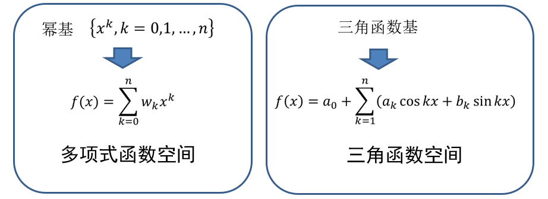

**万能逼近定理**：多项式函数空间是稠密的

对$[a,b]$上的任意连续函数$g$，及任意给定的$\varepsilon>0$，必存在$n$次代数多项式$f(x)=\sum\limits_{k=0}^nw_kx^k$，使得
$$
\min\limits_{x\in[a,b]}|f(x)-g(x)|<\varepsilon
$$
**最小二乘拟合**

* 选择一个变换函数空间

	* 线性函数空间$span\{B_0(x),B_1(x),\cdots,B_n(x) \}$

		* 如：多项式函数、三角函数、RBF函数等

	* 函数表达为系数参数：$W=(w_0,w_1,\cdots,w_n)$
		$$
		y=f(x)=\sum\limits_{i=0}^nw_iB_i(x)
		$$

* 最小二乘拟合：极小化数据误差
	$$
	\min_W\|Y-XW\|^2
	$$

**径向基函数**

* Affine+Radial：

$$
W(p)=A(p)+R(p)\ \ \ \ 
\begin{matrix}
A(p)=Mp+b\\
R(p)=(R_x(p),R_y(p))
\end{matrix}
$$

* Radial basis function：
	* 关于到锚点距离的函数

$$
g:R\rightarrow R
$$

* Radial component：

$$
R_i(p)=\sum\limits_{i=1}^N a_ig(\|p-p_i\|)
$$

* 给定$N$个锚点$p_i$，$p_i'$
	* $W(p_i)=p_i'$
	* 解线性系统求得系数$a_i$

**Lagrange插值函数**

插值$n+1$个点、次数不超过$n$的多项式是存在而且是唯一的——（$n+1$个变量，$n+1$个方程）
$$
p_k(x)=\prod\limits_{i\in B_k}\dfrac{x-x_i}{x_k-x_i}
$$
插值函数的自由度 = 未知量个数 - 已知量个数

**避免过拟合的常用方法**

* 数据去噪
	* 剔除训练样本中噪声
* 数据增广
	* 增加样本数，或者增加样本的代表性和多样性
* 模型简化
	* 预测模型过于复杂，拟合了训练样本中的噪声
	* 选用更简单的模型，或者对模型进行裁剪
* 正则约束
	* 适当的正则项，比如方差正则项、稀疏正则项

**岭回归正则项**

* 选择一个函数空间

	* 基函数的线性表达：$W=(w_0,w_1,\cdots,w_n)$

	$$
	y=f(x)=\sum\limits_{i=0}^nw_iB_i(x)
	$$

* 最小二乘拟合
	$$
	\min\limits_W\|Y-XW\|^2
	$$

* 岭回归
	$$
	\min\limits_W\|Y-XW\|^2+\mu\|W\|_2^2
	$$

**稀疏学习：稀疏正则化**

* 冗余基函数（过完备）

* 通过优化来选择合适的基函数

	* 系数向量的$L_0$模（非零元素的个数）尽量小
	* 挑选/学习出合适的基函数

* 稀疏学习的不同形式

	* 稀疏表达
		$$
		\begin{matrix}
		\min\limits_{\pmb x}\|\pmb f-\pmb {Dx}\|_2^2\\
		s.t. \|\pmb x\|_0<\epsilon
		\end{matrix}
		\Rightarrow
		\min\limits_{\pmb x}\dfrac{\lambda}{2}\|\pmb f-\pmb {Dx}\|_2^2+\|\pmb x\|_1
		$$

	* 字典学习
		$$
		\min\limits_{\pmb D,\pmb x}\dfrac{\lambda}{2}\|\pmb f-\pmb {Dx}\|_2^2+\|\pmb x\|_1
		$$

	* 稀疏正则化
		$$
		\min\limits_{\pmb u}\dfrac{\lambda}{2}\|\pmb u-\pmb f\|_2^2+\|\pmb {Tu}\|_1
		$$

**压缩感知**

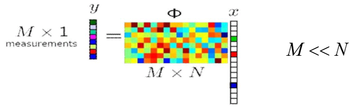

* 已知$y$和$\Phi$，有无穷多组解$x$

* 对于稀疏信号$x$，可通过优化能完全重建$x$

	* 在一定条件下
		$$
		\min \|x\|_0\\
		s.t.\ \ \ \ \Phi x=y
		$$
		

### 1.2. 高阶PDE插值/拟合

#### 1.2.1. 偏微分方程基础

**PDE**
$$
E(f,f_x,f_y,f_{xx},f_{xy},f_{yy})=0
$$
**二阶线性PDE**
$$
A\cdot f_{xx}+2B\cdot f_{xy}+C\cdot f_{yy}+D\cdot f_x+E\cdot f_y+F\cdot f+G=0
$$
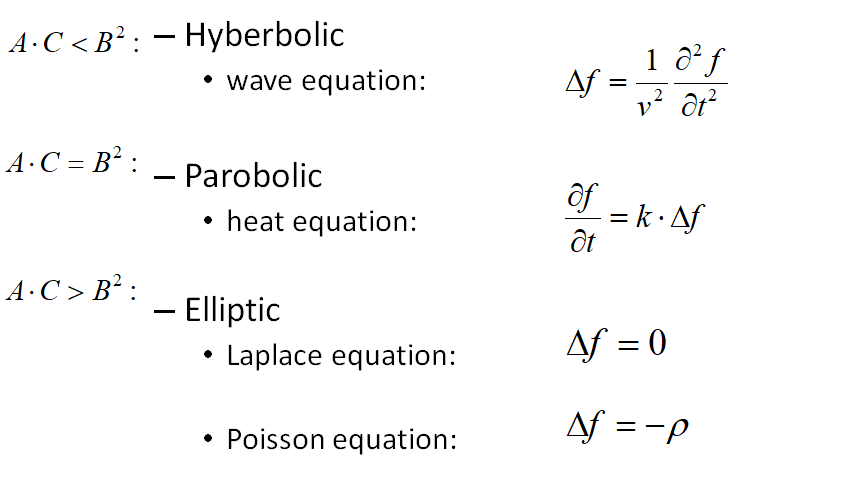

**泊松方程**
$$
\begin{align}
\Delta f&=-\rho\\
\Delta &\equiv \dfrac{\part^2}{\part x^2}+\dfrac{\part^2}{\part y^2}\\
\rho&=\rho(x,y)
\end{align}
$$
**边界条件**

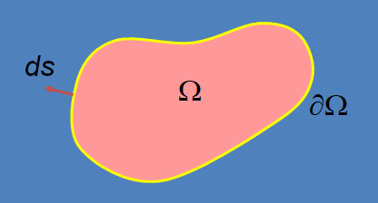

* Dirichlet boundary conditions:
	$$
	\pmb f\Big|_{\part \Omega}
	$$

* Neumann boundary conditions:
	$$
	\dfrac{\part f}{\part \pmb s}\Bigg|_{\part \Omega}
	$$

**离散泊松方程**

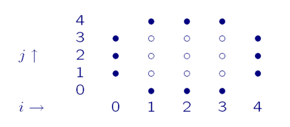
$$
\Delta f=-\rho\\
\Downarrow\\
\dfrac{f_{i+1,1}+f_{i-1,j}-2f_{i,j}}{h^2}+\dfrac{f_{i,j+1}+f_{i,j-1}-2f_{i,j}}{h^2}=\rho_{i,j}
$$
离散线性系统形式：

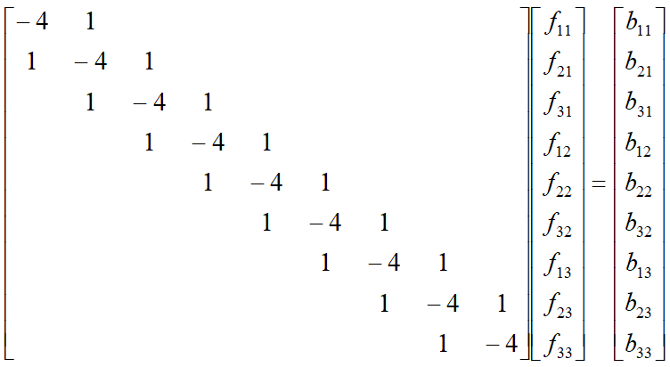

解方程算法：

* 直接解
* 迭代解
	* Jacobi, Gauss-Seidel, SOR
* Multigrid method

**变分插值**
$$
f^*=\arg\min\limits_f\iint _\Omega \|\nabla f-\pmb v\|^2\\
s.t. \ \ \ \ f^*\Big|_{\part \Omega}=f\Big|_{\Omega}
$$
利用欧拉方程：
$$
F_f-\dfrac{\part}{\part x}F_{f_x}-\dfrac{\part}{\part y}F_{f_y}=0
$$
可得
$$
\Delta f=\mathrm {div}(\pmb v)\\
s.t. \ \ \ \ f^*\Big|_{\part \Omega}=f\Big|_{\Omega}
$$


### 1.3. 离散微分几何

#### 1.3.1. 曲线

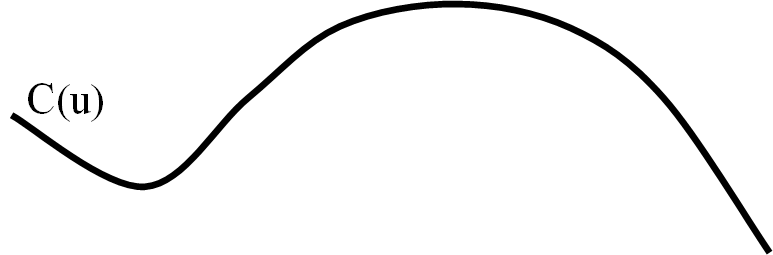

点$p$在曲线的$u_0$处

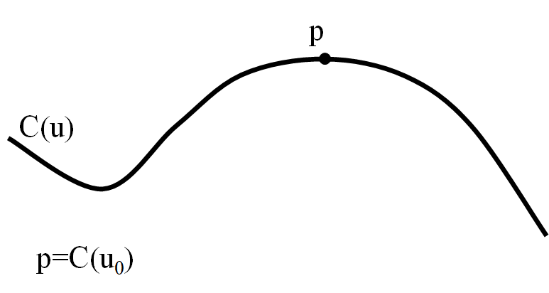

曲线$u_0$处的切线$T$

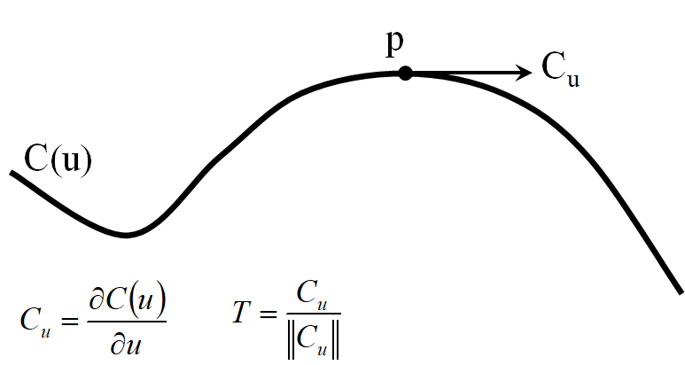

曲线$u_0$处的法向量$N$和副法向量$B$

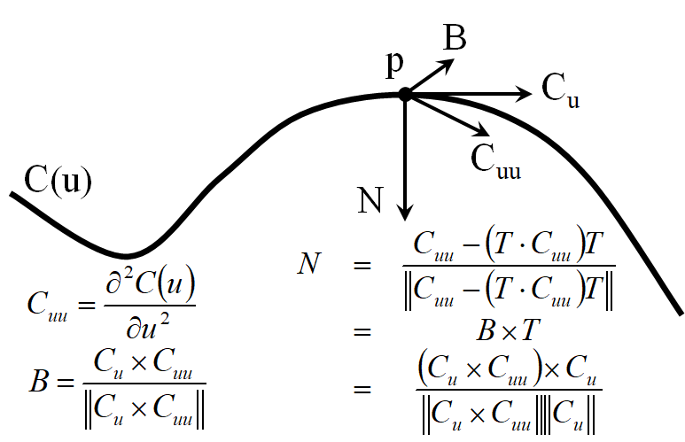

曲线$u_0$处的曲率$\kappa$和曲率半径$\rho$

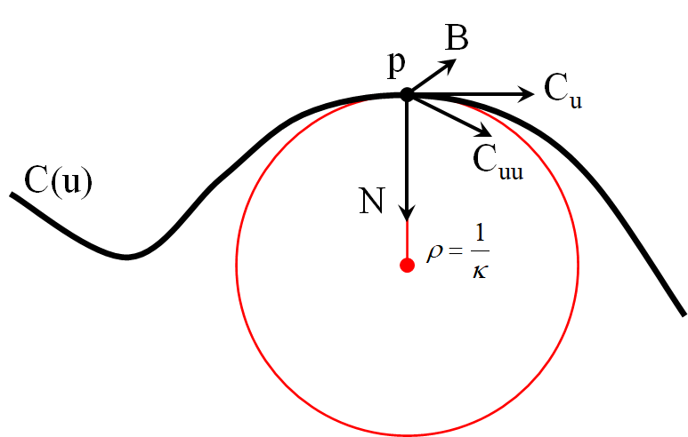

曲线$u_0$处的曲率是$-N_T$沿$T$的分量
$$
\kappa=-T\cdot N_T
$$
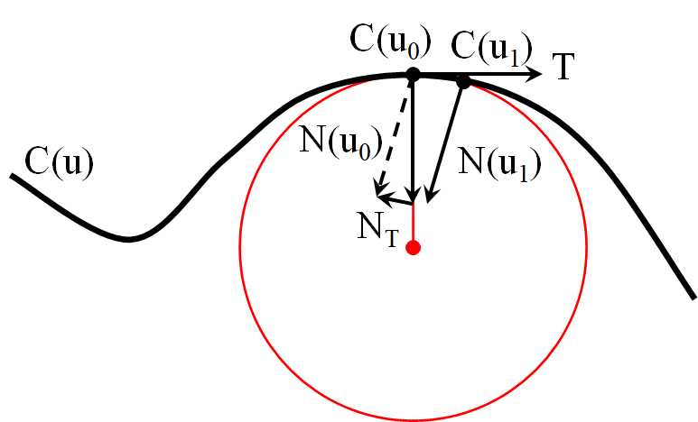

曲线曲率的计算
$$
N_T=N_s=N_u\dfrac{\part u}{\part s}\\
T=C_s=C_u\dfrac{\part u}{\part s}=\dfrac{C_u}{\|C_u\|}=C_u\dfrac{1}{\sqrt{C_u\cdot C_u}}\\
\begin{align}
\kappa&=-T\cdot N_T\\
&=-C_s\cdot N_s\\
&=-\Big(C_u\dfrac{\part u}{\part s}\Big)\cdot \Big(N_u\dfrac{\part u}{\part s}\Big)\\
&=-(C_u\cdot N_u)\Big(\dfrac{\part u }{\part s}\Big)^2\\
&=-\dfrac{C_u\cdot N_u}{C_u\cdot C_u}
\end{align}\\
N=\dfrac{(C_u\times C_{uu})\times C_u}{\|(C_u\times C_{uu})\times C_u \|}\\
\kappa=\dfrac{\|C_u\times C_{uu}\|}{\|C_u\|^3}
$$
对于参数方程曲线$C(t)=(x(t),y(t))$，

切向量
$$
T=C'(t)=\dfrac{\mathrm d C(t)}{\mathrm dt}=[x'(t),y'(t)]
$$
单位切向量
$$
\vec T=\vec C(t)=\dfrac{[x'(t),y'(t)]}{\sqrt{x'(t)^2+y'(t)^2}}
$$
曲率
$$
k(t)=\dfrac{x'(t)y''(t)-y'(t)x''(t)}{\Big(x'(t)^2+y'(t)^2\Big)^{3/2}}
$$

#### 1.3.2. 曲面

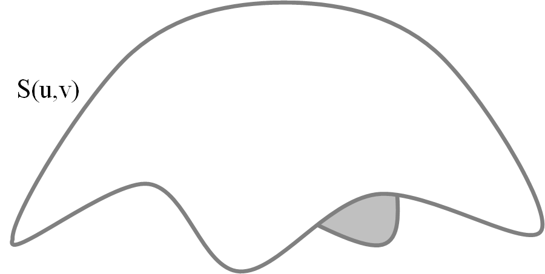

曲面上$(u_0,v_0)$处的一点$p$

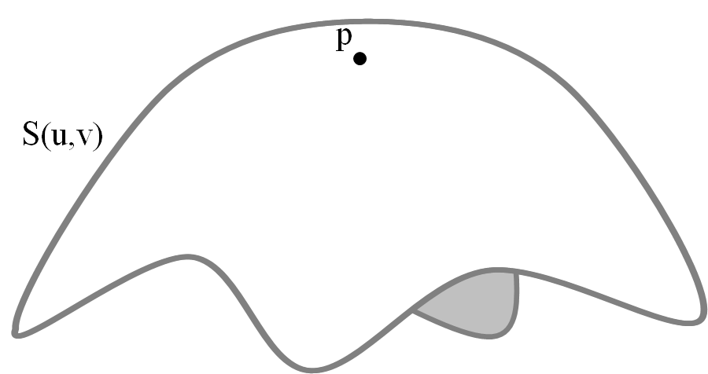

在$u$方向上的切向量$S_u$

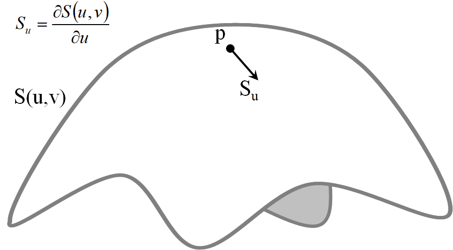

在$v$方向上的切向量$S_v$

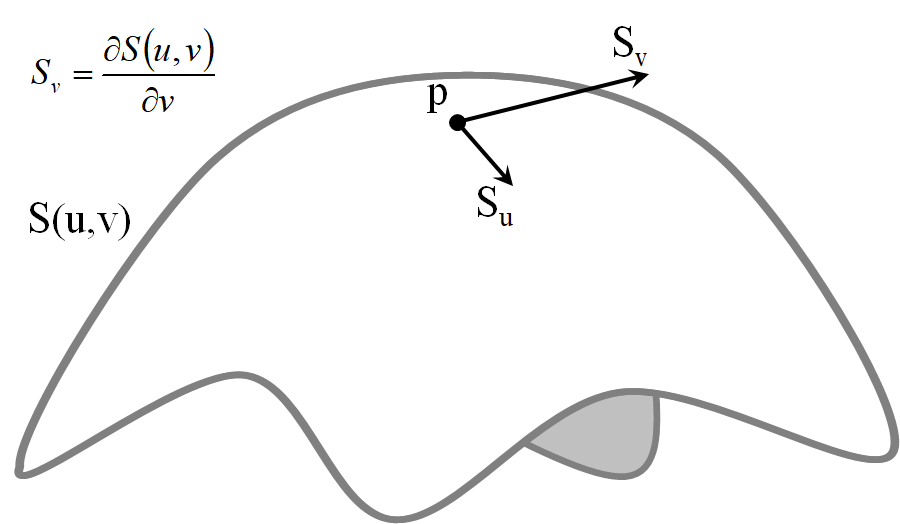

切平面$T$

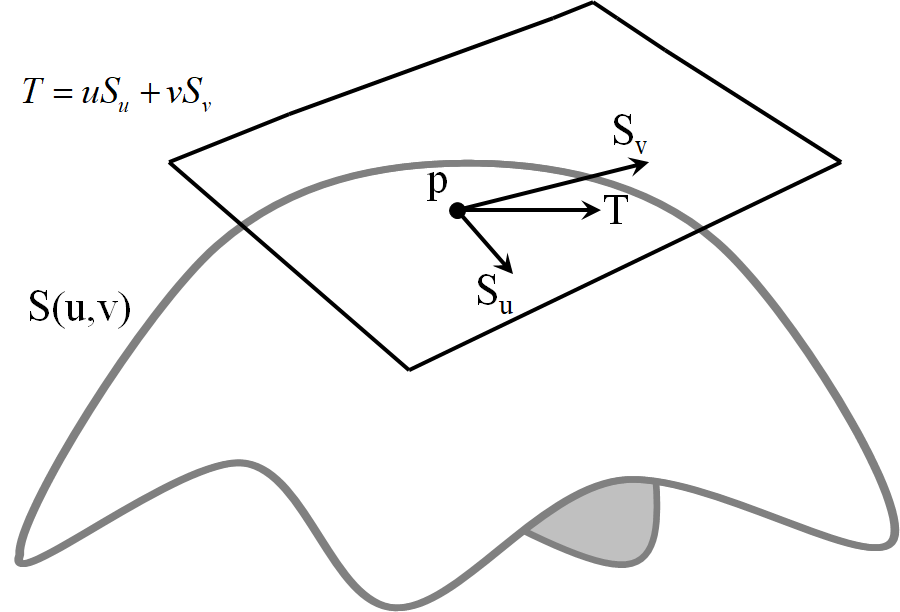

曲面第一基本形式$I_S$
$$
\begin{align}
T\cdot T&=\begin{bmatrix}u&v\end{bmatrix}\begin{bmatrix}S_u\\S_v\end{bmatrix}\cdot\begin{bmatrix}S_u&S_v\end{bmatrix}\begin{bmatrix}u\\v\end{bmatrix}\\
&=\begin{bmatrix}u&v\end{bmatrix}\begin{bmatrix}S_u\cdot S_u&S_u\cdot S_v\\S_u\cdot S_v&S_v\cdot S_v\end{bmatrix}\begin{bmatrix}u\\v\end{bmatrix}\\
&=\begin{bmatrix}u&v\end{bmatrix}\begin{bmatrix}E&F\\F&G\end{bmatrix}\begin{bmatrix}u\\v\end{bmatrix}\\
&=\begin{bmatrix}u&v\end{bmatrix}I_S\begin{bmatrix}u\\v\end{bmatrix}
\end{align}
$$
法向量$N$

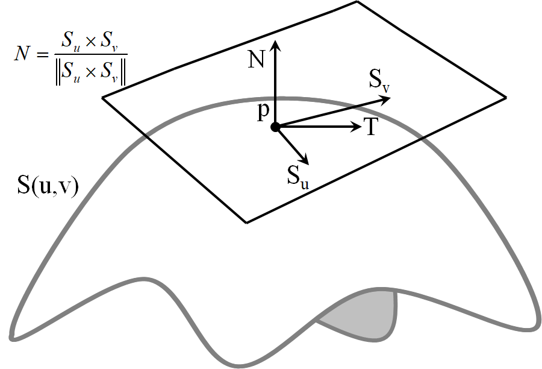

法截面

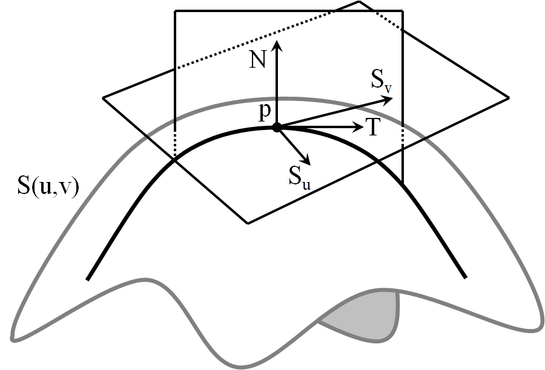

曲率

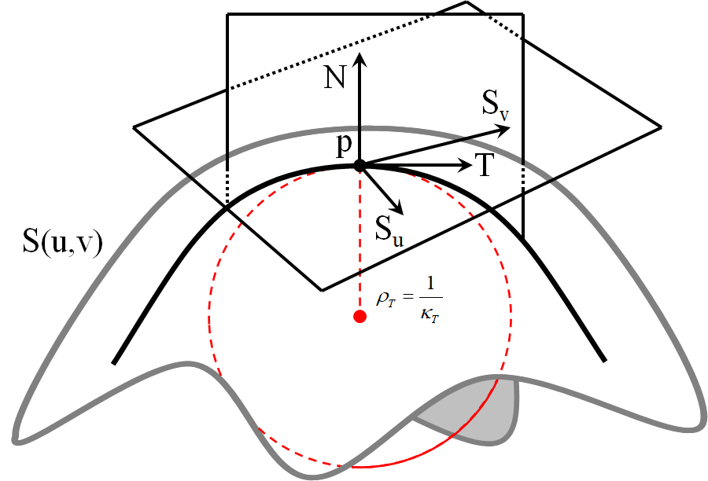

曲率半径
$$
\kappa_T=-T\cdot N_T
$$
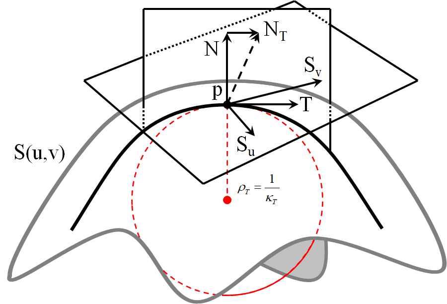

曲面第二基本形式$II_S$
$$
\begin{align}
-T\cdot N_T&=\begin{bmatrix}u&v\end{bmatrix}\begin{bmatrix}-S_u\\-S_v\end{bmatrix}\cdot\begin{bmatrix}N_u&N_v\end{bmatrix}\begin{bmatrix}u\\v\end{bmatrix}\\
&=\begin{bmatrix}u&v\end{bmatrix}\begin{bmatrix}-S_u\cdot N_u&-S_u\cdot N_v\\-S_v\cdot N_u&-S_v\cdot N_v\end{bmatrix}\begin{bmatrix}u\\v\end{bmatrix}\\
&=\begin{bmatrix}u&v\end{bmatrix}\begin{bmatrix}S_{uu}\cdot N_u&-S_{uv}\cdot N_v\\S_{vu}\cdot N_u&S_{vv}\cdot N_v\end{bmatrix}\begin{bmatrix}u\\v\end{bmatrix}\\
&=\begin{bmatrix}u&v\end{bmatrix}\begin{bmatrix}L&M\\M&N\end{bmatrix}\begin{bmatrix}u\\v\end{bmatrix}\\
&=\begin{bmatrix}u&v\end{bmatrix}II_S\begin{bmatrix}u\\v\end{bmatrix}
\end{align}
$$
**张量计算**

取曲面$S$的切平面

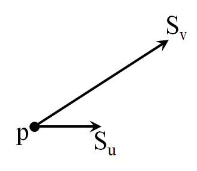

构造正交基

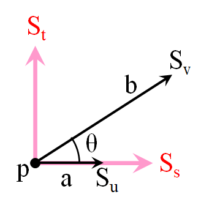
$$
\begin{bmatrix}
S_u\\S_v
\end{bmatrix}
=
\begin{bmatrix}
a&0\\b\cos\theta&b\sin\theta
\end{bmatrix}
\begin{bmatrix}
S_s\\S_t
\end{bmatrix}
=
A\begin{bmatrix}
S_s\\S_t
\end{bmatrix}

\\

\begin{bmatrix}
S_s\\S_t
\end{bmatrix}
=
\dfrac{1}{ab\sin\theta}
\begin{bmatrix}
b\sin\theta&0\\-b\cos\theta&a
\end{bmatrix}
\begin{bmatrix}
S_u\\S_v
\end{bmatrix}
=
A^{-1}\begin{bmatrix}
S_u\\S_v
\end{bmatrix}
$$
第一基本形式
$$
\begin{align}
I_S&=\begin{bmatrix}S_u\\S_v\end{bmatrix}\cdot\begin{bmatrix}S_u&S_v\end{bmatrix}\\
&=A\begin{bmatrix}S_u\\S_v\end{bmatrix}\cdot\begin{bmatrix}S_u&S_v\end{bmatrix}A'\\
&=A\begin{bmatrix}1&0\\0&1\end{bmatrix}A'\\
&=AA'=\begin{bmatrix}a^2&ab\cos\theta\\ab\cos\theta&b^2\end{bmatrix}
\end{align}
$$
用$(u,v)$和$(s,t)$表示点$T$

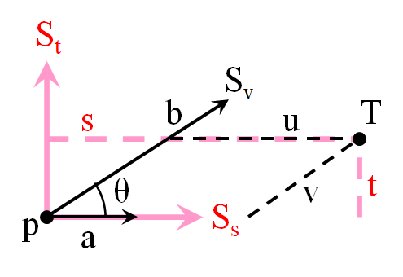
$$
\begin{align}
T&=\begin{bmatrix}u&v\end{bmatrix}\begin{bmatrix}S_u\\S_v\end{bmatrix}
=\begin{bmatrix}s&t\end{bmatrix}\begin{bmatrix}S_s\\S_t\end{bmatrix}\\
&=\begin{bmatrix}u&v\end{bmatrix}A\begin{bmatrix}S_s\\S_t\end{bmatrix}
=\begin{bmatrix}s&t\end{bmatrix}A^{-1}\begin{bmatrix}S_u\\S_v\end{bmatrix}\\
\begin{bmatrix}s&t\end{bmatrix}&=\begin{bmatrix}
u&v
\end{bmatrix}A\\
\begin{bmatrix}u&v\end{bmatrix}&=\begin{bmatrix}
s&t
\end{bmatrix}A^{-1}
\end{align}
$$
曲率

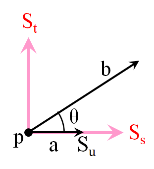

$\kappa$是关于方向$T$的函数
$$
\begin{align}
\kappa_T&=-T\cdot N_T\\
&=\begin{bmatrix}u&v\end{bmatrix}\begin{bmatrix}-S_u\\-S_v\end{bmatrix}\cdot
\begin{bmatrix}N_u&N_v\end{bmatrix}\begin{bmatrix}u\\v\end{bmatrix}\\
&=\begin{bmatrix}u&v\end{bmatrix}II_S\begin{bmatrix}u\\v\end{bmatrix}\\
&=\begin{bmatrix}s&t\end{bmatrix}A^{-1}II_S(A^{-1})'\begin{bmatrix}s\\t\end{bmatrix}\\
&=\begin{bmatrix}s&t\end{bmatrix}II_{\tilde S}\begin{bmatrix}s\\t\end{bmatrix}
\end{align}
$$

$$
II_{\tilde S}=A^{-1}II_S (A^{-1})'
$$

$II_{\tilde S}$的特征分析

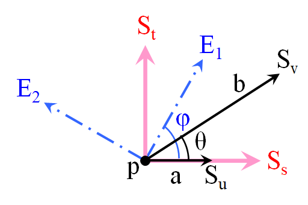

特征值：$\{\kappa_1,\kappa_2\}$

特征向量：$\{E_1,E_2\}$
$$
\kappa_T=\begin{bmatrix}s&t\end{bmatrix}II_{\tilde S}\begin{bmatrix}s\\t\end{bmatrix}\\
II_{\tilde S}=A^{-1}II_S (A^{-1})'
$$
$II_{\tilde S}$的特征分解
$$
\begin{align}
H_{\tilde S}=\hat V\Lambda\hat V^{-1}=\begin{bmatrix}s_1&s_2\\t_1&t_2\end{bmatrix}
\begin{bmatrix}\kappa_1&0\\0&\kappa_2\end{bmatrix}\begin{bmatrix}s_1&s_2\\t_1&t_2\end{bmatrix}^{-1}
\end{align}
$$

$$
\begin{bmatrix}E_1&E_2\end{bmatrix}=\begin{bmatrix}S_s&S_t\end{bmatrix}\begin{bmatrix}s_1&s_2\\t_1&t_2\end{bmatrix}
$$

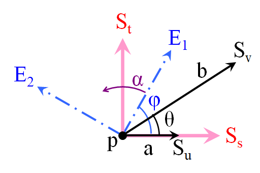
$$
\begin{align}
\begin{bmatrix}\cos(\varphi+\alpha)\\\sin(\varphi+\alpha)\end{bmatrix}&=
\begin{bmatrix}\cos\varphi\cos\alpha-\sin\varphi\sin\alpha\\\sin\varphi\cos\alpha+\cos\varphi\sin\alpha \end{bmatrix}\\
&=\begin{bmatrix}\cos\varphi&-\sin\varphi\\\sin\varphi&\cos\varphi\end{bmatrix}
\begin{bmatrix}\cos\alpha\\\sin\alpha\end{bmatrix}\\
&=V\begin{bmatrix}\cos\alpha\\\sin\alpha\end{bmatrix}
\end{align}
$$

$$
\begin{align}
\kappa_\alpha&=\begin{bmatrix}s&t\end{bmatrix}II_{\tilde S}\begin{bmatrix}s\\t\end{bmatrix}\\
&=\begin{bmatrix}\cos(\varphi+\alpha)&\sin(\varphi+\alpha)\end{bmatrix}II_{\tilde S}\begin{bmatrix}\cos(\varphi+\alpha)\\\sin(\varphi+\alpha)\end{bmatrix}\\
&=\begin{bmatrix}\cos\alpha&\sin\alpha\end{bmatrix}V^{-1}II_{\tilde S}V\begin{bmatrix}\cos\alpha\\\sin\alpha\end{bmatrix}\\
&=\begin{bmatrix}\cos\alpha&\sin\alpha\end{bmatrix}\begin{bmatrix}\kappa_1&0\\0&\kappa_2\end{bmatrix}\begin{bmatrix}\cos\alpha\\\sin\alpha\end{bmatrix}\\
&=\cos^2\alpha\kappa_1+\sin^2\alpha\kappa_2
\end{align}
$$

Weingarten Operator
$$
\begin{align}
W&=I_S^{-1}II_S\\
&=((A^{-1})'A^{-1})(AII_{\tilde S}A')\\
&=(A^{-1})'(A^{-1}A)II_{\tilde S}A'\\
&=(A^{-1})'(\hat V\Lambda\hat V^{-1})A'\\
&=((A^{-1})'\hat V)\Lambda((A^{-1})'\hat V)^{-1}\\
&=V\Lambda V^{-1}
\end{align}
$$
其中，$\Lambda=\begin{bmatrix}\kappa_1&0\\0&\kappa_2\end{bmatrix}$，$V=(A^{-1})'\hat V=(A^{-1})\begin{bmatrix}s_1&s_2\\t_1&t_2\end{bmatrix}=\begin{bmatrix}u_1&u_2\\v_1&v_2\end{bmatrix}$ 

又
$$
\begin{align}
W&=I_S^{-1}II_S\\
&=\dfrac{1}{EG-F^2}\begin{bmatrix}G&-F\\-F&E\end{bmatrix}\begin{bmatrix}L&M\\M&N\end{bmatrix}\\
&=\dfrac{1}{EG-F^2}\begin{bmatrix}GL-FM&GM-FN\\EM-FL&EN-FM\end{bmatrix}
\end{align}
$$

$$
\begin{align}
\kappa_{1,2}&=\dfrac{GL-2FM+EN\pm \sqrt{(GL-2FM+EN)^2-4(EG-F^2)(LN-M^2)}}{2(EG-F^2)}\\
\kappa_G&=\kappa_1\kappa_2=\det(W)=\dfrac{LN-M^2}{EG-F^2}\\
\kappa_M&=\dfrac{\kappa_1+\kappa_2}{2}=\dfrac{trace(W)}{2}=\dfrac{GL-2FM+EN}{2(EG-F^2)}
\end{align}
$$

若$\kappa_1\neq \kappa_2$
$$
E_{1,2}=\begin{bmatrix}S_u&S_v\end{bmatrix}\begin{bmatrix}\dfrac{GL-EN\pm \sqrt{(GL-2FM+EN)^2-4(EG-F^2)(LN-M^2)}}{2(EM-FL)}\\1\end{bmatrix}
$$
否则选择正交向量
$$
\begin{bmatrix}E_1&E_2\end{bmatrix}=\begin{bmatrix}S_u&N\times S_u\end{bmatrix}
$$
Bending Energy
$$
\begin{align}
\kappa_G&=\kappa_1\kappa_2\\
\kappa_M&=\dfrac{\kappa_1+\kappa_2}{2}\\
\kappa_B&=\kappa_1^2+\kappa_2^2\\&=4\Big(\dfrac{\kappa_1+\kappa_2}{2}\Big)^2-2\kappa_1\kappa_2\\&=4\kappa_M^2-2\kappa_G\\
E_B&=\int_S(\kappa_1^2+\kappa_2^2)\part A\\
&=\int_S(4\kappa_M^2-2\kappa_G)\part A\\
&=4\int_S\kappa_M^2\part A-2(2\pi\chi(S))\\
&=4\int_S\kappa_M^2\part A-4\pi(2-2G)
\end{align}
$$

$$
\mathrm {Minimizing}\ \int_S\kappa_1^2+\kappa_2^2\part A=\mathrm{Minimizing}\ \int_S\kappa_M^2\part A
$$

#### 1.3.3. 曲面逼近

**连续二次型逼近**

二次型逼近函数：
$$
F(x,y,z)=ax^2+bxy+cy^2-z=0
$$
最小二乘拟合：
$$
\min\sum\limits_i(ax_i^2+bx_iy_i+cy_i^2-z_i)
$$
写成矩阵形式：
$$
\begin{bmatrix}
x_1^2&x_1y_1&y_1^2\\\cdots&\cdots&\cdots\\x_n^2&x_n^2y_n^2&y_n^2
\end{bmatrix}
\begin{bmatrix}
a\\b\\c
\end{bmatrix}=
\begin{bmatrix}
z_1\\\cdots\\z_n
\end{bmatrix}\Rightarrow AX=b
$$
最小二乘解：$X^*=(A^TA)^{-1}A^Tb$

该二次型曲面下的曲率$k_{min}$和$k_{max}$为以下方程的实根：
$$
k^2-(a+c)k+ac-b^2=0
$$

* 平均曲率：$H=(k_{min}+k_{max})/2$
* 高斯曲率：$K=k_{min}k_{max}$

**离散逼近**

平均曲率：

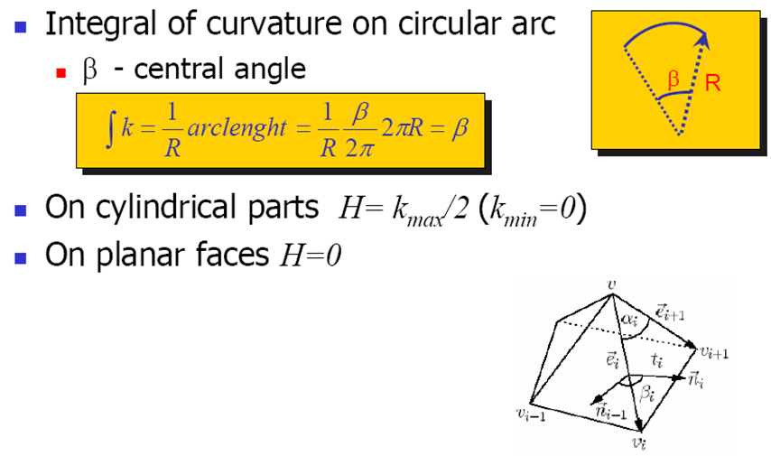

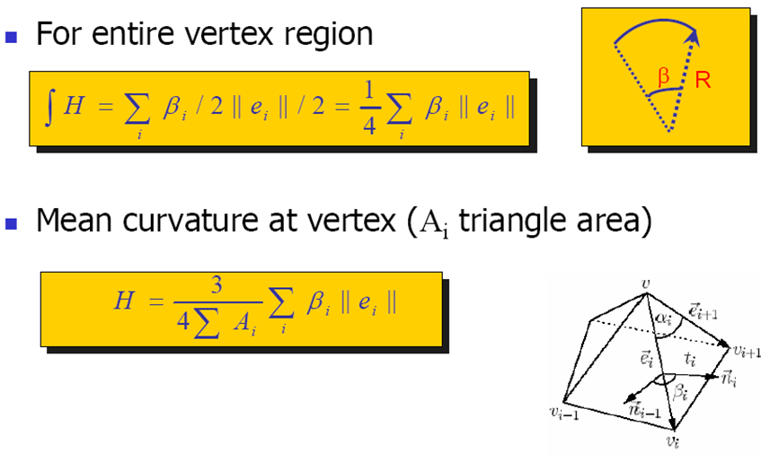

高斯曲率

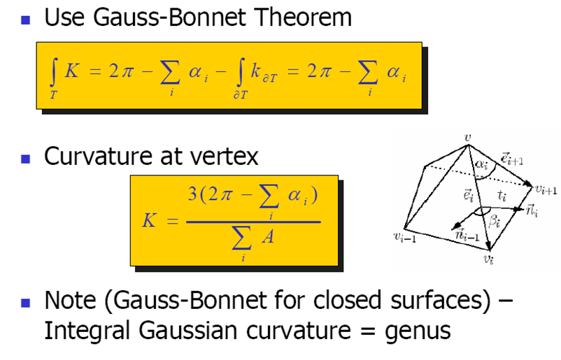

### 1.3. 变换

#### 1.3.1. 变换基础

**不同的坐标系**

* 物体坐标系
* 世界坐标系
* 相机坐标系（视点）
* 屏幕坐标系

**变换**：左乘规则

**变换合成问题举例**

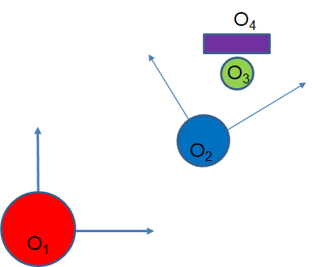

1. $O_1$是世界坐标
2. $O_2$在$O_1$的初始标架是$P_2$，绕$O_1$做了旋转$R_2$，平移$T_2$
3. $O_3$在$O_1$的初始标架是$P_3$，绕$O_2$做了旋转$R_3$，平移$T_3$
4. $O_4$在$O_3$的初始标架是$P_4$，绕$O_3$做了旋转$R_4$，平移$T_4$

问：$O_4$相对$O_1$的坐标是多少？

答：

设$O_1$的标架为$\vec O_1^t$（世界坐标架）
$$
\begin{cases}
\vec O_2^t=\vec O_1^t P_2\\
\vec O_3^t=\vec O_1^tP_3=\vec O_2^tP_2^{-1}P_3\\
\tilde O_4=\vec O_3^tP_4
\end{cases}
$$
设变换矩阵$M_i=T_iR_i$，或$M_i\begin{bmatrix}R_i&T_i\\O&1\end{bmatrix}$

作变换：
$$
\begin{align}
\tilde O_4=\vec O_3^tP_4&\xrightarrow{M_4}
\vec O_3^tM_4P_4=\vec O_2^tP_2^{-1}P_3M_4P_4\\
&\xrightarrow{M_3}\vec O_2^tM_3P_2^{-1}P_3M_4P_4=
\vec O_1^tP_2M_3P_2^{-1}P_3M_4P_4\\
&\xrightarrow{M_2}\vec O_1^tM_2P_2M_3P_2^{-1}P_3M_4P_4
\end{align}
$$

#### 1.3.2. 几何

**坐标系**


**基本几何要素**

* 几何研究$n$维空间中对象之间的关系
* 需要三个几何要素
	* 标量
	* 向量
	* 点

**标量**

* 标量可以定义为集合中的成员，集合中具有两种运算（加法和乘法），运算遵从一些基本的公理（结合律、交换律、逆）
* 例：实数或复数全体，通常的加法与乘法
* 标量自身没有几何属性

**向量**

* 物理定义：向量是具有以下两条性质的量
	* 方向
	* 长度：$|\pmb v|$

* 向量运算
	* 每个向量都有逆
		* 同样长度但指向相反方向
	* 每个向量都可以与标量相乘
	* 有一个零向量
		* 零长度，方向不定
	* 两个向量和为向量
		* 三角形法则

**线性空间**

* 运算
	* 标量乘法：$\pmb u=\alpha\pmb v$
	* 向量加法：$\pmb w=\pmb u+\pmb v$
* 向量没有位置
	* 向量空间还需要引入点

**点**

* 空间中的位置
* 点与向量之间可进行的运算
	* 点与点相减得到一个向量：$\pmb v=P-Q$
	* 点与向量相加得到新点：$P=\pmb v+Q$

**仿射空间**

* 点加上向量构造的空间
* 运算：
	* 向量与向量的加法 → 向量
	* 标量与向量的乘法 → 向量
	* 点与向量的加法 → 点
	* 标量与标量的运算 → 标量
	* 仿射空间的运算均与坐标无关
* 对于任意点，定义
	* $1\cdot P=P$
	* $0\cdot P=\pmb 0$

* 向量的线性组合

	给定$n$个向量$\pmb v_1,\pmb v_2,\cdots,\pmb v_n$以及$n$个标量$\alpha_1,\alpha_2,\cdots,\alpha_n$，则有
	$$
	\pmb v=\alpha_1\pmb v_1+\alpha_2\pmb v_2+\cdots+\alpha_n\pmb v_n
	$$

* 点的线性组合

	给定$n$个点$P_1,P_2,\cdots,P_n$以及$n$个标量$\alpha_1,\alpha_2,\cdots,\alpha_n$，线性组合：
	$$
	P=\alpha_1P_1+\alpha_2P_2+\cdots+\alpha_nP_n
	$$
	固定坐标系，取定其中两点，则对于$P_1+P_2$，有

	* 当$P_1$为原点时，$P_1+P_2=P_2$
	* 当$P_1$与$P_2$关于原点对称时，$P_1+P_2$为原点
	* 因此$P_1+P_2$的位置与坐标系有关，组合系数不能为任意数

	由归纳法，从“点-点=向量”和“标量·向量=向量”可知：

	* 当组合系数和$\alpha_1+\alpha_2+\cdots+\alpha_n=0$时，点的线性组合为向量

	* 当组合系数和$\alpha_1+\alpha_2+\cdots+\alpha_n=1$时，点的线性组合为点，称为给定点的仿射组合
		* $0.5P_1+0.5P_2=P_1+0.5(P_2-P_1)=点+向量=点$

**直线**

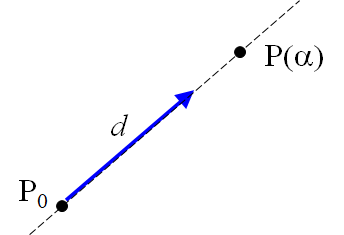

具有以下形式的所有点：

* $P(\alpha)=P_0+\alpha d$（参数形式）
	* 比其他形式更一般和稳定
	* 可以推广到曲线和曲面
* 即所有过$P_0$点，与$P_0$连线平行于向量$\pmb d$的点

* 二维形式

	* 显式：$y=mx+h$

	* 隐式：$ax+by+c=0$

	* 参数形式
		$$
		x(\alpha)=x_0+(1-\alpha)x_1\\
		y(\alpha)=y_0+(1-\alpha)y_1
		$$

**射线和线段**

* 如果限定$\alpha>0$，则$P(\alpha)=P_0+\alpha d$就是从$P_0$出发，方向为$\pmb d$的射线

* 如果采用两点定义向量$\pmb d$，则
	$$
	P(\alpha)=P_0+\alpha(P_1-P_0)=(1-\alpha)P_0+\alphaP_1
	$$

* 当$0\leq \alpha\leq 1$，那么就会得到连接$P_0$与$P_1$两点的线段

**两点的线性插值**

* 给定两点$A$，$B$，那么它们的仿射组合
	$$
	P(t)=(1-t)A+tB
	$$
	定义了过这两点的一条直线

* 应用

	* 关键帧动画

	* 多边形的变形

		给定两个有同样数目顶点的折线，那么利用线性插值可以给出从第一个折线到第二个折线的光滑过渡

		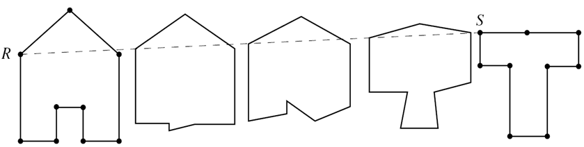

**凸体**

* 一个对象为凸的当且仅当在对象中任何两点的连接线段也在该对象内

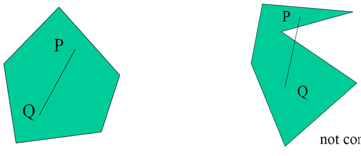

**仿射凸组合**

* 考虑“和”式
	$$
	P=\alpha_1P_1+\alpha_2P_2+\cdots+\alpha_nP_n
	$$

* 当$\alpha_1+\alpha_2+\cdots+\alpha_n=1$时上述和式有意义，此时结果就称为点$P_1,P_2,\cdots,P_n$的仿射和

* 若$\alpha_i\geq 0,\forall 1\leq i\leq n$，那么得到$P_1,P_2,\cdots,P_n$的凸包

**凸包**

* 最小的包含$P_1,P_2,\cdots,P_n$的凸体

* 可用“收缩包装”的方式得到

	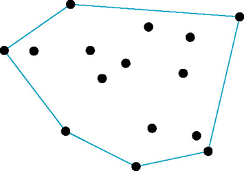

**曲线与曲面**

* 曲线是形式为$P(\alpha)$的单参数定义的几何体，其中的函数为非线性

	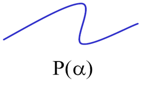

* 曲面是由形式为$P(\alpha,\beta)$的两个参数定义的几何体

	* 线性函数对应于平面和多边形

	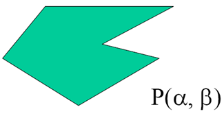

**平面**

* 平面由一个点与两个向量或者三个点确定

	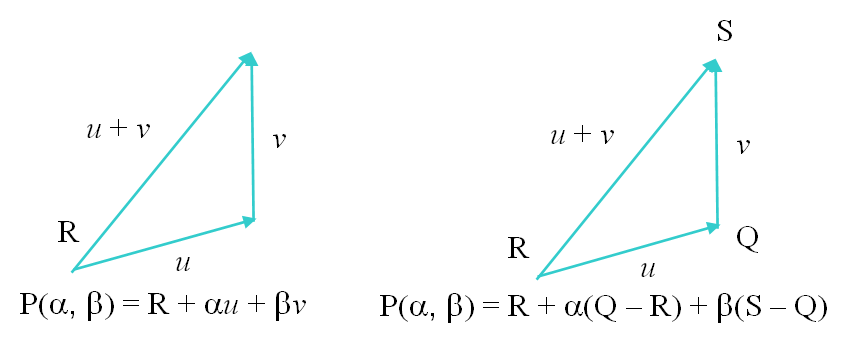

**三角形**

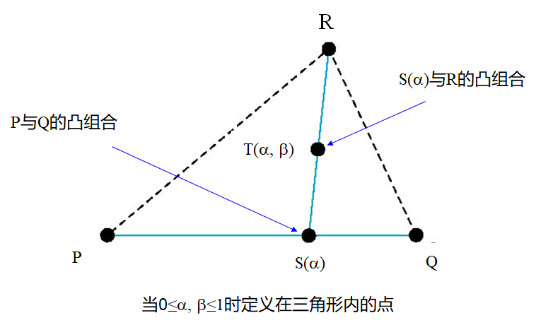

**向量的内外积**

* 内积：$\pmb u\cdot\pmb v=|\pmb u||\pmb v|\cos\theta$，$\theta$为两个向量的夹角
	$$
	\pmb u\cdot\pmb v=0\Leftrightarrow \pmb u\bot\pmb v
	$$

* 外积：$\pmb u\times\pmb v$为向量，其长度等于$|\pmb u||\pmb v|\cos\theta$，方向垂直于$\pmb u$，$\pmb v$所在平面，并且保证$\pmb u$，$\pmb v$，$\pmb u\times\pmb v$成为右手系，其中0为两个向量的夹角
	$$
	\pmb u\times\pmb v=\pmb 0\Leftrightarrow \pmb u//\pmb v
	$$

**法向量**

* 每个平面都有一个垂直于自身的向量$\pmb n$

* 在平面的点与二向量形式$P(\alpha,\beta)=R+\alpha\pmb u+\beta\pmb v$中，可以应用向量的外积得到
	$$
	\pmb n=\pmb u\times\pmb v
	$$
	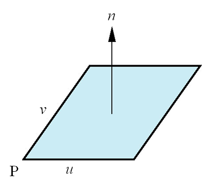

#### 1.3.3. 表示

**线性空间**

* 一组向量$\pmb v_1,\pmb v_2,\cdots,\pmb v_n$称为线性无关的，是指
	$$
	\alpha_1\pmb v_1+\alpha_2\pmb v_2+\cdots+\alpha_n\pmb v_n=\pmb 0
	$$
	当且仅当$\alpha_1=\alpha_2=\cdots=\alpha_n=0$

* 如果一组向量是线性无关的，那么不能把其中一个向量表示成其它向量的线性组合

* 如果一组向量是线性相关的，那么其中至少有一个向量可以表示为其它向量的线性组合

**维数**

* 在向量空间中，最大的线性无关向量组的元素个数是固定的，这个数就称为空间的维数

* 在$n$维空间中，任意$n$个线性无关的向量构成空间的基

* 给定空间的一组基$\pmb v_1, \pmb v_2 ,\cdots, \pmb v_n$，空间中任意向量$\pmb v$都可以表示为
	$$
	\pmb v=\alpha_1\pmb v_1+\alpha_2\pmb v_2+\cdots+\alpha_n\pmb v_n
	$$
	其中$\{\alpha_i\}$是唯一的

**坐标系**

* 考虑$n$维向量空间的基$\pmb v_1,\pmb v_2,\cdots,\pmb v_n$

* 一个向量$\pmb v$可以表示为$\pmb v=\alpha_1\pmb v_1+\alpha_2\pmb v_2+\cdots+\alpha_n\pmb v_n$

* 标量组$\{\alpha_1,\alpha_2,\cdots,\alpha_n\}$就称为$\pmb v$相对于给定基的表示

* 可以把表示写成列向量
	$$
	a=\begin{bmatrix}\alpha_1,\alpha_2,\cdots,\alpha_n\end{bmatrix}^T=\begin{bmatrix}\alpha_1\\\alpha_2\\\vdots\\\alpha_n\end{bmatrix}
	$$

**标架**

* 坐标系是不足以表示点的
* 如果要在仿射空间中考虑问题，那么可以在基向量组中增加一个点（称为原点），从而构成一个标架(frame)

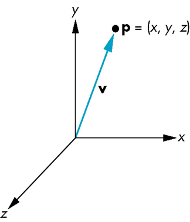

**在标架中的表示**

* 标架由$(O,\pmb v_1,\pmb v_2,\cdots,\pmb v_n)$确定

* 在这个标架中，每个向量可以表示为
	$$
	\pmb v=\alpha_1\pmb v_1+\alpha_2\pmb v_2+\cdots+\alpha_n\pmb v_n
	$$

* 每个点可以表示为
	$$
	P=O+\beta_1\pmb v_1+\beta_2\pmb v_2+\cdots+\beta_n\pmb v_n
	$$

统一的表示：

* 如果定义$\pmb 0\cdot P=\pmb 0$，$1\cdot P=P$，那么
	$$
	\begin{align}
	\pmb v&=\alpha_1\pmb v_1+\alpha_2\pmb v_2+\cdots+\alpha_n\pmb v_n\\
	&=\begin{bmatrix}\pmb v_1&\pmb v_2&\cdots&\pmb v_n&O\end{bmatrix}
	\begin{bmatrix}\alpha_1&\alpha_2&\cdots&\alpha_n&0\end{bmatrix}^T\\
	
	P&=O+\beta_1\pmb v_1+\beta_2\pmb v_2+\cdots+\beta_n\pmb v_n\\
	&=\begin{bmatrix}\pmb v_1&\pmb v_2&\cdots&\pmb v_n&O\end{bmatrix}
	\begin{bmatrix}\beta_1&\beta_2&\cdots&\beta_n&1\end{bmatrix}^T
	\end{align}
	$$

从而得到$n+1$维齐次坐标表示
$$
\begin{align}
\pmb v&=\begin{bmatrix}\alpha_1&\alpha_2&\cdots&\alpha_n&0\end{bmatrix}^T\\
P&=\begin{bmatrix}\beta_1&\beta_2&\cdots&\beta_n&1\end{bmatrix}^T
\end{align}
$$
**齐次坐标**

* 四维齐次坐标的一般形式为
	$$
	P=\begin{bmatrix}
	x&y&z&w
	\end{bmatrix}^T
	$$
	可以通过下述方法给出三维点（当$w\neq 0$）
	$$
	\begin{matrix}
	x\leftarrow x/w&
	y\leftarrow y/w&
	z\leftarrow z/w
	\end{matrix}
	$$
	当$w=0$时，表示对应的是一个向量

	注意：齐次坐标表示中把四维空间中过原点的一条直线对应于三维空间中的一个点

* 齐次坐标在图形学中的应用

	* 所有标准变换（旋转、平移、放缩）都可以应用4X4阶矩阵的乘法实现
	* 硬件流水线体系可以应用四维表示
	* 对于正交投影，可以通过$w = 0$保证向量，$w = 1$保证点
	* 对于透视投影，需要进行特别的处理：透视除法 

**变换坐标系**

* 考虑同一个向量相对于两个不同基的表示。假设表示分别是
	$$
	\begin{align}
	a&=\begin{bmatrix}\alpha_1&\alpha_2&\alpha_3
	\end{bmatrix}^T\\
	b&=\begin{bmatrix}
	\beta_1&\beta_2&\beta_3
	\end{bmatrix}^T
	\end{align}
	$$
	其中
	$$
	\begin{align}
	\pmb v&=\alpha_1\pmb v_1+\alpha_2\pmb v_2+\alpha_3\pmb v_3=\begin{bmatrix}\pmb v_1&\pmb v_2&\pmb v_3\end{bmatrix}
	\begin{bmatrix}\alpha_1&\alpha_2&\alpha_3\end{bmatrix}^T\\
	
	&=\beta_1\pmb u_1+\beta_2\pmb u_2+\beta_3\pmb u_3=\begin{bmatrix}\pmb u_1&\pmb u_2&\pmb u_3\end{bmatrix}\begin{bmatrix}\beta_1&\beta_2&\beta_3\end{bmatrix}^T
	\end{align}
	$$

* $\pmb u_1$，$\pmb u_2$，$\pmb u_3$中每个向量都可以用第一组表示出来

	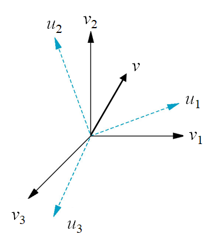
	$$
	\begin{align}
	\pmb u_1=
	\gamma_{11}\pmb v_1+
	\gamma_{12}\pmb v_2+
	\gamma_{13}\pmb v_3\\
	
	\pmb u_2=
	\gamma_{21}\pmb v_1+
	\gamma_{22}\pmb v_2+
	\gamma_{23}\pmb v_3\\
	
	\pmb u_3=
	\gamma_{31}\pmb v_1+
	\gamma_{32}\pmb v_2+
	\gamma_{33}\pmb v_3\\
	\end{align}
	$$

* 所有系数定义了一个3X3矩阵
	$$
	\pmb M=\begin{bmatrix}
	\gamma_{11}&\gamma_{12}&\gamma_{13}\\
	\gamma_{21}&\gamma_{22}&\gamma_{23}\\
	\gamma_{31}&\gamma_{32}&\gamma_{33}\\
	\end{bmatrix}
	$$
	两组基可以如下联系在一起：
	$$
	a=\pmb M^Tb
	$$

**改变标架**

* 考虑标架
	$$
	(P_0,\pmb v_1,\pmb v_2,\pmb v_3)\\
	(Q_0,\pmb u_1,\pmb u_2,\pmb u_3)
	$$

* 任何点和向量都可以用它们中的一个表示出来

* 把基的改变方法进行推广：
	$$
	\begin{align}
	\pmb u_1&=
	\gamma_{11}\pmb v_1+
	\gamma_{12}\pmb v_2+
	\gamma_{13}\pmb v_3\\
	
	\pmb u_2&=
	\gamma_{21}\pmb v_1+
	\gamma_{22}\pmb v_2+
	\gamma_{23}\pmb v_3\\
	
	\pmb u_3&=
	\gamma_{31}\pmb v_1+
	\gamma_{32}\pmb v_2+
	\gamma_{33}\pmb v_3\\
	
	Q_0&=
	\gamma_{41}\pmb v_1+
	\gamma_{42}\pmb v_2+
	\gamma_{43}\pmb v_3+
	P_0
	\end{align}
	$$

* 定义了4X4阶矩阵
	$$
	\pmb M=\begin{bmatrix}
	\gamma_{11}&\gamma_{12}&\gamma_{13}&0\\
	\gamma_{21}&\gamma_{22}&\gamma_{23}&0\\
	\gamma_{31}&\gamma_{32}&\gamma_{33}&0\\
	\gamma_{41}&\gamma_{42}&\gamma_{43}&1\\
	\end{bmatrix}
	$$

**表示的变换**

* 两个标架中任意点和向量具有同样形式的表示

	在第一个标架中：$a=\begin{bmatrix}\alpha_1&\alpha_2&\alpha_3&\alpha_4\end{bmatrix}^T$

	在第二个标架中：$b=\begin{bmatrix}\beta_1&\beta_2&\beta_3&\beta_4\end{bmatrix}^T$

	其中当表示的是点时，$\alpha_4=\beta_4=1$，表示的是向量时，$\alpha_4=\beta_4=0$并且$a=\pmb M^Tb$

	这里矩阵$\pmb M$是4X4阶，用齐次坐标定义一个仿射变换

* 仿射变换
	* 每个线性变换等价于一次标架改变
	* 所有的仿射变换保持共线性
	* 然而，一个仿射变换只具有12个自由度，因为所有仿射变换只是由4X4阶矩阵定义的线性变换的子集，矩阵的16个元素中有四个元素是固定的

**世界标架与摄像机标架**

* 当提及表示的时候，所指的是由n个标量构成的有序数组
* 这样标架的改变就是由一个4X4阶矩阵定义
* 在OpenGL中开始的基本标架是世界标架

* 最终我们是在照相机标架中表示几何体，这是用模型-视图矩阵进行变换的
* 初始状态时这两个标架是相同的 ($\pmb M=\pmb I$)

**摄像机的移动**


#### 1.3.4. 变换

**一般变换**

所谓变换就是把点映射到其他点，把向量映射到其他向量

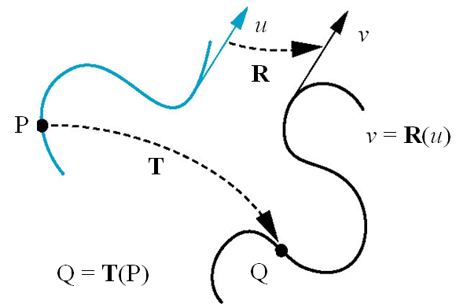

**连续变换**

* 在一般变换下，直线的像是由直线上每个点的像构成的，像一般不再是一条直线

* 当变换是连续的时候，直线的像就是一条连续曲线

**仿射变换**

* 保持共线性
* 许多物理上重要变换的特征
	* 刚体变换：旋转、平移
	* 放缩、错切

**变换的应用**

* 组合、构造场景

	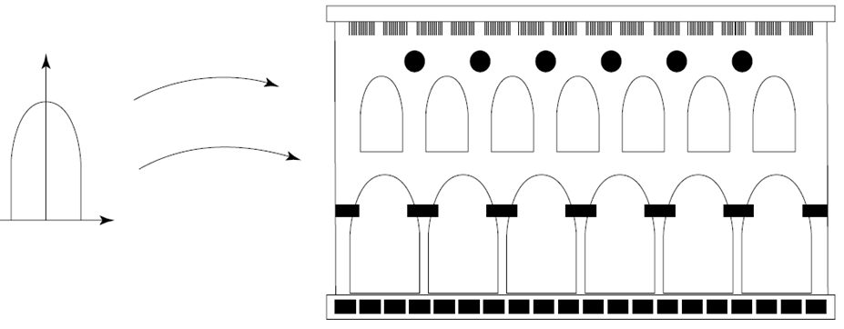

	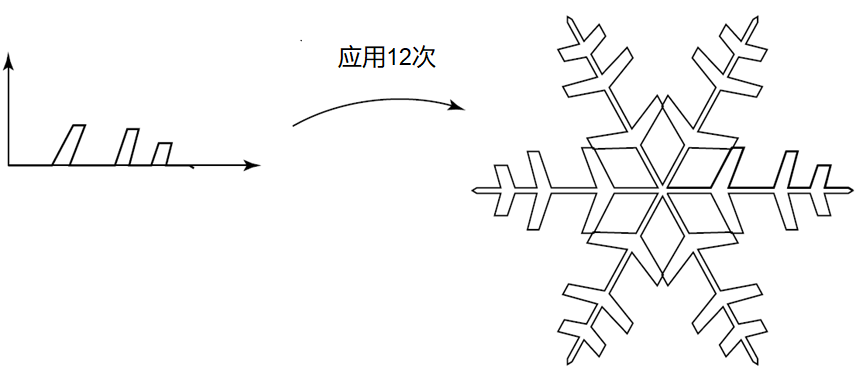

* 摄像机视角位置变换

	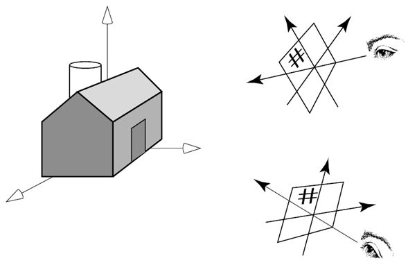

* 计算机动画

	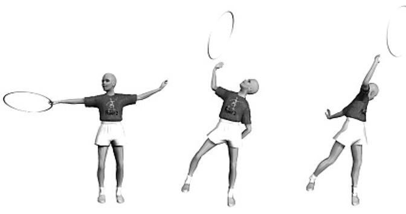

**流水线实现**

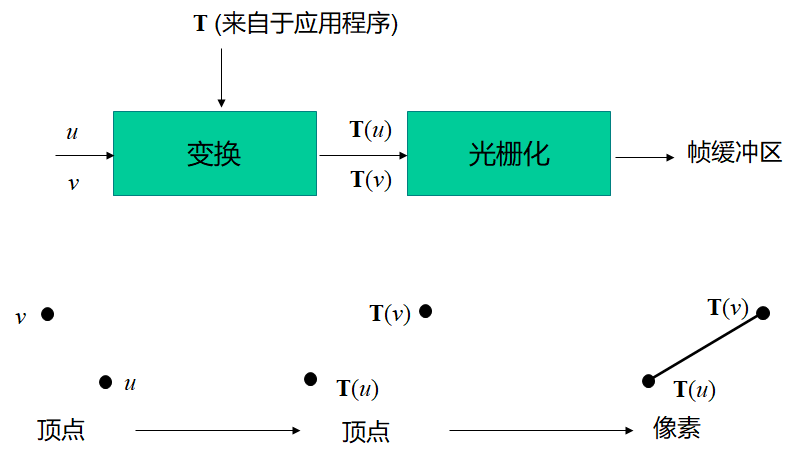

**记号**

* $P,Q,R$：仿射空间中的点
* $\pmb u,\pmb v,\pmb w$：仿射空间中的向量
* $\alpha,\beta,\gamma$：标量
* $p,q,r$：点的表示
	* 在齐次坐标中为由四个标量构成的数组
* $u,v,w$：向量的表示
	* 在齐次坐标中为由四个标量构成的数组

**平移**

* 把一个点移到新的位置

	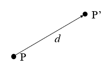

* 平移由一个向量$\pmb d$确定

	* 三个自由度
	* $P'=P+\pmb d$

* 对象的平移

	把一个对象上的所有点沿同一向量平移

	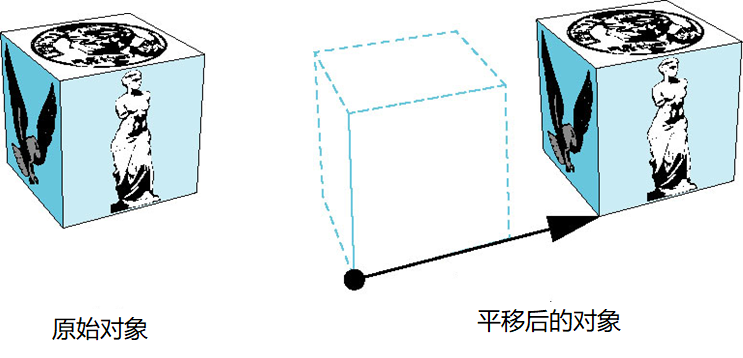

* 平移的表示

	应用在某个标架中的齐次坐标表示
	$$
	\begin{align}
	p&=\begin{bmatrix}
	x&y&z&1
	\end{bmatrix}^T\\
	
	p'&=\begin{bmatrix}
	x'&y'&z'&1
	\end{bmatrix}^T\\
	
	d&=\begin{bmatrix}
	d_x&d_y&d_z&0
	\end{bmatrix}^T\\
	\end{align}
	$$
	那么$p'=p+d$或
	$$
	x'=x+d_x\\
	y'=y+d_y\\
	z'=z+d_z
	$$
	平移矩阵：可以用在齐次坐标中一个4X4的矩阵$\pmb T$表示平移：$p'=\pmb Tp$，其中
	$$
	\pmb T=\pmb T(d_x,d_y,d_z)=\begin{bmatrix}
	1&0&0&d_x\\
	0&1&0&d_y\\
	0&0&1&d_z\\
	0&0&0&1
	\end{bmatrix}
	$$

**二维旋转**

考虑绕原点旋转$\theta$角

* 半径保持不变，角度增加了$\theta$

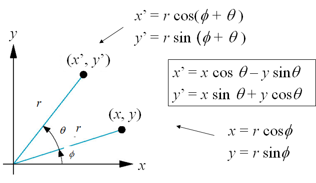

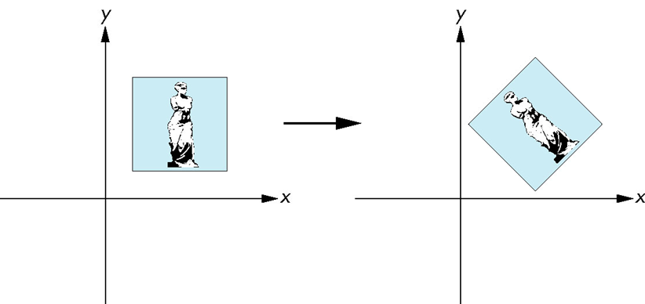

**三维旋转**

* 几种特殊情形
	* 分别绕$x,y,z$轴的旋转
	* 绕过原点的轴旋转
	* 绕任一轴旋转

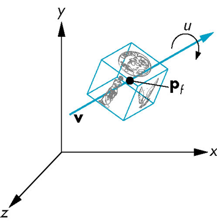

* 绕$z$轴的旋转

	* 在三维空间中绕$z$轴旋转，点的$z$坐标不变

		* 等价于在$z=常数$的平面上进行二维旋转

		$$
		\begin{align}
		x'&=x\cos\theta-y\sin\theta\\
		y'&=x\sin\theta+y\cos\theta\\
		z'&=z
		\end{align}
		$$

		* 齐次坐标表示为

		$$
		p'=\pmb R_z(\theta)p
		$$

	* 旋转矩阵
		$$
		\pmb R_z=\pmb R_z(\theta)=
		\begin{bmatrix}
		\cos\theta&-\sin\theta&0&0\\
		\sin\theta&\cos\theta&0&0\\
		0&0&1&0\\
		0&0&0&1
		\end{bmatrix}
		$$

* 绕$x$轴和绕$y$轴的旋转

	* 对于绕$x$轴的旋转，$x$坐标不变

	$$
	\pmb R_x=\pmb R_x(\theta)=\begin{bmatrix}
	1&0&0&0\\
	0&\cos\theta&-\sin\theta&0\\
	0&\sin\theta&\cos\theta&0\\
	0&0&0&1
	\end{bmatrix}
	$$

	* 对于绕$y$轴的旋转，$y$坐标不变

	$$
	\pmb R_y=\pmb R_y(\theta)=\begin{bmatrix}
	\cos\theta&0&\sin\theta&0\\
	0&1&0&0\\
	-\sin\theta&0&\cos\theta&0\\
	0&0&0&1
	\end{bmatrix}
	$$

**放缩**

沿每个坐标轴伸展或收缩（原点为不动点）

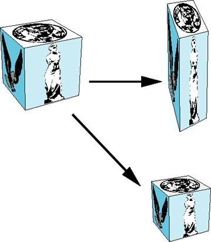
$$
\begin{align}
x'&=s_xx\\
y'&=x_yy\\
z'&=s_zz\\
p'&=\pmb Sp
\end{align}
$$
其中，
$$
\pmb S=\pmb S(s_x,s_y,s_z)=\begin{bmatrix}
s_x&0&0&0\\
0&s_y&0&0\\
0&0&s_z&0\\
0&0&0&1
\end{bmatrix}
$$
放缩因子：

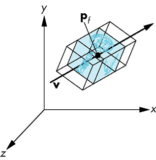

* 放缩变换必定有一个不动点
* 为了定义放缩变换，可以指定其不动点，一个放缩方向，以及沿该方向的放缩因子
* 当放缩因子大于1时，对象在指定方向上变长

反射：

* 对应于负的放缩因子

	

**逆变换**

虽然可以直接计算变换矩阵的逆，当根据几何意义可以给出各种变换的逆

* 平移：$\pmb T^{-1}(d_x,d_y,d_z)=T(-d_x,-d_y,-d_z)$

* 旋转：$\pmb R^{-1}(\theta)=\pmb R(\theta)$

	* 对任一旋转矩阵成立

	* 注意到$\cos(-\theta)=\cos\theta$，$\sin(-\theta)=-\sin\theta$，从而
		$$
		\pmb R^{-1}(\theta)=\pmb R^T(\theta)
		$$

* 放缩：$\pmb S^{-1}(s_x,s_y,s_z)=\pmb S(1/s_x,1/s_y,1/s_z)$

**变换的复合**

* 可以通过把旋转、平移与放缩矩阵相乘从而形成任意的仿射变换

* 因为对许多顶点应用同样的变换，所以构造矩阵$\pmb M =\pmb {ABCD}$的代价相比于对许多顶点$p$计算$\pmb Mp$的代价是很小的

* 难点在于如何根据应用程序的要求构造出满足要求的变换矩阵

* 变换的顺序

	* 注意在右边的矩阵是首先被应用的矩阵

	* 从数学角度来说，下述表示等价
		$$
		p'=\pmb {ABC}p=\pmb A(\pmb B(\pmb Cp))
		$$

	* 变换的顺序是不可交换的

**绕原点的一般旋转**

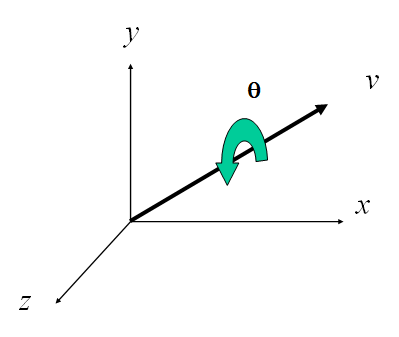

绕过原点任一轴旋转$\theta$角可以分解为绕$x,y,z$轴旋转的复合：$\pmb R(\theta)=\pmb R_z(\theta_z)\pmb R_y(\theta_y)\pmb R_x(\theta_x)$

$\theta_x,\theta_y,\theta_z$称为Euler角。注意旋转顺序不可交换，可以用不同的旋转顺序，不同的旋转角度得到同样的效果

**绕不同于原点的固定点旋转**

* 把固定点移到原点

* 旋转

* 把固定点移回到原来的位置
	$$
	\pmb M=\pmb T(p_f)\pmb R(\theta)\pmb T(-p_f)
	$$

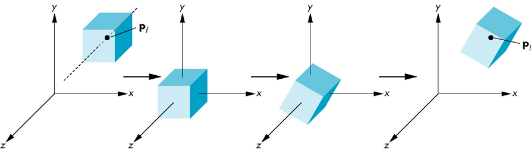

**错切**

* 等价于把面向相反方向倾斜

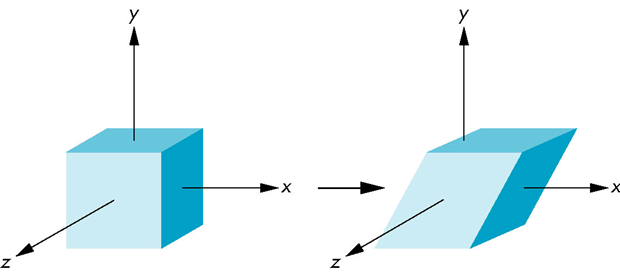

错切矩阵

* 考虑沿$x$轴的错切

	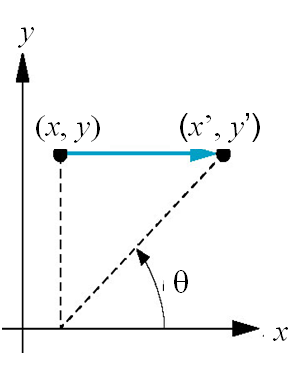
	$$
	\begin{align}
	x'&=x+y\cot\theta\\
	y'&=y\\
	z'&=z
	\end{align}
	$$
	矩阵形式：
	$$
	\pmb H(\theta)=\begin{bmatrix}
	1&\cot\theta&0&0\\0&1&0&0\\
	0&0&1&0\\
	0&0&0&1
	\end{bmatrix}
	$$

* 一个二维旋转相对于三个错切变换的复合
	$$
	\begin{bmatrix}
	\cos\alpha&\sin\alpha\\-\sin\alpha&\cos\alpha
	\end{bmatrix}=
	\begin{bmatrix}
	1&\tan\dfrac{\alpha}{2}\\0&1
	\end{bmatrix}
	\begin{bmatrix}
	1&0\\-\sin\alpha&1
	\end{bmatrix}
	\begin{bmatrix}
	1&\tan\dfrac{\alpha}{2}\\
	0&1
	\end{bmatrix}
	$$

**四元数**

* 把虚数从二维推广到三维

* 需要一个实部和三个虚部$i,j,k$
	$$
	\pmb q=q_0+q_1i+q_2j+q_3k=(q_0,Q)
	$$

* 运算性质：

	* $i^2=j^2=k^2=ijk=-1$
	* 加法：对应分量相加
	* 乘法：$\pmb {pq}=(p_0q_0-P\cdot Q,q_0P+p_0Q+P\times Q)$
	* 乘法单位元$(1,\pmb 0)$
	* 乘法逆元
	* 长度：$|\pmb q|=\sqrt{q_0^2+q_1^2+q_2^2+q_3^2}$

* 点：$\pmb p=(0,Q)$

* 四元数与旋转：

	* 定义：$\pmb r=(\cos\theta/2,\sin\theta/2\ \pmb v)$，其中$\pmb v$为一个单位向量
	* $\pmb {rpr}^{-1}$也是一个点，是点$Q$绕方向$\pmb v$旋转$\theta$角后的位置

	$$
	\pmb p'=\cos\dfrac{\theta}{2}\pmb p+\sin^2\dfrac{\theta}{2}(\pmb p\times\pmb v)\pmb v+2\sin\dfrac{\theta}{2}\cos\dfrac{\theta}{2}(\pmb v\times\pmb p)-\sin\dfrac{\theta}{2}(\pmb v\times\pmb p)\times\pmb v
	$$

* 四元数可以表示在球面上的光滑旋转，而且非常有效

	* 处理过程：
		* 模型视图矩阵 → 四元数
		* 用四元数进行运算
		* 四元数 → 模型视图矩阵

#### 1.3.5. OpenGL中的变换

**OpenGL中的矩阵**

* 在OpenGL中矩阵是状态的一部分
* 有三种类型
	* 模型视图
	* 投影
	* 纹理
	* 颜色
* 用于操作的单组函数
* 选择所操作的对象
	* `glMatrixMode(GL_MODELVIEW)`
	* `glMatrixMode(GL_PROJECTION)`

**当前变换矩阵（CTM）**

* 当前变换矩阵是一个4X4阶的齐次坐标矩阵，它是状态的一部分，被应用到经过流水线中的所有顶点
* CTM是在应用程序中定义的，并被上载到变换单元中

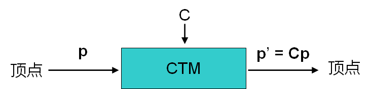

**CTM运算**

* CTM可以被改变，改变的方法是上载一个新得CTM或者右乘一个矩阵：

	上载单位阵：$C\leftarrow I$

	上载任意矩阵：$C\leftarrow M$

	上载一个平移矩阵：$C\leftarrow T$

	上载一个旋转矩阵：$C\leftarrow R$

	上载一个放缩矩阵：$C\leftarrow S$

	右乘任意矩阵：$C\leftarrow CM$

	右乘一个平移矩阵：$C\leftarrow CT$

	右乘一个旋转矩阵：$C\leftarrow CR$

	右乘一个放缩矩阵：$C\leftarrow CS$

* 绕固定点的旋转

	1. 从单位阵开始：$C\leftarrow I$
	2. 把固定点移到原点：$C\leftarrow CT$
	3. 旋转：$C\leftarrow CR$
	4. 把固定点移回到原处：$C\leftarrow CT^{-1}$
	5. 结果：$C=TRT^{-1}$

	其中每个运算对应于程序中的一个函数调用

**在OpenGL中的CTM**

* 在OpenGL的流水线中有一个模型视图矩阵和一个投影矩阵，这两个矩阵复合在一起构成CTM
* 可以通过首先设置正确的矩阵模式处理每个矩阵

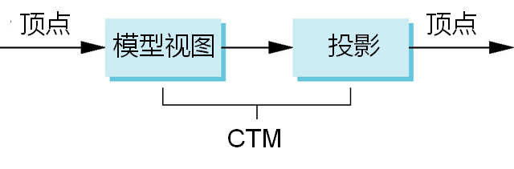

* 旋转、平移、放缩

	* 上载单位阵

		```c++
		glLoadIdentity();
		```

	* 在右边相乘

		```c++
		glRotatef(theta,vx,vy,vz);
		// theta以角度为单位，(vx,vy,vz)定义旋转轴
		glTranslatef(dx,dy,dz);
		glScalef(sx,sy,sz);
		```

		每个函数的参数还可以是d(double)类型

* 任意矩阵

	* 可以上载应用程序中定义的矩阵，或者使之与CTM相乘

		```c++
		glLoadMatrixf(m);
		glMultMatrixf(m);
		```

	* 矩阵m是有16个元素的一维数组，其按列定义了4X4矩阵

	* 在`glMultMatrixf(m)`中m乘在已有矩阵的右边

* 矩阵堆栈

	* 许多情况中需要保存变换矩阵，待稍后再用

		* 遍历层次数据结构
		* 当执行显示列表时避免状态改变

	* OpenGL为每种类型的矩阵维持一个堆栈

		* 应用下述函数处理矩阵堆栈

			```c++
			glPushMatrix();
			glPopMatrix();
			```

* 读入后台矩阵

	* OpenGL状态中有些信息是以矩阵形式保存的

	* 可以利用查询函数读入矩阵

		```c++
		glGetIntegerv
		glGetFloatv
		glGetBooleanv
		glGetDoublev
		```

### 1.4. 三维视图

#### 1.4.1 经典视图

**简介**

* 视图中需要三个基本要素
	* 一个或多个对象
	* 观察者，带有一个投影面
	* 从对象到投影平面的投影变换
* 经典视图就是基于这些要素之间的关系的
	* 观察者捡取一个对象并进行定向，确定希望看到的结果
* 每个对象都假定是用平面的基本多边形构造出来的

**平面几何投影**

* 即投影到平面上的标准投影
* 投影线为直线，这些直线满足：
	* 汇聚于投影中心或
	* 彼此平行
* 这种投影保持共线性
	* 但不一定保角

* 分类

	```mermaid
	graph TD
	平面几何投影 --> 平行投影
	平面几何投影 --> 透视投影
	平行投影 --> 多视点
	平行投影 --> 轴测法
	平行投影 --> 倾斜
	透视投影 --> 单点
	透视投影 --> 两点
	透视投影 --> 三点
	轴测法 --> 等角
	轴测法 --> 四边
	轴测法 --> 三度
	```

	**经典投影**

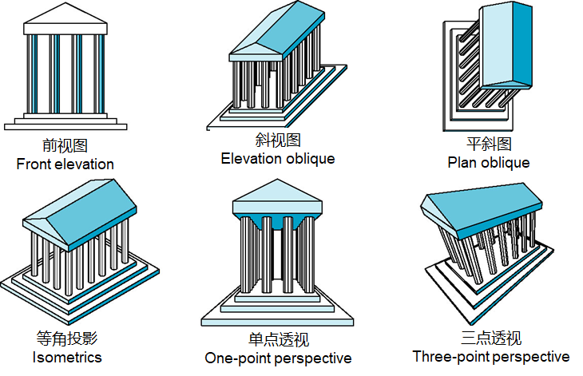

**基准面**

* 在诸如建筑业等实际应用中，所观察的对象通常由许多平坦面构成
* 这些面中任一个都可以认为是一个基准面，从而进行定位
	* 对于规则物体，例如房屋，按照通常的方式可以定义前、后、左、右、顶、底等面 
	* 许多对象上都有几个面相交于直角，从而可以得到三个正交的方向，称为基准方向

**透视投影**

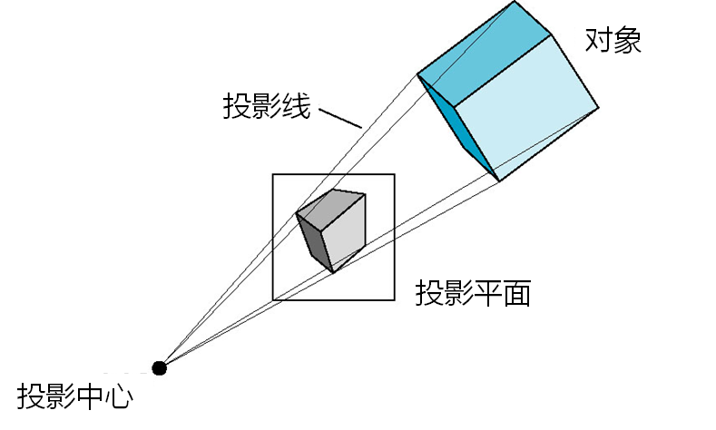

**正交投影**

* 投影线垂直于投影平面

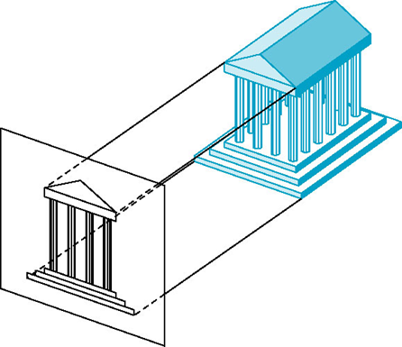

**多视点正交投影**

* 投影面平行于基准面
* 通常从前面、顶部和侧面进行投影

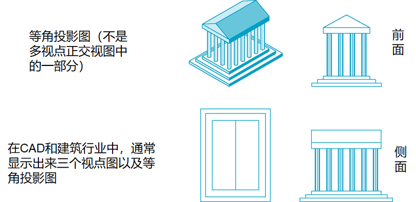

* 优势
	* 保持形状
	* 可以用来测量
		* 建筑规划
		* 手册
* 不足
	* 不能看到对象真正的全局形状，因为许多面在视点中不可见

**轴测投影**

* 投影面相对于对象基准面有一定的夹角

	根据对立方体进行投影时一个角点处有多少个角进行分类

	没有：三度

	两个：四边

	三个：等角

	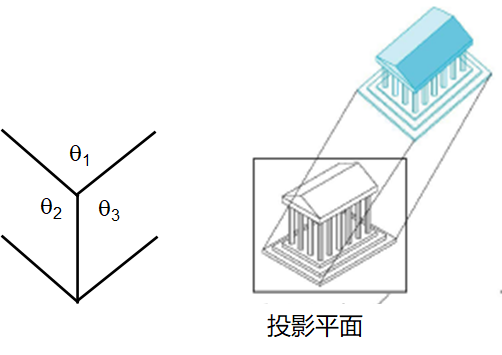

	

* 优势与不足

	* 直线段长度被缩短（foreshortened），但可以求出收缩因子
	* 保持直线但不保角
		* 圆所在平面如果不平行于投影面，它的投影为椭圆
	* 可以见到盒子类对象的三个基准面
	* 会导致某些观察错觉
		* 平行线看起来不平行 

	* 不是很真实，因为远的对象与近的对象具有同样的收缩因子
	* 在CAD应用中经常用到

**倾斜投影**

* 投影线与投影面之间的关系任意

	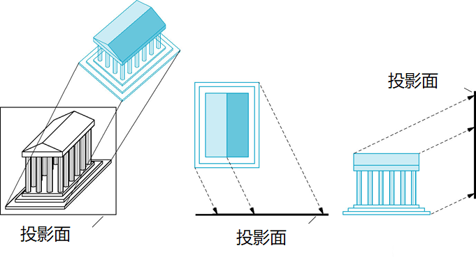

* 优势与不足

	* 可以增加某个角度，以便强调特定面
		* 建筑行业
	* 在平行于投影面的面上的角是保持的，但我们仍然可以见到其他侧面
	* 在实际世界中，只能利用特殊相机做到这一点

**透视投影**

* 投影线汇聚于投影中心（COP）

	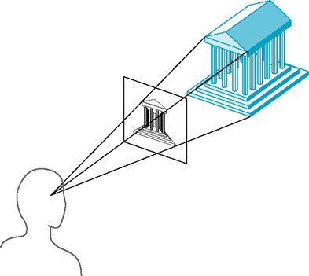

* 灭点

	* 在对象上的所有平行线（不平行于投影面）投影后交于一个点
	* 手工绘制简单透视投影时就需要利用这些灭点

	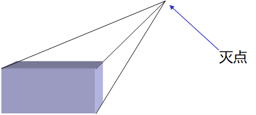

	* 实例

		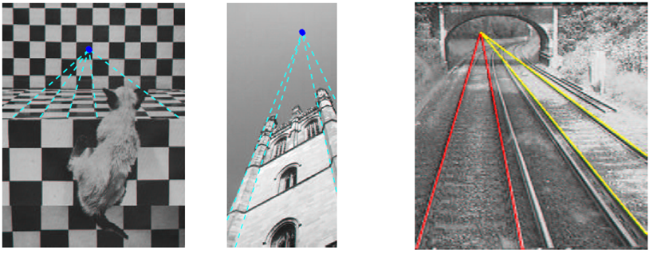

* 三点透视

	* 没有基准面平行于投影面
	* 立方体的投影中有三个灭点

	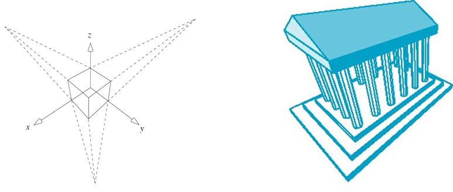

* 两点透视

	* 一个基准方向平行于投影面
	* 立方体的投影中有两个灭点

	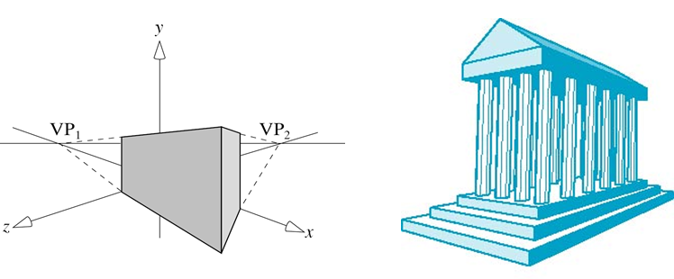

* 单点透视

	* 一个基准面平行于投影平面
	* 立方体的投影中有一个灭点

	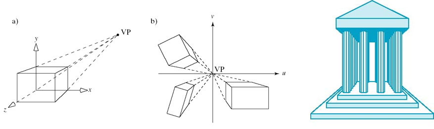

* 优势与不足

	* 同样大小的对象，离视点越远，投影结果就越小
		* 看起来更真实
	* 在一条直线等距的几点投影后不一定等距（非均匀收缩）
	* 只有在平行于投影面的平面上角度被保持
	* 相对于平行投影而言，更难用手工进行绘制（对计算机而言没有增加更多的困难）

#### 1.4.2. 计算机视图

**简介**

* 视图有三个功能，都在流水线体系中实现
	* 定位摄像机
		* 设置模型——视图矩阵
	* 设置镜头
		* 设置投影矩阵
	* 裁剪
		* 设置视景体

**合成照相机**

* 计算机视图是基于合成照相机的，原则上可以实现所有的经典视图
* 所有的经典视图是基于对象、观察者和投影线之间的紧密联系的，而在计算机图形学中强调的则是对象定义与照相机定义之间的独立性
* 在OpenGL中可以指定采用的是透视投影或者正交投影，但在透视投影中OpenGL并不知道什么是单点、两点或三点透视
	* 为了实现这些细节需要知道对象与照相机之间的关系

**OpenGL中的照相机**

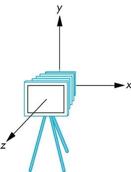

* 在OpenGL中，初始的世界标架和照相机标架相同
	* 初始的模型－视图矩阵是单位阵
* 照相机位于原点，并指向z轴的负向
* OpenGL也指定了默认的视景体，它是一个中心在原点的边长为2的立方体
	* 缺省的投影矩阵是单位阵

**缺省投影**

* 默认的投影是正交投影

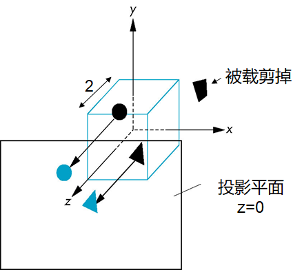

**定义可见的对象**

* 在缺省的照相机设置下，为了使定义的对象可见，只要使对象的位置和尺寸与默认视景体相匹配
	* 通常可以对数据进行适当的平移和各向同性放缩
	* 注意这并不是利用OpenGL的平移和放缩函数进行的操作

**移动照相机标架**

* 如果想看到具有更大的正z坐标的对象，我们可以
	* 把照相机沿z轴正向移动
		* 平移照相机标架
	* 把对象沿z轴负向移动
		* 移动世界坐标
* 二者是完全等价的，都是由模型—视图矩阵确定的
	* 需要平移`glTranslated(0.0,0.0,-d)`
	* 此处`d>0`

* 可以利用一系列旋转和平移把照相机定位到任意位置

**照相机参数**

* 照相机的默认位置在原点，指向$z$轴负向

* 所期望的位置称为视图参考点（view-reference point, VRP）

* 照相机定向

	* 视图平面法向（view-plane normal，VPN）
	* VUP（view-up vector）

	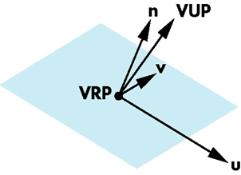

* VPN vs. VUP

	* VPN给出投影面的方向，即平面的法向
	* 只有平面的定向不能完全确定照相机的定向
		* 照相机还可以绕VPN方向旋转
	* 只有给出了VUP，才完全确定了照相机的方向

* VUP

	* 不必要去VUP向量必定平行于投影面

	* 把VUP投影到投影平面上得到上方向量$\pmb v$

		* $\pmb v$与$\pmb n$正交
		* 设$\pmb n=\pmb v\times\pmb n$
		* 由$(\pmb u,\pmb v,\pmb n)$构成的直角坐标系称为视图坐标系
		* 加上VRP，构成照相机标架
		* 实现这种变换的矩阵称为视图定向矩阵

		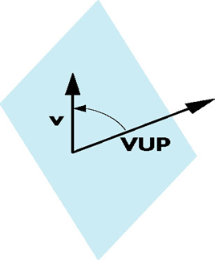

* 视图定位矩阵

	* 设VRP点$p=[x,y,z]^T$，视平面法向$\pmb n=[n_x,n_y,n_z,0]^T$，上方向量为$\pmb v_{up}=[v_{upx},v_{upy},v_{upz},0]^T$

	* $\pmb v=\pmb v_{up}-(\pmb v_{up}\cdot\pmb n)/(\pmb n\cdot\pmb n)\pmb n$，把$\pmb v$，$\pmb n$单位化

	* $\pmb n=\pmb v\times\pmb n$

	* 视图定位矩阵为
		$$
		\pmb V=\begin{bmatrix}
		u_x&u_y&u_z&-xu_x-yu_y-zu_z\\
		v_x&v_y&v_z&-xv_x-yv_y-zv_z\\
		n_x&n_y&n_z&-xn_x-yn_y-zn_z\\
		0&0&0&1
		\end{bmatrix}
		$$

**飞机操纵模拟**

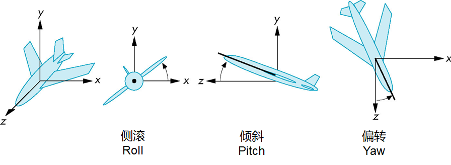

**星空观察**

* 采用极坐标

* 点在天空中的位置指定

	* 方向由方位角和仰角定义
	* 观察者所在的平面，即法向$\pmb n$
	* 照相机还可以绕方向选择，称为扭转角

	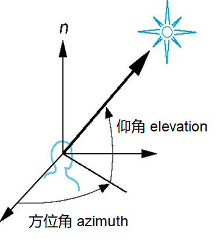

**投影与规范化**

* 在视点（照相机）标架中默认的投影是正交投影

* 对于在默认视景体内的点，$x_p = x$，$y_p=y$，$z_p=0$

* 大多数图形系统应用视图规范化的过程

	* 通过由投影矩阵确定的变换把所有其它的视图转化为默认视图
	* 从而可以对所有的视图采用同样的流水线体系

* 齐次坐标表示

	默认的正交投影矩阵：
	$$
	\begin{align}
	\pmb P_p&=\pmb {Mp}\\
	\pmb M&=\begin{bmatrix}
	1&0&0&0\\0&1&0&0\\0&0&0&0\\0&0&0&1
	\end{bmatrix}
	\end{align}\\
	\begin{matrix}
	x_p=x&y_p=y&z_p=0&w_p=1
	\end{matrix}
	$$

**简单透视**

* 投影中心在原点
* 投影平面为$z=d,d<0$

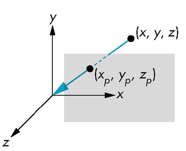

* 透视方程

	考虑顶部与侧边视图

	

* 齐次坐标形式
	$$
	
	\pmb p=\pmb {Mq}\\
	\begin{matrix}
	\pmb M=\begin{bmatrix}
	1&0&0&0\\0&1&0&0\\0&0&1&0\\0&0&1/d&0
	\end{bmatrix}&
	\pmb q=\begin{bmatrix}x\\y\\z\\1\end{bmatrix}
	\Rightarrow
	\pmb p=\begin{bmatrix}
	x\\y\\z\\z/d
	\end{bmatrix}
	\end{matrix}
	$$

**透视除法**

* 如果$w\neq 1$，那么必须从齐次坐标中除以$w$而得到所表示的点

* 透视方程
	$$
	\begin{matrix}
	x_p=\dfrac{x}{z/d}&y_p=\dfrac{y}{z/d}&z_p=d
	\end{matrix}
	$$

**透视变换**

* 透视除法是非线性的，导致非均匀缩短
	* 离COP远的对象投影后尺寸缩短得比离COP近的对象大
* 透视变换是保直线的，但不是仿射变换
* 透视变换是不可逆的，因为沿一条投影直线上的所有点投影后的结果相同

**投影流水线**

* 在模型—视图矩阵后应用4X4的投影矩阵实现简单的投影，但在最后需要进行透视除法


**视角**

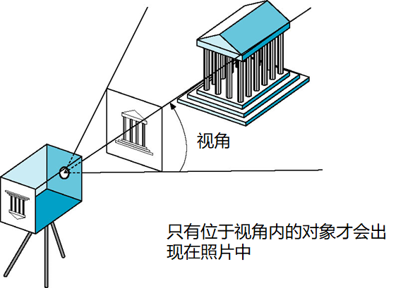

**视景体**


* 若胶卷是矩形的，那么由视角张成一个半无穷的棱台，这称为视景体
	* 其顶点就是COP
	* 但实际的视景体通常有前后裁剪面
	* 不在视景体内的物体被裁剪掉

**OpenGL的正交视图**


**OpenGL的透视**

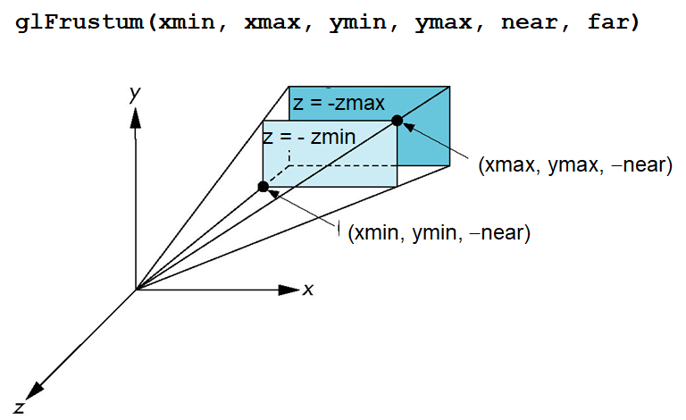

**视野的应用**

* 应用`glFrustum`有时很难得到所期望的结果
* `gluPerspective(fovy,aspect,near,far)`可以提供更好的界面

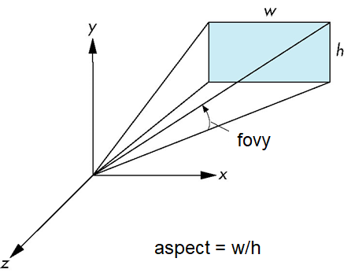

#### 1.4.3. 投影矩阵

**流水线**

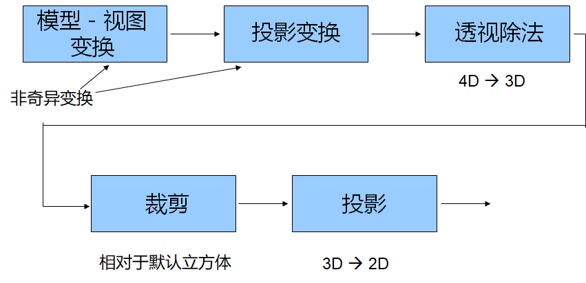

* 在模型-视图变换和投影变换的过程中，一直在四维齐次坐标系中操作
	* 这些变换都是非奇异的
	* 默认值为单位阵
* 规范化使得不管投影的类型是什么，都是相对于默认的简单立方体进行裁剪
* 投影直到最后时刻才进行

**正交规范化**

规范化$\Rightarrow$求出把指定裁剪体转化为默认裁剪体的变换

```c++
glOrtho(left, right, bottom, top, near, far)
```

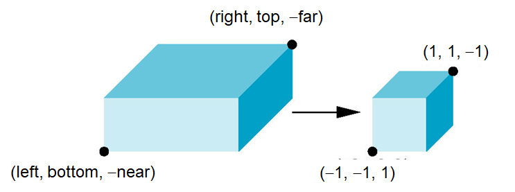

正交规范化矩阵：

1. 把中心移到原点，对应的变换为
	$$
	\pmb T(-(\mathrm{left}+\mathrm{right})/2,-(\mathrm{bottom}+\mathrm{top})/2,(\mathrm{near}+\mathrm{far})/2)
	$$

2. 进行放缩从而使视景体的边长为2
	$$
	\pmb S(2/(\mathrm{left}-\mathrm{right}),2/(\mathrm {top}-\mathrm{bottom}),2.(\mathrm{near}-\mathrm{far}))
	$$

	$$
	\pmb P=\pmb {ST}=\begin{bmatrix}
	\dfrac{2}{\mathrm{right}-\mathrm{left}}&0&0&-\dfrac{\mathrm{right}+\mathrm{left}}{\mathrm{right}-\mathrm{left}}\\
	0&\dfrac{2}{\mathrm{top}-\mathrm{bottom}}&0&-\dfrac{\mathrm{top}+\mathrm{bottom}}{\mathrm {top}-\mathrm{bottom}}\\
	0&0&\dfrac{2}{\mathrm{near}-\mathrm{far}}&\dfrac{\mathrm{far}+\mathrm{near}}{\mathrm{far}-\mathrm{near}}\\
	0&0&0&1
	\end{bmatrix}
	$$

**最后的投影**

* 令$z=0$

* 这等价于如下的齐次坐标变换
	$$
	\pmb M_{orth}=\begin{bmatrix}
	1&0&0&0\\
	0&1&0&0\\
	0&0&0&0\\
	0&0&0&1
	\end{bmatrix}
	$$

* 从而在4D中一般的正交投影为$\pmb P=\pmb M_{orth}\pmb{ST}$

**倾斜投影**

* OpenGL的投影函数不支持一般的平行投影，例如立方体的如下图示

	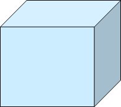

* 此时立方体好像发生了错切，然后再进行正交投影

* 倾斜投影 = 错切＋正交投影

* 一般的错切

	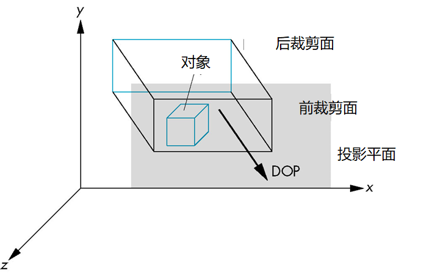

* 错切矩阵

	* $xy$错切（$z$值不变）

	$$
	\pmb H(\theta,\phi)=
	\begin{bmatrix}
	1&0&-\cot\theta&0\\
	0&1&-\cot\phi&0\\
	0&0&1&0\\
	0&0&0&1
	\end{bmatrix}
	$$

	投影矩阵：$\pmb P=\pmb M_{orth}\pmb H(\theta,\phi)$

	一般情形：$\pmb P=\pmb M_{orth}\pmb {STH}(\theta,\phi)$

* 等价性

	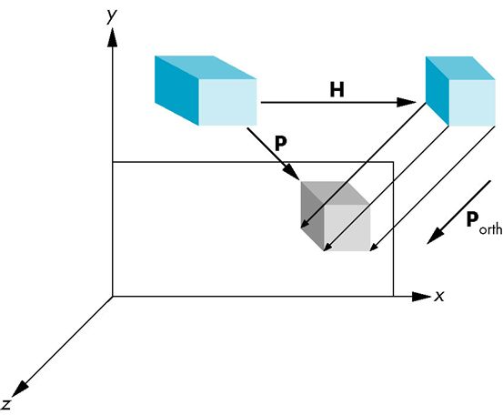

* 对裁剪体的影响

	投影矩阵$\pmb P=\pmb {STH}$把原来的裁剪体变换为默认的裁剪体

	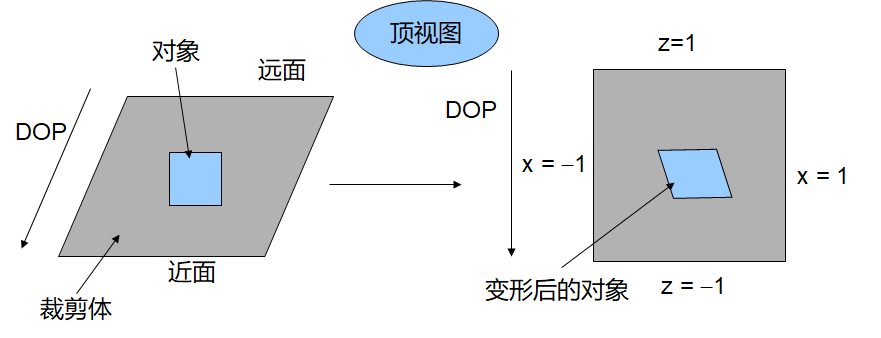

**简单透视**

* 考虑简单透视，COP在原点，近裁剪面在$z=-1$，由平面$x=\pm z,y=\pm z$确定的有90度的视野

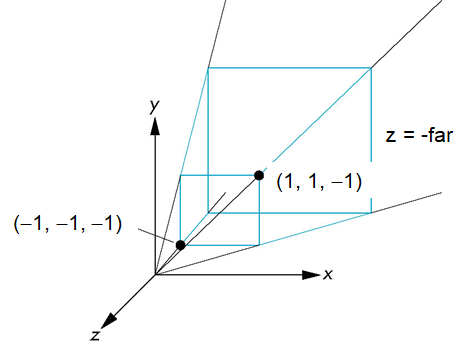

* 透视矩阵：
	$$
	\pmb M=\begin{bmatrix}
	1&0&0&0\\
	0&1&0&0\\
	0&0&1&0\\
	0&0&-1&0
	\end{bmatrix}
	$$
	该矩阵与远裁剪面无关

* 推广

	* 在透视除法后，点$(x,y,z,1)$变到了
		$$
		\begin{matrix}
		x'=-x/z&y/=-y/z&z'=-(\alpha+\beta/z)
		\end{matrix}
		$$
		无论$\alpha$，$\beta$的值是什么，在正交投影后就得到所期望的点，此时矩阵$N$非奇异
		$$
		N=\begin{bmatrix}
		1&0&0&0\\
		0&1&0&0\\
		0&0&\alpha&\beta\\
		0&0&-1&0
		\end{bmatrix}
		$$

	* $\alpha$与$\beta$的选取

		若取
		$$
		\alpha=(\mathrm{near}+\mathrm {far})/(\mathrm{far}-\mathrm{near})\\
		\beta=2\ \mathrm{near}*\mathrm{far}/(\mathrm{near}-\mathrm{far})
		$$
		那么近平面映射到$z=-1$

		远平面映射到$z=1$

		各侧边映射到$x=\pm 1,y=\pm 1$

**规范变换**

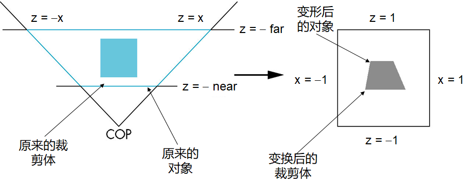

* 隐藏面消除
	* 虽然这里选择的透视矩阵形式上看起来有点儿任意，但这种选择保证如果在原来的裁剪体内$z_1>z_2$, 那么变换后的点满足$z_1’>z_2’$
	* 因此如果首先应用规范变化，隐藏面消除算法有效
	* 然而，公式$z’ = -(\alpha+\beta/z)$意味着由于规范化导致距离发生了改变，这可能导致数值问题，特别是当近距离非常小的时候更是如此

**OpenGL的透视**

* `glFrustum`可以定义非对称视景体，但`gluPerspective`不能做到这一点

	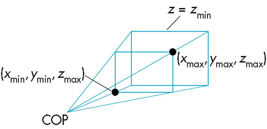

* OpenGL透视矩阵

	在`glFrustum`中的规范化需要进行一个初始剪切变换，从而形成一个视景棱台，接着进行放缩变换，得到规范后的透视视景体。最后，透视矩阵导致只需要最后的正交变换：
	$$
	\pmb P=\pmb {NSH}=\begin{bmatrix}
	\dfrac{2z_\min}{x_\max-x_\min}&0&\dfrac{x_\max+x_\min}{x_\max-x_\min}&0\\
	0&\dfrac{2z_\min}{y_\max-y_\min}&\dfrac{y_\max+y_\min}{y_\max-y_\min}&0\\
	0&0&-\dfrac{\mathrm{far}+\mathrm{near}}{\mathrm{far}-\mathrm{near}}&-\dfrac{2\mathrm{far}*\mathrm{near}}{\mathrm{far}-\mathrm{near}}\\
	0&0&-1&0
	\end{bmatrix}
	$$

* 意义

	* 规范化使得只需要一个流水线体系就可以进行透视投影和正交投影
	* 尽可能位于四维齐次空间中，以便保持隐藏面消除和明暗处理所需要的三维信息
	* 简化了裁剪的操作

## 2. 图形学基础

### 2.1. 光栅化

#### 2.1.1. 基本模型

* 像素：图像的基本单元
* 光栅：像素的阵列

像素构成的矩阵：连续空间的离散采样

* 矩阵的每个元素称为片元

* 片元赋予了颜色后称为像素

#### 2.1.2. 线段的光栅化

**DDA算法（数字微分分析法）**

直线$y = mx + h$满足微分方程$ \mathrm dy/\mathrm d x = m = \mathrm Dy/\mathrm Dx =(y2 – y1)/(x2 – x1)$

沿扫描线$ \mathrm Dx = 1$

```c++
for(x=x1;x<=x2;x++)
{
    y+=m;
    write_pixel(x,round(y));
}
```

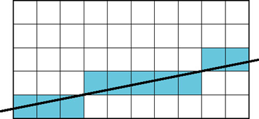

**Bresenham算法**

* DDA算法中每一步需要一次浮点加法
* 在Bresenham算法中可以不出现任何浮点运算
* 只考虑$0\leq m\leq 1$的情形
	* 其它情形利用对称性处理

* 假设像素中心在半整数处

* 如果从一个已被确定激活的像素出发，那么下一像素的可能位置只会有两种可能

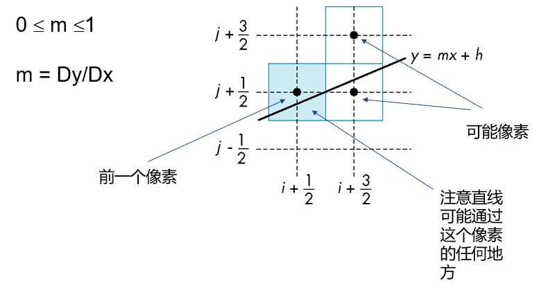

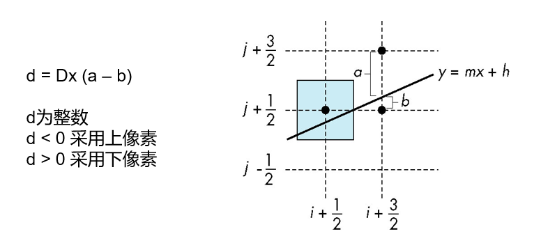

增量形式：

* 如果基于第$k$步的决策变量$\mathrm dk$表示第$k+1$步的决策变量，可以使算法更有效：
	$$
	\mathrm d_{k+1} = \mathrm d_k – 2 D_y, 若 d_k >0;\\
	\mathrm d_{k+1} = d_k – 2(D_y – D_x), 否则
	$$

* 对每个$x$值，只需要进行整数加法以及测试
* 可以在图形芯片上用单个指令实现

#### 2.1.3. 多边形区域的光栅化

**内外检测：奇偶检测法**

从一点$p$引射线，如果与多边形边界交点数为偶数，则$p$在多边形外，否则在多边形内部

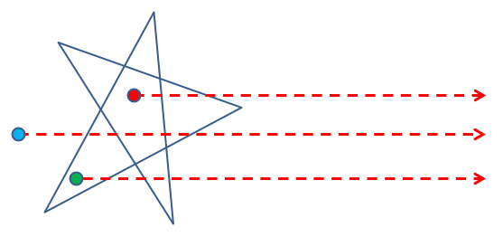

**扫描线转化算法**

通过维持一个特别的数据结构（结构中保存扫描线与多边形的交点）进行填充

* 按扫描线进行排序
* 逐扫描线跨距进行填充

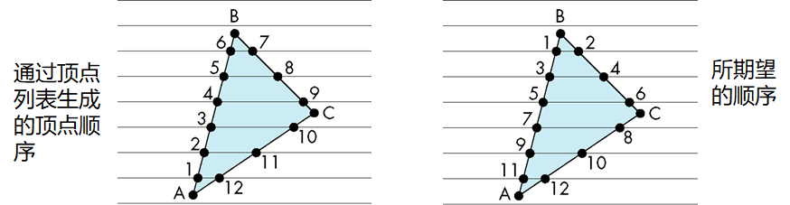

数据结构：

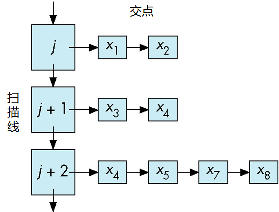

#### 2.1.4. 圆的光栅化

**中点法**：Bresenham算法

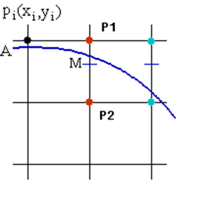

**正负判定法**

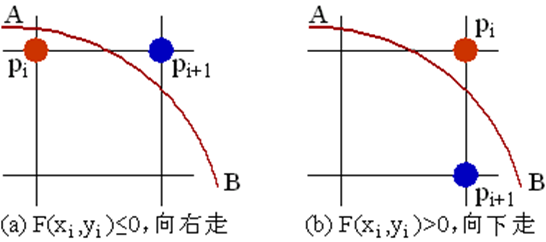

#### 2.1.5. 参数曲线的离散：采样

* 分段线性逼近：多边形

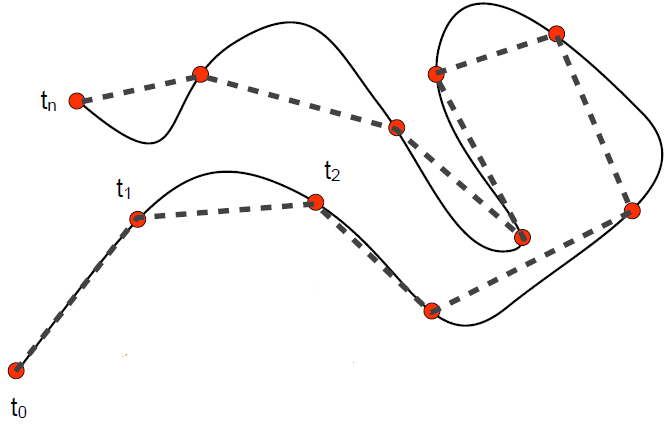

#### 2.1.6. 反走样

**锯齿现象**

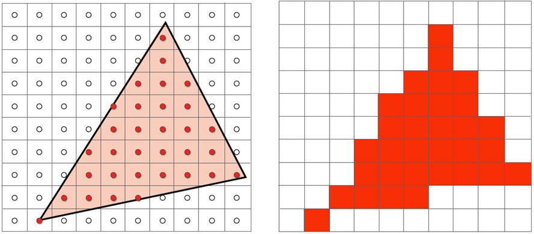

**走样现象的缓解**


* 引入中间颜色值，换解视觉突兀感

* 欠采样导致走样现象

* 使用低通滤波去掉高频信息

## 3. 几何

### 3.1. 重心坐标

**概述**

对给定点集合$v_\Sigma=\{v_1,\cdots,v_i,\cdots\}$

重心坐标表示为：
$$
x=\sum b_ix_i,\sum b_i=1
$$
其中，对所有$b_i>0$

**各种重心坐标的计算方法**

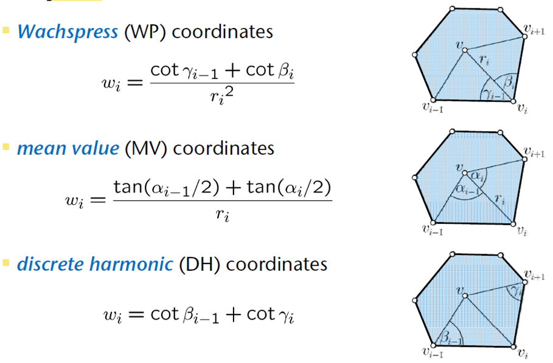

### 3.2. 三角剖分

#### 3.2.1. 2D Delaunay Triangulation

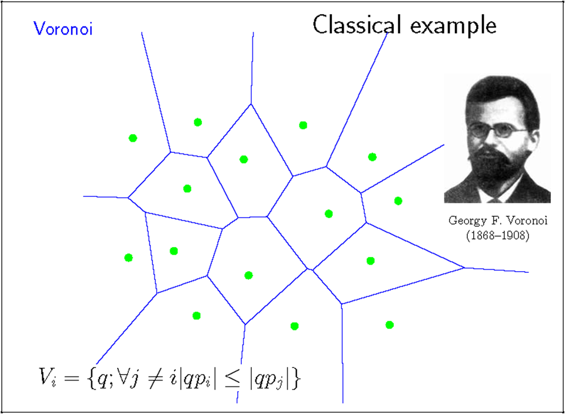

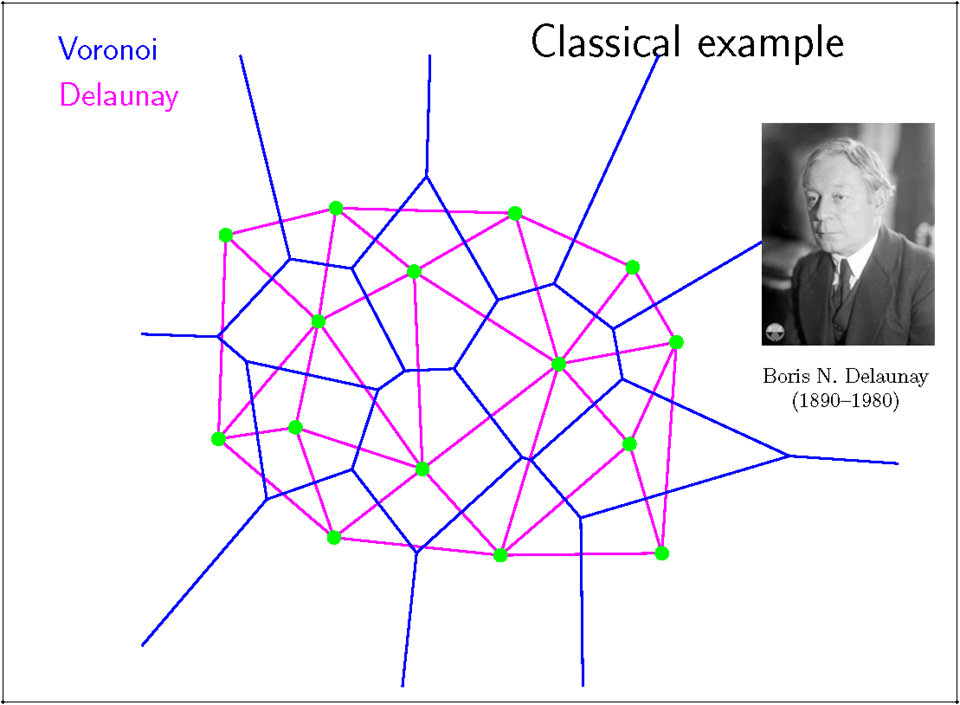

**Properties**：

1. Empty sphere property: no points inside the circum-sphere of any simplex

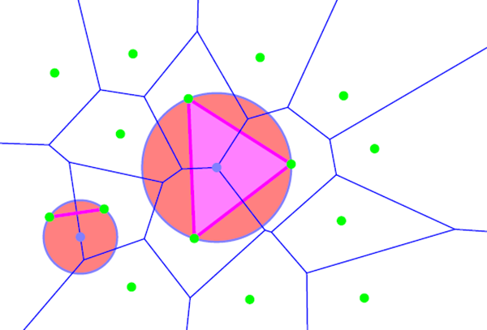

2. DT maximizes the smallest angle

	

3. Convex hull: union of all triangles

	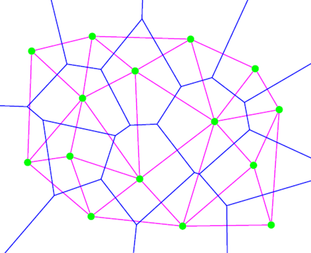

4. DT maximizes the arithmetic mean of the radius of inscribed circles of the triangles. 

	DT minimizes roughness (the Dirichlet energy of any piecewise-linear scalar function)

	DT minimizes the maximum containing radius (the radius of the smallest sphere containing the simplex)

5. The DT in d-dimensional spaces is the projection of the points of convex hull onto a (d+1)-dimensional paraboloid.

	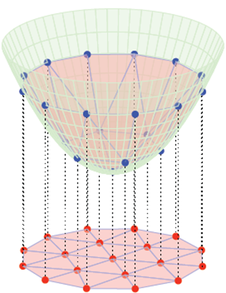

6. DT minimizes the spectrum of the geometric Laplacian (spectral characterization)

#### 3.2.2. Simple Method: Edge Swapping/Flipping

* Start with any triangulation
	1. find any two adjacent triangles that form a convex quadrilateral that does not satisfy empty sphere condition
	2. swap the diagonal of the quadrilateral to be a Deluany triangulation of that four points
	3. repeat step 1,2 until stuck.

#### 3.2.3. Algorithms for Voronoi Diagrams

* Compute the intersection of n-1 half-planes for each site, and “merge” the cells into the diagram
* Divide-and-conquer
* Plane sweep
* Randomized incremental construction

#### 3.2.4. Centroidal Voronoi Tessellation

**Definition**: The VT is a centroidal Voronoi tessellation (CVT) , if each seed coincides with the centroid of its Voronoi cell

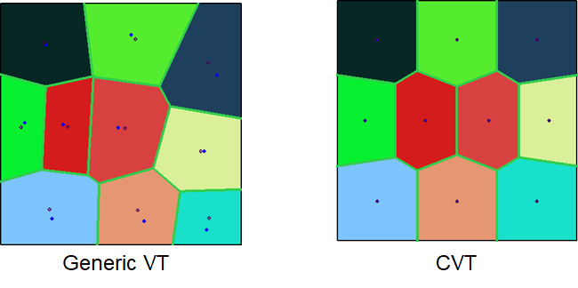

**CVT energy function**：
$$
F(X)=\sum\limits_{i=1}^N\int_{V_i}\rho(\pmb x)\|\pmb x-\pmb x_i\|^2\mathrm d\pmb x
$$

* •CVT is a critical point of $F(X)$, an *optimal* CVT is a global minimizer of $F(X)$ 

**The Gradient of CVT Energy**

The gradient of $F(X)$：
$$
\dfrac{\part F}{\part \pmb x_i}=2m_i(\pmb x_i-\pmb c_i)
$$
其中，
$$
m_i=\int_{\pmb x\in \Omega_i}\rho(\pmb x)\mathrm d\sigma
$$
**Lloyd Algorithm**

* Construct the VT associated with the points
* Compute the centroids of the Voronoi regions
* Move the points to the centroids
* Iterate until convergent

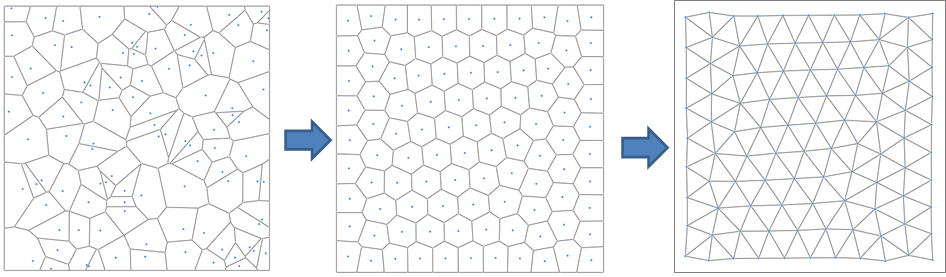

#### 3.4.5. Optimal Delaunay Triangulation

**ODT energy function**
$$
\begin{align}
E(X)&=\|f-f_{I,\mathcal T}\|_{L^1(\Omega)}\\
&=\sum\limits_{\tau\in\mathcal T}\int_\tau f_I(\pmb x)\mathrm d\pmb x-\int_\Omega f(\pmb x)\mathrm d\pmb x
\end{align}
$$
**Compare ODT and CVT**

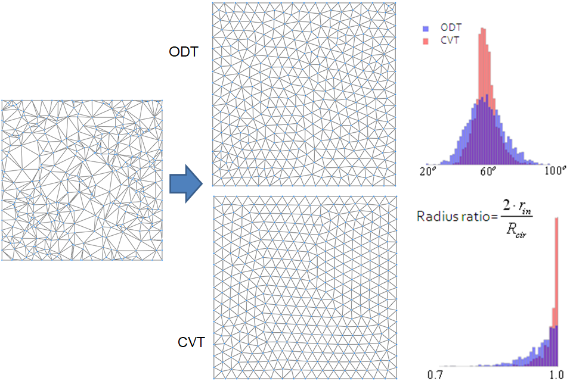

### 3.3. 网格基础

#### 3.3.1. 图数据结构

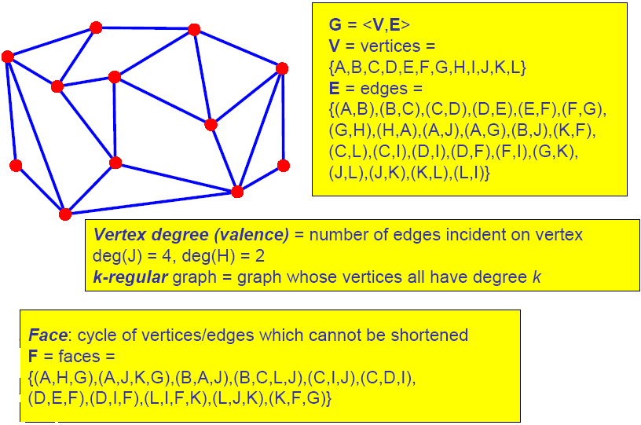

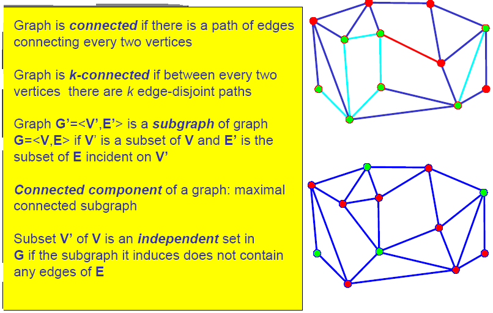

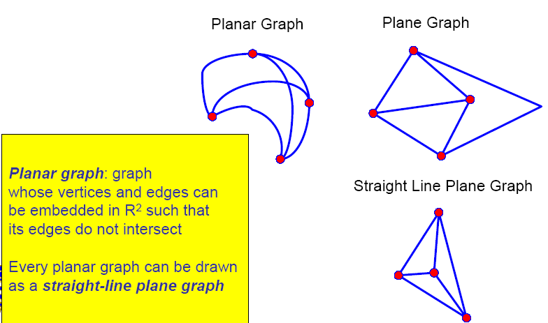

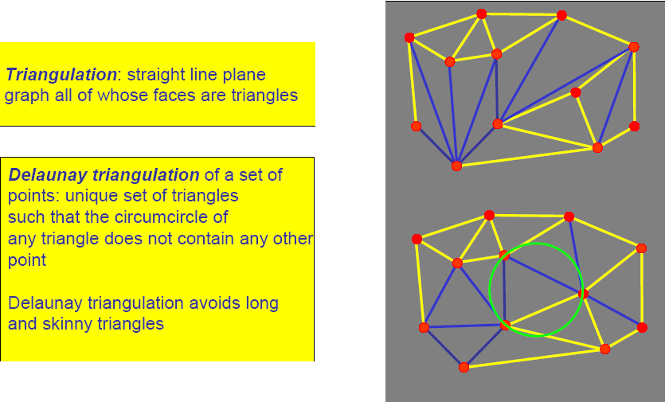

#### 3.3.2. 欧拉公式

对于简单多面体
$$
V+F-E=2
$$
V：顶点数，F：面数，E：边数

如果多面体不是简单的，在面上有H个洞，通过多面体的洞有$G$个，那么
$$
V+F-E=2+H-2G
$$
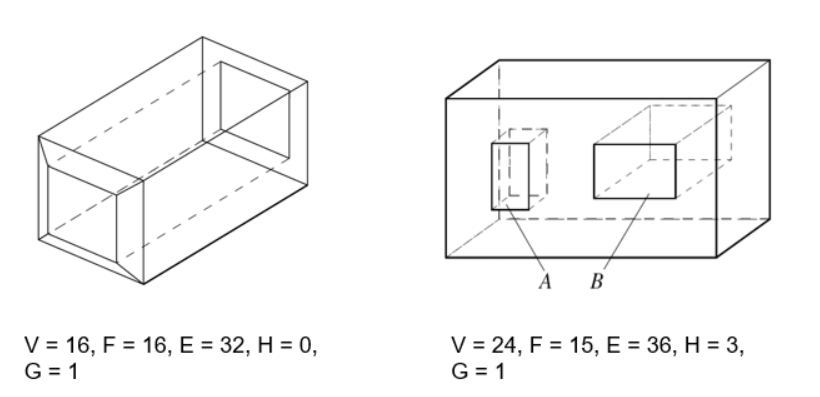

#### 3.3.3. 网格数据结构

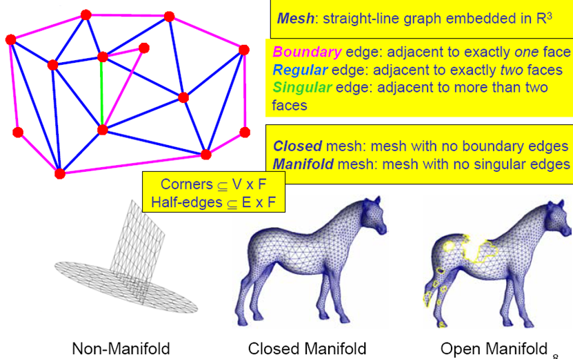

**Topology**

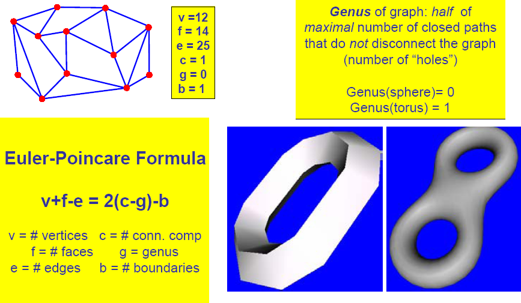

**Orientability**

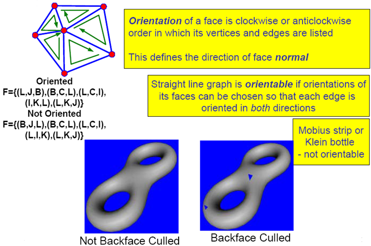

**Developablility**

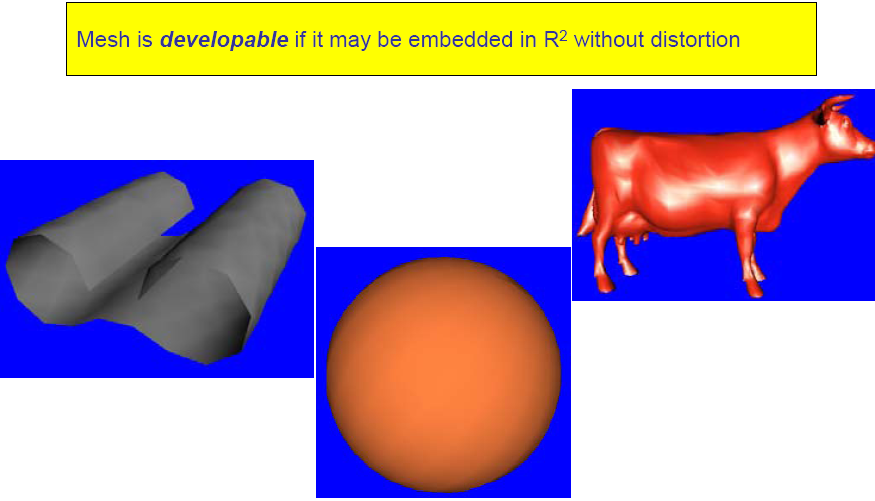

**OBJ文件格式**

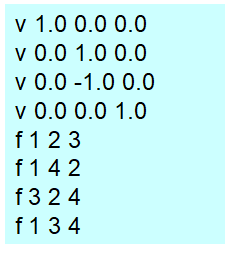

* Vertices
	* Start with char ‘v’
	* (x,y,z) coordinates
* Faces
	* Start with char ‘f’
	* Indices of its vertices in the file
* Other properties
	* Normal, texture coordinates, material, etc.

**定义网格**

* Geometry
	* Vertex Coordinates
* Connectivity
	* How do vertices connected?
* List of Edge
* Vertex-Edge
* Vertex-Face
* Combined
* Surface & material properties
	* Material color
	* Ambient, hightlight coefficients
	* Texture coordinates
	* BRDF, BTF
* Rendering properties
	* Lighting
	* Normals
	* Rendering modes

#### 3.3.4. List of Faces

* List of vertices 
	* Position coordinates
* List of faces
	* Triplets of pointers to face vertices (c1,c2,c3)

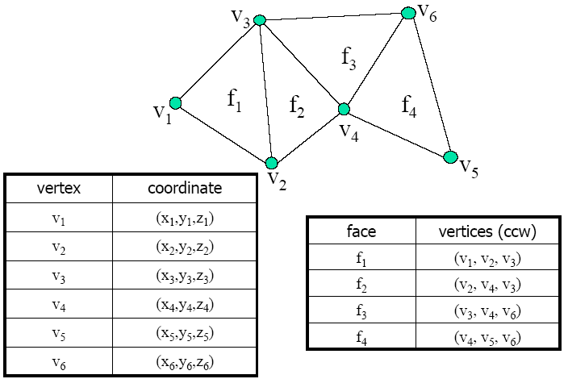

**Pros**

* Convenient and efficient (memory wise)
* Can represent non-manifold meshes

**Cons**

* Too simple - not enough information on relations between vertices & faces

#### 3.3.5. Adjacency Matrix

**Definition**

* View mesh as connected graph
* Given n vertices build n*n matrix of adjacency information
	* Entry (i,j) is TRUE value if vertices i and j are adjacent
* Geometric info 
	* list of vertex coordinates
* Add faces 
	* list of triplets of vertex indices (v1,v2,v3)

**Example**

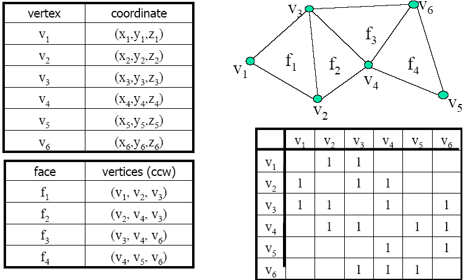

**Pros**

* Information on vertices adjacency

* Stores non-manifold meshes

**Cons**

* Connects faces to their vertices, BUT NO connection between vertex and its face

#### 3.3.6. Doubly-Connected Edge List (DCEL)

* Record for each face, edge and vertex:
	* Geometric information
	* Topological information
	* Attribute information

* Half-Edge Structure

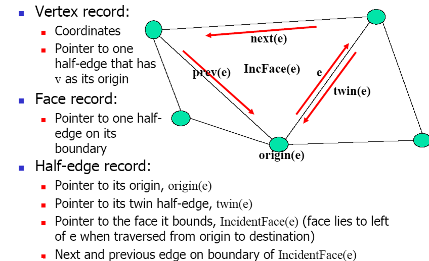

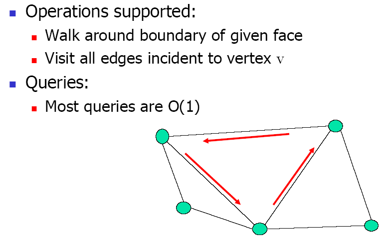

**Example**

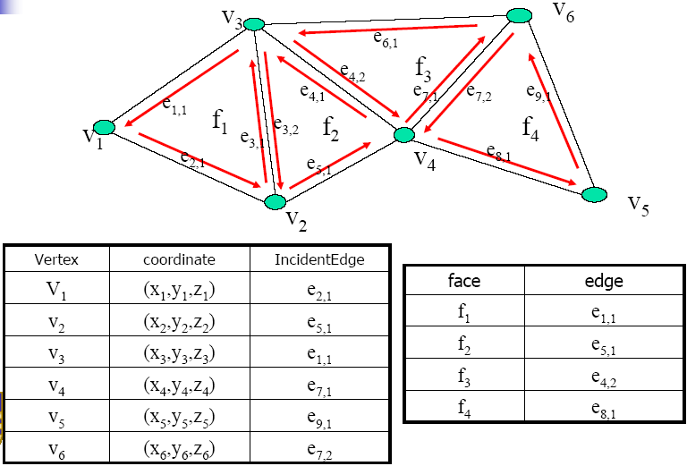

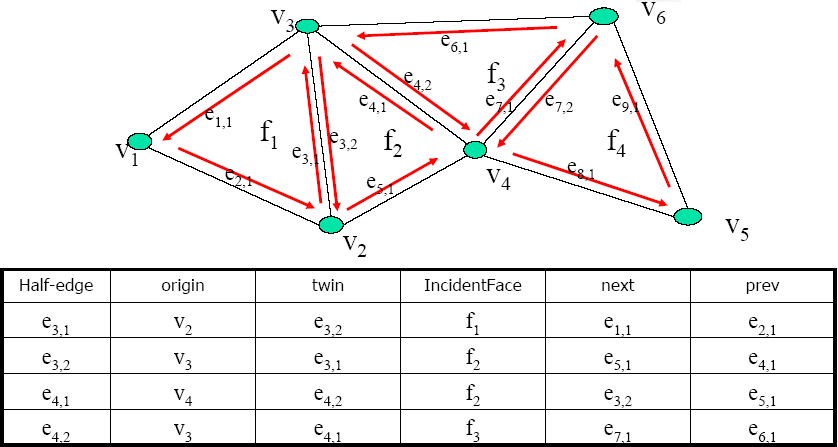

**Pros**

* All queries in O(1) time
* All operations are O(1) (usually)

**Cons**

* Represents only manifold meshes

#### 3.3.7. Corner Table

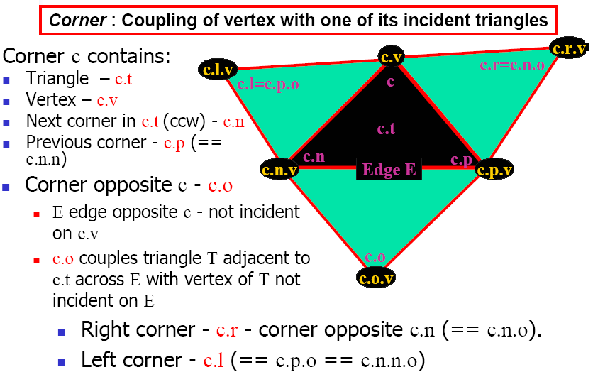

**Example**

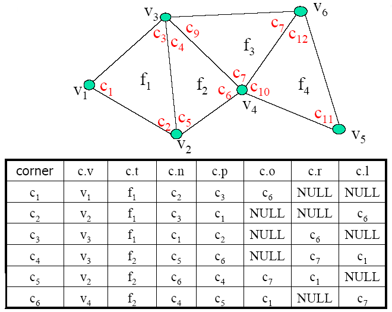

**Pros**

* All queries in O(1) time
* All operations are O(1) (usually)

**Cons**

* Represents only manifold meshes
* High redundancy (but not too high …)

### 3.4. 微分坐标（Laplacian 坐标）

#### 3.4.1. Detail

* Detail=surface-smooth
* smooth=averaging


#### 3.4.2. 微分坐标

$$
\delta_i=v_i-\sum\limits_{j\in N(i)}w_jv_j
$$


权重的选择：

* Uniform weight (geometry oblivious)
	$$
	w_j=1
	$$

* Cotangent weight (geometry aware)
	$$
	w_j=(\cot\alpha+\cot\beta)
	$$

* Normalization
	$$
	w_j=\dfrac{w_j}{\sum\limits_jw_j}
	$$

#### 3.4.3. Laplacian矩阵

用矩阵形式表示微分坐标

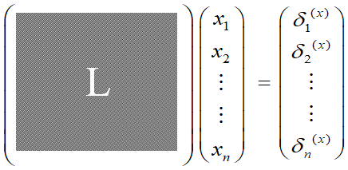

其中，

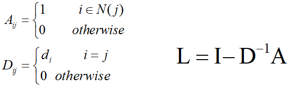

对三个分量有

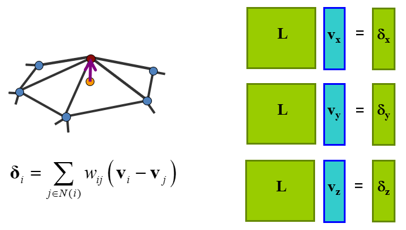

重建：

解稀疏线性方程组
$$
Lv=\delta
$$
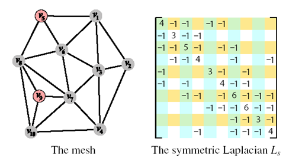

若Laplacian矩阵非方阵，则
$$
L^TLv=L^T\delta
$$
求解最小二乘解

**从变分角度看**

Laplacian近似
$$
\tilde {\pmb x}=\arg\min\limits_{\pmb x}\Big(\|L\pmb x-\delta^{(x)}\|^2+\sum\limits_{j\in C}\omega^2\|x_j-c_j\|^2\Big)
$$
Gradient近似
$$
\min\limits_{\phi}\iint_\Omega \|\nabla \phi-w\|^2\mathrm dA
$$

#### 3.4.4. 极小曲面

定义：平均曲率处处为0的曲面
$$
H(v_i)=0,\forall i
$$


### 3.5. 曲面参数化

#### 3.5.1. Tutte’s Method

If G=<V,E> is a 3-connected planar graph (triangular mesh) then any barycentric embedding provides a valid parameterization

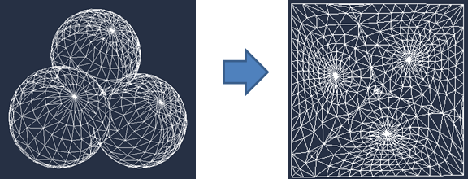

如果边界位于凸多边形上，则三角形一定不会发生翻转

#### 3.5.2. Floater参数化方法

* Uniform parametrization
* Weighted least squares parametrization
* Shape-preserving parametrization 

#### 3.5.3. 自由边界的平面参数化方法

* ASAP
* ARAP

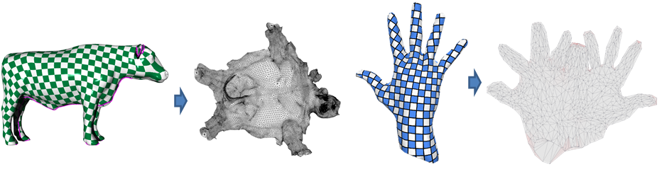

#### 3.5.4. 参数化的数学本质：映射

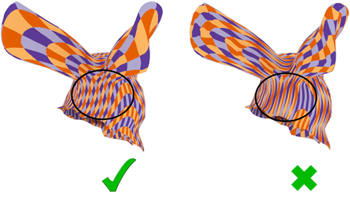

不同的参数化定义域：

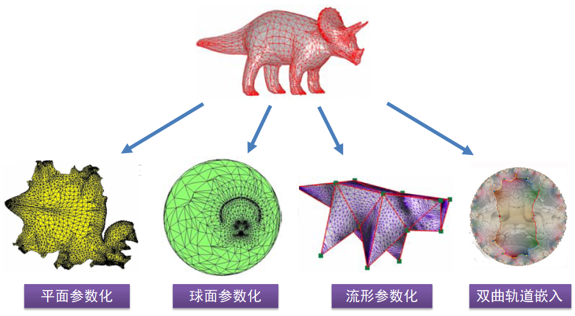

求解映射的方法：

* 连续方法
	* 首先求一个连续光滑的映射函数
	* 然后采样得到离散三角网格
	* 特点：理论漂亮，实际操作有采样的问题
	* 代表方法：计算共形几何
* 离散方法
	* 直接从离散三角网格映射到结果网格
	* 特点：直接求解分片线性映射
* 混合方法

### 3.6. 数字几何处理

#### 3.6.1. 表面重建

**问题描述**

* 输入
	* 从三维模型上采样得到的一系列点
* 输出
	* 接近原始模型的二维网格表面

**希望拥有的特性**

* No restriction on topological type

* Representation of range uncertainty

* Utilization of all range data

* Incremental and order independent updating

* Time and space efficiency

* Robustness

* Ability to fill holes in the reconstruction

**主要方法**

* Methods that construct triangle meshes directly — *Explicit methods*
	* Voronoi diagram and Delaunay triangulation（直接构网法）

	* Zippering in 3D
* Methods that construct volumetric implicit functions — *Implicit methods*（隐式构网法：构造一个4D隐函数，在点上的值为0；抽取0等值面为结果曲面）

	* Signed distances
* Radial basis function reconstruction
	* Poisson reconstruction
* Registration：将不同视角的点云统一到同一个坐标系中

#### 3.6.2. 网格光滑化

**Laplacian Smoothing **

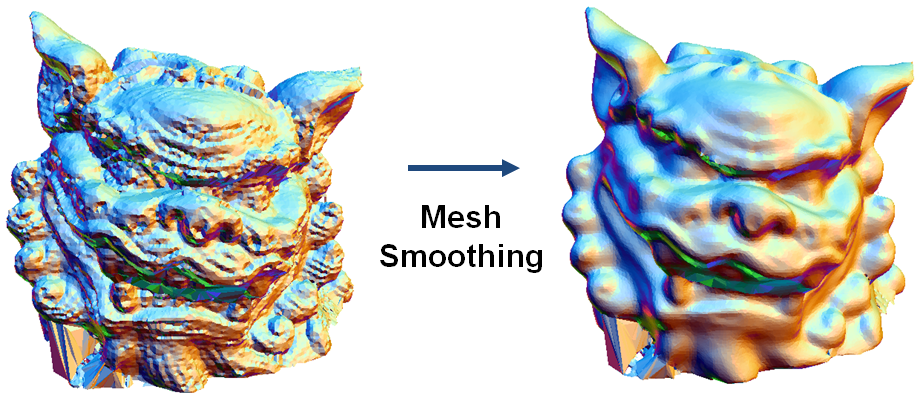
$$
L(P)=\dfrac{1}{n}\sum\limits_{i=1}^n\vec{PQ_i}=\dfrac{1}{n}\sum\limits_{i=1}^nQ_i-P
$$

$$
P_{new}\leftarrow P_{old}+\lambda L(P_{old})
$$

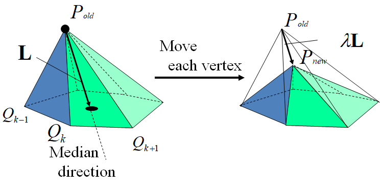

**Discrete Mean Curvature Flow Filtering**

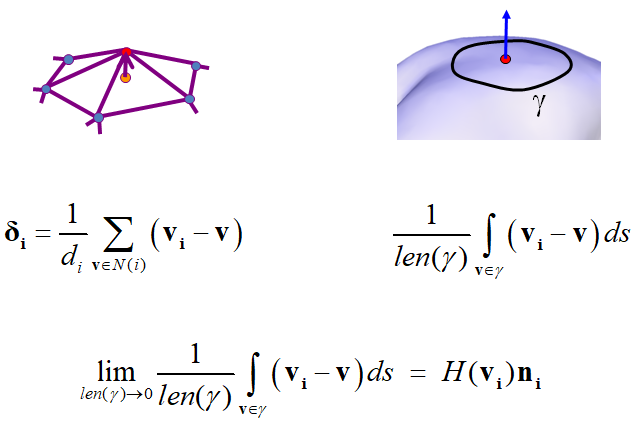

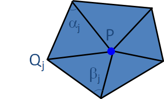
$$
H\pmb n=\dfrac{\nabla_p A}{2A}=\dfrac{1}{4A}\sum\limits_j(\cot\alpha_j+\cot\beta_j)(\pmb P-\pmb Q_i)
$$

$$
P_{new}\leftarrow P_{old}+\lambda H(P_{old})\pmb n(P_{old})
$$

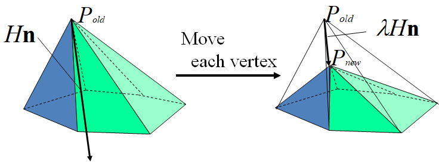

#### 3.6.3. 网格简化

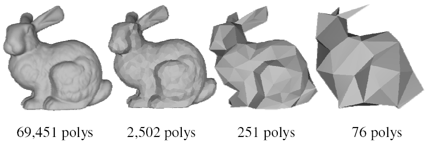

简化策略：删除不重要的顶点/边/面

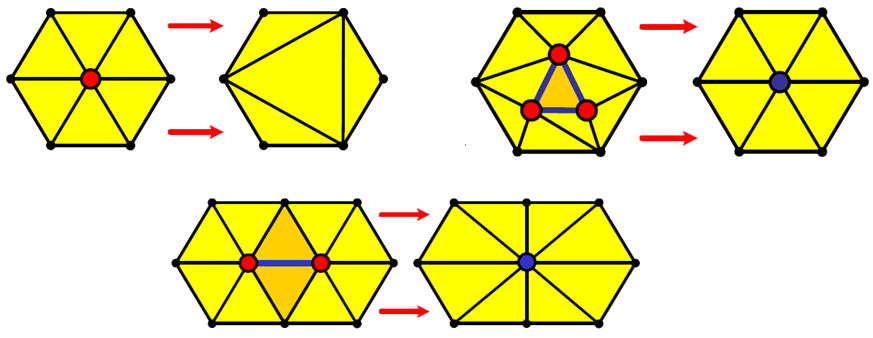

#### 3.6.4. 表面编辑

* Deform the vertex coordinates directly
	* Drag vertices
* Deform the control points
	* Bézier, NURBS
* Deform the embedded space
	* FFD, Axial deformation

**Free-form Deformation (FFD)**

* Embed the object into a domain that is more easily parametrized than the object.
* Advantages: 
	* You can deform arbitrary objects
	* Independent of object representation

**Detail-Preserving Editing**

1. Laplacian Editing

	* Local detail representation – enables detail preservation through various modeling tasks
	* Representation with sparse matrices
	* Efficient linear surface reconstruction

2. Poisson Mesh Editing

	* The representation: the gradients of the functions X, Y, Z on each triangle of the mesh
	* Deformation: propagate the transformation of the handle onto the ROI using geodesic distances

	

3. Linear Rotation-invariant Coordinates 

	* Keep a local frame at each vertex

	* Prescribe changes to some selected frames

		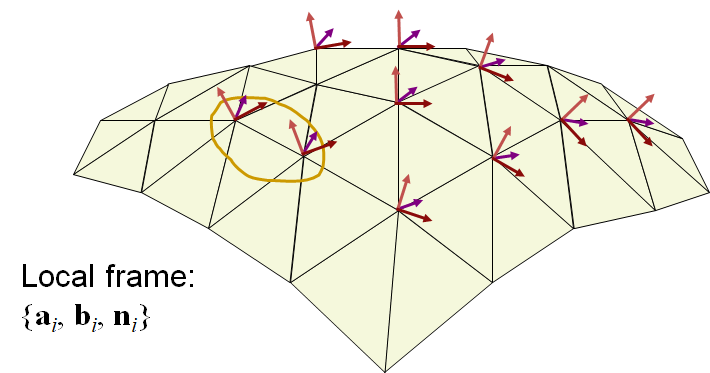
		* Encode the differences between adjacent frames
		* Solve for the new frames in least-squares sense

	* Reconstruction

		* After having the frames, solve for positions

#### 3.6.5. Mesh Morphing

Given two objects produce sequence of intermediate objects that gradually evolve from one object to the other

* Interpolate object shapes
* Interpolate object attributes
	* Color, texture, normal, etc.

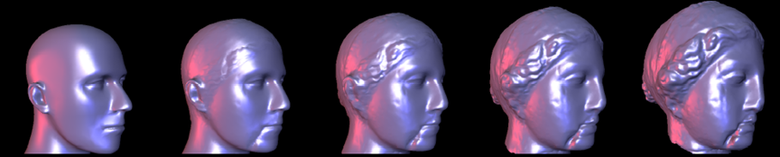

Terminologies:

* Morphing
* Metamorphosis
* Shape blending
* Shape averaging
* Shape interpolation
* Shape transition

子问题：

* Correspondence problem
	* For each point on source/target meshes find corresponding point on second mesh = Parameterization
* Path Problem
	* Specify trajectory in time for each point
	* For mesh – specify vertex trajectory

### 3.7. 多视角几何

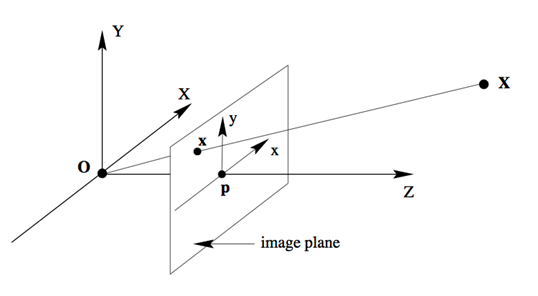

摄像机模型中，目标点坐标为
$$
\pmb x=\begin{bmatrix}x\\y\end{bmatrix}
$$
齐次坐标：
$$
\pmb X=\begin{bmatrix}
X\\Y\\Z
\end{bmatrix}
$$

$$
\lambda\begin{bmatrix}x\\y\\f\end{bmatrix}=\begin{bmatrix}X\\Y\\Z\end{bmatrix}\Leftrightarrow
\begin{bmatrix}x\\y\\f\end{bmatrix}=\begin{bmatrix}1&0&0&0\\0&1&0&0\\0&0&1&0\end{bmatrix}\begin{bmatrix}X\\Y\\Z\\1\end{bmatrix}
$$

几何关系如下：


世界坐标和摄像头坐标的转换：

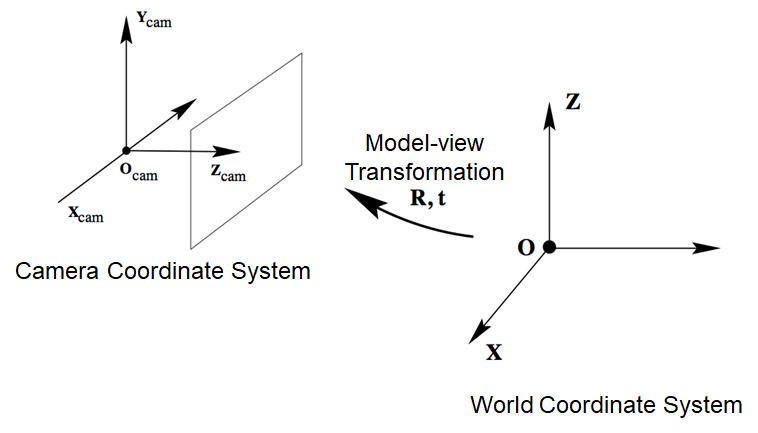
$$
\begin{bmatrix}
X_{cam}\\Y_{cam}\\Z_{cam}\\1
\end{bmatrix}=
\begin{bmatrix}
\pmb R&\pmb t\\\pmb 0^T&1
\end{bmatrix}
\begin{bmatrix}
X\\Y\\Z\\1
\end{bmatrix}
$$

$$
\begin{bmatrix}x\\y\\1\end{bmatrix}=
\begin{bmatrix}f&0&0\\0&f&0\\0&0&1\end{bmatrix}
\begin{bmatrix}1&0&0&0\\0&1&0&0\\0&0&1&0\end{bmatrix}
\begin{bmatrix}\pmb R&\pmb t\\\pmb 0^T&1\end{bmatrix}
\begin{bmatrix}X\\Y\\Z\\1\end{bmatrix}
$$

令
$$
\begin{matrix}
\pmb K=\begin{bmatrix}f&0&0\\0&f&0\\0&0&1\end{bmatrix}&
\pmb x=\begin{bmatrix}x\\y\\1\end{bmatrix}&
\pmb X=\begin{bmatrix}X\\Y\\Z\\1\end{bmatrix}
\end{matrix}
$$
原式可表示为
$$
\pmb x=\pmb K[\pmb R|\pmb t]\pmb X\\
\Downarrow\\
\pmb x=\pmb {PX}
$$
其中，$\pmb P=\pmb K[\pmb R|\pmb t]$为相机参数（相机投影矩阵），$\pmb R$称为固有参数（内参Intrinsic），$\pmb t$称为外部参数（外参Extrinsic）

### 3.8. 几何建模

#### 3.8.1. 3D重建：已存在的物体

**静态物体的3D重建**

1. 视觉方法（Stereo Vision）

	* Shape from X

		* Shape from shading, shape from silhouette, …

		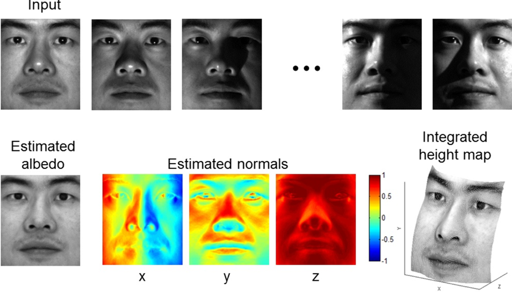

	* Multi-view stereo/geometry (MVS)

		* 双目扫描、结构光扫描

		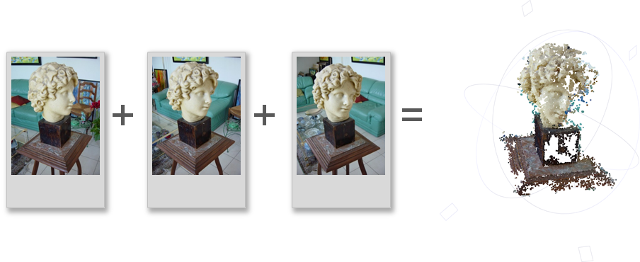

	* Structure from motion (SfM)

		SfM vs. SLAM

		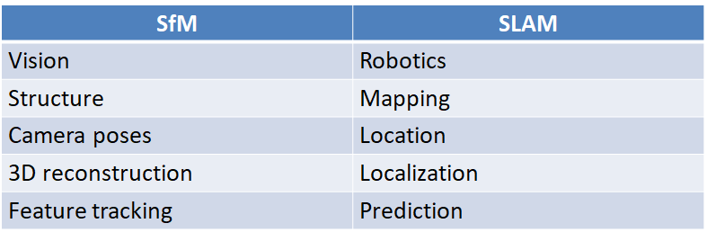

		SLAM的主要流程：

		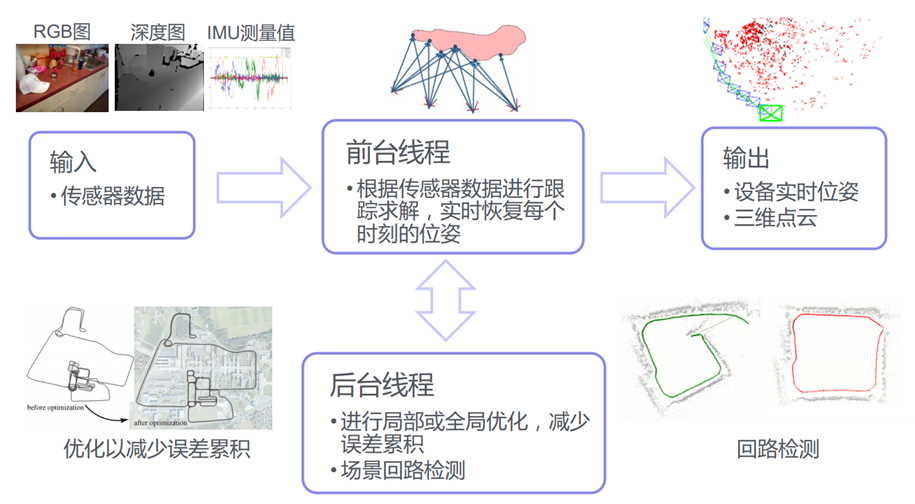

2. 激光测点（三角几何）方法

	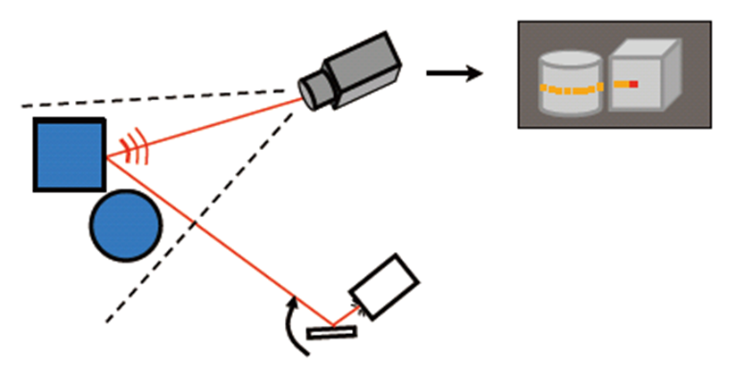

3. 基于深度相机的3D重建

**动态物体的3D重建**

人体动态重建：离线算法、在线算法

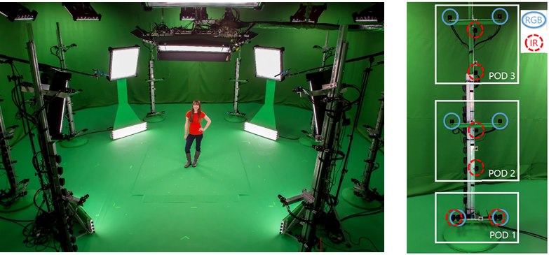

3D动态重建的困难性：

* 数据量大 
* 数据采集困难
	* Single-Camera
	* Multi-Camera
* 数据结构复杂
	* Geometry
	* Color
	* Topology
* 硬件需求高

基本流程：

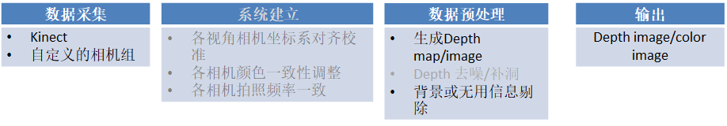

#### 3.8.2. 3D设计：不存在的物体

1. 人工建模：使用3D建模软件
2. 基于草图交互的3D设计
3. 基于子部件组装的3D建模
4. 基于知识的草图交互建模

#### 3.8.3. 3D形状的分析和理解

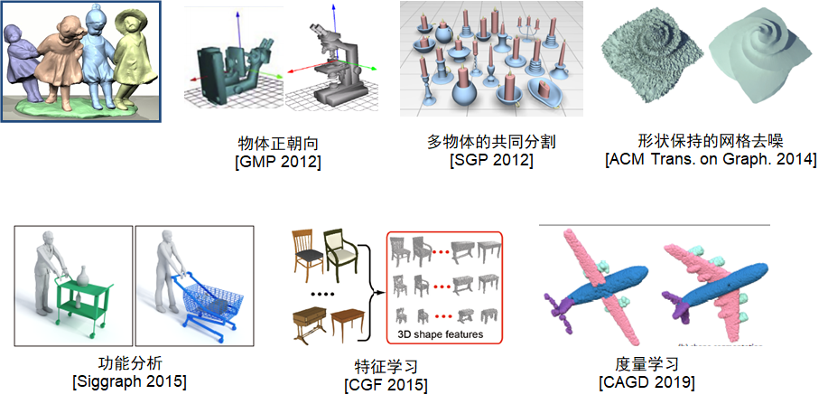

**核心问题**：形状表征（描述子、特征）

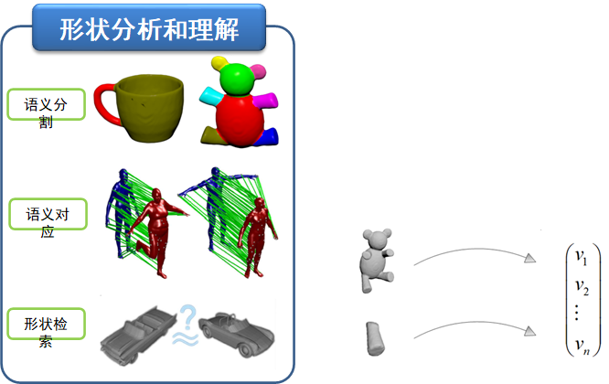

**三维数据的信息**

* 点坐标$(x,y,z)$
* 几何量
	* 长度、角度、面积、体积
* 微分量
	* 法向量
	* 曲率
* 拓扑量
	* 连接关系
	* Laplace谱
* 映射度量
	* 雅可比（变形量）
	* 共形比
* ...

**各种人工定义的3D形状特征**

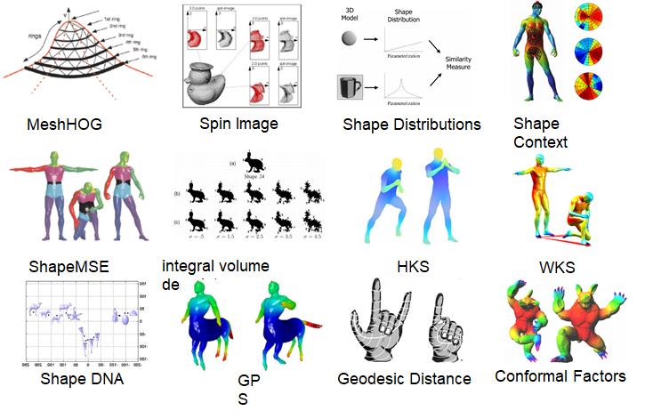

**三维数据深度学习的三种方法**

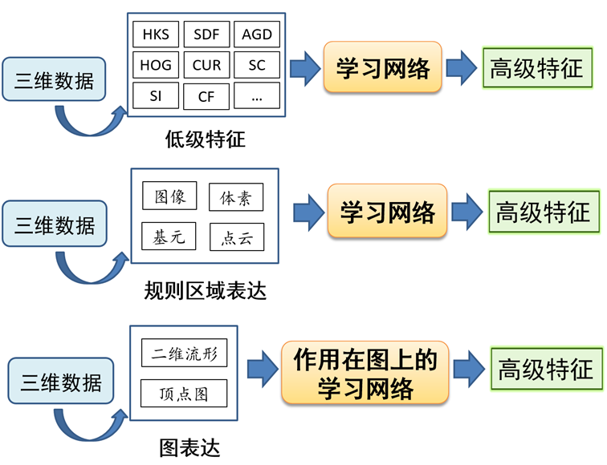

## 4. 仿真

### 4.1. 弹簧-质点模型

#### 4.1.1. 单质点

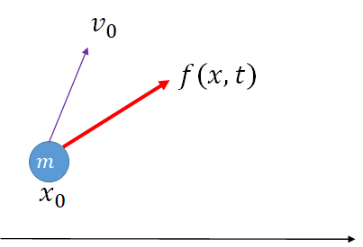

* 质点
	* 质量$m$
	* 位置$x$
	* 速度$v$
	* 合外力$f=f(x,t)$
* 已知：质点在初始时刻的位置$x_0$
* 预测：质点在下一刻的位置

* 牛顿第二定律：$F=ma$

* 求解初值问题：
	$$
	\begin{matrix}
	x(0)=x_0&v(0)=v_0
	\end{matrix}\\
	\dfrac{\mathrm d^2x(t)}{\mathrm dt^2}=\ddot{x}(t)=\dfrac{f(x,t)}{m}
	$$
	解耦为一阶微分方程：
	$$
	\begin{matrix}
	x(0)=x_0&v(0)=v_0
	\end{matrix}\\
	\begin{align}
	\dfrac{\mathrm dx(t)}{\mathrm dt}&=\dot{x}(t)=v(t)\\
	\dfrac{\mathrm dv(t)}{\mathrm dt}&=\dot v(t)=\dfrac{f(x,t)}{m}
	\end{align}
	$$

* 时间离散积分
	$$
	\begin{align}
	v_{n+1}&= v_n+h\int_{t_n}^{t_{n+1}}\dfrac{f(x,t)}{m}\mathrm dt\\
	x_{n+1}&=x_n+h\int_{t_n}^{t_{n+1}}v(t)\mathrm dt
	\end{align}
	$$

* 数值求解

	* 显式欧拉法
		$$
		\begin{align}
		x(t+h)&=x(t)+h\cdot v(t)\\
		v(t+h)&=v(t)+h\cdot\dfrac{f(x(t),t)}{m}
		\end{align}
		$$

	* 隐式欧拉法
		$$
		\begin{align}
		x(t+h)&=x(t)+h\cdot v(t+h)\\
		v(t+h)&=v(t)+h\cdot\dfrac{f(x(t+h),t+h)}{m}
		\end{align}
		$$

	* 半隐式欧拉法
		$$
		\begin{align}
		x(t+h)&=x(t)+h\cdot v(t+h)\\
		v(t+h)&=v(t)+h\cdot\dfrac{f(x(t),t)}{m}
		\end{align}
		$$

#### 4.1.2. 质点系统（多质点）

* 牛顿第二定律
	$$
	\pmb {M\ddot x}(t)=\pmb f(t,\pmb x(t))=\pmb f_{int}(\pmb x(t))+\pmb f_{ext}\\
	\dfrac{\mathrm d}{\mathrm dt}\begin{bmatrix}\pmb x\\\pmb v\end{bmatrix}=\begin{bmatrix}\pmb v\\\pmb M^{-1}\pmb f\end{bmatrix}
	$$

* 显式欧拉法
	$$
	\begin{align}
	\pmb x_{n+1}&=\pmb x_n+h\pmb v_n\\
	\pmb v_{n+1}&=\pmb v_n+h\pmb M^{-1}\pmb f(t_n)
	\end{align}
	$$

* 隐式欧拉法
	$$
	\begin{align}
	\pmb x_{n+1}&=\pmb x_n+h\pmb v_{n+1}\\
	\pmb v_{n+1}&=\pmb v_n+h\pmb M^{-1}\pmb f(t_{n+1})
	\end{align}
	$$

* 半隐式欧拉法
	$$
	\begin{align}
	\pmb x_{n+1}&=\pmb x_n+h\pmb v_n\\
	\pmb v_{n+1}&=\pmb v_n+h\pmb M^{-1}\pmb f(t_{n+1})
	\end{align}
	$$

#### 4.1.3. 弹簧-质点

* 胡克定律：$F=kx$

* 弹力：
	$$
	f_p=k(\|x_p\|-r)\dfrac{-x_p}{\|x_p\|}\\
	\Downarrow\\
	f_p=k_s\Big(\dfrac{\|x_p\|}{r}-1\Big)\dfrac{-x_p}{\|x_p\|}
	$$

* 弹簧质点对

	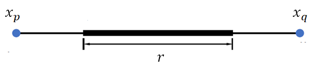

	* 弹簧

	$$
	f_p=k_s\Big(\dfrac{\|x_q-x_p\|}{r}-1\Big)\dfrac{x_q-x_p}{\|x_q-x_p\|}
	$$

	* 阻尼
		$$
		f_p=k_d\Big(\dfrac{v_q-v_p}{r}\cdot\dfrac{x_q-x_p}{\|x_q-x_p\|} \Big)\dfrac{x_q-x_p}{\|x_q-x_p\|}
		$$

	* 合内力
		$$
		f_p=(k_s\Big(\dfrac{\|x_q-x_p\|}{r}-1\Big)+k_d\Big(\dfrac{v_q-v_p}{r}\cdot\dfrac{x_q-x_p}{\|x_q-x_p\|} \Big))\dfrac{x_q-x_p}{\|x_q-x_p\|}
		$$

* 弹性力学角度

	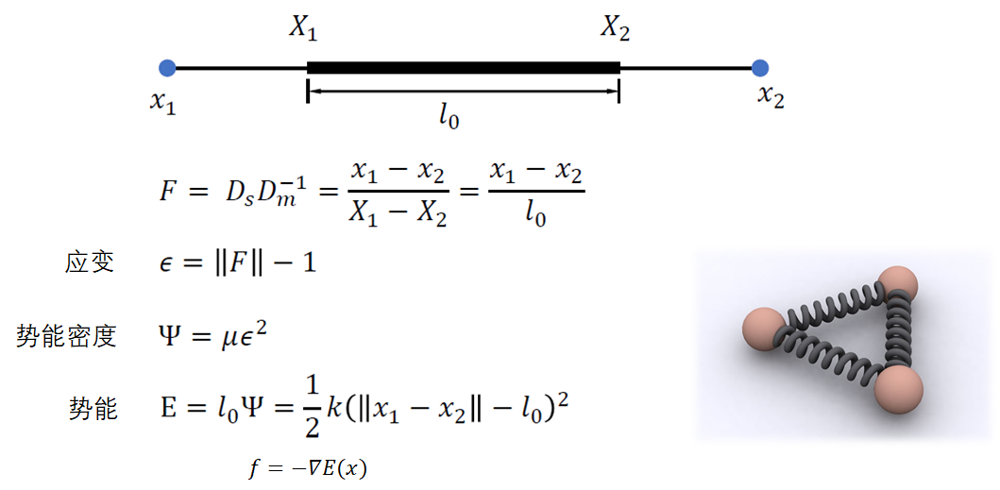

* 伪代码

	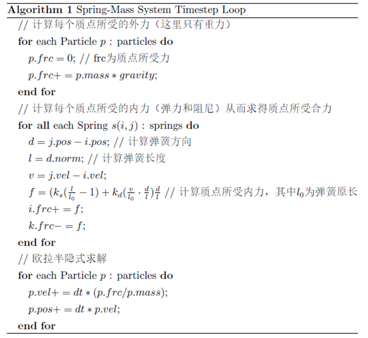

#### 4.1.4. 弹簧质点系统的能量法

欧拉隐式方法：
$$
\begin{align}
\pmb x_{n+1}&=\pmb x_n+h\pmb v_{n+1}\\
\pmb v_{n+1}&=\pmb v_n+h\pmb M^{-1}\pmb f(t_{n+1})\\\\
\Rightarrow \pmb x_{n+1}&=\pmb x_n+h\pmb v_n+h^2\pmb M^{-1}\pmb f(x_{n+1},t_{n+1})\\
\pmb v_{n+1}&=\dfrac{\pmb x_{n+1}-\pmb x_n}{h}

\end{align}
$$
原问题可转化为求解方程：
$$
\pmb x_{n+1}=\pmb y+h^2\pmb M^{-1}\pmb f_{int}(\pmb x_{n+1})
$$
其中，$\pmb y=\pmb x_n+h\pmb v_n+h^2\pmb M^{-1}\pmb f_{ext}$

对于保守力$\pmb f_{int}(\pmb x(t),t)$可以写为$-\nabla E(\pmb x)$，这里$E$为势能
$$
E(\pmb p_1,\pmb p_2)=\dfrac{1}{2}k(\|\pmb p_1-\pmb p_2\|-r)^2
$$

* 重力可看作外力，重力势能也可加入总势能

上述方程可以描述为以下优化问题的解：
$$
\pmb x_{n+1}=\arg\min\limits_{\pmb x}\dfrac{1}{2}(\pmb x-\pmb y)^T\pmb M(\pmb x-\pmb y)+h^2E(\pmb x)
$$
如果用Newton-Raphson方法求解即为通常的欧拉隐式方法

数值解法：$\Delta \pmb x=-[\nabla^2g(\pmb x)]^{-1}\nabla g(\pmb x)$ 

#### 4.1.5. 弹簧质点系统的加速方法

胡克定律：
$$
E(\pmb x_1,\pmb x_2)=\dfrac{1}{2}k(\|\pmb x_1-\pmb x_2\|-l_0)^2
$$
能量极小化求解：
$$
\pmb x_{n+1}=\arg\min\limits_{\pmb x}\dfrac{1}{2}(\pmb x-\pmb y)^T\pmb M(\pmb x-\pmb y)+h^2E(\pmb x)
$$
对每根弹簧：
$$
E_i(\pmb x)=\dfrac{1}{2}k_i(\|\pmb p_{i_1}-\pmb p_{i_2}\|-r_i)^2
$$
加入辅助变量：$\pmb d_i$，满足$\|\pmb d_i\|=r_i$

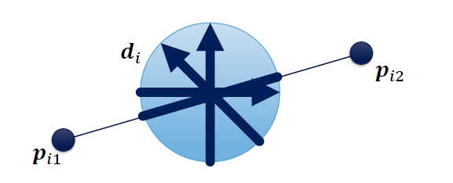

胡克定律改写为：
$$
\dfrac{1}{2}k_i(\|\pmb p_{i_1}-\pmb p_{i_2}\|-r_i)^2=\dfrac{1}{2}k_i\min\limits_{\|\pmb d_i\|=r_i}\|\pmb p_{i_1}-\pmb p_{i_2}-\pmb d_i \|^2
$$
当$\pmb d_i=r_i\dfrac{\pmb p_{i_1}-\pmb p_{i_2}}{\|\pmb p_{i_1}-\pmb p_{i_2}\|}$时，上述优化问题取得等号

弹性势能：
$$
\begin{align}
E(\pmb x)&=\sum\limits_i\Big(\min\limits_{\|\pmb d_i\|=r_i}\Big(\dfrac{1}{2}k_i(\|\pmb p_{i_1}-\pmb p_{i_2}-\pmb d_i \|)^2\Big) \Big)\\
&=\min\limits_{\pmb d\in\mathcal M}\Big(\sum\limits_i\Big(\dfrac{1}{2}k_i(\|\pmb p_{i_1}-\pmb p_{i_2}-\pmb d_i \|)^2\Big) \Big)
\end{align}
$$
时间积分：
$$
\min\limits_{\pmb x}\dfrac{1}{2}(\pmb x-\pmb y)^T\pmb M(\pmb x-\pmb y)+h^2E(\pmb x)\\
\Downarrow\\
\min\limits_{\pmb x,\pmb d\in\pmb U}\dfrac{1}{2}\pmb x^T\pmb {Ax}+\pmb x^T(\pmb {Bd}+\pmb c)
$$
其中，$U=\{\pmb d=(\pmb d_1,\pmb d_2,\cdots,\pmb d_s),\pmb d_i\in R^3,\|\pmb d_i\|=r_i\}$

优化：
$$
\min\limits_{\pmb x,\pmb d\in\pmb U}\dfrac{1}{2}\pmb x^T\pmb {Ax}+\pmb x^T(\pmb {Bd}+\pmb c)
$$

* $\pmb A$，$\pmb B$，$\pmb c$为常量，不依赖于$\pmb x$，$\pmb d$
* Local/global 优化方法
	* 固定$\pmb x$, $\pmb d$容易优化
	* 固定$\pmb d$, $\pmb x$容易优化

* Local Step：由当前$\pmb x$求$\pmb d$
	$$
	\pmb d_i=r_i\dfrac{\pmb p_{i_1}-\pmb p_{i_2}}{\|\pmb p_{i_1}-\pmb p_{i_2}\|}
	$$
	可以并行优化

* Global Step：
	$$
	\pmb x^*=-\pmb A^{-1}(\pmb {Bd}+\pmb c)
	$$
	其中矩阵$\pmb A$为常量，且为正定矩阵，故优化可以进行预分解

#### 4.1.6. 一般线性系统

* 运动方程：
	$$
	\pmb K(\pmb x-\pmb u)+\pmb {Dv}+\pmb {Ma}=\pmb f_{ext}
	$$
	$\pmb K=-\dfrac{\part \pmb f_{int}}{\part \pmb x}$：刚度矩阵，$\pmb D$：阻尼

* $\pmb u$为初始位置，令$\pmb d=\pmb x-\pmb u$
	$$
	\pmb K(\pmb d)+\pmb D\dot{\pmb d}+\pmb M\ddot {\pmb d}=\pmb f_{ext}
	$$

### 4.2. 刚体运动仿真

将弹簧质点系统中的弹力替换为质点间的约束


6个自由度：位移$\pmb x$，朝向$\pmb R$

* 质心
	$$
	\pmb x_{com}=\dfrac{\sum\limits_{i=1}^Nm_i\pmb p_i}{\sum\limits_{i=1}^Nm_i}
	$$
	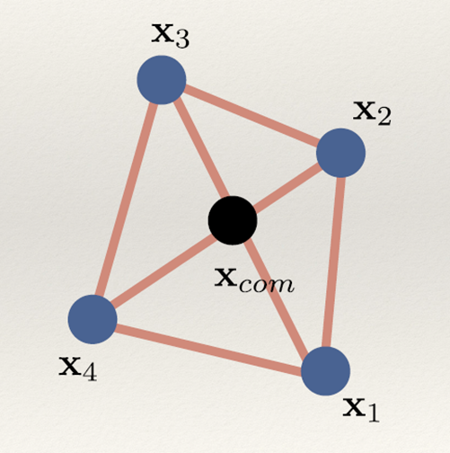

* 质点的坐标表示

	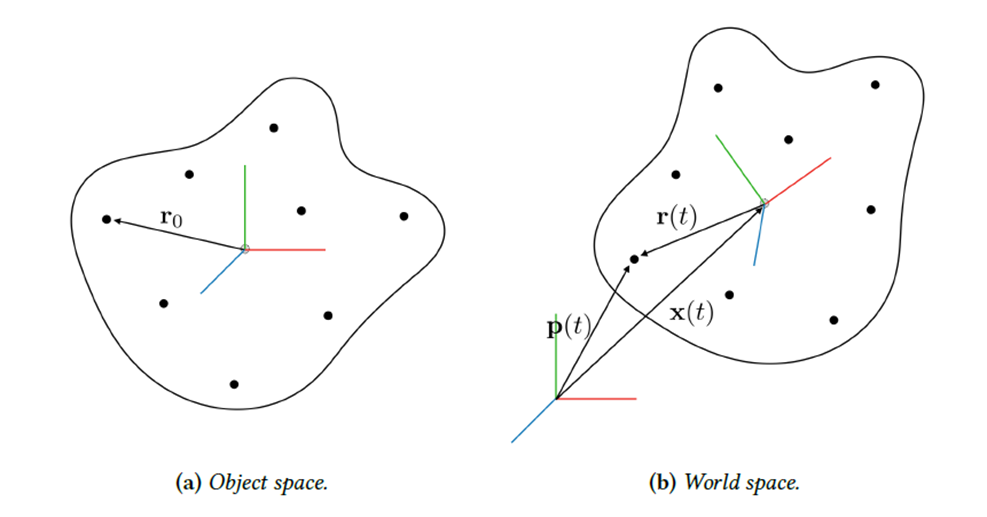

* 位移
	$$
	\pmb p(t)=\pmb x(t)+\pmb r(t)=\pmb x(t)+\pmb R(t)\pmb r_0
	$$

* 速度
	$$
	\begin{align}
	\pmb v(t)&=\dot{\pmb p}(t)=\dot{\pmb x}(t)+\dot{\pmb R}(t)\pmb r_0\\
	\dot{\pmb R}(t)\pmb r_0&=\pmb \omega(t)\times\pmb r(t)\\
	\pmb v(t)&=\dot{\pmb x}(t)+\pmb \omega(t)\times\pmb r(t)
	\end{align}
	$$
	其中$\pmb \omega(t)$为刚体角速度

* 动量
	$$
	\pmb p(t)=\pmb M\dot{\pmb x}(t)
	$$
	刚体总质量$\pmb M=\sum\limits_{i=1}^Nm_i$

* 角动量
	$$
	\begin{align}
	\pmb L(t)&=\pmb I(t)\pmb \omega(t)\\
	\pmb I(t)&=\pmb R(t)\pmb I_0\pmb R(t)^T
	\end{align}
	$$
	其中，$\pmb I(t)$为刚体的转动惯量，$\pmb I_0(t)$为初始时刻的转动惯量

* 运动方程
	$$
	\dfrac{\mathrm d}{\mathrm dt}\begin{bmatrix}\pmb x(t)\\\pmb R(t)\\\pmb P(t)\\\pmb L(t) \end{bmatrix}=\begin{bmatrix}\pmb v(t)\\\pmb\omega^*\pmb R(t)\\\pmb f(t)\\\pmb \tau(t) \end{bmatrix}
	$$
	其中，$\pmb \omega^*\in\pmb R^{3\times 3}$满足$\pmb \omega^*\pmb x=\pmb \omega\times \pmb x$，$\forall \pmb x\in\pmb R^{3}$，$\pmb \tau(t)$为外力矩

### 4.3. 弹性体仿真

#### 4.3.1. 材料的力学特性

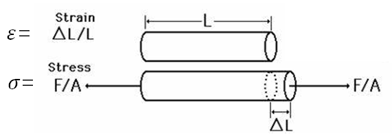

* 应力：$\sigma=F/A$

* 应变：$\varepsilon=\Delta l/l_0$

* 弹性模量：$E=\sigma/\varepsilon$

**应力**

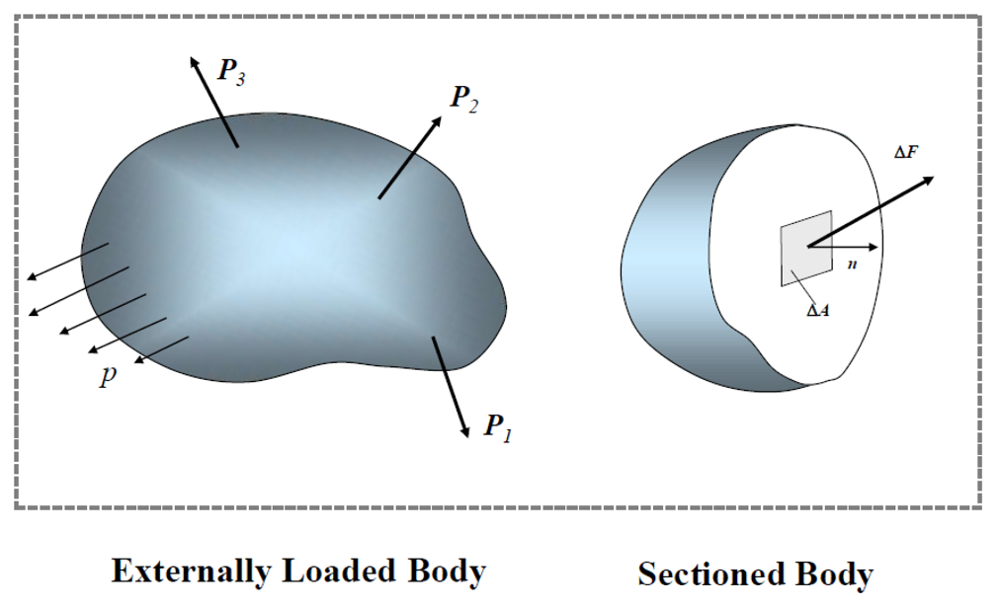
$$
\pmb T^n(\pmb x,\pmb n)=\lim\limits_{\Delta A\rightarrow 0}\dfrac{\Delta F}{\Delta A}
$$
**应力张量**

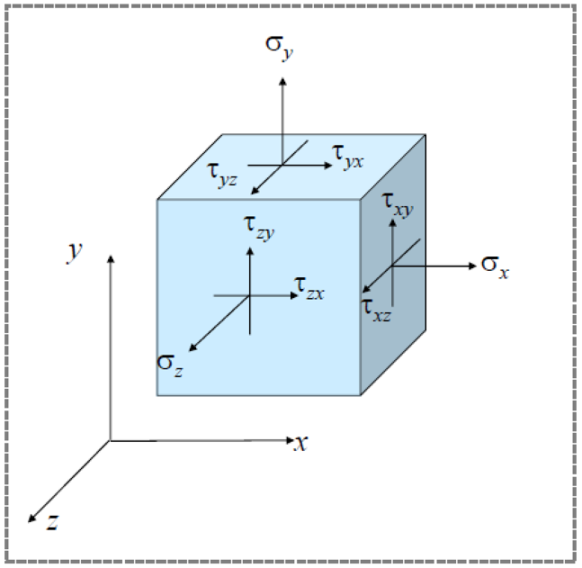
$$
\begin{align}
\pmb T^n(\pmb x,\pmb n=\pmb e_1)&=\sigma_x\pmb e_1+\tau_{xy}\pmb e_2+\tau_{xz}\pmb e_3\\
\pmb T^n(\pmb x,\pmb n=\pmb e_2)&=\tau_{yx}\pmb e_1+\sigma_{y}\pmb e_2+\tau_{yz}\pmb e_3\\
\pmb T^n(\pmb x,\pmb n=\pmb e_3)&=\tau_{zx}\pmb e_1+\tau_{zy}\pmb e_2+\sigma_{z}\pmb e_3
\end{align}
$$

$$
\pmb \sigma=[\pmb \sigma]=\begin{bmatrix}
\sigma_x&\tau_{xy}&\tau_{xz}\\
\tau_{yx}&\sigma_y&\tau_{yz}\\
\tau_{zx}&\tau_{zy}&\sigma_z
\end{bmatrix}
$$

$$
\begin{align}
\pmb T^n=\sigma\pmb n&=(\sigma_xn_x+\tau_{yx}n_y+\tau_{zx}n_z)\pmb e_1\\
&+(\tau_{xy}n_x+\sigma_yn_y+\tau_{zy}n_z)\pmb e_2\\
&+(\tau_{xz}n_x+\tau_{yz}n_y+\sigma_zn_z)\pmb e_3
\end{align}
$$

**平衡方程**

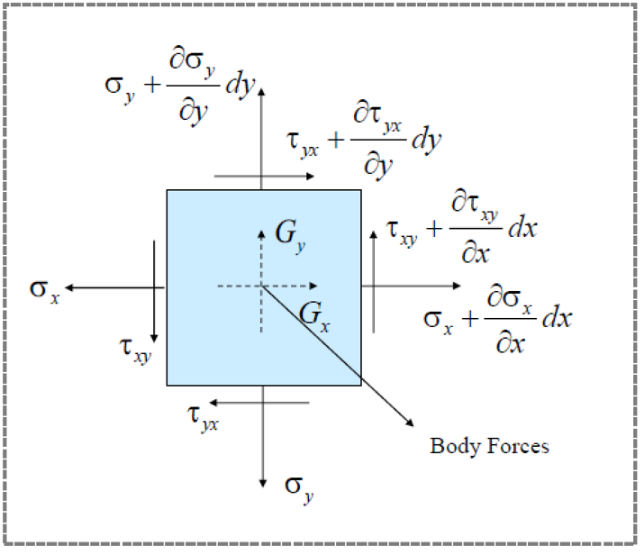
$$
\begin{align}
\rho\dfrac{\mathrm dv_x}{\mathrm dt}&=\sum F_x=\dfrac{\part \sigma_x}{\part x}+\dfrac{\part \tau_{yx}}{\part y}+G_x\\
\rho\dfrac{\mathrm dv_y}{\mathrm dt}&=\sum F_y=\dfrac{\part \tau_{xy}}{\part x}+\dfrac{\part \sigma_{y}}{\part y}+G_y\\
&\Downarrow\\
\rho\dfrac{\mathrm d\pmb v}{\mathrm dt}&=\nabla\cdot\pmb \sigma+\pmb g
\end{align}
$$
**本构方程**

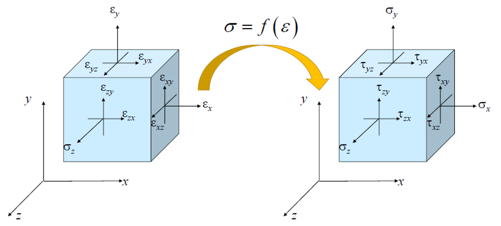

**塑性材料**

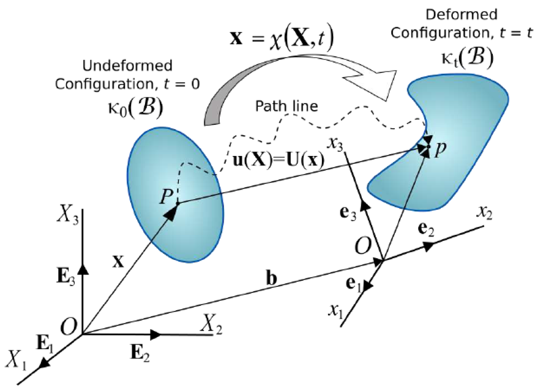

变形梯度：
$$
\pmb F=\dfrac{\part \pmb x}{\part\pmb X}
$$

#### 4.3.2. 有限元方法

**空间离散**：有限单元

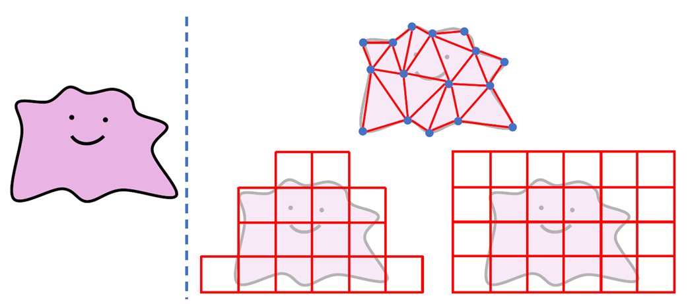

**变形的分类**：

* 线变形：线元的伸长和缩短
* 角变形：成角度的线元之间夹角的改变

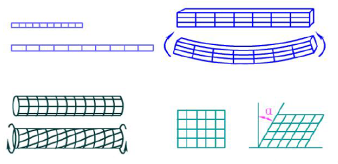

通过分析物体任意两点之间距离的变化分析形变

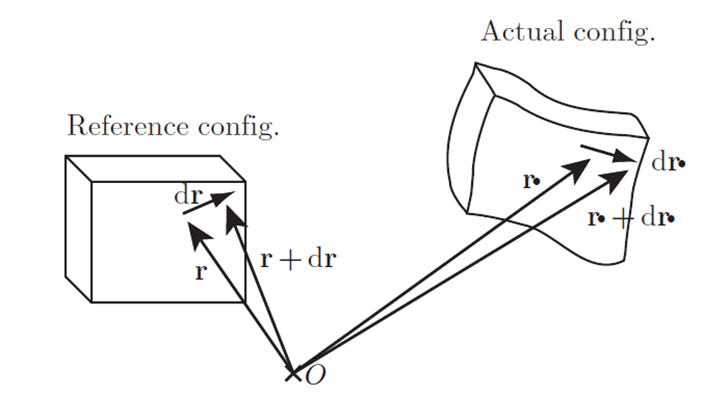

设$\{\pmb e_1,\pmb e_2,\pmb e_3\}$为参考构型中选取的坐标架
$$
\begin{align}
(\mathrm d\pmb r')^2-(\mathrm d\pmb r)^2&=(\mathrm d[x_i+u_i(x_j)]\pmb e_i)^2-(\mathrm dx_i\pmb e_i)^2\\
&=\Big(\Big[\mathrm dx_i+\dfrac{\part u_i}{\part x_j}\mathrm dx_j\Big]\pmb e_j \Big)^2-(\mathrm dx_i\pmb e_i)^2\\
&=\Big(\Big[\delta_{ij}+\dfrac{\part u_i}{\part x_j}+\dfrac{\part u_j}{\part x_i}+\dfrac{\part u_k}{\part x_i}\dfrac{\part u_k}{\part x_j} \Big]-\delta_{ij}\Big)\mathrm dx_i\mathrm dx_j\\
&=\Big( \dfrac{\part u_i}{\part x_j}+\dfrac{\part u_j}{\part x_i}+\dfrac{\part u_k}{\part x_i}\dfrac{\part u_k}{\part x_j}\Big)\mathrm dx_i\mathrm dx_j
\end{align}
$$
Green-Lagrange应变张量：
$$
(\mathrm dr')^2-(\mathrm dr)^2=2\epsilon_{ij}(r)\mathrm dx_i\mathrm dx_j\\
\epsilon=\dfrac{1}{2}(\nabla_xu+(\nabla_xu)^T+(\nabla_xu)^T\nabla_xu)
$$
形变梯度$\pmb F=\dfrac{\part \pmb x'}{\part \pmb x}$，则$\nabla_x u=\pmb F-\pmb I$
$$
\epsilon=\dfrac{1}{2}(\pmb F^T\pmb F-\pmb I)
$$
Cauchy应变张量：舍弃Green-Lagrange应变张量中二次项
$$
\begin{align}
\epsilon&=\dfrac{1}{2}(\nabla_xu+(\nabla_xu)^T)\\
\epsilon&=\dfrac{1}{2}(\pmb F^T+\pmb F)-\pmb I
\end{align}
$$
Co-rotated:
$$
\epsilon=\dfrac{1}{2}(\pmb S^T+\pmb S)-\pmb I
$$
其中，$\pmb F=\pmb {RS}$极分解

**线性弹性模型**

应力（广义胡克模型）：
$$
\pmb \sigma=\pmb {C\epsilon}
$$
其中，$\pmb C$为弹性张量（四阶张量），$\pmb \sigma$为应力，$\pmb \varepsilon$为应变

各向同性材料：
$$
\pmb \sigma=\lambda \mathrm {tr}(\pmb\epsilon)\pmb I+2\mu\pmb\epsilon
$$
$\mu$和$\lambda$为拉梅常数，与材料有关

对杨氏模量为$E$，泊松比为$v$的材料：
$$
\begin{matrix}
\mu=\dfrac{E}{2(1+v)}&\lambda=\dfrac{Ev}{(1-2v)(1+v)}
\end{matrix}
$$
势能：
$$
\eta=\dfrac{1}{2}\sigma_{ij}\epsilon_{ij}=\dfrac{1}{2}\pmb \sigma:\pmb\epsilon=\dfrac{1}{2}\sum\limits_{i,j}\sigma_{i,j}\epsilon_{ij}
$$
力的计算：
$$
f_i=-\dfrac{\part \eta}{\part x_i}
$$
**超弹性模型**

形变函数：$\pmb \phi:\pmb X\rightarrow x$
$$
\begin{matrix}
\pmb X=(X_1,X_2,X_3)^T&\pmb x=(\phi_1(\pmb X),\phi_2(\pmb X),\phi_3(\pmb X))^T
\end{matrix}
$$
形变梯度张量：
$$
\pmb F:=\dfrac{\part(\phi_1,\phi_2,\phi_3)}{\part(X_1,X_2,X_3)}=\Big(\dfrac{\part \phi_i}{\part x_j}\Big)_{i,j}
$$
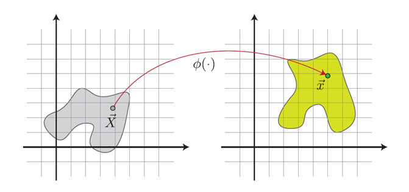

超弹性材料能量：
$$
E=\int\sigma_{ij}\varepsilon_{ij}\mathrm dX\\
E[\pmb \phi]=\int\psi[\pmb \phi;\pmb X]\mathrm d\pmb X\\
\begin{align}
\pmb \phi(\pmb X)\approx&\pmb \phi(\pmb X_*)+\dfrac{\part\pmb \phi}{\part\pmb X}(\pmb X_*)(\pmb X-\pmb X_*)\\
=&\pmb x_*+\pmb F(\pmb X_*)(\pmb X-\pmb X_*)\\
=&\pmb F_*\pmb X+\pmb t
\end{align}
$$
能量密度：
$$
\psi[\pmb \phi;\pmb X]=\psi(\pmb F(\pmb X))
$$

不同能量：

* 物体会被压缩成一个点

$$
\psi(\pmb F)=\dfrac{k}{2}\|\pmb F\|_F^2
$$

* 物体倾向于平行移动
	$$
	\psi(\pmb F)=\dfrac{k}{2}\|\pmb F-\pmb I\|_F^2
	$$

Neo-Hooken模型：
$$
\psi(\pmb F)=\dfrac{\mu}{2}(I_1-3)-\mu\log(J)+\dfrac{\lambda}{2}\log^2(J)
$$
其中，$I_1=\mathrm{tr}(\pmb F^T\pmb F)$，$J=\det(\pmb F)$，$\mu$和$\lambda$为拉梅常数

对于杨氏模量为$E$，泊松比为$v$的材料：
$$
\begin{matrix}
\mu=\dfrac{E}{2(1+v)}&\lambda=\dfrac{Ev}{(1-2v)(1+v)}
\end{matrix}
$$
**离散计算**

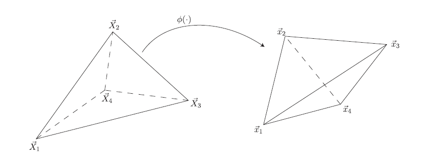

将模型离散为四面体单元$\{\mathcal J_i\}$，设形变函数为分片线性函数，且在每个四面体单元上是线性的，由形变梯度定义：
$$
\pmb x=\pmb \phi(\pmb X)=\pmb {FX}+\pmb b,\mathrm {for}\ \pmb X\in \mathcal J_i
$$
在一个四面体单元（顶点$X_1$，$X_2$，$X_3$，$X_4$）中：

由$\pmb x_i=\pmb \phi(\pmb X_i)$
$$
\begin{align}
\begin{cases}
x_1=FX_1+b\\
x_2=FX_2+b\\
x_3=FX_3+b\\
x_4=FX_4+b
\end{cases}
\Rightarrow
\begin{cases}
x_1-x_4=F(X_1-X_4)\\
x_2-x_4=F(X_2-X_4)\\
x_3-x_4=F(X_3-X_4)
\end{cases}
\end{align}
$$
令
$$
\begin{matrix}
d=\begin{bmatrix}
x_1-x_4&x_2-x_4&x_3-x_4\\
y_1-y_4&y_2-y_4&y_3-y_4\\
z_1-z_4&z_2-z_4&z_3-z_4\\
\end{bmatrix}
&
D=\begin{bmatrix}
X_1-X_4&X_2-X_4&X_3-X_4\\
Y_1-Y_4&Y_2-Y_4&Y_3-Y_4\\
Z_1-Z_4&Z_2-Z_4&Z_3-Z_4\\
\end{bmatrix}
\end{matrix}
$$
则$F=dD^{-1}$

总能量：$E(x)=\sum V_i\psi(\pmb F_i)$，其中$V_i$为四面体体积

力的计算：
$$
\pmb f_i=-\dfrac{\part E(\pmb x)}{\part \pmb x_i}
$$
**欧拉隐式方法**

求解$g(\pmb x)=\dfrac{1}{2}(\pmb x-\pmb y)^T\pmb M(\pmb x-\pmb y)+h^2E(\pmb x)$的最小值

牛顿法求解方程
$$
\nabla g(\pmb x)=\pmb M(\pmb x-\pmb y)+h^2\nabla E(\pmb x)=0\\
\nabla^2 g=\pmb M+h^2\nabla^2E
$$
迭代步骤：
$$
\pmb x^{k+1}=\pmb x^k-(\nabla^2g)^{-1}\nabla g
$$
速度更新：
$$
\pmb v_{n+1}=\dfrac{\pmb x_{n+1}-\pmb x_n}{h}
$$
**模拟的改进**

* 利用恰当的方法去逼近优化函数的Hessian矩阵，加快优化速度:
* 显式方法：系统能量增加使得方法不稳定；力的传播需要时间
* 隐式方法：系统能量耗散；方法稳定
* 改进优化方法使得系统能量守恒
* 通过离散的粗化加快模拟

### 4.4. 流体仿真

#### 4.4.1. 流体的力学特性

**流体**
$$
\pmb\sigma=-p\pmb I+\mu(\nabla\pmb v+\nabla\pmb v^T)
$$
其中，$p$为静水压力，$\pmb I$为单位矩阵，$\mu$为黏度系数，$\nabla\pmb v=\begin{bmatrix}\dfrac{\part v_x}{\part x}&\dfrac{\part v_x}{\part y}&\dfrac{\part v_x}{\part z}\\\dfrac{\part v_y}{\part x}&\dfrac{\part v_y}{\part y}&\dfrac{\part v_y}{\part z}\\\dfrac{\part v_z}{\part x}&\dfrac{\part v_z}{\part y}&\dfrac{\part v_z}{\part z}\end{bmatrix}$

**Navier-Stokes方程**
$$
\rho(\pmb u_t+\pmb u\cdot\nabla\pmb u)=-\nabla p+\mu\Delta\pmb u+\pmb f\\
\nabla\cdot\pmb u=0
$$

* 质量：$\rho$
* 加速度：$\pmb u_t+\pmb u\cdot\nabla\pmb u$
* 内力：$-\nabla p$
* 阻尼：$\mu\Delta \pmb u$
* 外力：$\pmb f$

**拉格朗日视角 vs 欧拉视角**

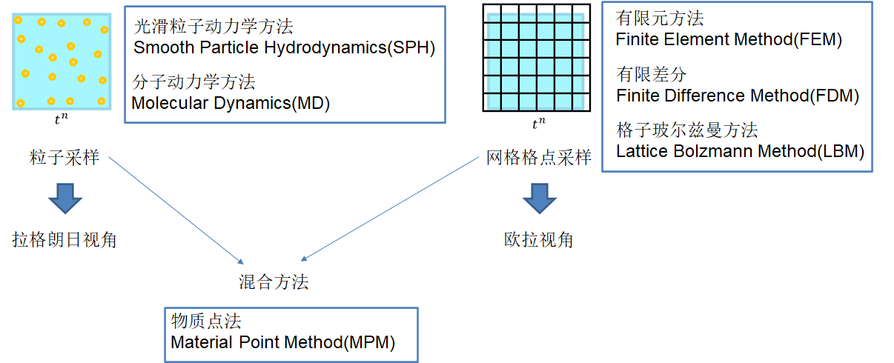


## 5. 渲染

### 5.1. 渲染简介

**主要阶段**

* 几何阶段
	* 将3D模型投影变换到图像平面
	* 决定可见的图元（图形元素）
* 光栅阶段
	* 决定可见的片元 (fragment)
	* 决定片元的颜色成为彩色像素

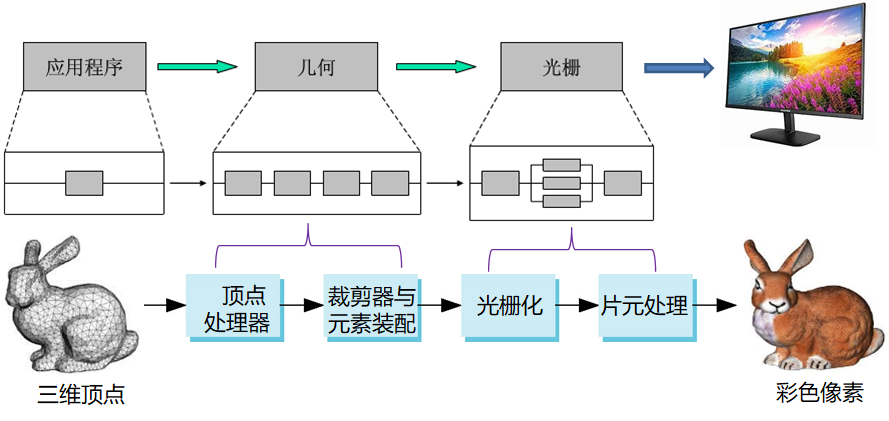

**基本图元**

* 2D
	* 点、线
* 3D
	* 点、线、三角形

### 5.2. 渲染流水线的过程

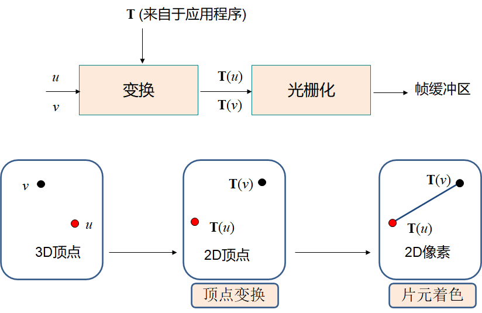

* 逐顶点计算
	* 视点变换，法向量变换，纹理坐标，光照计算
* 图元装配
	* 背面剔除，投影变换，裁剪，透视除法，视口变换

* 光栅化
	* 插值顶点属性：颜色，深度值，纹理坐标

* 片元操作
	* 纹理生成，雾化
* 光栅操作
	* 融合，反走样，Alpha测试，深度测试

#### 5.2.1. 几何变换逐顶点计算屏幕坐标

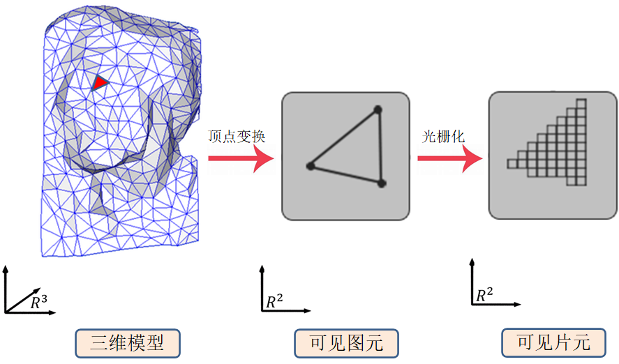

**成像模型：**

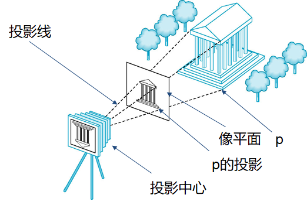

3D场景在虚拟相机下的投影

应用程序指定：

* 3D模型
* 相机参数：位置、朝向、焦距、视角

各种坐标系：

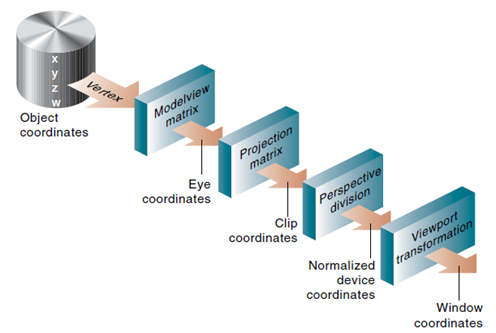

* 对象坐标系或建模坐标系
* 世界坐标系
* 视点坐标系或照相机坐标系
* 裁剪坐标系
* 规范化的设备坐标系
* 窗口坐标系或屏幕坐标系

**顶点处理：**

流水线中大部分工作是把对象在一个坐标系中表示转化为另一坐标系中的表示：

* 世界坐标系

* 照相机(眼睛)坐标系

* 屏幕坐标系

坐标的每个变换相当于一次矩阵乘法

* 最终的顶点变换为多个矩阵的乘法：MVP

* 窗口变换

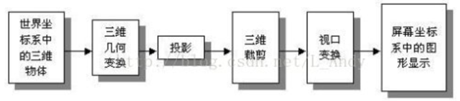

**模型及视图变换：**


**投影变换：**

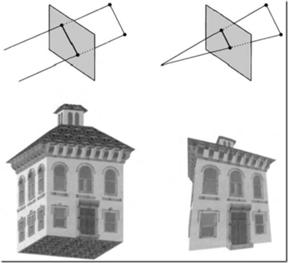

**裁剪**：视景图裁剪（超出可视范围的几何元素需裁剪掉，不参加后面的计算）

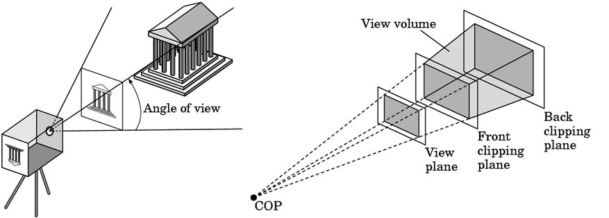

**裁剪**：窗口裁剪

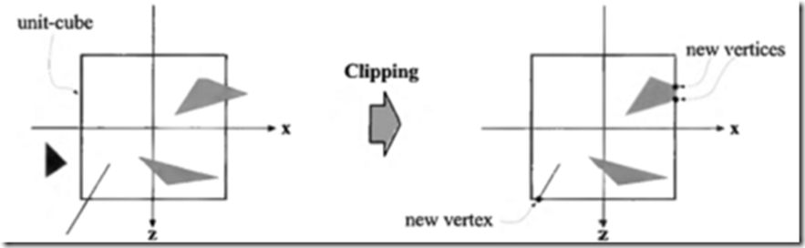

**消隐**：消除隐藏面

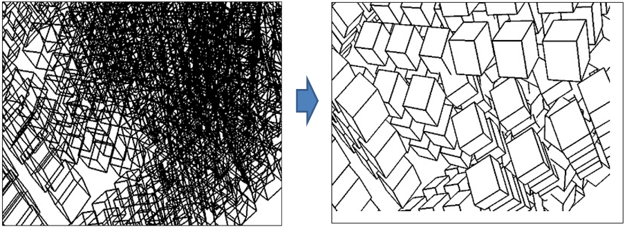

**屏幕映射变换**

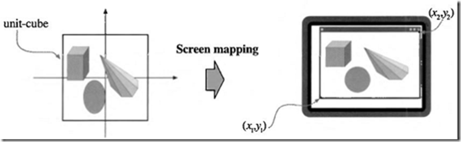

**光栅化**

* 如果一个对象不被裁掉，那么在帧缓冲区中相应的像素就必须被赋予颜色

* 光栅化程序为每个对象生成一组片段

* 片段是“潜在的像素”

	* 在帧缓冲区中有一个位置

	* 具有颜色和深度属性

* 光栅化程序在对象上对顶点属性进行插值（重心坐标）

#### 5.2.2. 像素着色逐片元计算颜色

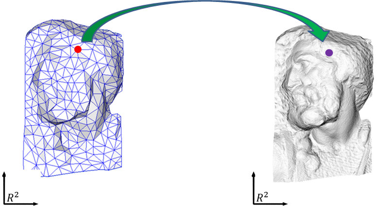

**光照模型**

* 局部光照模型
	* 简单、经验性
* 全局光照模型
	* 复杂的、物理的

**局部光照模型**

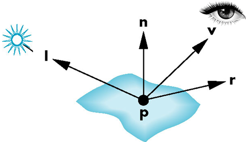

三个主要部分：

* 环境光Ambient
* 漫反射Diffuse
* 镜面反射Specular

$$
I=k_aI_a+k_dI_d\pmb I\cdot \pmb n+k_sI_s(\pmb v\cdot\pmb r)^\alpha
$$

漫反射：

* 模拟粗糙的表面：光向各个方向均匀地反射
* 反射光的比例正比与入射光的竖直分量
	* 反射光$\sim \cos\theta_I$
	* $I_d=k_dI_l\cos\theta_i$

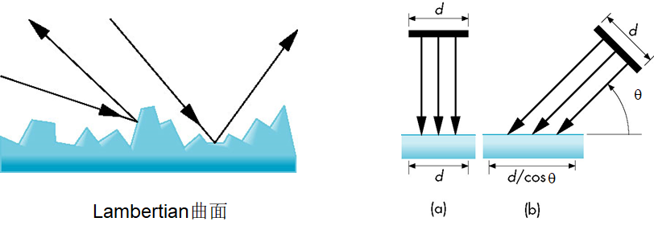

镜面反射：


* 模拟在镜面反射方向附近的聚集光现象

	* $\pmb n$：法向量
	* $\pmb I$：入射光方向
	* $\pmb r$：反射方向
	* $\pmb v$：视点方向
	* $\pmb \phi$：$\pmb r$与$\pmb v$的夹角

	$$
	I_r=k_sI\cos^\alpha\phi
	$$

	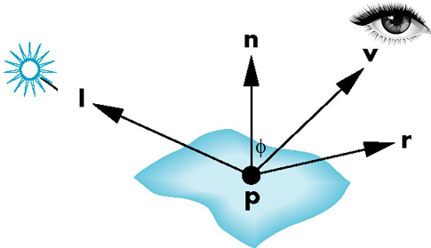

* 高光系数$\alpha$：
	* 如果$\alpha$的值介于100到200之间，那么对应于金属材料
	* 如果$\alpha$的值介于5到10之间，材料类似于塑料

* 镜面反射的Blinn-Phong修正计算

	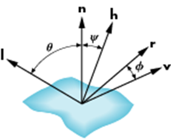

	* Blinn利用中分向量给出了一个近似算法，减少计算量、提高计算效率

	* $\pmb h$是$\pmb I$和$\pmb v$的平分单位向量，即
		$$
		\pmb h=\dfrac{\pmb I+\pmb v}{|\pmb I+\pmb v|}
		$$

	* 用$(\pmb n\cdot\pmb h)^\beta$代替$(\pmb v\cdot\pmb r)^\alpha$

		* 参数$\beta$恰当选取，以匹配高光度

环境光：

* 背景光：模拟多次反射后的效果的近似
	* 让场景光照不到的地方看起来不是全黑
	* 每个地方都具有相同的强度
* 环境光强$I_a=[I_{ar},I_{ag},I_{ab}]$为常值

光源与材质属性

* 三原色中每种分量单独处理
	* 九个系数 $k_{dr}, k_{dg}, k_{db}, k_{sr}, k_{sg}, k_{sb}, k_{ar}, k_{ag}, k_{ab}$

* 材质
	* 高光系数$\alpha$

* 多个光源
	* 每个光源的结果叠加在一起

着色结果

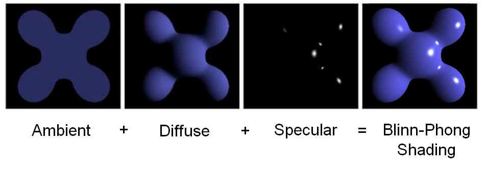

**顶点的着色**

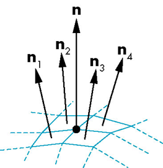

* 顶点的法向
	* 由原始数据给出
	* 由相邻面的法向（加权）平均得到
	* 其他估计方法

**片元的着色**

由顶点处的信息插值得到

1. Flat Shading（Shade each triangle）

	* 每个三角形中的像素的法向都一样（三角形的法向）
	* 相当于：视点在无穷远，光源在无穷远
		* 视点方向$\pmb v$和入射方向$\pmb l$都是常量

	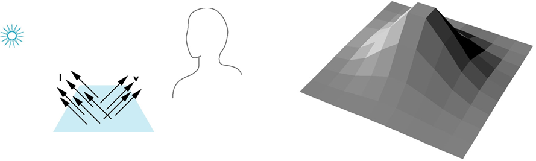

2. Gouraud Shading（Shade each vertex）
	* 由3个顶点的颜色插值得到像素的颜色
	* OpenGL 提供的方法

3. Phong Shading（Shader each pixel）
	
	* 根据每个顶点的法向，插值出三角形内部各点的法向，然后基于光照模型计算出各点的颜色

不同着色方法的比较：

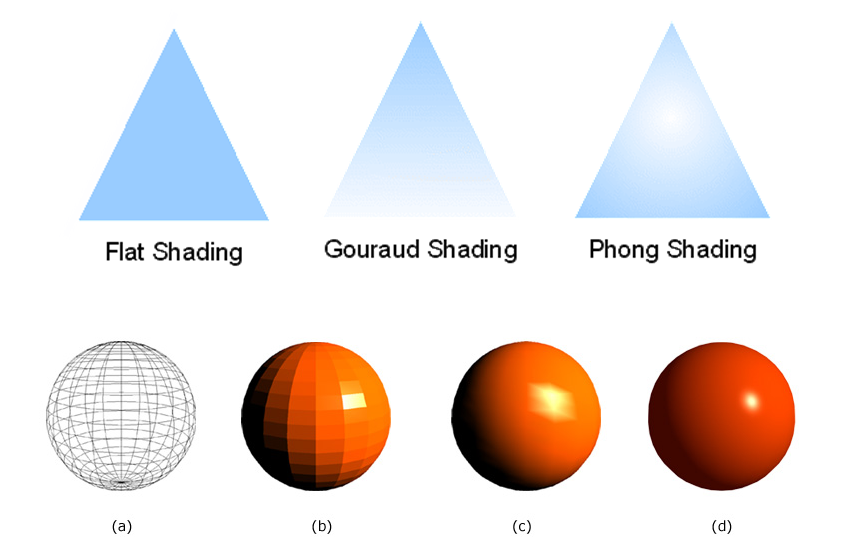

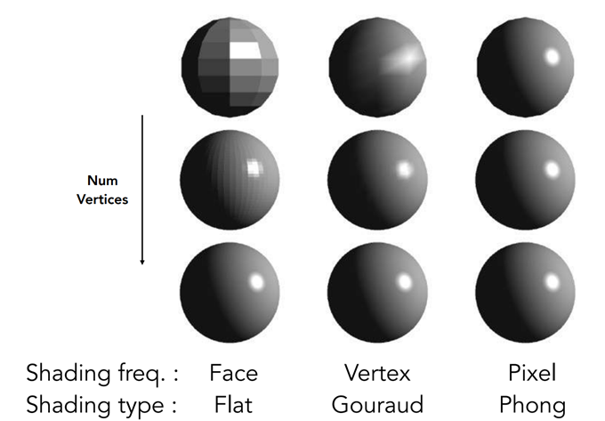

**更复杂的光照模型**

* 折射（透明体、水等）
* 多次反射
* 焦散
* 环境映射
* …

**说明**

* 对于顶点的着色在几何处理流程中就做好了，顶点的颜色作为顶点的属性传入到片元处理流程中使用
* 片元处理流程还可使用其他顶点属性
	* 法向
	* 深度
	* 纹理坐标
	* …

#### 5.2.3.图形渲染API

**常用的图形渲染API**

* OpenGL：开放的接口，跨平台
* DirectX3D：Microsoft, Windows操作系统支持较好，更新快
* Vulkan: next generation of OpenGL

**固定（不可编程）渲染管线**

* 按照API提供的接口函数逐步操作、处理每个对象
* 优点：对初级用户使用方便
* 缺点：渲染效果一般，无法进行高级渲染
* 流水线体系

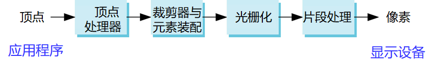

**可编程渲染管线**

* 固定管线：固定的处理模式（如Phong光照模型），至多有些参数可调，不够灵活

* 可编程管线
	* Vertex processor、 fragment processor： programmable

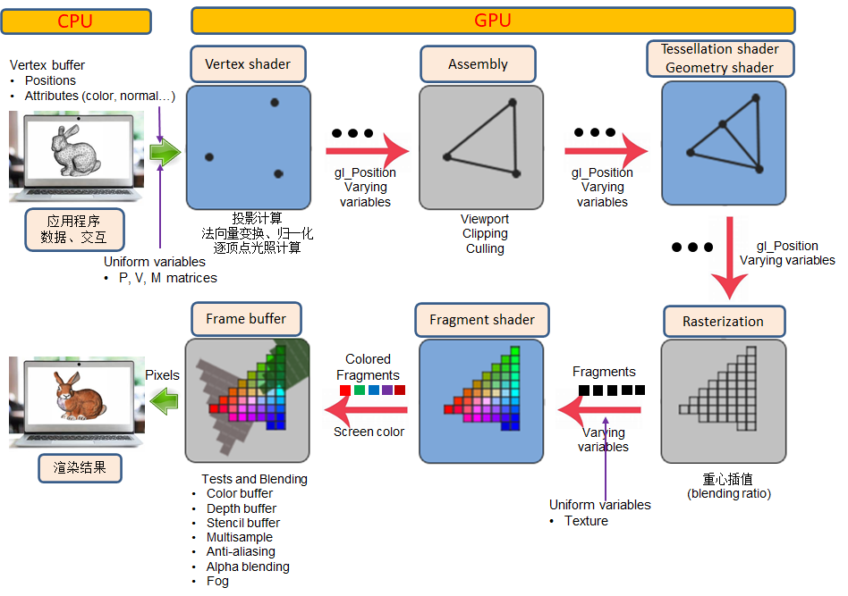

### 5.3. OpenGL

#### 5.3.1. OpenGL简介

**OpenGL的发展**

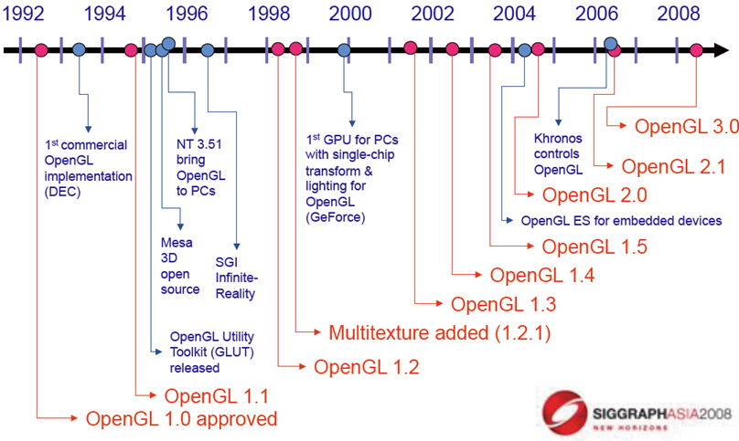

**OpenGL 3.1**

* 完全基于shader
	* 没有缺省的shader
	* 每个应用程序必须提供一个vertex shader和一个fragment shader
* 取消立即模式
* 减少状态变量
* 非向后兼容

**OpenGL ES**

* 嵌入式系统
* Version 1.0（简化的 OpenGL 2.1版本）
* Version 2.0 （简化的 OpenGL 3.1）
	* Shader based

**WebGL**

* OpenGL ES 2.0的Javascript实现
* 新的网络浏览器支持

**OpenGL 4.1 and 4.2**

* 新增了geometry shaders 和 tessellator

#### 5.3.2. Direct3D vs OpenGL

**OpenGL**

* 跨平台的开放式标准API
	* 可扩展机制
* 可硬件加速的3D渲染系统
	* 底层实现（驱动）管理硬件

* 专业图形应用、科研
	* 跨平台，可移植
* 适合图形学教学

**Direct 3D**

* Windows平台的专利API
	* 一致性好
* 3D硬件接口
	* 应用程序管理硬件资源
* 计算机游戏
	* 高性能硬件存取能力

* 非向下兼容

#### 5.3.3. OpenGL库

**OpenGL核心库**

* Windows: OpenGL32.dll (WINDOWS\SYSTEM32)
	* Windows XP支持OpenGL 1.1，Vista支持1.4
	* Direct3D的封装，需安装驱动来实现硬件加速

* 大多数Unix/Linux系统：GL库 (libGL.a)

**OpenGL实用库**

* OpenGL的一部分
	* Windows: glu32.dll
* 利用OpenGL核心库提供一些功能，避免重复编写代码
	* 二次曲面、NURBS、多边形网格化等

**与窗口系统的连接**

* X Window系统：GLX
* Windows: WGL
* Macintosh: AGL
* 粘合OpenGL和窗口系统

**GLUT**

* OpenGL实用工具库（OpenGL Utility Toolkit Library, GLUT）
	* 提供所有窗口系统的共同功能
		* 创建窗口
		* 从鼠标和键盘获取输入
		* 菜单
		* 事件驱动
* 代码可以在平台间移植，但是GLUT缺乏一些现代GUI的控件和功能
	* 无滚动条
	* 可用FLTK、SDL

**GLFW**

* 在Windows操作系统下，若要使用最新版本的OpenGL功能
	* 查看图形卡支持的OpenGL版本
	* 使用GLEW库（OpenGL Extension Wrangler Library）（还有其它库GLee，GL3W等）

* 目的：对于特殊的操作系统，使得调用OpenGL 扩展功能更简单
* 对于Windows代码来说，避免直接调用实体入口（entry points）
* 应用程序需要：增加 glew.h头文件，调用 glewInit()即可

#### 5.3.4. OpenGL应用程序简介

**OpenGL应用程序结构**

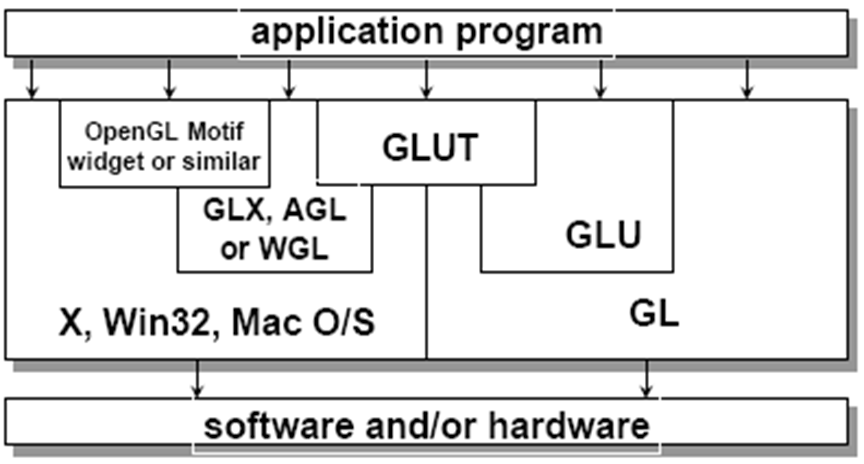

**OpenGL流水线架构**

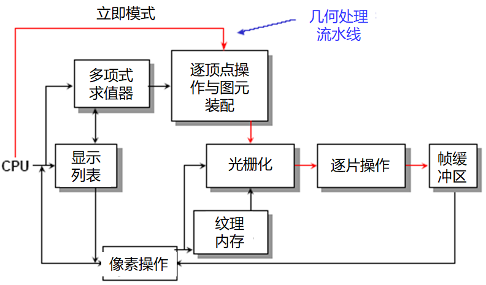

**OpenGL的函数**

* 图元函数（primitive）
	* 点
	* 线段
	* 多边形
* 属性函数（attribute） 
* 变换函数（transformation）
	* 视图函数（viewing）
	* 建模函数（modeling）
* 输入函数（input） GLUT
* 控制函数（control） GLUT
* 查询函数（query）

**OpenGL的状态机模型**

* OpenGL使用状态机模型

* OpenGL 函数有两大类型
	* 生成图元（图元函数，如glVertex）
		* 如果图元可见，则被输出
		* 顶点如何被处理，图元的外观由状态控制
	* 改变状态
		* 变换函数
		* 属性函数
		* 在3.1以下版本，大多数变量由应用程序定义并发送至shaders

**程序依赖**

* 头文件

	```c++
	#include <GL/gl.h>
	#include <GL/glu.h>
	#include <GL/glut.h>
	```

* 库文件

	* 编译系统库文件目录`\opengl32.lib glu32.lib glut32.lib`
	* `C:\windows\system32\opengl32.dll glu32.dll glut32.dll`

* 数据类型

	* 为了兼容性，OpenGL定义了各种数据类型(#define)
		* `GLfloat`, `GLint`, `GLenum`, etc.

**OpenGL变量命名准则**

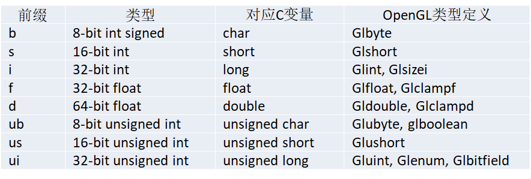

**OpenGL函数名称格式**

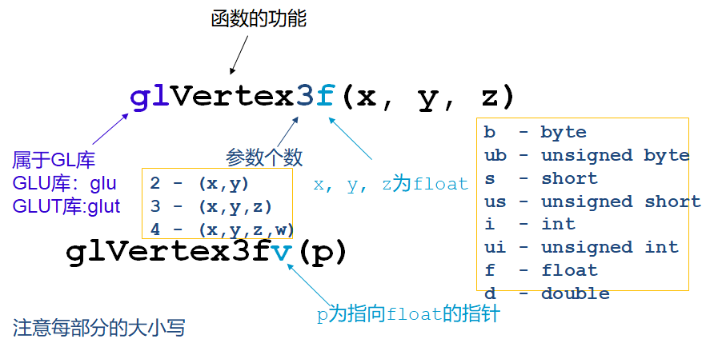

**OpenGL程序的一般结构**

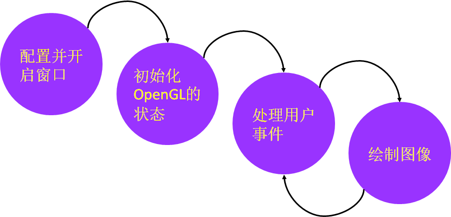

**简单示例**

```c++
#include <GL/glut.h>
void mydisplay()
{
	glClear(GL_COLOR_BUFFER_BIT);
	glBegin(GL_POLYGON);
		glVertex2d(-0.5, -0.5);
		glVertex2d(-0.5, 0.5);
		glVertex2d(0.5, 0.5);
		glVertex2d(0.5, -0.5);
	glEnd();
	glFlush();
}
int main(int argc, char* argv[]) 
{
	glutInit(&argc, argv);
	glutCreateWindow("简单示例");
	glutDisplayFunc(mydisplay);
	glutMainLoop();
}
```

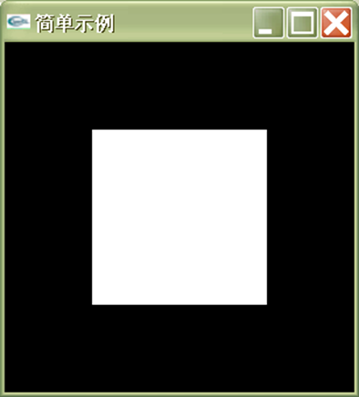

**OpenGL中的摄像机**

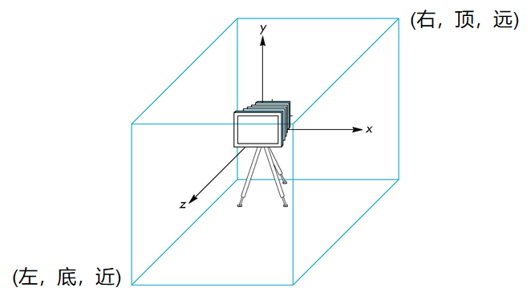

* 照相机被放置在对象坐标系的原点，指向*z*轴的负方向
* 默认的视景体是一个中心在原点，边长为2的立方体

**变换与视图**

* 在默认的正交视图中，点沿着z轴投影到z=0的平面上

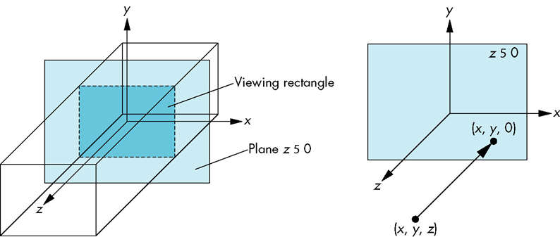

* 在OpenGL中投影是利用投影矩阵乘法（变换）进行的

* 因为OpenGL是一个状态机，拥有模型视点（modelview ）矩阵栈和投影（projection） 矩阵栈，因此须先设置矩阵模式

	```c++
	glMatrixMode(GL_PROJECTION);
	```

* 变换函数是累加在一起的，因此需要从单位阵开始，然后把它改变为一个投影矩阵以定义视景体

	```c++
	glLoadIdentity();
	glOrtho(-1.0, 1.0, -1.0, 1.0, -1.0, 1.0);
	```

**视窗**

* 并不需要把整个当前窗口用来显示图像：`glViewport(x,y,w,h)`
* 参数值以像素为单位（屏幕坐标）

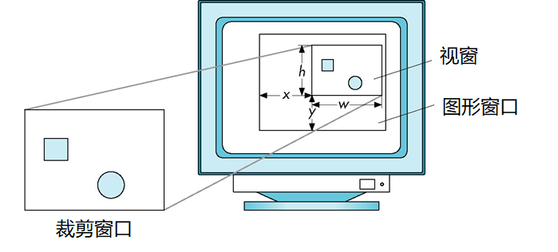

**OpenGL的基本几何形状**

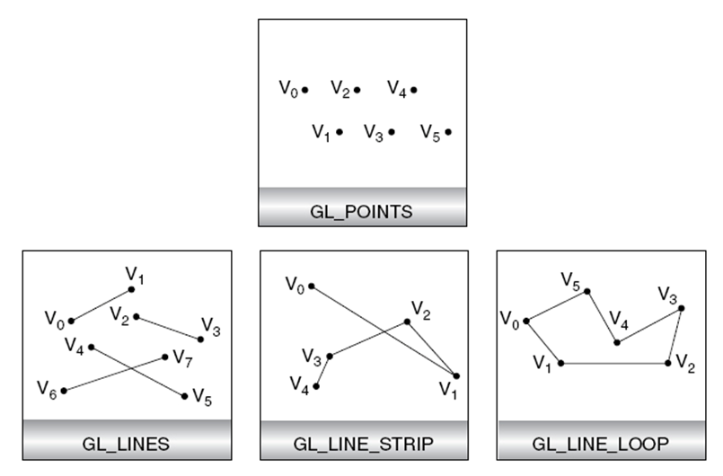

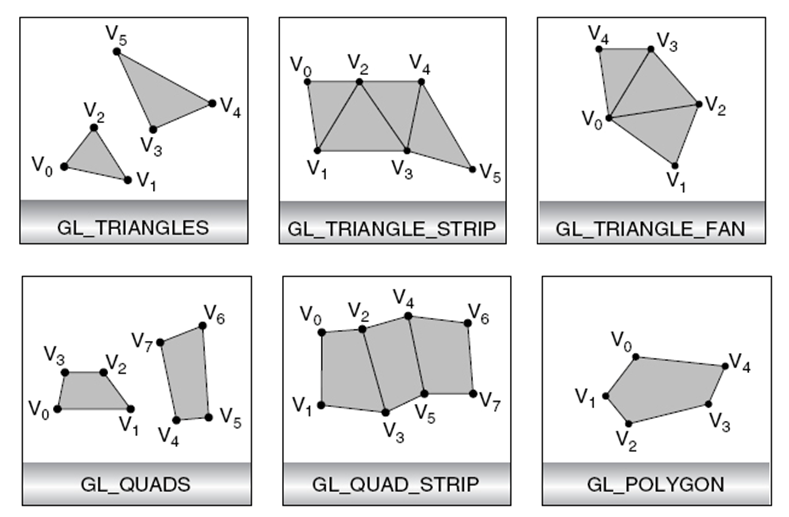

**定义多边形的限制条件**

* OpenGL只能显示满足下述条件的多边形
	* 简单多边形：边除顶点外不相交
	* 凸多边形：对于多边形中任意两点，连接这两点的线段完全在多边形内
	* 平面多边形：所有顶点在同一平面上

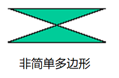

* 用户自己确保上述条件满足
	* 如果不满足上述要求，OpenGL也会有输出，只是结果看起来与期望的不同
	* 三角形自动满足上述所有限制条件，因此尽量应使用三角形网格

**属性**

* 属性是OpenGL中状态的一部分，确定对象的外观
	* 颜色（点、线、多边形）
	* 点的大小
	* 线段的宽度与实虚模式
* 多边形的模式
	* 前后面
	* 填充模式：颜色或模式
	* 显示为实心多边形或者只显示边界

**RGB颜色**

* 颜色的每个分量在帧缓冲区中是分开存贮的
* 在缓冲区中通常每个分量占用8位字节
* 注意在函数`glColor3f`中颜色值的变化范围是从0.0（无）到1.0（全部）, 而在`glColor3ub`中颜色值的变化范围是从0到255

* 由`glColor`设置的颜色成为状态的一部分，后续构造过程将使用这一颜色，直至它被修改为止
	* 颜色与其它属性不是对象的一部分，但是在渲染对象时要把这些属性赋给对象

颜色的光滑化过渡：

* 默认状态是光滑过渡
	* OpenGL根据多边形顶点的颜色插值出来内部的颜色
* 另外一种状态是平坦过渡
	* 第一个顶点的颜色确定填充颜色
* `glShadeModel(GL_SMOOTH)`或`glShadeModel(GL_FLAT)`

**Z缓冲隐藏面消除**

* 该算法创建专门的缓冲区（称为z缓冲区），当几何体经过流水线各步骤时，存贮着该几何体的深度信息
* 启用该算法的要素
	* 在main()中，显示模式初始化语句改为
		` glutInitDisplayMode(GLUT_SINGLE|GLUT_RGB|GLUT_DEPTH);`
	* 在init()中激活Z-Buffer隐藏面消除算法
		 `glEnable(GL_DEPTH_TEST);`
	* 在显示回调函数中清空深度缓冲区
		` glClear(GL_COLOR_BUFFER_BIT|GL_DEPTH_BUFFER_BIT);`

### 5.4. 明暗（着色）处理

#### 5.4.1. 基本算法

**多边形网格模型**

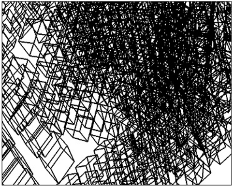

**隐藏面消除**

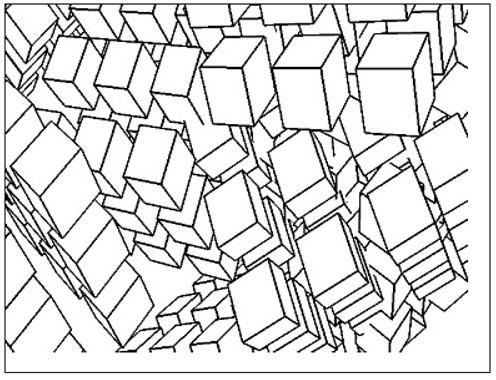

**光滑明暗处理**

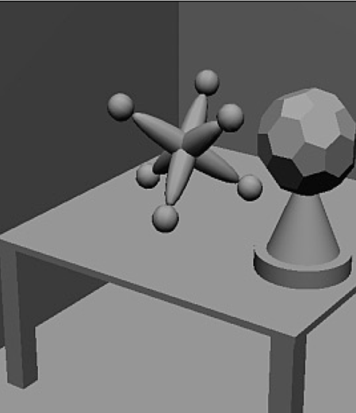

在计算了每个顶点处的亮度后，应用线性插值计算出内部的亮度——称为Gouraud明暗处理算法

**镜面光**

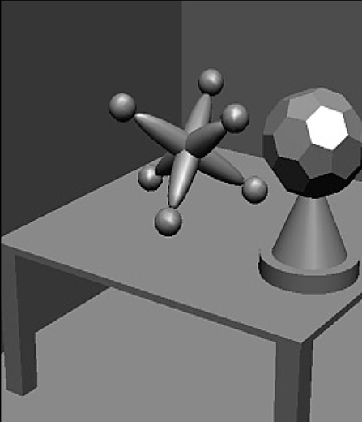

**阴影**

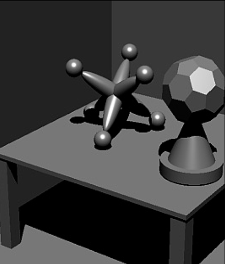

**纹理映射**

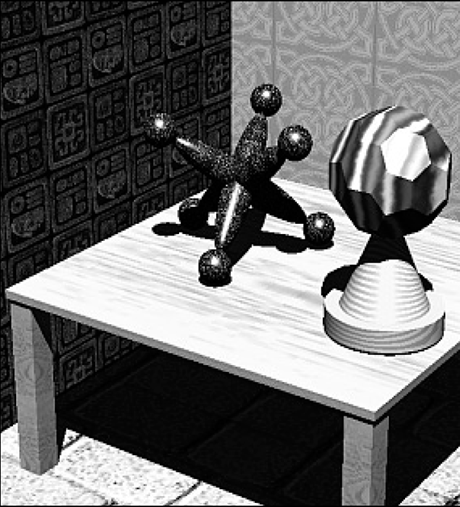

#### 5.4.2. 光源

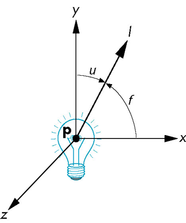

**光源的描述**

* 光线从光源表面离开的方式有两种
	* 自发射
	* 反射

* 在表面上任一点$(x,y,z)$所发出的光可以用$\theta$，$\phi$两个方位角表示以及每个波长$\lambda$的强度确定
	* 光照函数有六个变量

* 一般的光源是很难处理的，因为我们需要对于在光源面上的所有点进行光强积分
* 光源颜色：光亮度函数$\pmb I=[I_r,I_g,I_b]$

**点光源**

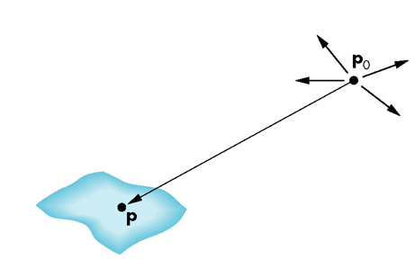

* 由位置和颜色表示

* 理想的点光源向各个方向发射光

* 远光源即在无穷远处的光源，光线为平行线

* 点光源的亮度函数$\pmb I(\pmb p_0) = [I_r(\pmb p_0), I_g(\pmb p_0),I_b(\pmb p_0)]$

* 在点$p$接受的光亮度反比于光源与点的距离
  $$
  i(\pmb p,\pmb p_0)=\dfrac{1}{\|\pmb p-\pmb p_0\|}I(\pmb p_0)
  $$

* 在计算机图形学中大量应用点光源，是因为它易于使用

* 但不能很好地反映物理现实

	* 只有点光源的场景得到的图像中对比度比较高；对象显得要么很亮，要么很暗
	* 而真实的光源由于尺寸较大，因此场景的结果比较柔和

**聚光灯**

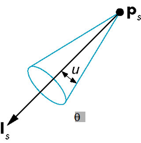

* 具有一个比较的窄的照明范围，通常为圆锥形半无穷区域
	* 可以给点光源加上一定的限制得到
	* 锥的顶点在$P_s$, 而中心轴方向为$I_s$
	* 如果$\theta = 180°$, 聚光灯成为点光源

* 光亮度在照明锥内具有一定的分布

	* 通常绝大多数光集中在照明锥的中心
	* 因此照明强度是向量$s$与中心轴夹角$\phi$的函数

	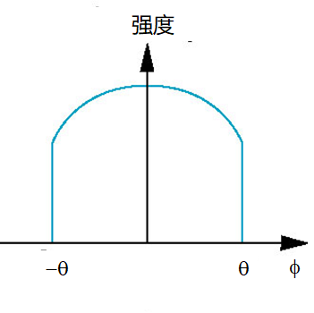

	* 强度函数通常定义为$\cos^e\phi$

		* 指数$e$确定光强度衰减的快慢
		* 之所以采用余弦函数，是因为在这种情况下，非常容易计算出来它的值：$\cos \phi = \pmb s\cdot\pmb l$

		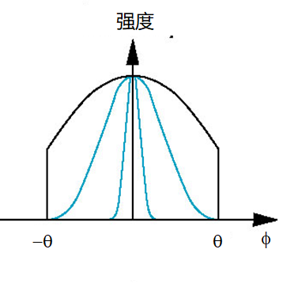

**无穷远光源**

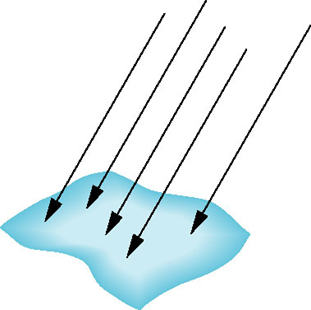

* 在光照计算中需要计算从光源到当前点的向量
	* 入射方向为上述向量的相反向量，而且需要单位化
* 如果光源在无穷远，该向量为常数
	* 太阳光是无穷远光源的典型代表

**环境光**

* 在场景中每个地方都具有相同的强度
* 严格意义上说，环境光也是来自于某个光源，但由于在光照计算中进行了某些简化，需要用环境光来模拟多次反射后的效果
* 环境光强是由$I_a = [I_{ar}, I_{ag},I_{ab}]$确定的，在每点的值完全相同

#### 5.4.3. 对象表面

* 如果对象表面光滑，对象显得明亮；如果表面粗糙，那么就显得暗淡
* 表面有三种类型
	* 镜面（specular surfaces）
	* 漫反射面（diffuse surfaces）
	* 透明面（translucent surfaces）

**镜面**

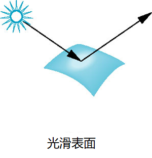

* 表面显得明亮，因为绝大多数光集中在严格镜面反射方向的周围

* 镜子是真正的镜面模型

理想反射：

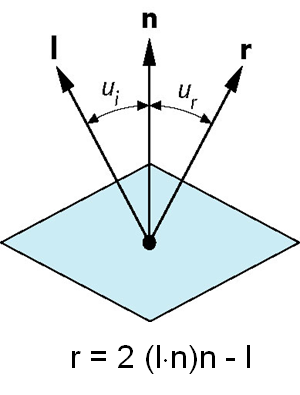

* 法向由局部定向确定
	* 单位化$\|\pmb n\|=1$

* 入射角 = 反射角
	* $\theta_i=\theta_r$

* 三个向量$\pmb I$, $\pmb n$, $\pmb r$必须共面
	* 均为单位向量

镜面光模型：

* 模拟在镜面反射方向附近的聚集光现象

	* $\pmb n$：法向量
	* $\pmb I$：入射光方向
	* $\pmb r$：反射方向
	* $\pmb v$：视点方向
	* $\pmb \phi$：$\pmb r$与$\pmb v$的夹角

	$$
	I_r=k_sI\cos^\alpha\phi
	$$

	

* 高光系数$\alpha$：

	* 如果$\alpha$的值介于100到200之间，那么对应于金属材料
	* 如果$\alpha$的值介于5到10之间，材料类似于塑料

	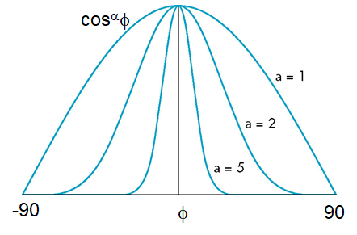

**漫反射面**

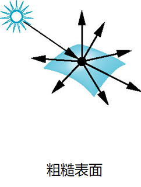

* 特征是反射光向各个方向进入空间
* 例如：涂有不光滑油漆的墙面

Lambertian曲面：

* 真正的漫反射
* 光向各个方向均匀地反射
* 模拟粗糙表面


漫反射光强：

* 反射光的比例正比于入射光的竖直分量

	* 即反射光$\sim \cos\theta_i$
	* 如果向量为单位向量，则$\cos \theta_i=\pmb l\cdot\pmb n$
	* 存在三个系数$k_r$, $k_b$, $k_g$分别相应于每种颜色的光反射的比例

	* 对每种光，反射光强$I_d=kI_l\cos\theta_i$

**透明面**

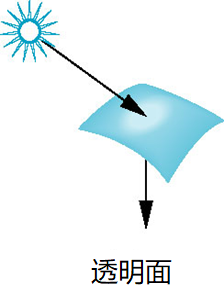

* 有些光可以进入表面，从对象的另一处出来
* 例如：玻璃与水中的折射
* 这时也会有部分光被反射

折射光：

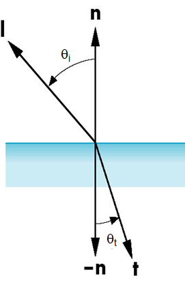
$$
\dfrac{\sin\theta_i}{\sin\theta_t}=\dfrac{\eta_t}{\eta_i}
$$
$\eta_t$和$\eta_i$分别表示两种物质的折射系数

令$\eta=\eta_t/\eta_i$，则
$$
\cos\theta_t=\sqrt{1-\dfrac{1}{\eta^2}(1-\cos^2\theta_i)}\\
\pmb t=-\dfrac{1}{\eta}\pmb I-\Big(\cos\theta_t-\dfrac{1}{\eta}\cos\theta_i\Big)\pmb n
$$

#### 5.4.4. OpenGL中的明暗处理

**在OpenGL中应用明暗处理的步骤**

* 启用明暗处理功能，并选择模式
* 指定法向量
* 指定材料属性
* 指定光源

### 5.5. 纹理映射

#### 5.5.1. 映射简介

**三种映射方法**

* 纹理映射
* 环境映射
* 凹凸映射

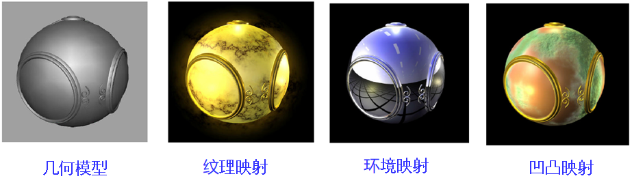

映射技术是在输出流水线的最后阶段实现的

**纹理映射框架**

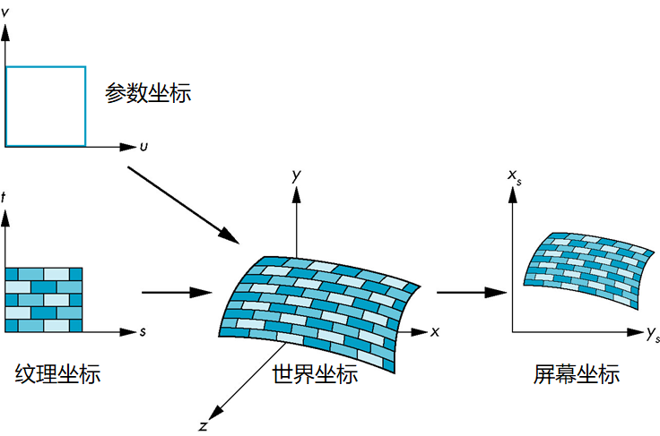

**映射函数**

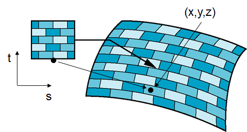

* 考虑从纹理坐标到曲面上一点的映射

* 直观地看，应当需要三个函数
	$$
	\begin{matrix}
	x=x(s,t)&y=y(s,t)&z=z(s,t)
	\end{matrix}
	$$

**逆映射**
$$
\begin{matrix}
s=s(x,y,z)&t=t(x,y,z)
\end{matrix}
$$
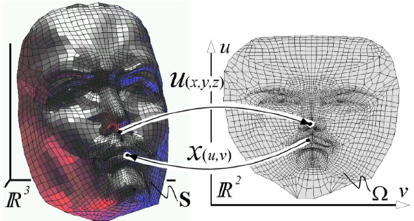

#### 5.5.2. 构建映射的方法

**映射的确定**

考虑由参数方程定义的曲面
$$
p(u,v)=(x(u,v),y(u,v),z(u,v))
$$
此时通常采用如下形式从纹理元素对应到曲面上的点
$$
u=as+bt+c\\
v=ds+et+f
$$
只要$ae\neq bd$，上述映射是可逆的

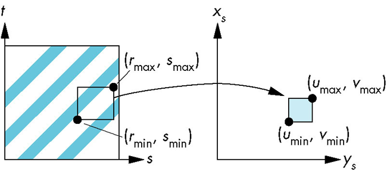
$$
u=u_\min+\dfrac{s-s_\min}{s_\max-s_\min}(u_\max-u_\min)\\
v=v_\min+\dfrac{t-t_\min}{t_\max-t_\min}(v_\max-v_\min)
$$
**圆柱映射**

假设纹理坐标在单位正方形$[0,1]^2$内变化，圆柱高$h$，半径$r$

那么圆柱的参数方程为
$$
\begin{matrix}
x=r\cos(2\pi s)&y=r\sin(2\pi s)&z=ht
\end{matrix}
$$
从纹理坐标到圆柱面上没有变形

适合于构造与无底的圆柱面拓朴同构的曲面上的纹理

**球映射**

球的参数方程
$$
\begin{matrix}
x=r\cos(2\pi s)&y=r\sin(2\pi s)\cos(2\pi t)&z=r\sin(2\pi s)\sin(2\pi t)
\end{matrix}
$$
可用在环境映射中

**立方体映射**

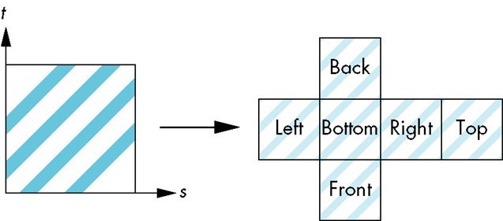

* 适合应用于正交投影
* 也用在环境映射中

**两步映射**

* 首先把纹理映射到一个简单的中间曲面上
* 从中间对象到实际对象的映射
	* 从中间形状的法向到实际对象
	* 从实际对象的法向到中间形状
	* 从中间形状的中心开始的向量

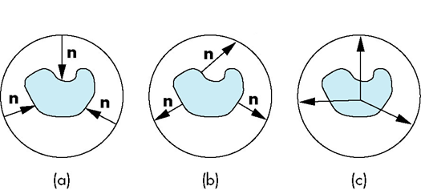

#### 5.5.3. MipMap

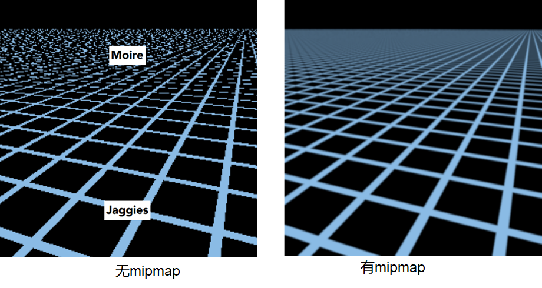

原因：采样不足

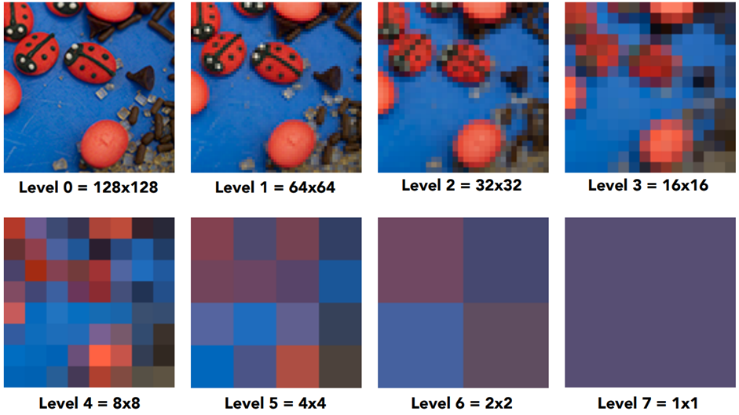

图像金字塔

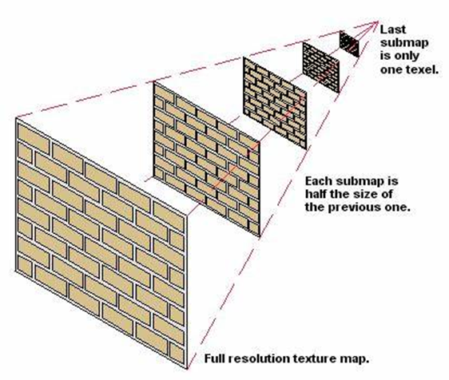

MipMap存储

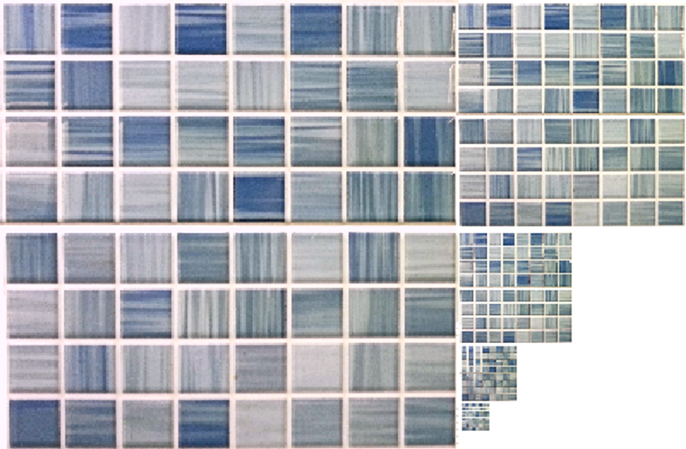

MipMap层次计算：

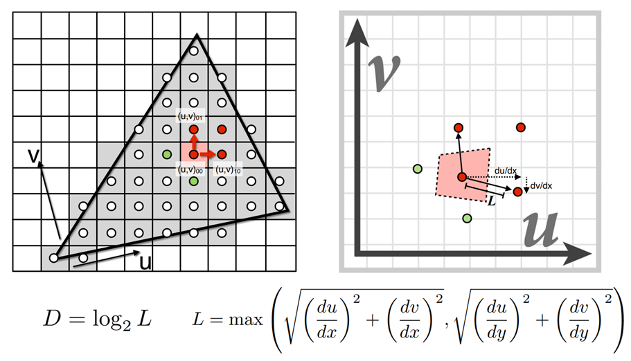

#### 5.5.4. OpenGL中的纹理映射

**应用纹理映射的三个步骤**

* 指定纹理
	* 读入或生成图像
	* 赋给纹理
	* 激活纹理映射功能
* 给每个顶点赋纹理坐标
	* 由应用程序建立适当的映射函数
* 指定纹理参数
	* 包装（wrapping）, 过滤（filtering）

**应用纹理框架**

* 在纹理对象中指定纹理
* 设置纹理滤波函数
* 设置纹理函数
* 设置纹理的wrap模式
* 设置可省的透视校正提示
* 结合纹理对象
* 激活纹理映射功能
* 为每个顶点指定纹理坐标
	* 坐标可以自动生成

**多重纹理**

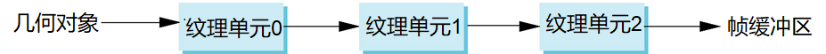

#### 5.5.5. 环境映射

**基本想法**：

* 形状为多边形，表面为光滑的镜面反射材料
* 从视点来看，观察者的位置和镜面法向已知，因此反射角确定：$\pmb r = 2(\pmb v\times \pmb n)\pmb n –\pmb v$ 
* 如果沿这个反射方向跟踪，它必与环境交于某一点

**两步策略**：

1. 假设场景中没有表面镜子的多边形，照相机放在镜子的中心，指向镜子的法向
	* 如此得到环境的图像
	* 这个图像并不是完全正确的
2. 把上述图像贴到镜子多边形上

**存在的问题**：

* 第一步中得到的图像并不是很正确
	* 因为它是在场景中缺少一个对象（即镜子）的情形下得到的
* 必须处理映射中的问题
	* 在第一步中应当把场景投影到哪种曲面上？
	* 照相机应当放在哪儿？
* 有时我们会移动镜子，那么就需要多次投影

**经典解决方法**：

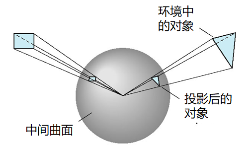

* 经典的方法是把场景投影到一个球上，球的中心就是COP
	* 注意在COP的观察者分不清到底看到的是原来的对象，还是投影后的对象
* 早期的环境映射中接着就利用经纬线把球面上的图像对应到矩形上
	* 极点的变形很大
	* 也不保持面积
	* 大量应用三角运算

**球面映射**

* OpenGL支持上述方法的变体，即球面映射
	* 应用程序提供一个圆形图像，它来自于环境映射到其上的球的正交投影
	* 好处：从反射向量到圆上二维纹理坐标的对应非常简单，易于硬件或软件实现
	* 缺陷：需要圆形图像，可以用宽角镜头进行透视投影来近似构造，或者从其它结果转化过来

**Cube Map**

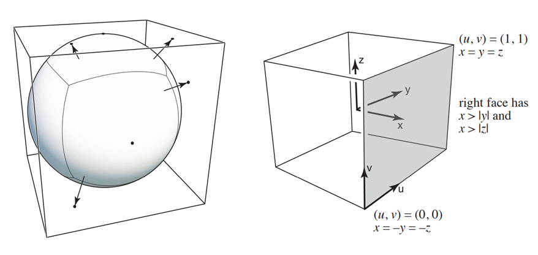

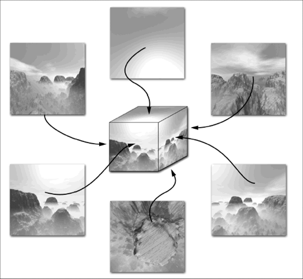

**从中间曲面的映射**

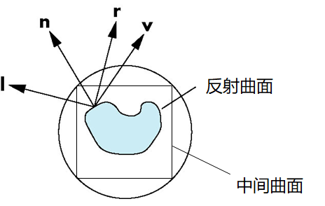

把六个图像组合成一个环境映射，然后如图构造映射

#### 5.5.6. 凹凸映射

**基本想法**

* 对曲面的法向进行随机扰动

* 如此得到的图像就会显现出形状变化的错觉

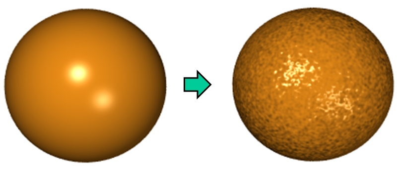

**法向**

* 曲面上一点的法向量刻划曲面在该点的形状
* 如果用小量扰动曲面法向，那么就会得到具有小变化的曲面
* 如果在生成图像时进行这种扰动，那么就会从光滑的模型得到具有复杂表面模型的图像

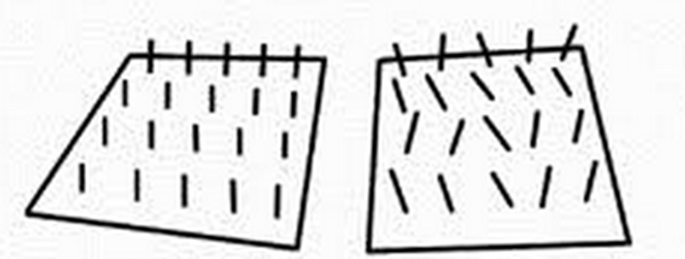

**法向扰动方法**

* 设曲面方程为$S(u,v)$

* 在一点的单位法向为$\pmb n=\dfrac{\pmb S_u\times \pmb S_v}{\|\pmb S_u\times \pmb S_v\|}$

* 假设曲面在法向移位$\pmb d(u,v)(\|\pmb d(u,v)\|<<1)$

* 则变化后的法向近似为
	$$
	\pmb n'=\pmb n+\pmb d_u\pmb n\times \pmb S_u+\pmb d_v\pmb n\times\pmb S_v
	$$
	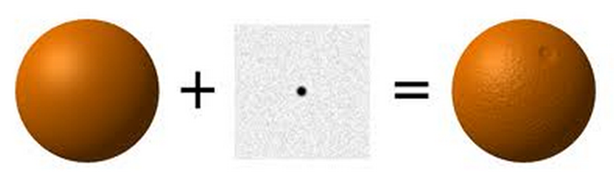

**计算方法**

* 曲面表示的偏导数计算
	* 基于曲面的表示解析计算，或者在当前点让$u$与$v$改变很小，找到四个最近点，用差商代替微商
* 位移函数的偏导数计算
	* 根据定义方式解析计算

**斜面效应**

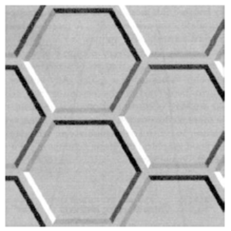

* 沿几何图形的边界应当显示出明显的边界效果
* 描述斜面（bevelling）的参数
	* 脊与平坦区域的宽度
	* 在脊的顶部与底部的斜率

#### 5.5.7. 法向映射

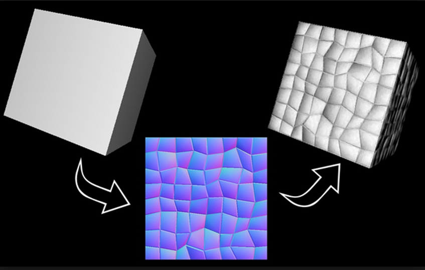

#### 5.5.8. 偏置映射

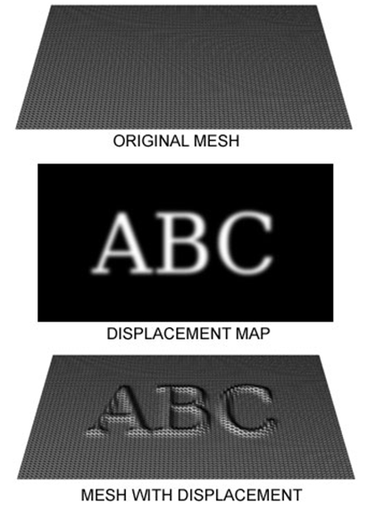

#### 5.5.9. 阴影映射

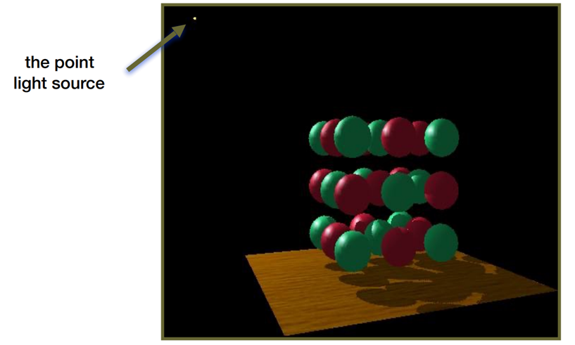

**阶段1：从光源渲染**

生成深度图

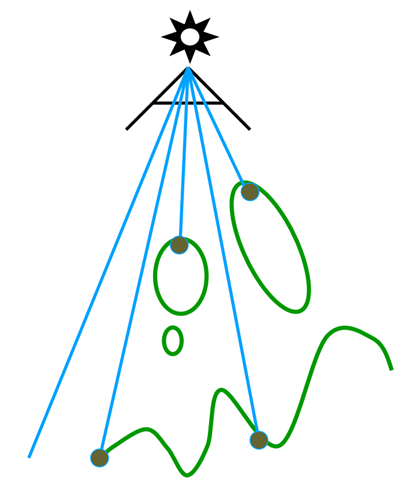

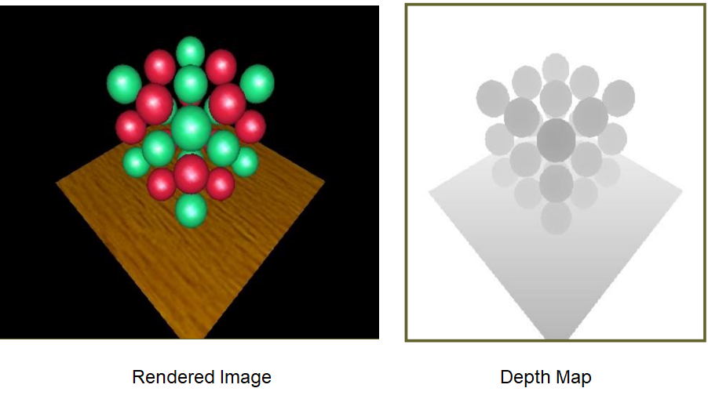

**阶段2：从摄像头渲染**

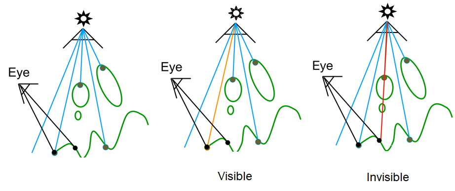

比较：

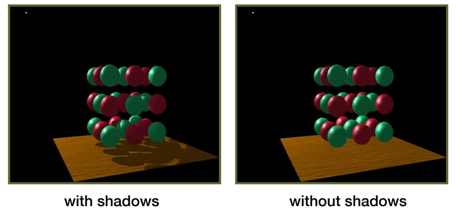

### 5.6. 着色器编程

#### 5.6.1. 概述

**渲染管线**

* 逐片元操作
	* 剪切测试（scissor test）
	* 多重采样片元操作（multisample fragment operations）
	* 模板测试（stencil test）
	* 深度测试（depth test）
	* 融混（blending）
	* 抖动（dithering）
	* 逻辑操作

* 逐片元操作的应用
	* 深度缓存
		* 隐藏面消除（z buffer algorithm）
		* 阴影绘制（shadow mapping）
	* 模板缓存
		* 汽车驾驶模拟显示中的挡风玻璃
		* 多道绘制技术（multipass rendering）
	* 融混
		* 透明物体的绘制
	* 多重采样与抖动
		* 反走样
	* 利用逐片元操作，可以实现很多特殊任务的绘制

**固定管线 vs 可编程管线**

* 固定管线
	* 用户能控制
		* 管线中的某子流水线的参数设置
	* 用户不能控制
		* 管线中的某子流水线的具体实现（计算）方法
	* 不足：
		* 参数的类型与数目都是有限的，可能的结果也仅仅是有限多种，无法创造新的渲染结果

* 可编程管线
	* 随着硬件的发展，用户已经可以针对图形处理器（GPU）进行编程
	* OpenGL提供了相应的机制支持这一点：用户可以编写专门运行于GPU的小程序，而非只能为函数设置有限的参数
		* 通过编写着色器(Shader)，用于替代固定流水线中的各个子流水线
		* 着色器，是一种针对GPU编写的，由GPU直接运行的，高度并行化的小程序
			* 顶点着色器、细分着色器、几何着色器、片元着色器、通用的计算着色器
			* …

**固定流水线 vs 可编程流水线**

* 固定流水线
	* 只支持Blinn-Phong光照模型
	* 无法实现
		* 物理真实感的光照效果：折射、区域光、软阴影
		* 非真实感效果：卡通着色效果、水墨画 
* 可编程流水线
	* 把顶点和片元处理中那些固定的功能用可编程处理器代替，可定制化编写效果
	* 须实现固定管线的功能

**顶点着色器的应用**

* 顶点的位置计算
	* 偏置 (Displacement)
	* 扰动
* 顶点的光照计算　
	* 更真实的模型
	* 卡通着色器

**片元着色器的应用**

* 逐片元进行光照计算

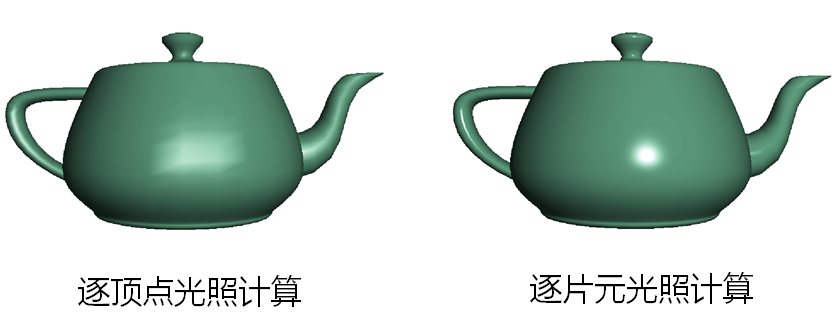

* 纹理映射

	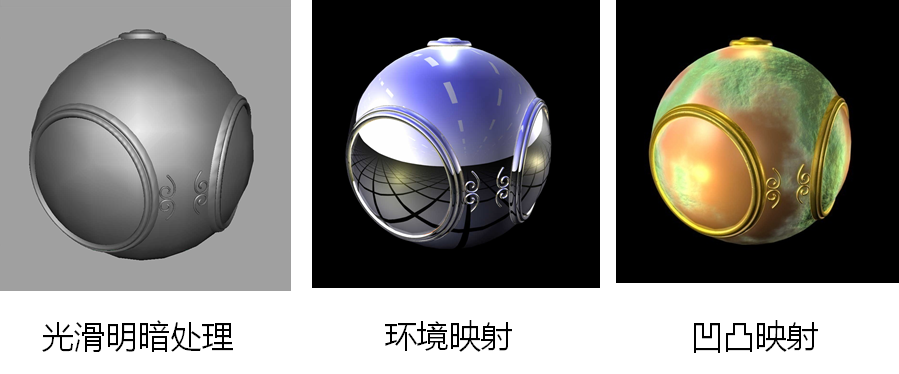

#### 5.6.2. GLSL着色语言

**简介**

* OpenGL内置的，专用于编写着色器程序的语言
	* 类C语言
	* 着色器程序的源代码可以直接写在C++程序中，用字符串常量表示
* 引进新的数据类型
	* 矩阵
	* 向量
	* 采样器（Samplers）
* OpenGL的状态通过内置变量传递

**顶点着色器 vs 片元着色器**

* 顶点着色器：将3D顶点映射到2D片元（屏幕位置）
* 片元着色器：决定2D片元的最终呈现的颜色

顶点（片元）着色器是每个顶点（片元）都需要（并行）运行一遍的程序

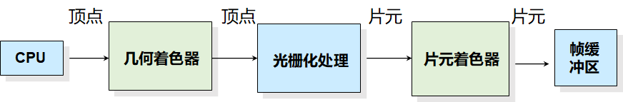

**可编程渲染管线的工作流程**

1. 进行准备工作
2. 编写顶点着色与片元着色代码，生成可执行的GPU程序
3. 向GPU程序中传输数据
4. 运行你的程序，绘制图像


### 5.6. 真实感渲染简介

#### 5.6.1. 局部光照模型

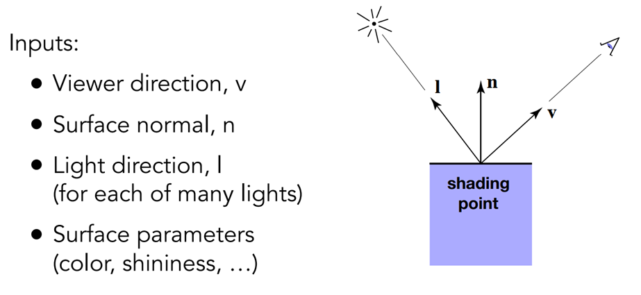

**漫反射**

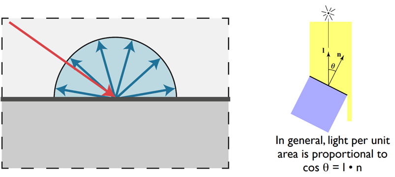

**光的衰减**

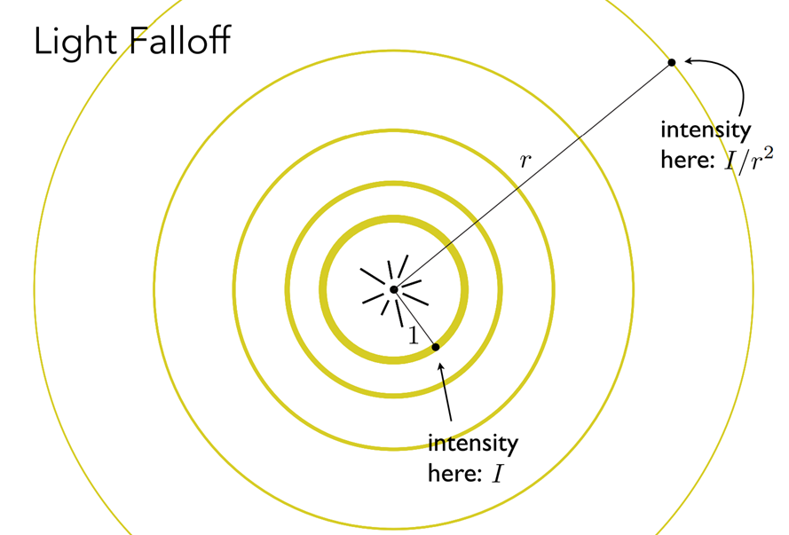

**Lambertian漫反射**

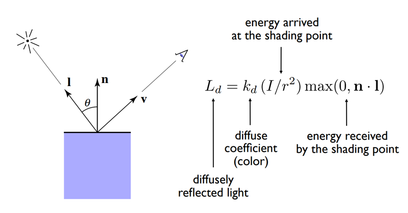

**镜面反射项**

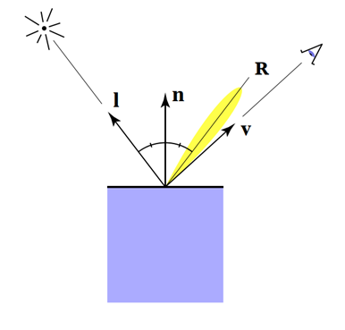

Blinn-Phong

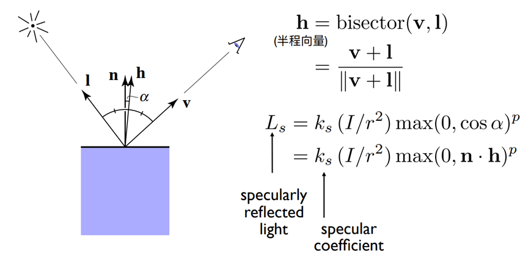

**漫反射项**

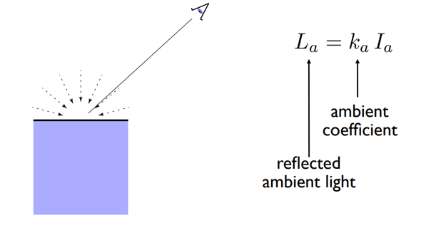

**Blinn-Phong光照模型**

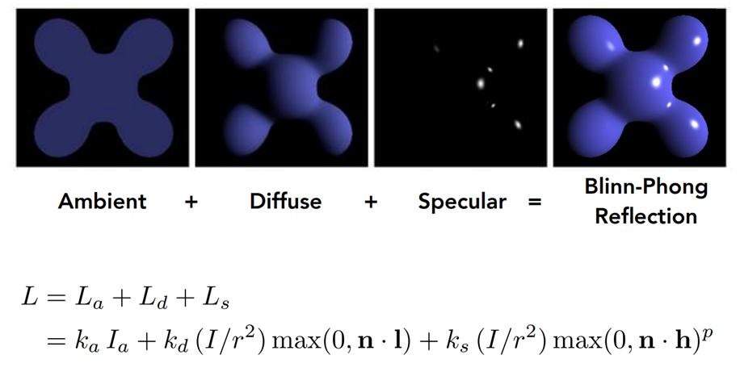

**局部光照模型的不足**

* 过于简化的反射模型
* 没有间接反射光

#### 5.6.2. 全局光照模型

材料由双向反射分布函数BRDF(Bidirectional Reflectance Distribution Function)决定

**Lambertian Material (BRDF)**

光照均匀反射到每一个出射方向

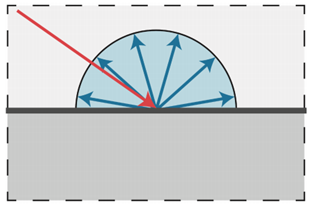

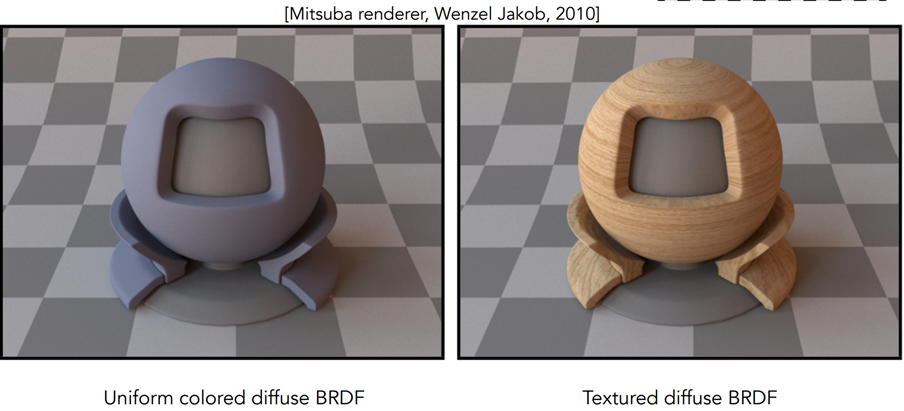

假设入射光是常数

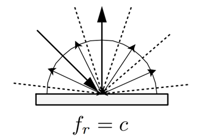
$$
\begin{align}
L_o(\omega)&=\int_{\mathcal H^2}f_rL_i(\omega_i)\cos\theta_i\mathrm d\omega_i\\
&=f_rL_i\int_{\mathcal H^2}\cos\theta_i\mathrm d\omega_i\\
&=\pi f_rL_i
\end{align}
$$

$$
f_r=\dfrac{\rho}{\pi}
$$

其中，$\rho$为反照率颜色

**Glossy material (BRDF)**

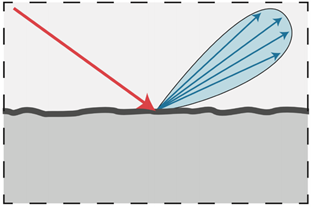

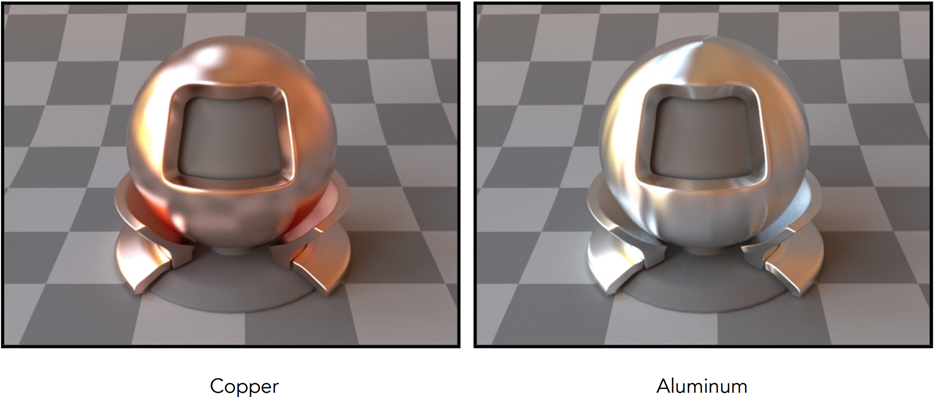

**Reflective/Refractive material (BSDF)**

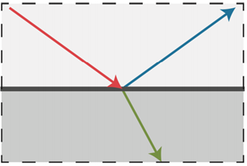

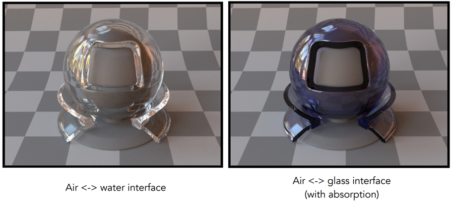

#### 5.6.3. 渲染方程

**原理**：光路的不断反射传播

**Radiance辐射率**

* $\pmb x$处在$\pmb\omega$方向上的辐射能量
	* 一个5D函数$L(\pmb x,\pmb \omega)$，幂
		* 每个投影表面面积
		* 每个立体角

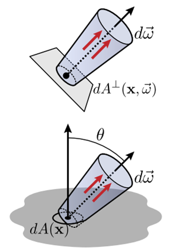


* 立体角

	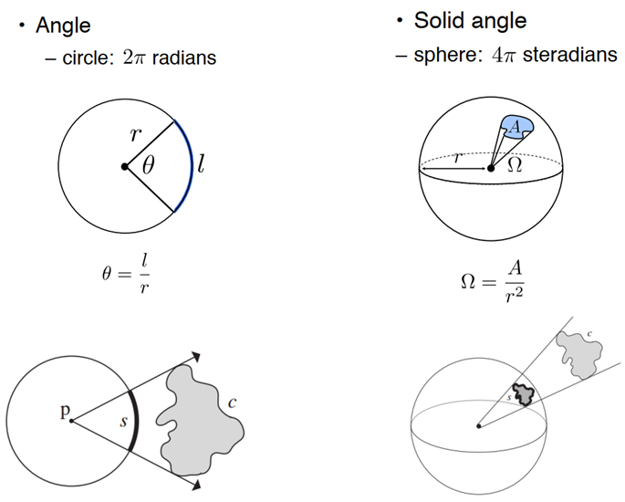

**渲染方程**
$$
[outgoing]=[emitted]+[reflected]
$$
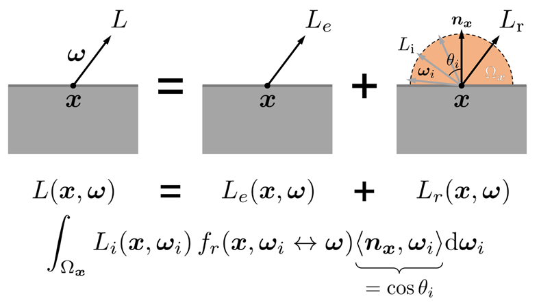

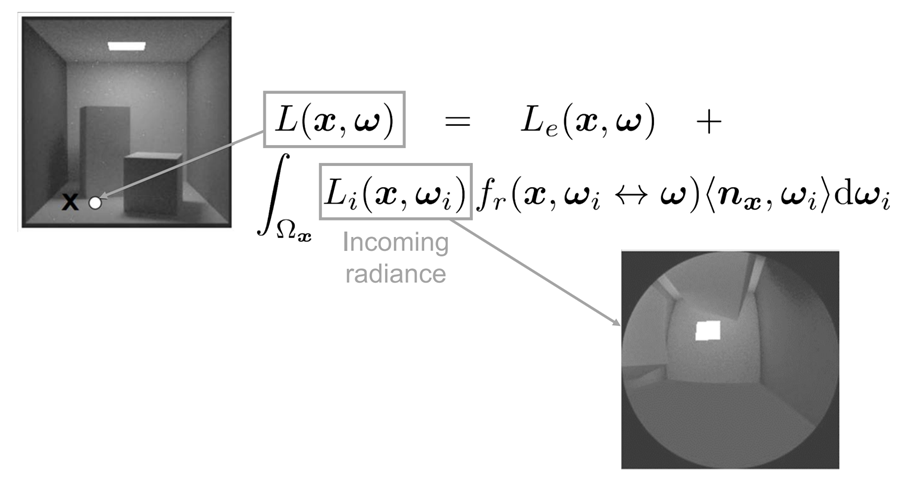

#### 5.6.4. 渲染方程的解

$$
L_o(x,\omega_o)=L_e(x,\omega_o)+\int_{\mathcal H^2}L_i(x,\omega_i)f_r(x,\omega_i\rightarrow \omega_o)\cos\theta_i\mathrm d\omega_i
$$

迭代：

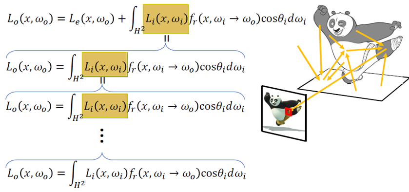

### 5.7. 光线跟踪算法

#### 5.7.1. 反向跟踪

* 只有到达视点的光线才有作用
* 逆光线方向投射光线
* 每个像素至少需要一条光线

**Ray Casting**

基本原理：

* Generate an image by casting one ray per pixel 
* Check for shadows by sending a ray to the light

**递归光线跟踪**

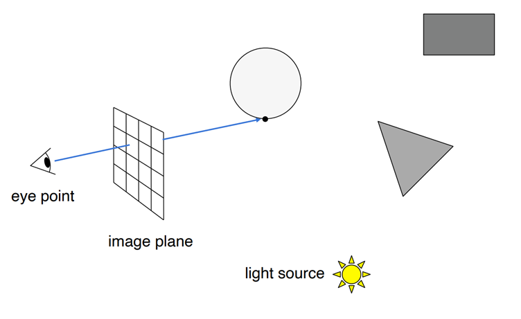

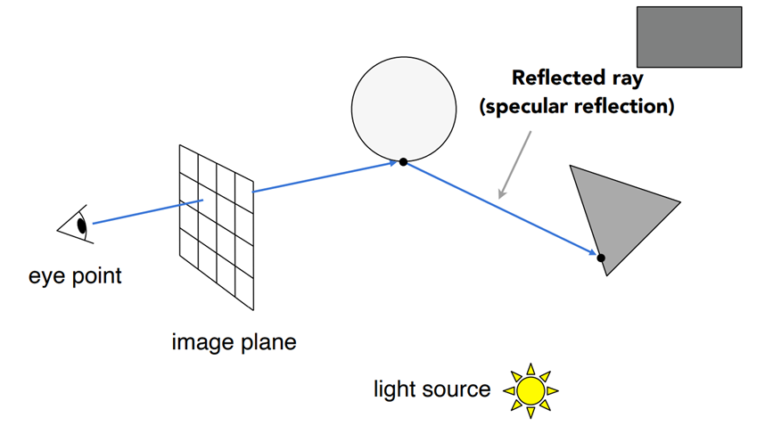

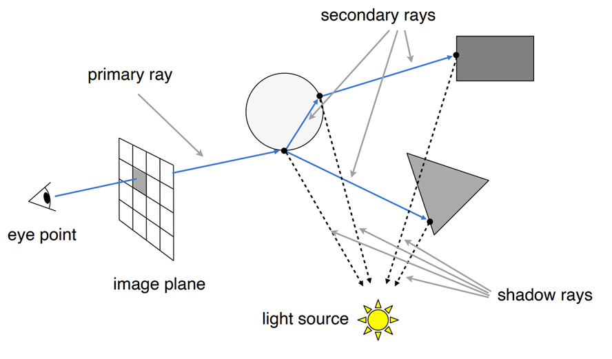

**递归终止条件**

* 在每个相交时，有些光线被吸收
	* 跟踪余下的量
* 忽略进入无穷空间的光线（或背景光强）
	* 在场景周围放一个大球
* 递归步数有限制

**算法框架**

```c++
color trace(point p, vector d, int step)
{
	color local, reflected, transmitted;
	point q; 
	normal n;
	if(step > max) return(background_color);

	q = intersect(p,d,status);
	if(status == light_source)
		return(light_source_color);
	if(status == no_intersection)
		return(background_color);

	n = normal(q);
	r = reflect(q,n);
	t = transmit(q,n);
	local = phong(q,n,r);
	reflected = trace(q,r,step+1);
	transmitted = trace(q,t,step+1);

	return(local+reflected+transmitted);
}
```

**计算效率**

* 大量的求交运算
	* 点与三角网格的求交
	* 点与三角形的求交

**加速策略**

* Axis-Aligned Bounding Box (AABB) (轴对⻬包围盒)
* 包围球


* 空间组织

	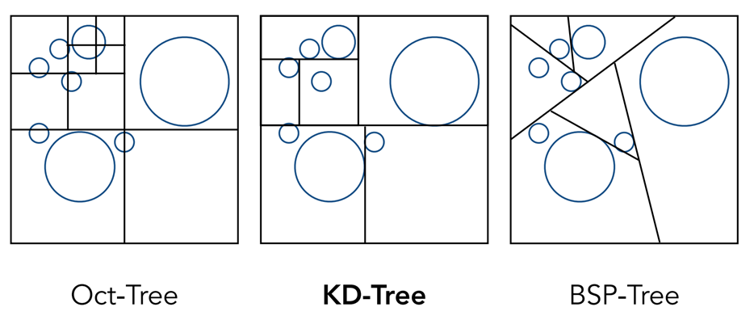

* Bounding Volume Hierarchy (BVH)

	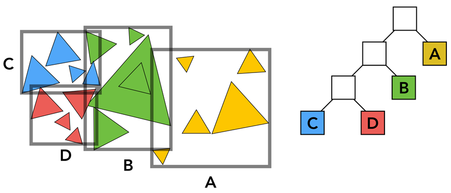

**Spatial vs Object Partitions**


#### 5.7.2. 路径追踪 Path Tracing

Whitted光线跟踪算法只是计算了一条反射光路，而不是整个半球面

**Path Tracing基本思想**

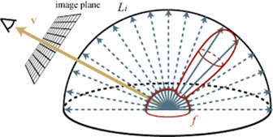
$$
L_o(p,\omega_o)=L_e(p,\omega_o)+\int_{\Omega^+}L_i(p,\omega_i)f_r(p,\omega_i,\omega_o)(\pmb n\cdot\pmb \omega_i)\mathrm d\omega_i
$$

* 从视点往像素打N条光线
* 每条光线生成一条光路(path)，计算着色
	* 每点按概率只产生一个反射方向
		* 数值积分方法（Monte Carlo方法）
* 将所有光路的着色进行平均
	* 大数定理（当N趋向无穷）

**Monte Carlo积分方法**

**目标**：估计$I=\int_a^b f(x)\mathrm dx$

**思想**：构造随机变量$<I>$

* 使得$E[<I>]=I$
* $<I>$称为$I$的无偏估计

令$p()$是$[a，b]$上的任意概率密度函数，而$X$是密度为$p$的随机变量

令$<I>:=\dfrac{f(X)}{p(X)}$
$$
E[<I>]=E\Bigg[\dfrac{f(X)}{p(X)}\Bigg]=\int_a^b\dfrac{f(x)}{g(x)}p(x)\mathrm dx=I
$$
**流程**

* 选择一个概率密度函数$p(x)$

* 生成$n$个独立的样本
	$$
	x_1,x_2,\cdots,x_n\sim p
	$$

* 对$j=1,2,\cdots,n$，计算
	$$
	\hat I_j:=\dfrac{f(x_j)}{p(x_j)}
	$$

* 返回采样均值
	$$
	\overline I:=\dfrac{1}{n}\sum\limits_{j=1}^n\hat I_j
	$$

**概率密度函数$p()$的选择**

* 理论上
	* 几乎是所有概率密度函数
* 实际应用上
	* 均匀分布几乎总是有效的
		* 只需定义域有界
	* $p()$的选择对估计效率（即收敛速率）有很大的影响

**多重重要性采样MIS**

为了估计
$$
I=\int_\Omega f(\pmb x)\mathrm d\mu(\pmb x)
$$
假设有$n$个概率密度函数$p_1,p_2,\cdots,p_n$对$\pmb x$进行采样，则
$$
<I>_{MIS}:=\sum\limits_{i=1}^nw_i(\pmb x_i)\dfrac{f(\pmb x_i)}{p_i(\pmb x_i)}\ \ \ \ \pmb x_i\sim p_i
$$
为$I$的无偏估计只需满足：

* 对所有$\pmb x$满足$f(\pmb x)\neq 0$有$\sum\limits_{i=1}^n w_i(\pmb x)=1$
* 当$p_i(\pmb x)=0$时，有$w_i(\pmb x)=0$

平衡启发式权重计算：
$$
w_i(\pmb x)=\dfrac{p_i(\pmb x)}{\sum_{j=1}^np_j(\pmb x)}
$$
则
$$
<I>_{balance}:=\sum\limits_{i=1}^nw_i(\pmb x_i)\dfrac{f(\pmb x_i)}{p_i(\pmb x_i)}=\sum\limits_{i=1}^n\dfrac{f(\pmb x_i)}{\sum_{j=1}^np_j(\pmb x_i)}
$$
**光线追踪思想**

目标：解积分
$$
L_o(p,\omega_o)=L_e(p,\omega_o)+\int_{\Omega^+}L_i(p,\omega_i)f_r(p,\omega_i,\omega_o)(\pmb n\cdot\pmb \omega_i)\mathrm d\omega_i
$$
蒙特卡洛积分：
$$
\int f(x)\mathrm dx=\dfrac{1}{N}\sum\limits_{i=1}^N\dfrac{f(X_i)}{p(X_i)}
$$
合并可得：
$$
L_o(p,\omega_o)\approx\dfrac{1}{N}\sum\limits_{i=1}^N\dfrac{L_i(p,\omega_i)f_r(p,\omega_i,\omega_o)(\pmb n\cdot\pmb \omega_i)}{p(\omega_i)}
$$
**伪代码**

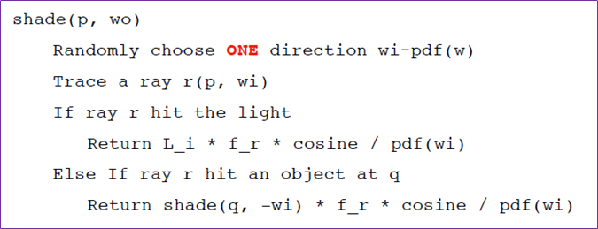

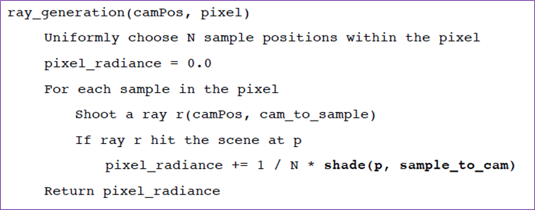

无法收敛问题——俄罗斯赌盘（Russian Roulette RR）

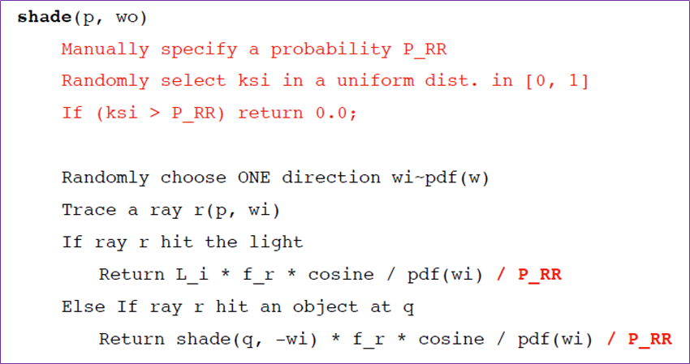

**Path Tracing的优化：光源采样**
$$
L_r(\pmb x,\pmb \omega)=L_r^{direct}(\pmb x,\pmb\omega)+L_r^{indirect}(\pmb x,\pmb \omega)
$$
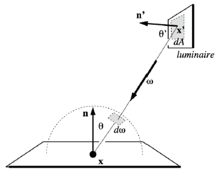

* 光源采样：
	$$
	\mathrm{pdf}=1/A（由于\int \mathrm{pdf}\ \mathrm dA=1）
	$$

* 立体角 → 区域积分
	$$
	\mathrm d\omega=\dfrac{\mathrm dA\cos\theta'}{\|x'-x\|^2}
	$$

* 渲染方程
	$$
	\begin{align}
	L_o(x,\omega_o)&=\int_{\Omega^+}L_i(x,\omega_i)f_r(x,\omega_i,\omega_o)\cos\theta\mathrm d\omega_i\\
	&=\int_AL_i(x,\omega_i)f_r(x,\omega_i,\omega_o)\dfrac{\cos\theta\cos\theta'}{\|x'-x\|^2}\mathrm dA
	\end{align}
	$$

* 伪代码：

	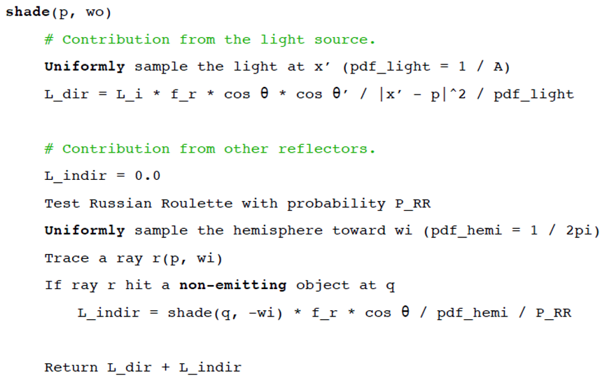

* 阴影射线的可视测试

	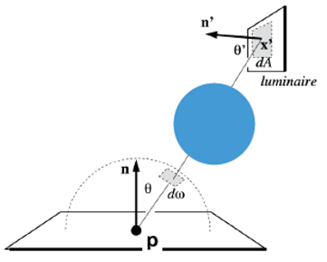

	在渲染方程中增加一项：
	$$
	L_o(p,\omega_o)=L_e(p,\omega_o)+\int_{\Omega^+}L_i(p,\omega_i)V(p,x',\omega_i)f_r(p,\omega_i,\omega_o)(\pmb n\cdot\pmb \omega_i)\mathrm d\omega_i
	$$
	伪代码：

	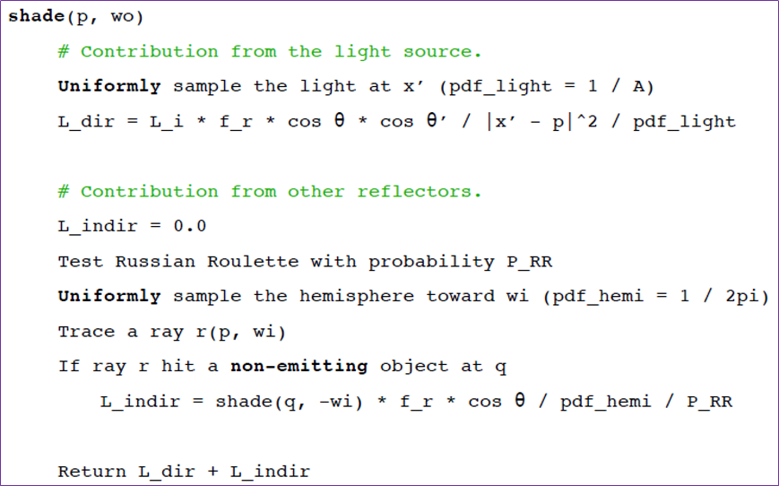

	**Image-Based Lighting (IBL)**

	* 用环境映射当作光源

		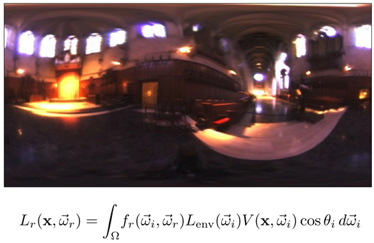

	

	* 重要性采样

		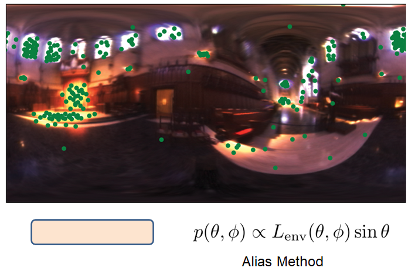

	伪代码：

	

#### 5.7.3. Advanced Path Tracing

**Ray Tracing方法综述**

* Ray Casting（光线投射）
	* Ray Tracing的第一步，发射光线与物体相交
* Ray Tracing（光线跟踪/追踪）
	* Recursive ray tracing
	* Stochastic ray tracing 
* Path Tracing
	* Ray tracing+Monte Carlo Method

* Advanced Light Transport (Advanced Path Tracing)

**Bidirectional path tracing (BDPT)**

* 解决的问题：复杂光线
	* 从相机出发的光路很难打到光源

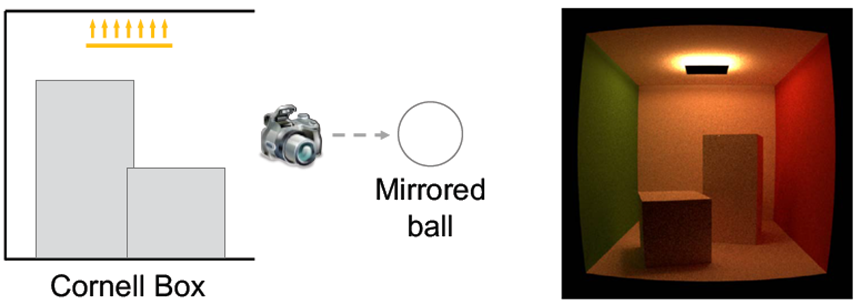

* Recall: 一条路径连接摄像机和光源
* BDPT
	* 同时从摄像机和光源追踪子路径
	* 从两条子路径连接终点
* 使用多重采样来对路径适当加权

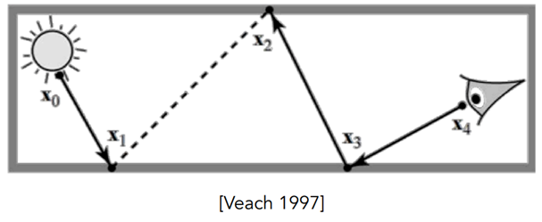

* 构建传输路径

	* 对于任意$s,t\geq 0$，创建光线的子路径$(\pmb y_0,\cdots,\pmb y_{s-1})$以及摄像机子路径$(\pmb z_0,\cdots,\pmb z_{t-1})$（使用局部路径采样）

		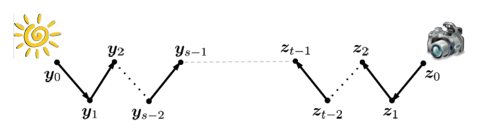

	* 完整路径由连接两段路径得到：
		$$
		\overline x_{s,t}:=(\pmb z_0,\pmb z_1,\cdots,\pmb z_{t-1},\pmb y_{s-1},\cdots,\pmb y_1,\pmb y_0)
		$$

	* 对每个$s$和$t$，构造$\overline x_{s,t}$的一个概率密度函数$p_{s,t}(\overline x_{s,t})$
		$$
		p_{s,t}=p((\pmb y_0,\pmb y_1,\cdots,\pmb y_{s-1}))p((\pmb z_o,\pmb z_1,\cdots,\pmb z_{t-1}))
		$$

	* 使用多重采样可以结合所有的路径采样结果
		$$
		<I>_{MIS}=\sum\limits_{s\geq 0}\sum\limits_{t\geq 0}w_{s,t}(\overline x_{s,t})\dfrac{f(\overline x_{s,t})}{p_{s,t}(\overline x_{s,t})}
		$$
		其中$w_{s,t}$为权重函数——平衡启发式

* 分析

	* 适用于当光线传输在光源端复杂的情况
	* 难以实现且渲染速度较慢

	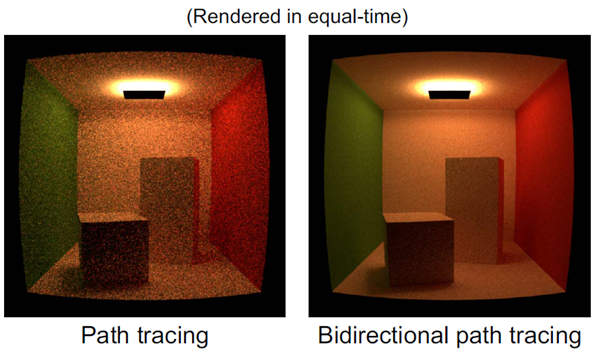

**Metropolis Light Transport (MLT)**

* 解决的问题：无关路径

	* 各条光路是相互无关的
	* 从相机出发的光路受一点扰动可能偏差较大

	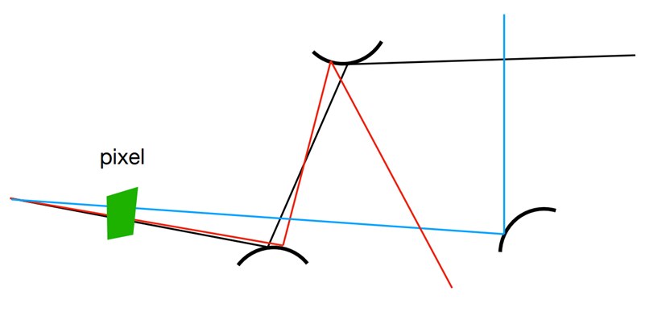

* 关键思想

	* 局部干扰已有路径以获得新路径

* 马尔科夫链的应用

	* 从当前的采样通过某种概率密度函数跳转到下一个采样

* 能够高效地构造困难传输路径

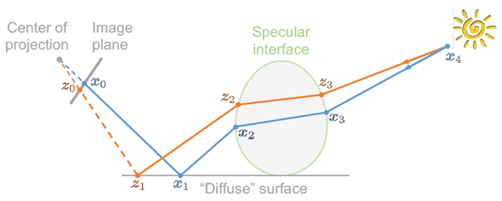

* Metropolis-Hasting Method

	* 给定非负函数$f$，生成一系列相关的采样$X_1,X_2,X_3,\cdots$，其概率密度函数与$f$成正比

	* 主要优势：$f$不需要为一个概率密度函数

	* 输入：

		* 非负函数$f$
		* 概率密度函数$g(y\rightarrow x)$，对给定的前一个采样$y$，生成候选的下一个采样值$x$

	* 算法：给定当前采样$X_i$

		* 从$g(X_i\rightarrow X')$采样得到$X'$

		* 令
			$$
			a=\dfrac{f(X')}{f(X_i)}\dfrac{g(X'\rightarrow X_i)}{g(X_i\rightarrow X')}
			$$

		* 设置$X_{i+1}$转移到$X'$的概率为$a$；否则，设置$X_{i+1}$转移到$X_i$

	* 从任意初始化状态$X_0$开始

* 路径突变

	* MLT的关键步骤

	* 期望的突变性质

		* 高可接受概率
		* 路径的大幅度改变
		* 遍历（永远不会停留在路径空间的某些区域）
		* 低耗用

	* 给定一个传输路径$\overline x$，我们需要定义一个传递概率$g(\overline x\rightarrow \overline y)$来允许基于$\overline x$采样突变路径$\overline y$

		* 给定该传递概率密度，接受概率表示为：
			$$
			a(\overline x\rightarrow\overline y)=\min \Bigg\{1,\dfrac{f(\overline y)}{f(\overline x)}\dfrac{g(\overline y\rightarrow\overline x)}{g(\overline x\rightarrow\overline y)}\Bigg\}
			$$

	* 路径突变策略

		1. 扰乱中间一段光路

			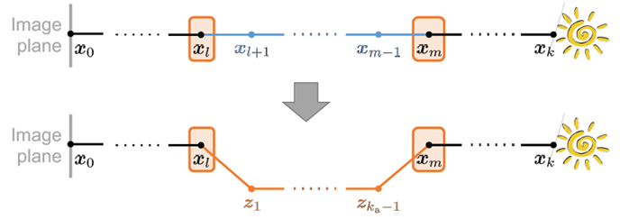

		2. 扰动最后一段光路，从光源回退光路

			

* 分析

	* 优点

		* 困难光路效果好
		* 无偏

		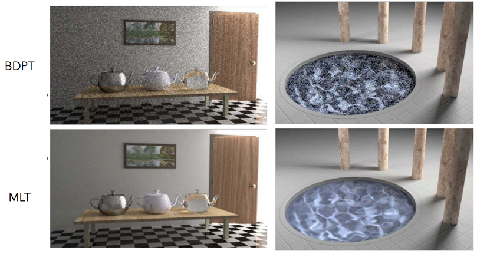

	* 缺点

		* 收敛速率难以估计
		* 无法保证每个像素同等收敛
		* 经常造成“脏”结果
		* 一般不用于渲染动画

**Photon Mapping**

* 解决的问题：焦散

	* 焦散的生成非常困难

	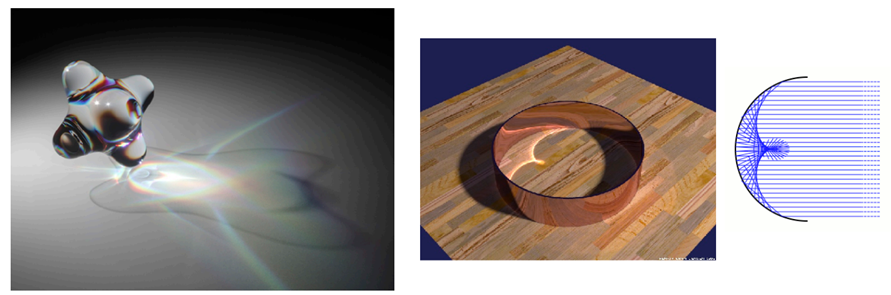

* 核心思想

	* 波粒二象性
		* 光子越多，呈现越亮
	* 非常适合用于生成焦散现象

* 两阶段方法：

	1. Photon Tracing

		* 从光源发出光子

		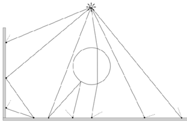

	2. Photon collection

		* 从摄像机射出路径
		* 对于每个着色点，寻找最近的$N$个光子，取它们的表面积

		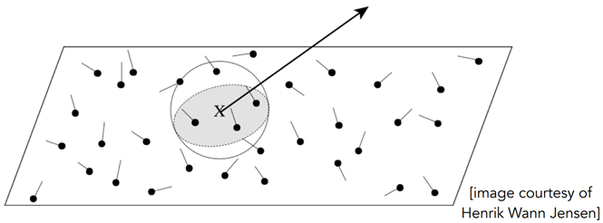

* 分析

	* 有偏逼近
		* 关于渲染中的偏差的理解：
			* 偏差==模糊
			* 一致==无限采样不模糊

**Combine Method**

* Path Tracing (BDPT) & Photon Mapping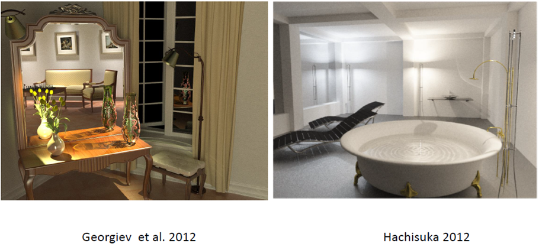

* Vertex Connection and Merging (VCM)
	* 如果端点不能连接但可以合并，则不要浪费BDPT中的子路径
	* 使用photon mapping处理附近“光子”的合并

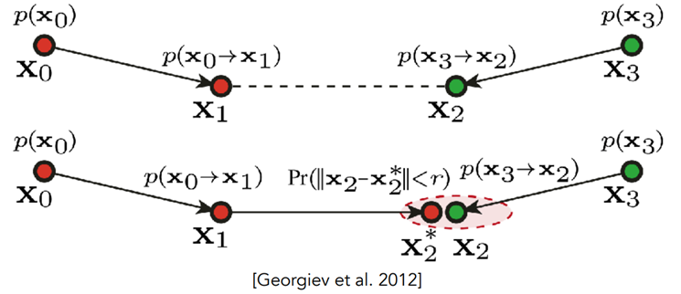

**Denoise**

* Neural network based methods

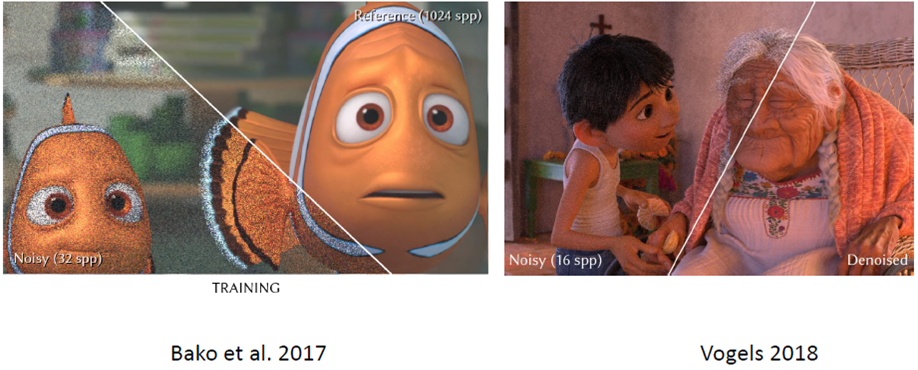

### 5.8. 辐射度渲染方法Radiosity

#### 5.8.1. 简介

* 假定：场景中的物体均为理想漫反射表面(Diffuse) 
	* Radiosity方法不能处理镜面反射的物体表面

* 求解渲染方程：与视点无关，只需求解一次
	* 稀疏方程组
	* 如光源不变，可预存为贴图

* 可与其他绘制算法结合

#### 5.8.2. 渲染方程

渲染方程：
$$
\begin{align}
L_o(x,\omega_o)&=L_e(x,\omega_o)+L_r(x,\omega_o)\\
&=L_e(x,\omega_o)+\int_{H^2}f_r(x,\omega_i\rightarrow \omega_o)L_i(x,\omega_i)\cos\theta_i\mathrm d\omega_i
\end{align}
$$
另一种形式的渲染方程：
$$
L(x',x)=L_e(x',x)+\int_{M^2}f_r(x'',x',x)L(x'',x')G(x'',x')\mathrm dA''(x'')
$$
几何项$G(x'',x')$表示为：
$$
G(x'',x')=\dfrac{\cos\theta_i''\cos\theta_o'}{\|x''-x'\|^2}V(x'',x')
$$
可视性项$V(x'',x')$表示为
$$
V(x'',x')=\begin{cases}
1&\mathrm{visible}\\
0&\mathrm{not\ visible}
\end{cases}
$$
解渲染方程：
$$
\begin{align}
L_o(x_0',x_0)&=L_e(x_0',x_0)+\int_{M^2}L_i(x_0',x_0'')f_r(x_0,x'_0,x''_0)G(x_0'',x_0')\mathrm dA(x_0'')\\

L_o(x_1',x_1)&=L_e(x_1',x_1)+\int_{M^2}L_i(x_1',x_1'')f_r(x_1,x'_1,x''_1)G(x_1'',x_1')\mathrm dA(x_1'')\\

&\vdots\\
&\vdots\\
L_o(x_n',x_n)&=L_e(x_n',x_n)+\int_{M^2}L_i(x_n',x_n'')f_r(x_n,x'_n,x''_n)G(x_n'',x_n')\mathrm dA(x_n'')\\
\end{align}
$$
令：
$$
L=\begin{bmatrix}
L_o(x_0',x_0)\\
L_o(x_1',x_1)\\
\vdots\\
\vdots\\
L_o(x_n',x_n)\\
\end{bmatrix},

L_e=\begin{bmatrix}
L_e(x_0',x_0)\\
L_e(x_1',x_1)\\
\vdots\\
\vdots\\
L_e(x_n',x_n)\\
\end{bmatrix},

K\circ L=\begin{bmatrix}
\int_{M^2}L_i(x_0',x_0'')f_r(x_0,x'_0,x''_0)G(x_0'',x_0')\mathrm dA(x_0'')\\

\int_{M^2}L_i(x_1',x_1'')f_r(x_1,x'_1,x''_1)G(x_1'',x_1')\mathrm dA(x_1'')\\
\vdots\\
\vdots\\

\int_{M^2}L_i(x_n',x_n'')f_r(x_n,x'_n,x''_n)G(x_n'',x_n')\mathrm dA(x_n'')\\

\end{bmatrix}
$$
有
$$
L=L_e+K\circ L\\
\Downarrow\\
(I-K)\circ L=L_e
$$
又
$$
B_j=E_j+\rho_j\sum\limits_{i=1}^NB_iF_{ij},\ \ \ \ j=1,\cdots,M
$$
写成矩阵形式：
$$
\begin{bmatrix}
1-\rho_1F_{11}&-\rho_1F_{12}&\cdots&-\rho_1F_{1N}\\
-\rho_2F_{21}&1-\rho_2F_{22}&\cdots& -\rho_2F_{2N}\\
\vdots&\vdots&\ddots&\vdots\\
-\rho_NF_{N1}&-\rho_NF_{N2}&\cdots&1-\rho_NF_{NN}
\end{bmatrix}
\begin{bmatrix}
B_1\\B_2\\\vdots\\B_N
\end{bmatrix}=
\begin{bmatrix}
E_1\\E_2\\\vdots\\E_N
\end{bmatrix}\\
\Downarrow\\
L=(I-K)^{-1}\circ L_e
$$
又
$$
(I-K)^{-1}=\dfrac{1}{I-K}=I+K+K^2+\cdots\\
\Downarrow\\
L^n=L_e+K\circ L^n
$$
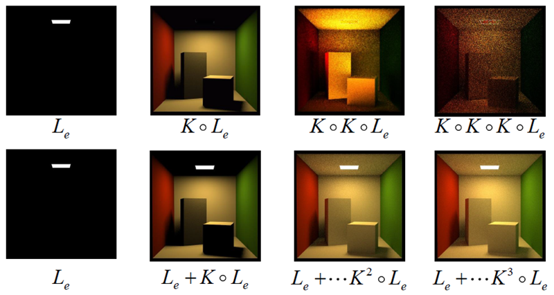

#### 5.8.3. 各种辐射度渲染方法

**Radiosity**

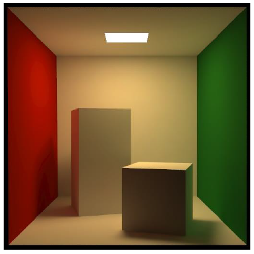

**Hierarchical Radiosity**

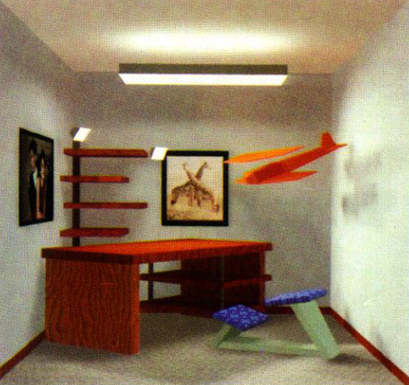

**Instant Radiosity**

* 也叫many-light approaches
* 关键思想
	* 反光面可以视作光源
* 方法
	* 射出光线的子路径并假设每个子路径的终端点为一个虚拟点光源VPL
	* 像平常一样用这些虚拟点光源渲染场景

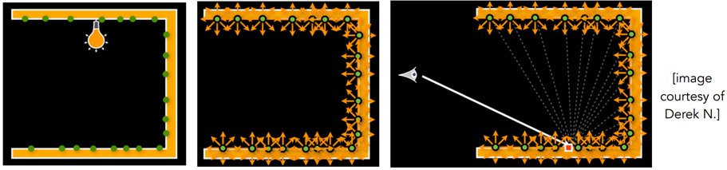

**Many-light Rendering (PointGI)**

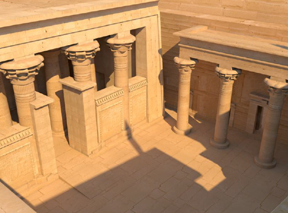

**Matrix Sampling and Recovery via Sparsity Analysis**


#### 5.8.4. 分析

* 优点
	* 速度快
	* 对漫反射场景有很好的效果
* 缺点
	* VPL接近阴影点时会出现尖峰
	* 无法处理反光材料

### 5.9. 实时渲染

#### 5.9.1. 简介

**Path Tracing based Methods的问题**

* 尽可能地求解渲染方程
	* 速度很慢

**实时渲染**

* 实时渲染的速度
	* 一般应用：30fps
	* VR：60-120fps

* 时间预算（时间紧迫）渲染

	* 需要在固定的时间预算内渲染

	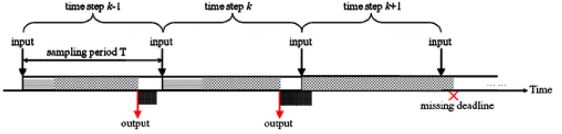

* 基本思想：简化渲染方程的计算
	* 积分 → 某几项之和

#### 5.9.2. 实时渲染算法

**Point light local shading**

* Blinn-Phong local shading

	* 特殊的BRDF ← 漫反射项+镜面反射项
	* 间接关照 ← 环境项

	$$
	L_o(x,\omega_o)=L_i(x,\omega_i)f_r(x,\omega\rightarrow \omega_o)\cos\theta_i
	$$

	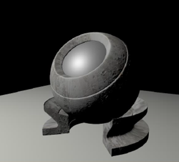

**Point light local shading + shadow**

* Shadow map

	* 只对点光源有效

	$$
	L_o(x,\omega_o)=L_i(x,\omega)f_r(x,\omega_i\rightarrow\omega_o)V(\omega_i\rightarrow\omega_o)\cos\theta_i
	$$

	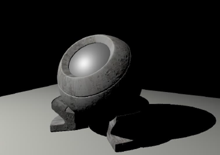

**Environment/area light local shading**

* 无法使用shadow map

$$
L_o(x,\omega_o)=\int_{H^2}L_i(x,\omega_i)f_r(x,\omega_i\rightarrow\omega_o)\cos\theta_i\mathrm d\omega_i
$$

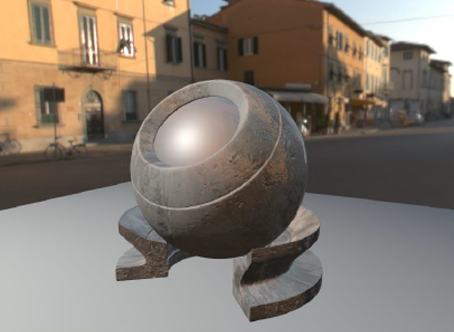

**Rendering under environment lighting**
$$
L_o(x,\omega_o)=\int_{H^2}L_i(x,\omega_i)f_r(x,\omega_i\rightarrow\omega_o)V(\omega_i\rightarrow\omega_o)\cos\theta_i\mathrm d\omega_i
$$
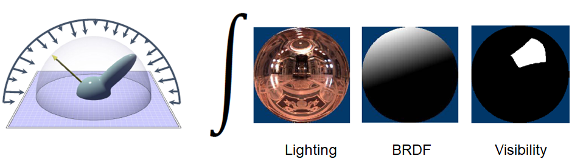

#### 5.9.3. 渲染方程的简化

$$
L_o(x,\omega_o)=\int_{H^2}L_i(x,\omega_i)f_r(x,\omega_i\rightarrow\omega_o)V(\omega_i\rightarrow\omega_o)\cos\theta_i\mathrm d\omega_i
$$

**简化入射辐射度Incident Radiance**
$$
L_i(x,\omega_i)
$$

* 逼近incident radiance
	* Probes, Fields, etc.

**简化BRDF**
$$
f_r(x,\omega_i\rightarrow\omega_o)
$$

* 逼近BRDF
	* Fitting, MIP-Mappings, etc.

**加速Visibility**
$$
V(\omega_i\rightarrow\omega_o)
$$

* 逼近visibility
	* AO, basis functions, simple occluders, contours, distance, field, etc.

**预计算辐射传输Precomputed Radiance Transfer (PRT)**

渲染方程：
$$
L_o(x,\omega_o)=\int_{H^2}L_i(x,\omega_i)f_r(x,\omega_i\rightarrow\omega_o)V(\omega_i\rightarrow\omega_o)\cos\theta_i\mathrm d\omega_i
$$
称$L_i(x,\omega_i)$项为光线项，$f_r(x,\omega_i\rightarrow\omega_o)V(\omega_i\rightarrow\omega_o)\cos\theta_i$项为光线传输项

* 用基函数逼近光线
* 预计算阶段：
	* 计算光照传输并投影到基函数空间
* 运行阶段
	* 点乘（漫反射）或矩阵-向量乘法（光滑）


